# 084：简单API 第2部分 🎤➡️📝➡️🌍

在本节课中，我们将学习如何使用集成人工智能的应用程序接口。具体来说，我们将通过两个IBM Watson服务来实践：首先，使用语音转文本API将音频文件转录为文字；然后，使用语言翻译API将转录出的文本翻译成另一种语言。

---

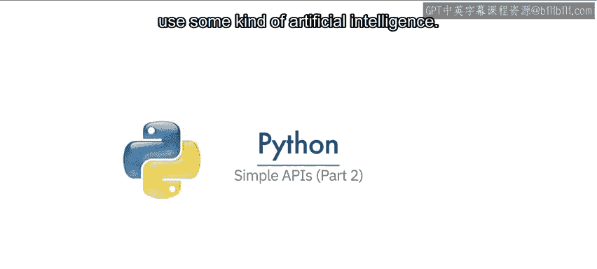

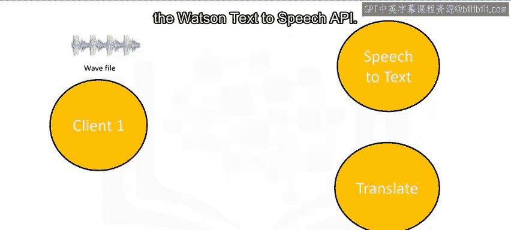

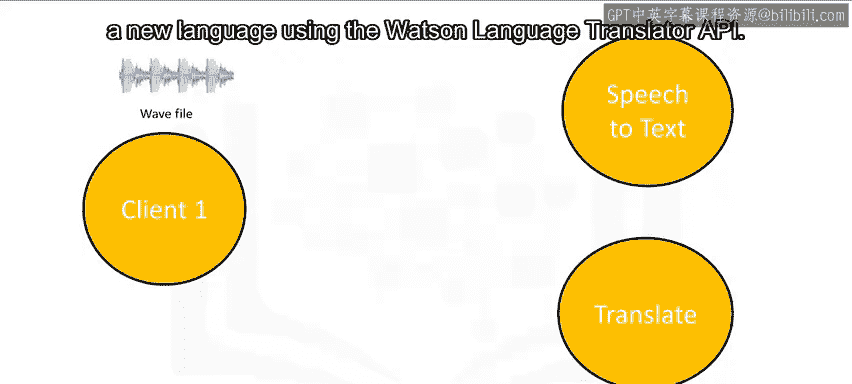

## 理解API调用流程 🔄

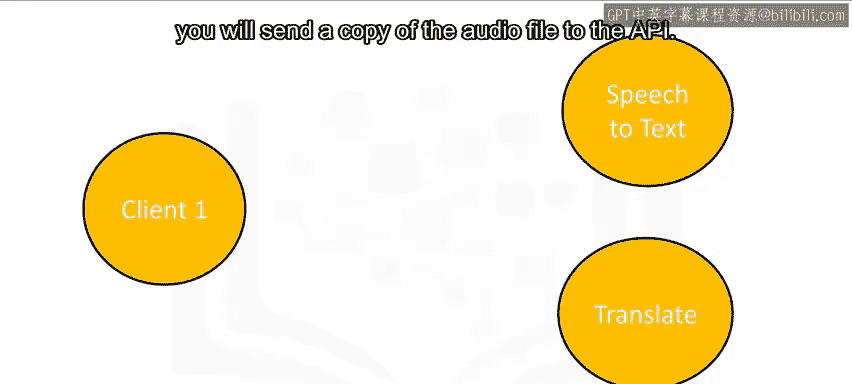

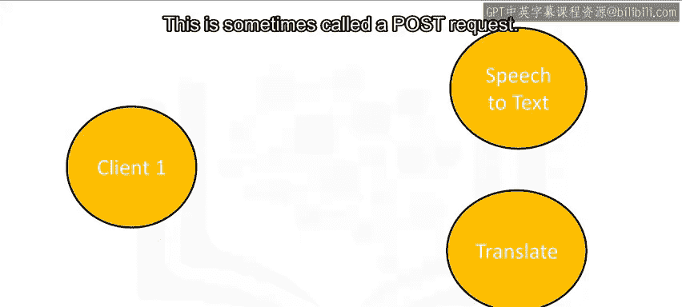

上一节我们介绍了API的基本概念，本节中我们来看看一个结合了AI服务的具体API调用流程。

整个过程涉及两次API调用：
1.  将音频文件发送给语音转文本API进行转录。
2.  将得到的文本发送给语言翻译API进行翻译。

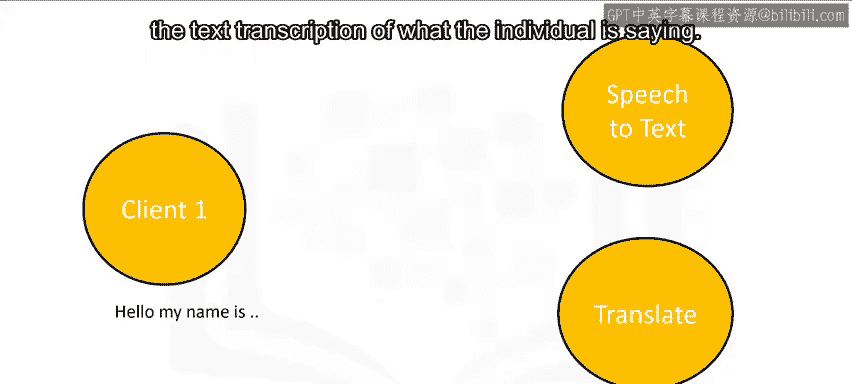

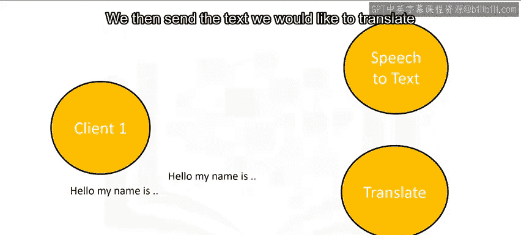

以下是这个流程的详细步骤：

*   **第一步：发送音频文件**。你向语音转文本API发送一份音频文件的副本。这种发送数据的请求通常被称为 **POST请求**。
    
    
    
    
    

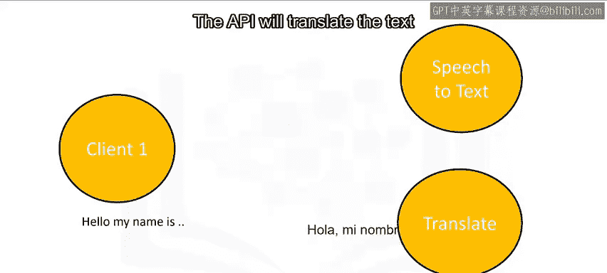

*   **第二步：接收转录文本**。API在后台处理音频，并将说话内容的文本转录结果返回给你。这个返回数据的请求可以理解为 **GET请求**。

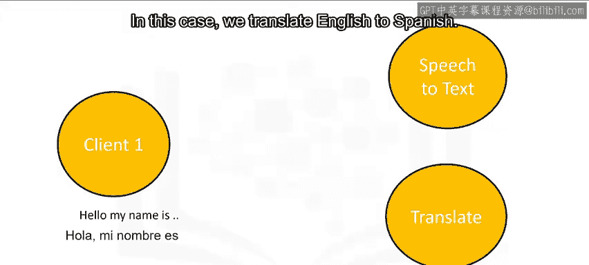

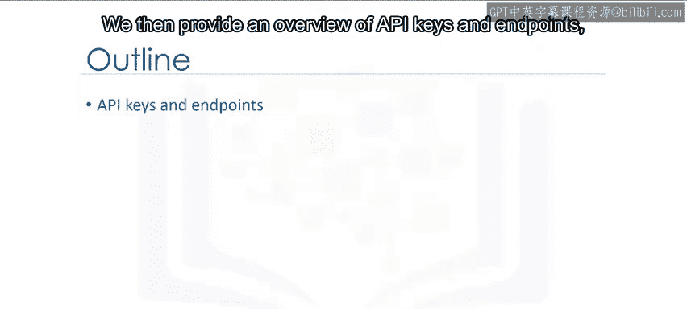

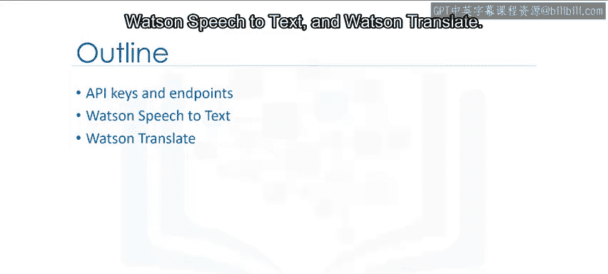

*   **第三步：发送文本进行翻译**。你将希望翻译的文本发送给第二个API，即语言翻译API。
    
    

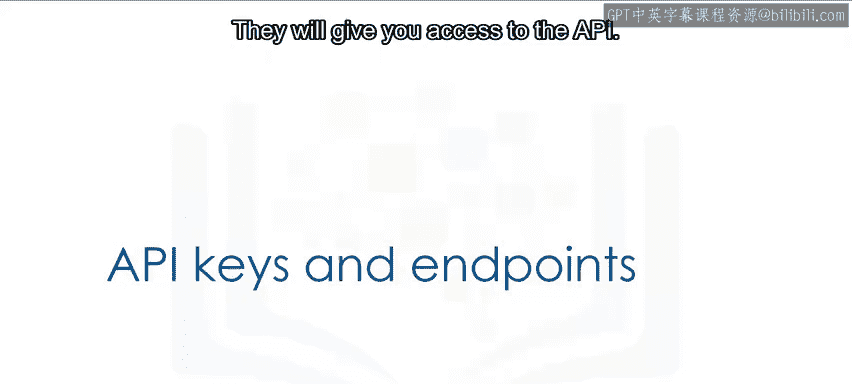

*   **第四步：接收翻译结果**。API翻译文本，并将翻译后的内容返回给你。在本例中，我们实现的是英语到西班牙语的翻译。

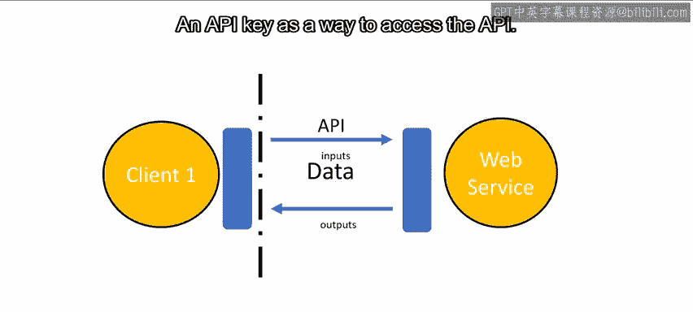

---

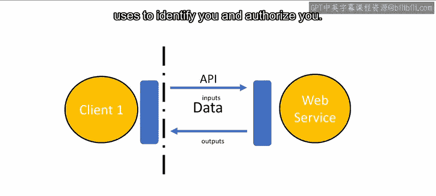

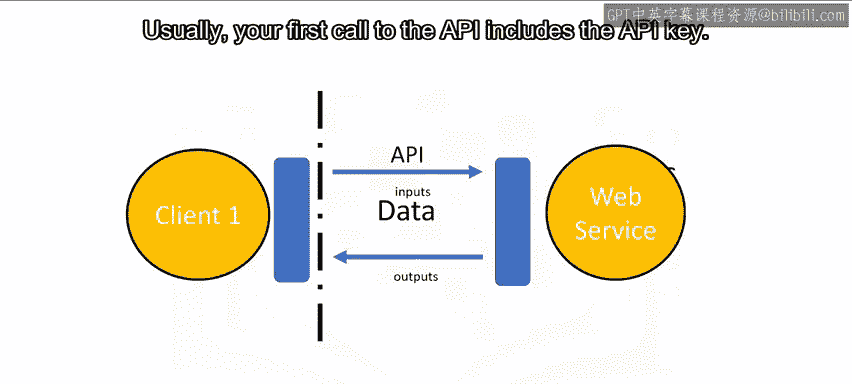

## API密钥与端点概述 🔑

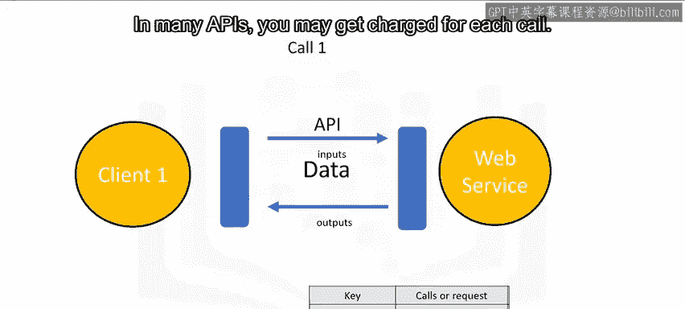

在开始动手实验之前，我们需要理解两个关键概念：API密钥和端点。它们是访问Watson语音转文本和翻译服务的前提。

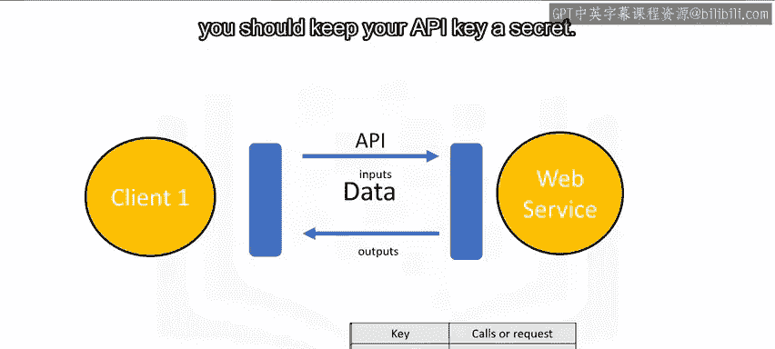

*   **API密钥**：这是访问API的凭证。它是一串独特的字符，API用它来识别和授权你的身份。通常，你的第一次API调用就需要包含这个密钥。由于许多API会按调用次数收费，因此API密钥应像密码一样妥善保管，避免泄露。
    
    
    
    
    

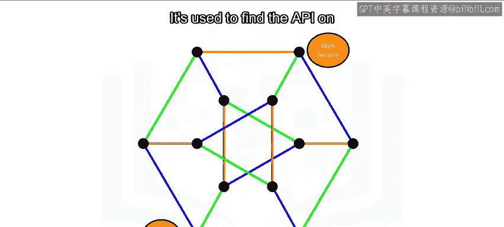

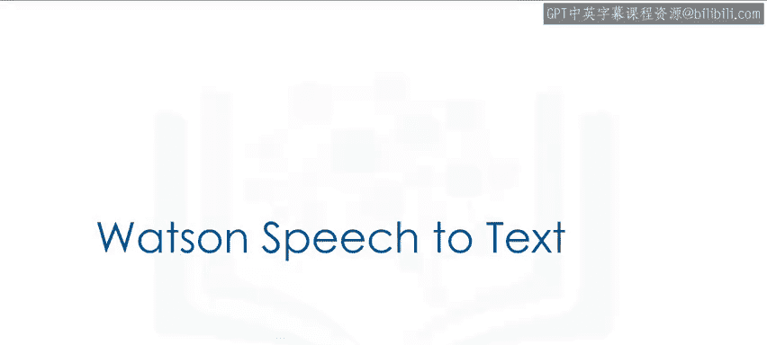

*   **端点**：这指的是服务的位置，用于在互联网上找到该API，就像一个网址。
    

---

## 实践：使用Watson语音转文本API转录音频 🎧➡️📄

现在，我们来看看如何使用Watson语音转文本API来转录一个音频文件。

开始实验前，你需要先注册获取API密钥。我们会将一个音频文件下载到你的工作目录中。

以下是实现转录的步骤：

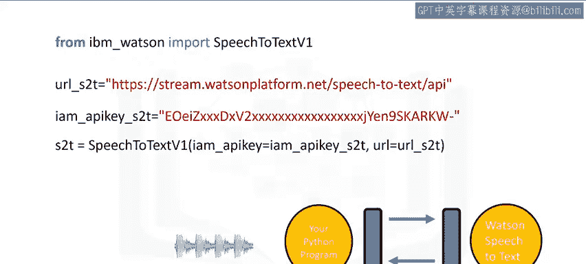

1.  **导入库并设置认证**。首先，从`ibm_watson`库导入`SpeechToTextV1`模块。服务端点根据服务实例的位置而定，你需要将其存储在变量中（例如`url_s2t`）。查看服务凭证即可找到应使用的URL。同样，你也需要获取并设置你的API密钥。
    ```python
    from ibm_watson import SpeechToTextV1
    url_s2t = “你的服务端点URL”
    iam_apikey_s2t = “你的API密钥”
    ```

2.  **创建服务对象**。使用端点和API密钥作为参数，创建一个语音转文本适配器对象。你将通过这个对象与Watson语音转文本服务进行通信。
    ```python
    speech_to_text = SpeechToTextV1(iam_apikey=iam_apikey_s2t, url=url_s2t)
    ```

3.  **读取音频文件**。指定要转换的WAV文件路径。使用`open()`函数以二进制读取模式（`‘rb’`）创建文件对象，这使我们可以访问包含音频的WAV文件。
    ```python
    with open(‘audio_file.wav’, ‘rb’) as wav_file:
        audio_data = wav_file.read()
    ```

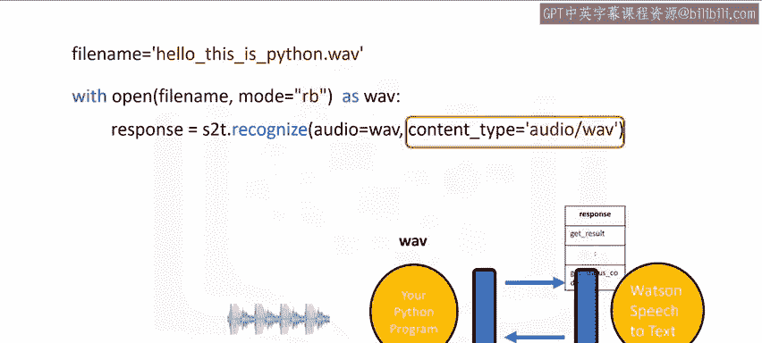

4.  **调用API并获取结果**。使用适配器对象的`recognize()`方法，这会将音频文件发送给Watson服务。参数包括音频数据（`audio`）和音频文件格式（`content_type`）。服务返回的响应存储在`response`对象中。
    ```python
    response = speech_to_text.recognize(audio=audio_data, content_type=‘audio/wav’).get_result()
    ```

5.  **提取转录文本**。响应结果（`response`）是一个Python字典。其`‘results’`键对应的值是一个列表，列表中包含字典。我们关注其中的`‘transcript’`键。可以将其赋值给一个变量，例如`recognized_text`，这个变量现在包含了转录后的文本字符串。
    ```python
    recognized_text = response[‘results’][0][‘alternatives’][0][‘transcript’]
    ```

---

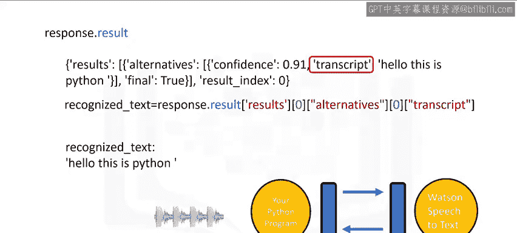

## 实践：使用Watson语言翻译API翻译文本 📝➡️🗣️

接下来，我们学习如何用Watson语言翻译器来翻译上一步得到的文本。

1.  **导入库并设置认证**。首先，从`ibm_watson`库导入`LanguageTranslatorV3`。将服务端点赋值给变量（如`url_lt`），并获取对应的API密钥。此API请求还需要指定版本日期，请参考文档。
    ```python
    from ibm_watson import LanguageTranslatorV3
    url_lt = “你的翻译服务端点URL”
    apikey_lt = “你的翻译API密钥”
    version_lt = ‘2018-05-01’
    ```

2.  **创建翻译器对象**。使用上述信息创建语言翻译器对象。
    ```python
    language_translator = LanguageTranslatorV3(iam_apikey=apikey_lt, url=url_lt, version=version_lt)
    ```

3.  **获取可识别语言列表（可选）**。你可以获取服务支持的语言列表，方法返回语言代码。例如，英语的代码是`‘en’`，西班牙语是`‘es’`。
    ```python
    languages = language_translator.list_identifiable_languages().get_result()
    ```

4.  **执行翻译**。使用`translate()`方法翻译文本。结果是一个详细的响应对象。参数`text`是要翻译的文本，`model_id`指定使用的翻译模型。例如，设为`‘en-es’`表示从英语翻译到西班牙语。
    ```python
    translation_response = language_translator.translate(text=recognized_text, model_id=‘en-es’).get_result()
    ```

5.  **提取翻译结果**。响应结果是一个字典，包含翻译文本、字数、字符数等信息。我们可以获取翻译文本并赋值给变量，例如`spanish_translation`。
    ```python
    spanish_translation = translation_response[‘translations’][0][‘translation’]
    ```

6.  **进行其他翻译**。利用得到的变量，我们可以轻松地将文本翻译回英语，或者翻译成其他语言，比如法语。
    ```python
    # 翻译回英语
    translation_back = language_translator.translate(text=spanish_translation, model_id=‘es-en’).get_result()
    english_back = translation_back[‘translations’][0][‘translation’]

    # 翻译成法语
    translation_french = language_translator.translate(text=recognized_text, model_id=‘en-fr’).get_result()
    french_text = translation_french[‘translations’][0][‘translation’]
    ```

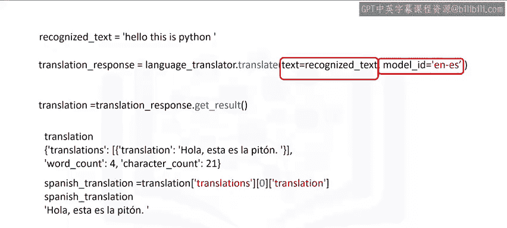

---

## 总结 📚

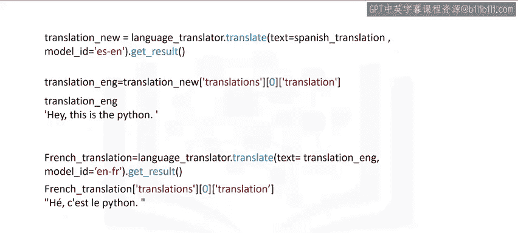

本节课中，我们一起学习了如何串联使用两个AI服务的API来完成一个实际任务。我们首先了解了API调用的基本流程，包括POST请求和GET请求。然后，我们掌握了访问API的两个关键要素：API密钥和端点。最后，我们通过实践，逐步实现了使用IBM Watson的语音转文本API将音频转录为文字，再使用语言翻译API将文字翻译成其他语言的过程。通过本课，你应该对如何调用和组合不同的云AI服务有了更直观的认识。