# 085：REST API与HTTP请求详解（第一部分）🌐

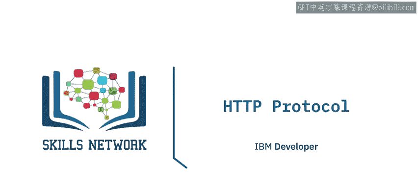

在本节课中，我们将深入探讨HTTP协议，特别是统一资源定位符（URL）以及HTTP请求与响应的基本结构。这是理解REST API如何工作的基础。

上一节我们简要介绍了REST API。HTTP协议可以被视为在网络上传输信息的通用协议，它承载了包括REST API在内的多种网络通信。回想一下，REST API的工作原理是发送一个请求，而这个请求是通过HTTP消息进行通信的，该消息通常包含一个JSON文件。

## HTTP请求与响应流程 🔄

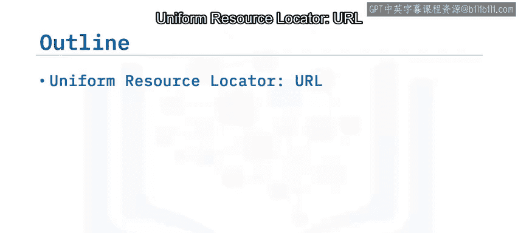

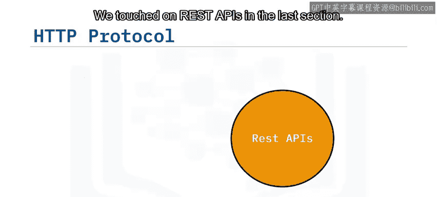


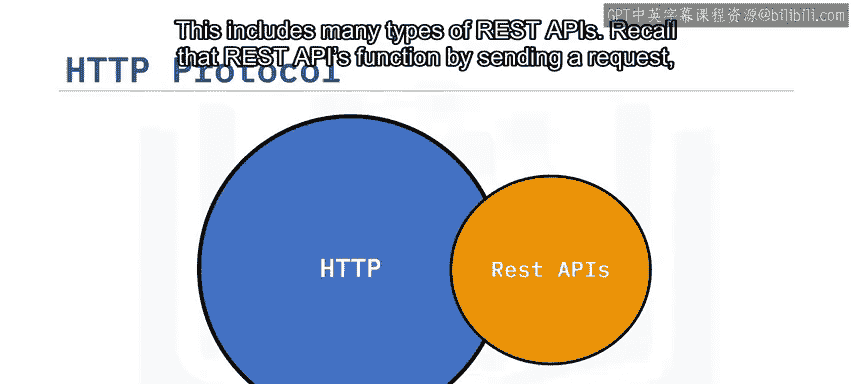

当你（客户端）访问一个网页时，你的浏览器会向托管该网页的服务器发送一个HTTP请求。服务器会尝试查找所请求的资源（默认是`index.html`）。如果请求成功，服务器会在HTTP响应中将目标对象发送回客户端。响应中包含了资源类型、资源长度等信息。

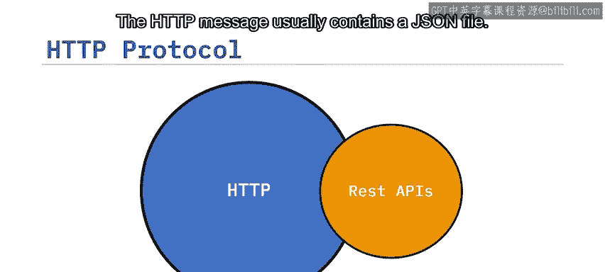

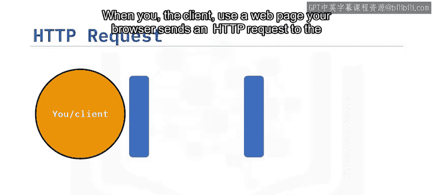

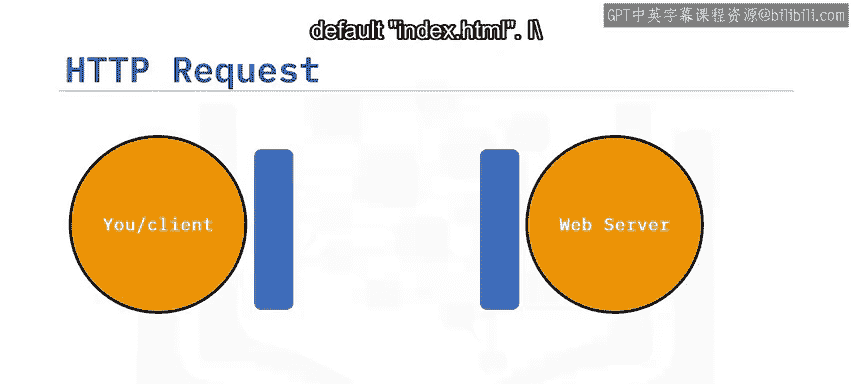

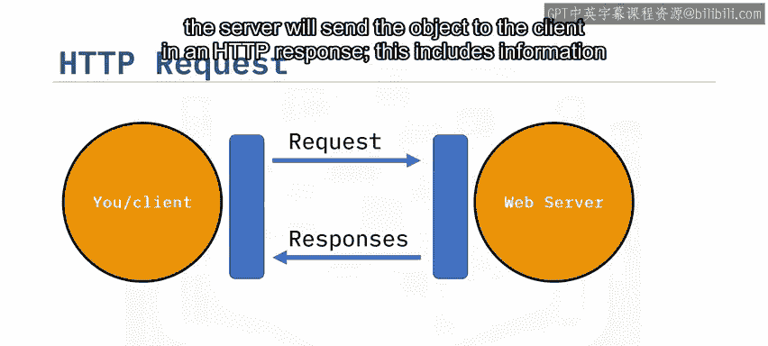

下图中的表格代表了Web服务器上存储的资源列表，例如一个HTML文件、一个PNG图像和一个文本文件。当请求信息时，Web服务器会发送所请求的文件。

## 理解URL 🧭

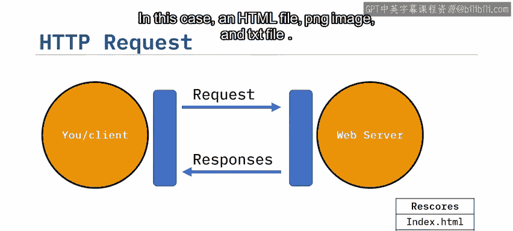

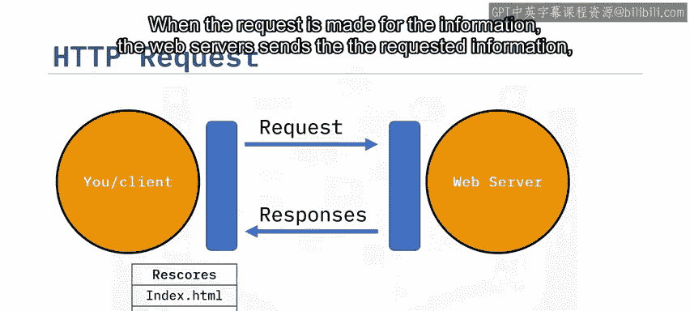

统一资源定位符（URL）是在网络上定位资源最常用的方式。我们可以将URL分解为三个部分：
*   **协议**：这是使用的协议。在本实验中，它始终是 `http://`。
*   **网络地址或基础URL**：用于定位服务器。例如 `www.ibm.com` 或 `www.gitlab.com`。
*   **路径**：资源在Web服务器上的具体位置。例如 `/images/IBM_logo.png`。

## 剖析HTTP消息 📦

让我们回顾一下请求和响应的过程。以下是一个使用GET请求方法的请求消息示例（还有其他HTTP方法可用）。

**请求消息示例：**
```
GET /index.html HTTP/1.1
Host: www.example.com
```
*   **起始行**：包含`GET`方法（一种HTTP方法），请求的文件`/index.html`，以及协议版本`HTTP/1.1`。
*   **请求头**：传递HTTP请求的附加信息。在GET方法中，请求头可能为空。某些请求会包含**请求体**，我们稍后会举例。
*   **请求体**：在GET请求中通常为空。

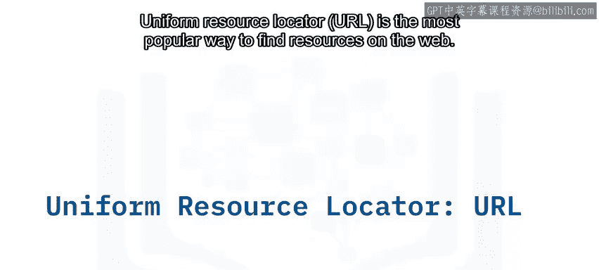

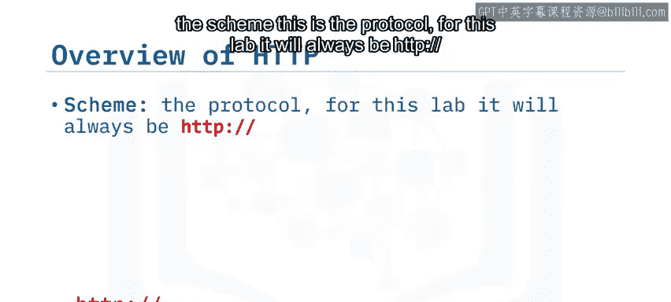

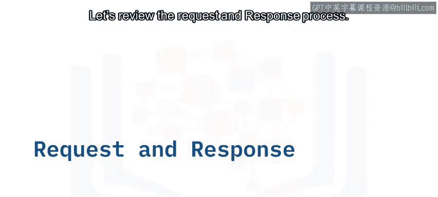

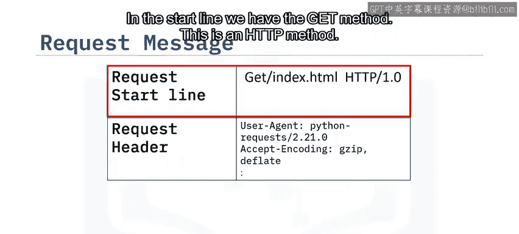

**响应消息示例：**
```
HTTP/1.1 200 OK
Content-Type: text/html
Content-Length: 1234

<!DOCTYPE html><html>...</html>
```
*   **响应起始行**：包含版本号`HTTP/1.1`，后跟状态码`200`（表示成功）和描述短语`OK`。
*   **响应头**：包含元信息，例如`Content-Type`和`Content-Length`。
*   **响应体**：包含实际的资源文件，在本例中是一个HTML文档。

## HTTP状态码分类 📊

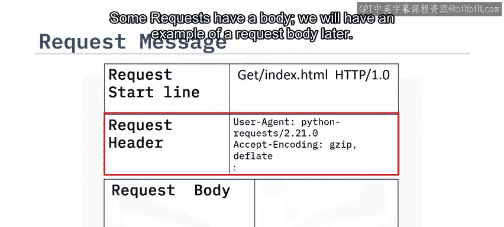

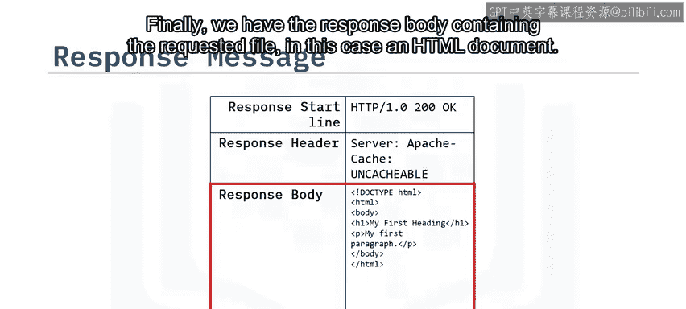

让我们看看其他的状态码。状态码前缀表明了其类别：
*   **1xx（信息响应）**：例如`100`，表示一切正常，请求正在继续处理。
*   **2xx（成功响应）**：例如`200`，表示请求已成功。
*   **4xx（客户端错误）**：表示请求有问题。例如`401`表示请求未授权。
*   **5xx（服务器错误）**：表示服务器处理请求时出错。例如`501`表示功能未实现。

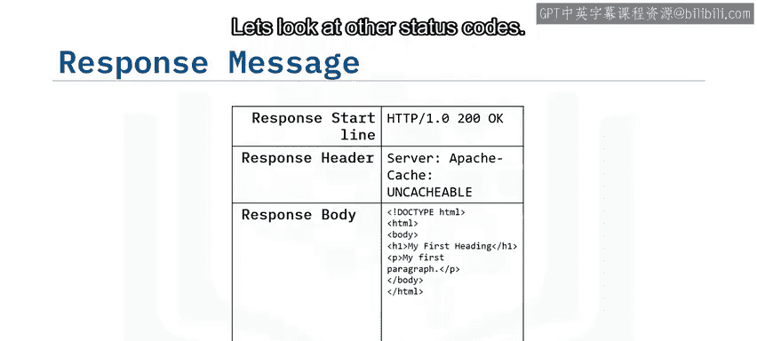

## HTTP方法概述 ⚙️

当发起一个HTTP请求时，会发送一个HTTP方法，它告诉服务器要执行什么操作。以下是几种常见的HTTP方法：
*   **GET**：从服务器检索数据。
*   **POST**：向服务器发送数据。
*   **PUT**：更新服务器上的资源。
*   **DELETE**：删除服务器上的资源。

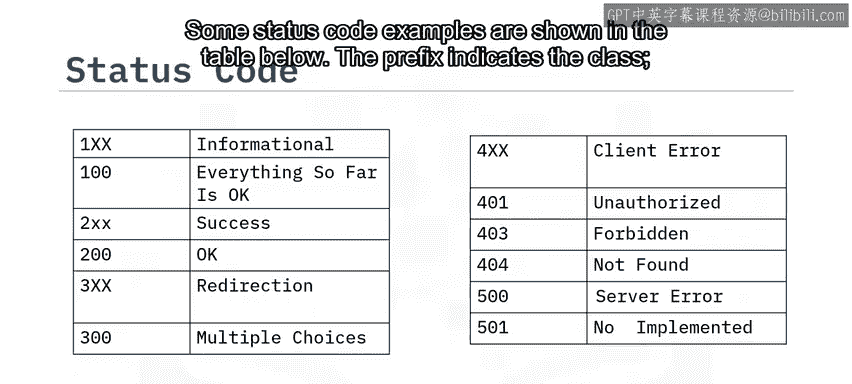

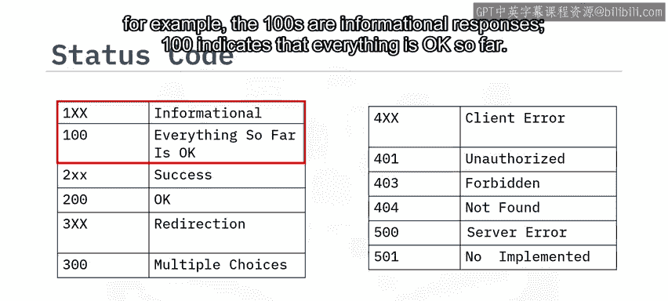

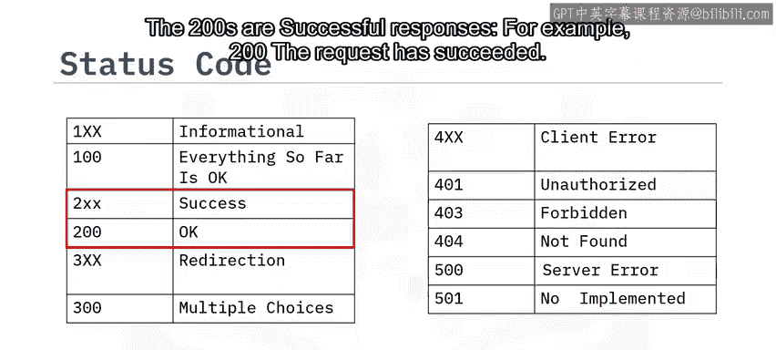

在下一个视频中，我们将使用Python来实践**GET**方法（从服务器检索数据）和**POST**方法（向服务器发送数据）。

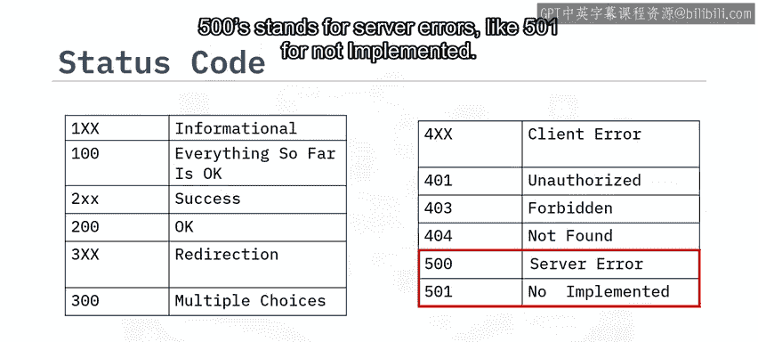

## 总结 📝

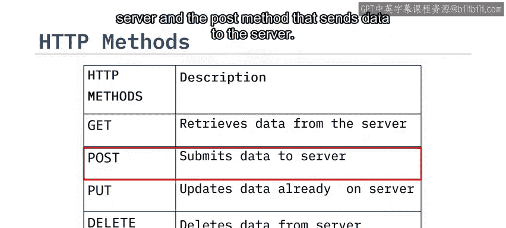

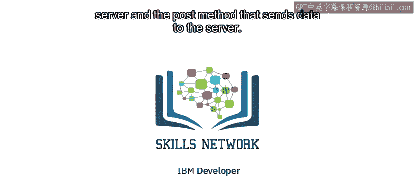

本节课我们一起学习了HTTP协议的基础知识。我们了解了URL的构成、HTTP请求与响应的完整结构（包括起始行、头部和主体），熟悉了不同类别的HTTP状态码所代表的含义，并认识了主要的HTTP方法（如GET和POST）。这些概念是理解和使用REST API的基石，在接下来的实践中，我们将运用这些知识通过代码与API进行交互。