# 089：使用不同的文件格式（CSV, XML, JSON, XLSX）📁


在本节课中，我们将学习如何识别和处理几种常见的数据文件格式，包括CSV、JSON和XML。我们将使用Python库来读取这些文件，并学习如何组织和输出其中的数据。

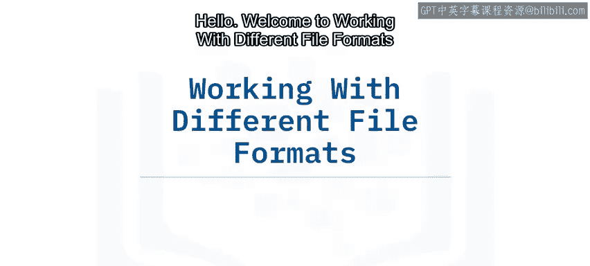

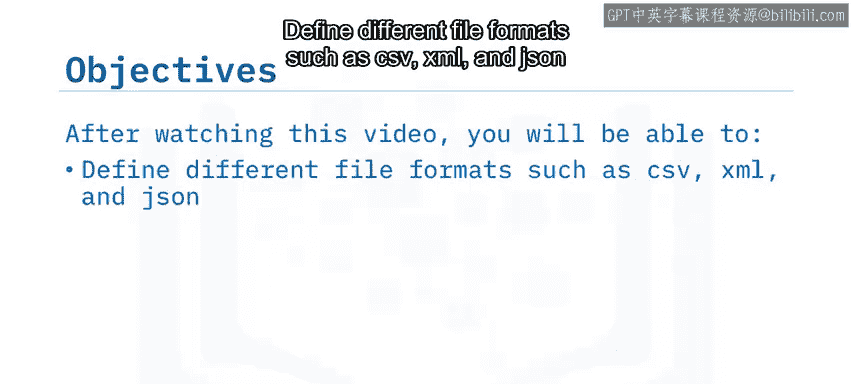

## 认识不同的文件格式

当收集数据时，你会发现存在多种不同的文件格式。为了完成数据驱动的分析，我们需要读取这些文件。Python通过其预定义的库，可以使这个过程变得简单。但在探索Python之前，让我们先了解一些常见的文件格式。

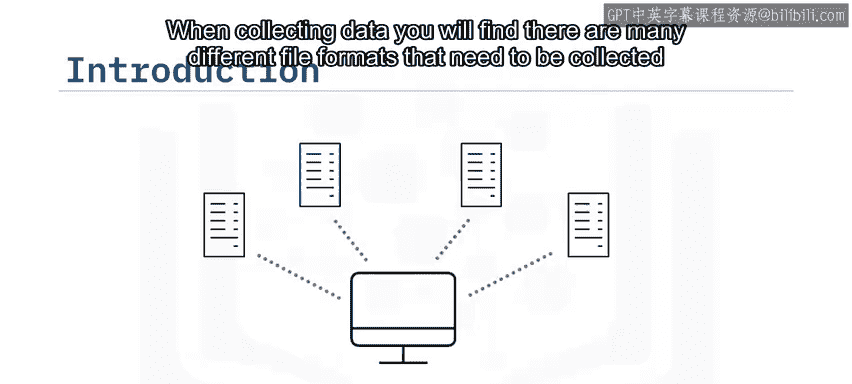

通过观察文件名，你会注意到标题末尾有一个扩展名。这些扩展名让你知道文件的类型以及打开它需要什么工具。例如，如果你看到一个标题如 `file_example.csv`，你就会知道这是一个CSV文件。但这只是众多文件类型中的一个例子，还有更多类型，例如JSON或XML。

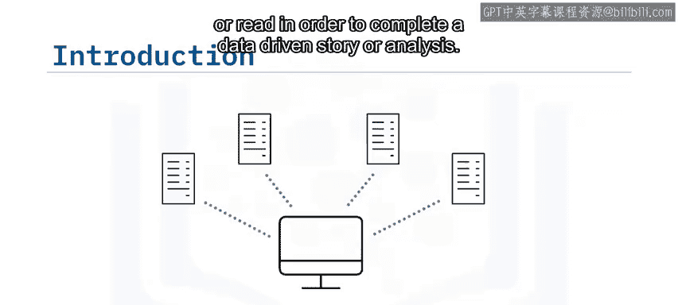


## 使用Python库读取数据

当遇到这些不同的文件格式并试图访问其中的数据时，我们需要利用Python库来简化这个过程。首先要熟悉的Python库是 **Pandas**。通过在代码开头导入这个库，我们就能轻松读取不同类型的文件。


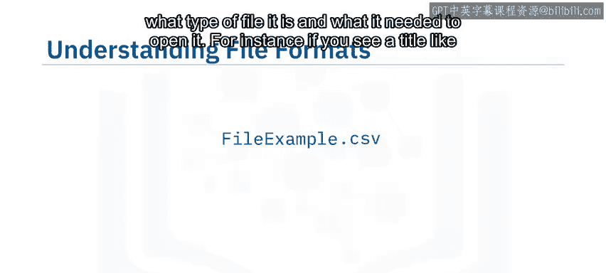

以下是导入Pandas库的代码：
```python
import pandas as pd
```

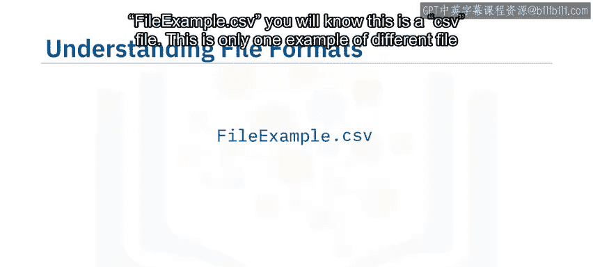

既然我们已经导入了Pandas库，让我们用它来读取第一个CSV文件。在这个例子中，我们遇到了 `file_example.csv` 文件。第一步是将文件赋值给一个变量，然后借助Pandas库创建另一个变量来读取文件。接着，我们可以调用 `read_csv` 函数将数据输出到屏幕上。

以下是读取CSV文件的代码示例：
```python
file_path = 'file_example.csv'
df = pd.read_csv(file_path)
print(df)
```


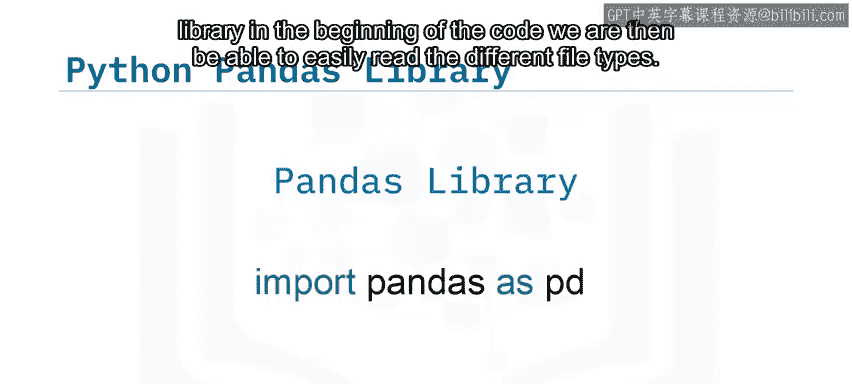

在这个例子中，数据没有表头，所以程序将第一行数据作为了表头。由于我们不希望第一行数据成为表头，接下来让我们看看如何纠正这个问题。

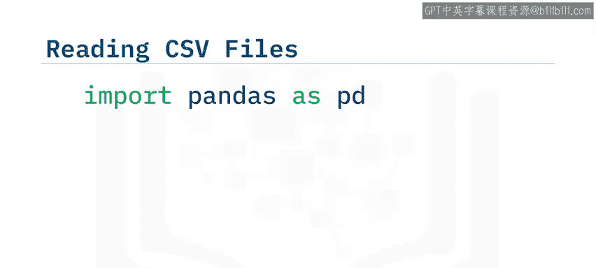

## 组织数据输出

上一节我们学习了如何读取和输出CSV文件的数据，现在让我们使其看起来更有条理。


在上一个例子中，我们能够打印出数据，但因为文件没有表头，它将第一行数据打印成了表头。我们通过添加一个数据框属性轻松解决了这个问题。我们使用变量 `df` 来调用文件，然后通过添加 `columns` 属性来指定列名。通过将这一行代码添加到程序中，我们可以将数据输出整齐地组织到每个指定的列标题下。


以下是添加自定义列名的代码：
```python
df.columns = ['Column1', 'Column2', 'Column3']
print(df)
```

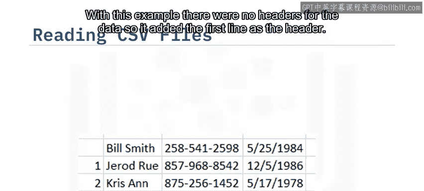

## 处理JSON文件格式

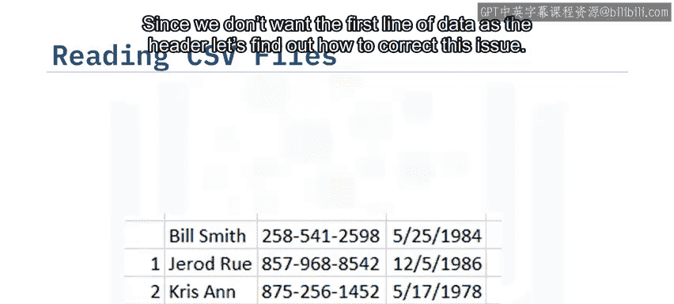


接下来我们将探索的文件格式是JSON。在这种类型的文件中，文本以独立于语言的数据格式编写，类似于Python字典。读取此类文件的第一步是导入 `json` 库。


以下是导入JSON库的代码：
```python
import json
```

导入JSON后，我们可以添加一行代码来打开文件，调用JSON的 `load` 属性开始读取文件，最后打印文件内容。

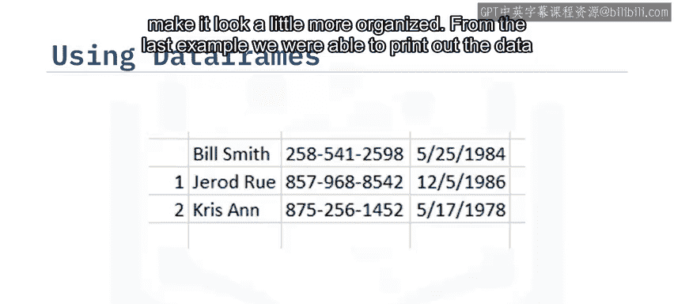

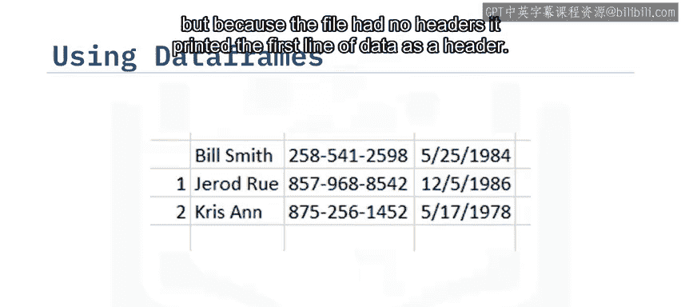

以下是读取JSON文件的代码示例：
```python
with open('data.json', 'r') as file:
    data = json.load(file)
print(data)
```


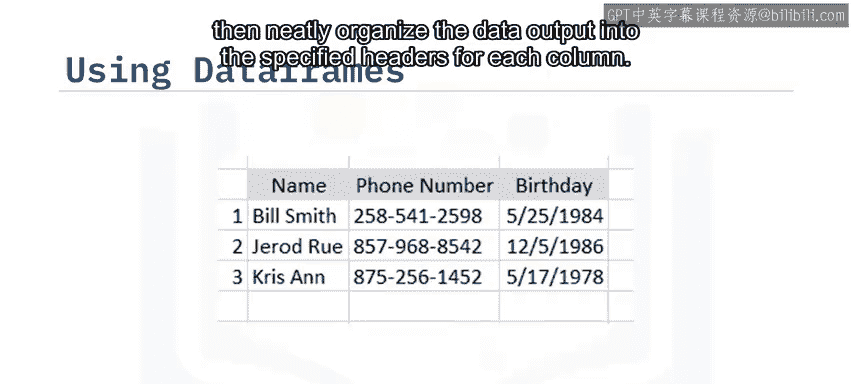

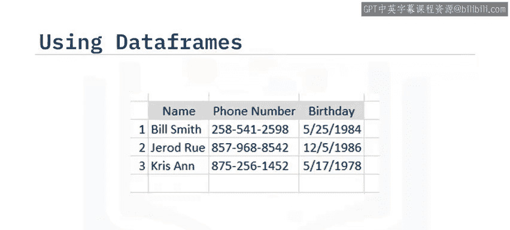

## 处理XML文件格式

下一个文件格式类型是XML，即可扩展标记语言。虽然Pandas库没有直接读取此类文件的属性，但让我们探索如何解析这种类型的文件。


读取此类文件的第一步是导入 `xml.etree.ElementTree` 库。通过导入这个库，我们可以使用 `ElementTree` 属性来解析XML文件。然后我们添加列标题并将它们分配给数据框。

以下是解析XML文件的代码示例：
```python
import xml.etree.ElementTree as ET

tree = ET.parse('data.xml')
root = tree.getroot()
```


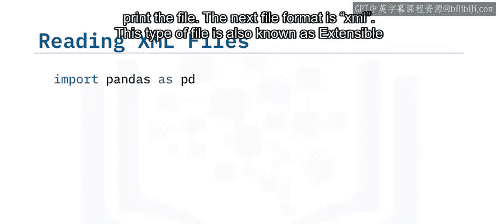


然后创建一个循环来遍历文档，收集必要的数据，并将数据附加到数据框中。

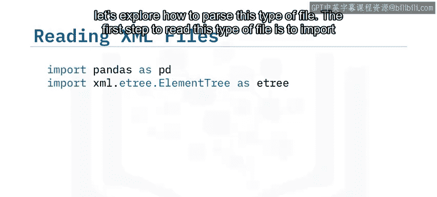

以下是遍历XML数据并创建DataFrame的代码示例：
```python
data = []
for elem in root.findall('.//record'):
    row = {}
    for child in elem:
        row[child.tag] = child.text
    data.append(row)

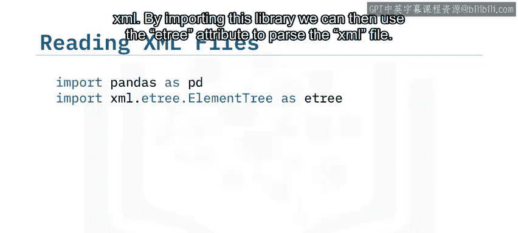

df = pd.DataFrame(data)
print(df)
```


## 课程总结


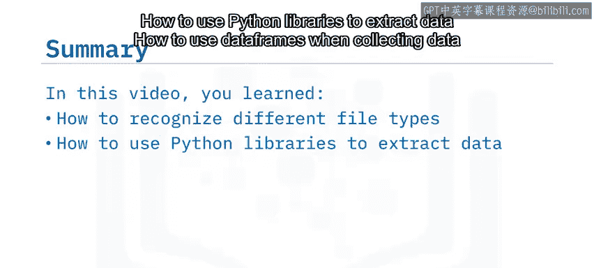


本节课中，我们一起学习了如何识别不同的文件类型，如何使用Python库提取数据，以及在收集数据时如何使用数据框。掌握这些技能是进行有效数据分析的重要基础。