# 090：IBM应用人工智能课程简介 🚀

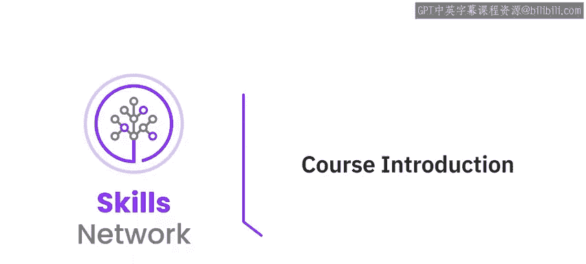

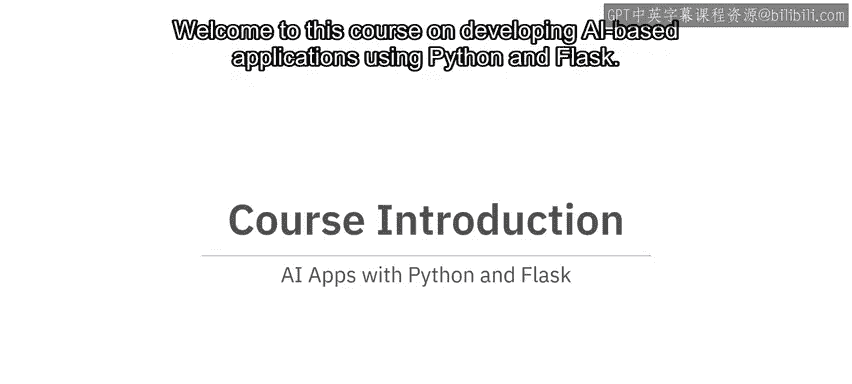

在本节课中，我们将要学习《IBM应用人工智能》课程的整体介绍。课程将指导你如何从零开始，使用Python和Flask框架来构建集成人工智能的Web应用程序。我们将了解课程目标、适用人群以及三个核心模块的主要内容。

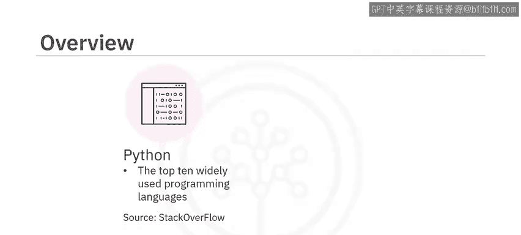

## 概述

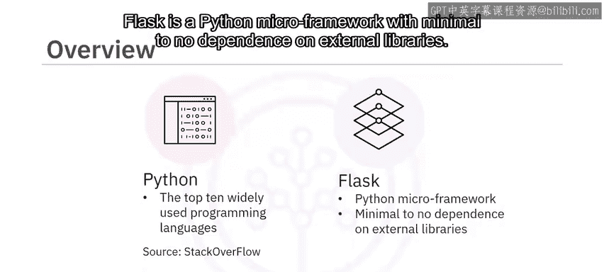

欢迎来到这门关于使用Python和Flask开发人工智能应用程序的课程。

Python是全球使用最广泛的十大编程语言之一，这一结论源自Stack Overflow的调查报告。

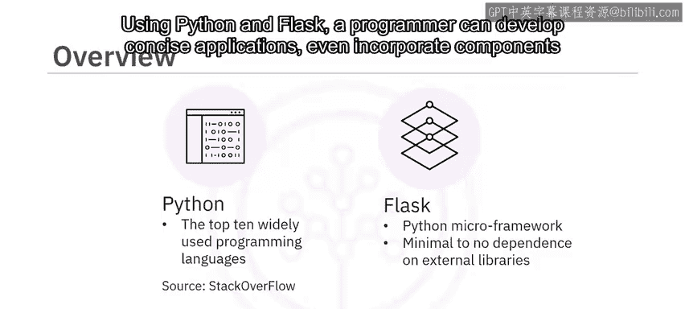

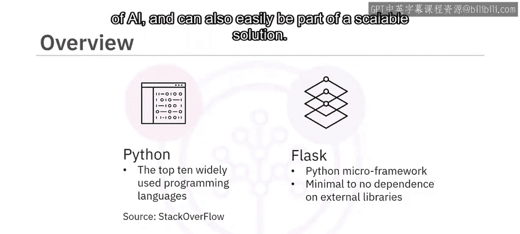

Flask是一个Python微框架，它对外部库的依赖极少甚至没有。

使用Python和Flask，程序员可以开发简洁的应用程序，即使是在企业级的AI组件中，也能轻松成为可扩展解决方案的一部分。

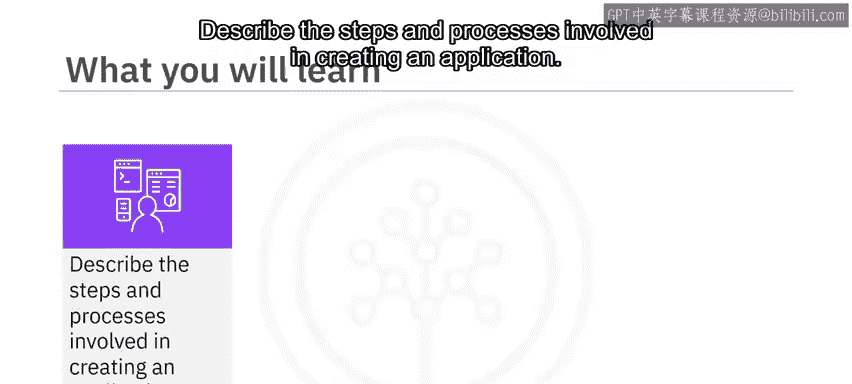

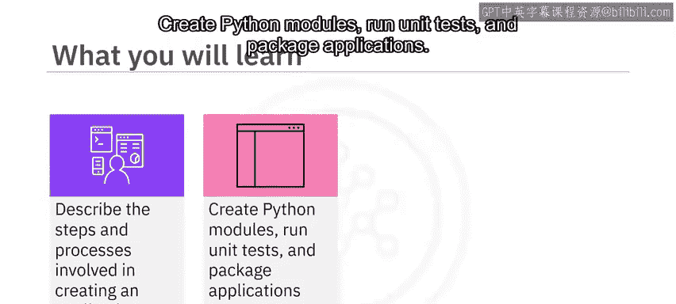

完成本课程后，你将能够描述创建应用程序所涉及的步骤和流程，创建Python模块，运行单元测试，以及打包应用程序。

你将能够使用Flask框架在Web上部署应用程序，并使用IBM Watson AI库和Flask创建并部署一个基于AI的应用程序到Web服务器。

本课程面向所有具备基本编程知识、对Python有初步了解，并且有兴趣构建集成AI的可复用Web应用程序的学习者。

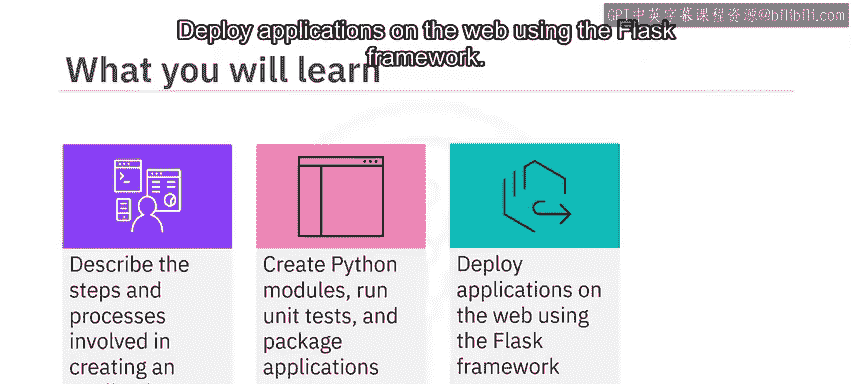

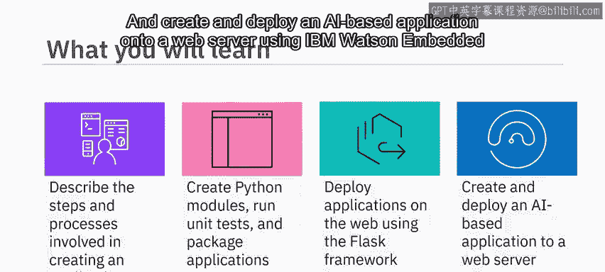

## 课程模块介绍

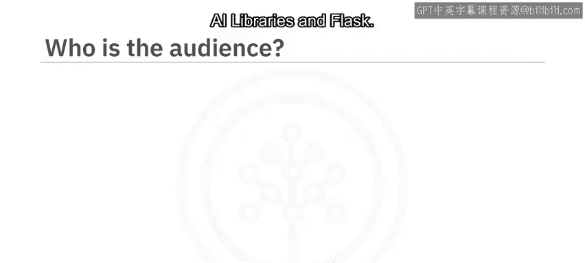

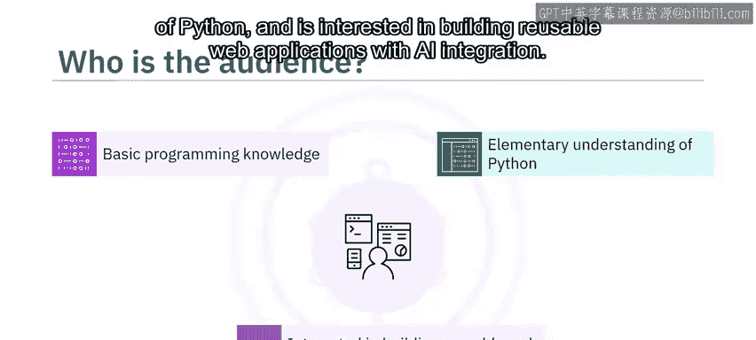

上一节我们了解了课程的整体目标，本节中我们来看看课程的具体内容安排。课程主要分为三个模块。

以下是三个核心模块的简要说明：

1.  **模块一：应用开发基础**
    *   本模块将向你介绍应用程序开发的基础知识，包括生命周期和编码最佳实践。
    *   你将有机会创建模块、运行单元测试并打包应用程序。
    *   你将学习Python的理想编码实践，并了解如何运行静态代码分析。

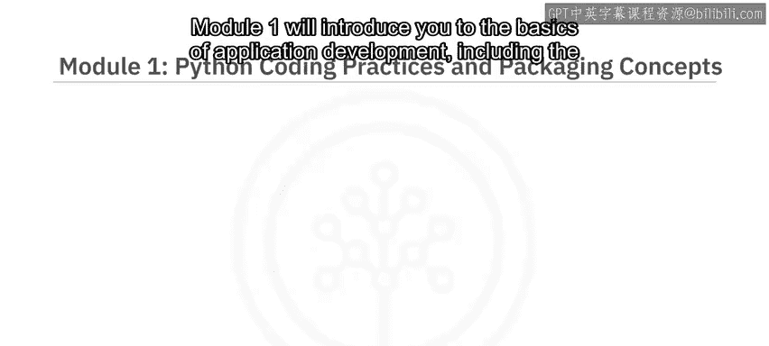

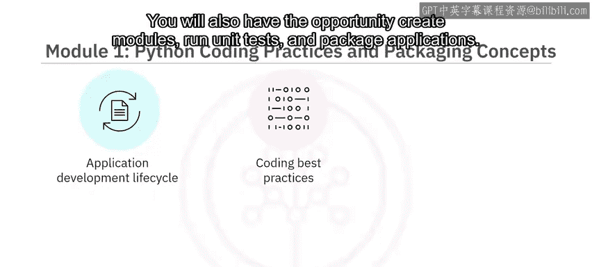

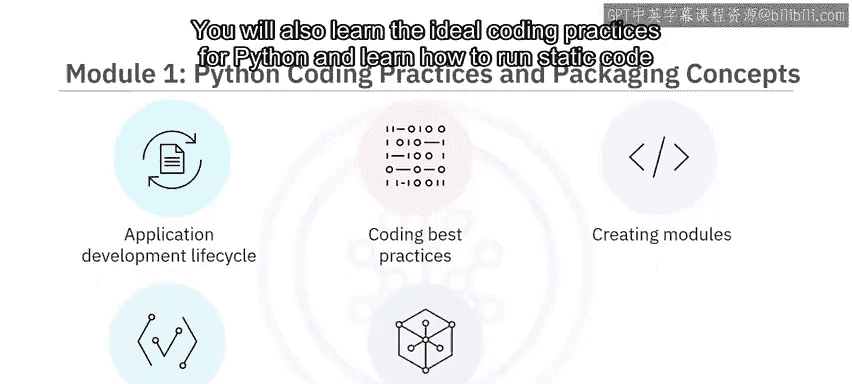

2.  **模块二：Flask框架入门**
    *   在模块二中，你将首先学习Flask的简介。
    *   接着，你将了解部署相关的概念，包括路由、请求和响应对象、错误处理以及装饰器。
    *   你将能够使用Flask创建并部署一个应用程序。

3.  **模块三：开发AI应用**
    *   最后，在模块三中，你将有机会运用之前模块学到的所有知识，使用Watson嵌入式AI库开发功能性的Web应用程序和基于AI的Web应用程序。

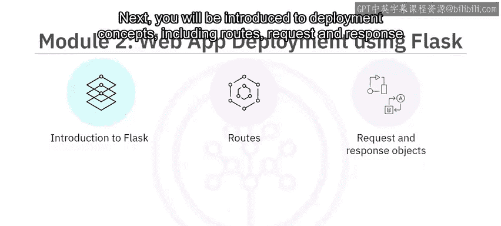

## 课程项目与学习建议

在了解了课程结构后，我们来看看如何通过实践来巩固所学知识。课程包含实践项目来帮助你掌握技能。

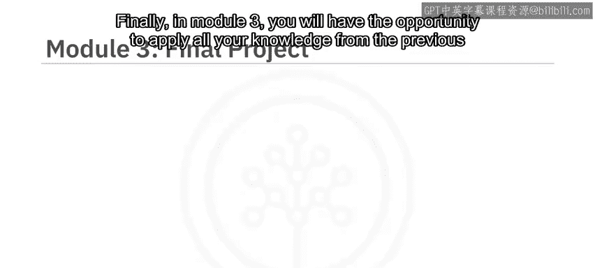

通过一个练习项目和一个计分项目，你将能够展示自己使用Flask创建和部署应用程序的熟练程度。

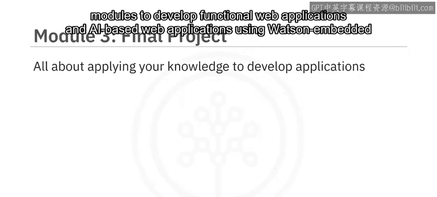

你必须将计分项目的作业提交给同伴进行互评。

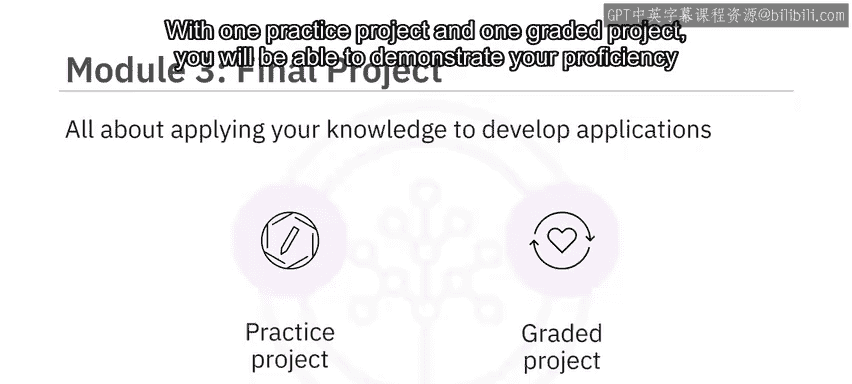

课程内容非常丰富。为了从本课程中获得最大收益，请确保观看每一个视频，通过每个测验检查学习效果，并完成所有动手实验。

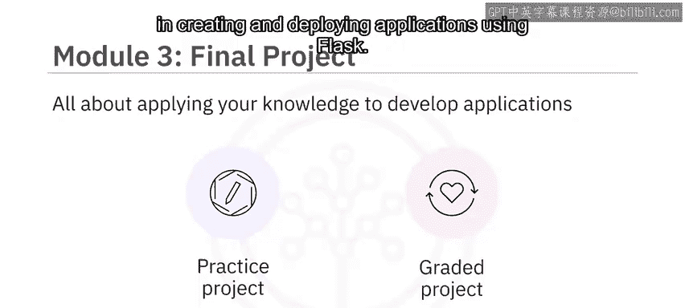

如果你对任何课程材料有疑问，请随时在讨论区联系我们。

感谢你加入我们的课程，欢迎你的到来。

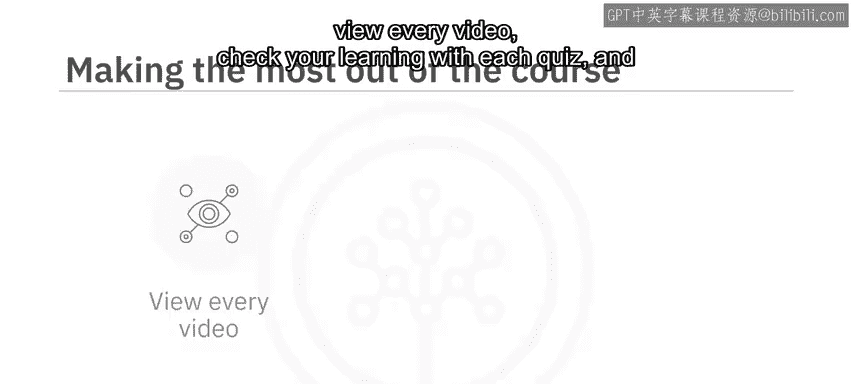

## 总结

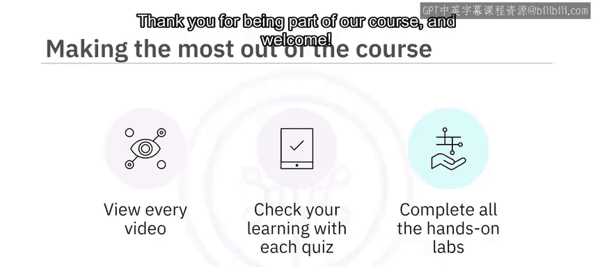

本节课中我们一起学习了《IBM应用人工智能》课程的简介。我们了解到本课程旨在教授使用Python和Flask构建AI驱动的Web应用，涵盖了从开发基础、Flask框架到集成IBM Watson AI的三个核心阶段，并通过实践项目来巩固学习成果。