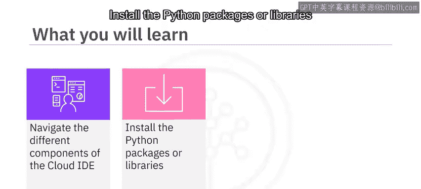
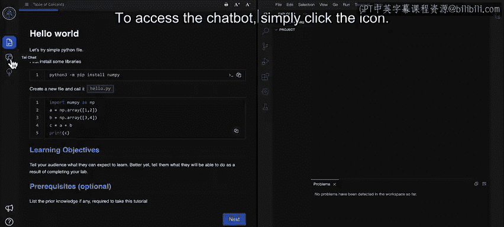
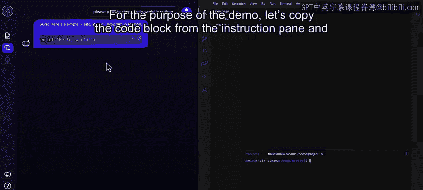
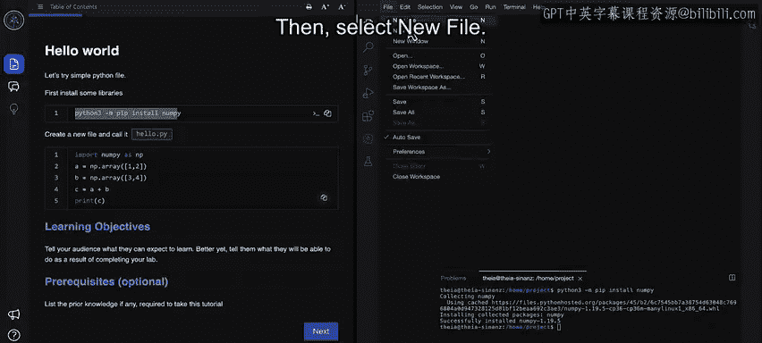
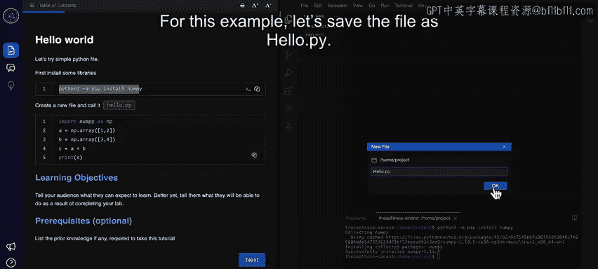
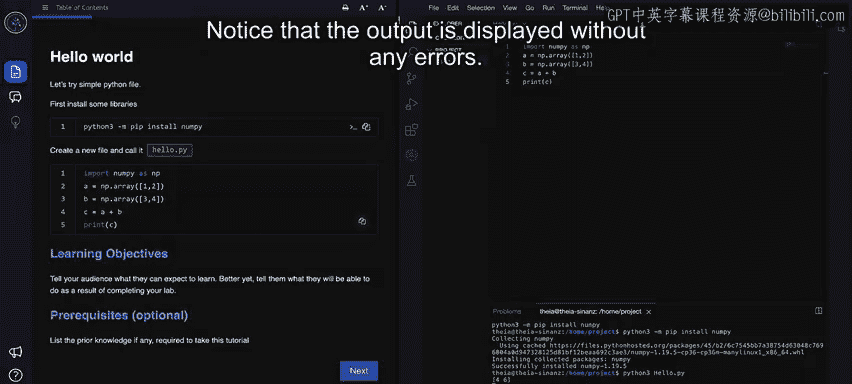

# 093：使用IBM Cloud IDE进行开发 🚀

在本节课中，我们将学习如何使用IBM Skills Network团队提供的Cloud IDE（集成开发环境）。这是一个基于浏览器的编程环境，无需在个人设备上安装任何软件，即可编写、运行、调试和执行代码。

---

## 认识Cloud IDE界面

上一节我们介绍了Cloud IDE的基本概念，本节中我们来看看它的具体界面布局。



打开Cloud IDE后，会显示两个主要窗格。

左侧窗格称为**教学窗格**，它显示完成项目所需遵循的说明。

右侧窗格显示**编程界面**，您可以在此编写和执行代码。

请注意，右侧窗格与流行的代码管理IDE——VS Code界面相似。

您可以调整教学窗格和代码窗格的大小。例如，通过从边缘向左拖动来缩小教学窗格，或向右拖动来增大它。

您还可以根据个人偏好修改字体和字号。

如果教学窗格包含多个页面，您会看到“下一页”和“上一页”按钮。这些按钮使您能够在页面间导航。您也可以预览教学页面。

注意教学窗格左上角的“目录”按钮。使用此按钮可在说明的不同部分之间导航。

---

## 使用AI教学助手Chatbot

接下来，让我们看看Cloud IDE上可用的一个AI驱动的聊天机器人。

IBM Skills Network团队为您提供了一个名为“TI”的AI教学助手聊天机器人，它可帮助您使用实验环境完成编码作业。TI的图标位于教学窗格的左侧。

要访问聊天机器人，只需单击该图标。



让我们尝试提问，例如：“请为我提供一个简单的Python代码。” 如您所见，代码会显示出来。您可以复制或执行该代码。


---

## 编程界面的核心组件

上一节我们体验了AI助手，本节中我们来深入了解编程界面的主要组成部分。

编程界面包含多个组件，但您将频繁使用的两个选项卡包括：
*   **编辑器选项卡**：用于编写代码。
*   **终端选项卡**：用于执行代码。

在编程窗格中，还有一个**Skills Network工具箱**，它使您能够使用各种数据库管理环境、大数据工具、云工具、嵌入式AI库，并启动您构建的应用程序。

在开始编写代码之前，您需要在这个基于云的环境中安装所需的Python库或包。您需要在终端选项卡中执行此任务。

要打开新终端，请单击“终端”菜单，然后选择“新建终端”。

为了演示，让我们从教学窗格复制代码块并将其粘贴到终端中。



然后，按回车键执行命令。注意，`numpy`库已成功安装。现在，您可以将此库导入到您的代码中。


---

## 创建并运行您的第一个程序

了解了界面和准备工作后，现在让我们在编程窗格中创建一个基本的Python程序。



单击“文件”，然后选择“新建文件”。


新文件将在编辑器选项卡中打开。在开始添加代码之前保存文件是一个最佳实践。

由于我们编写的是Python代码，请使用`.py`扩展名保存文件。从文件菜单中，单击“保存”或使用快捷键 `Ctrl + S`。出现提示时，提供文件名。对于此示例，让我们将文件保存为 `hello.py`。




下一步是添加代码。您可以在编辑器选项卡中手动键入代码，或者如果教学窗格中有可用代码，也可以复制并粘贴到您的文件中。

为了本次演示，让我们从教学窗格复制代码并粘贴到文件中。**别忘了保存文件**。

是时候执行代码了。让我们导航回终端选项卡。

确保您位于存储程序文件的文件夹中，可以通过键入 `python3` 后跟文件名来执行文件。对于此示例，命令是：
```bash
python3 hello.py
```
注意，输出已显示且没有任何错误。




---

## 课程总结

本节课中我们一起学习了IBM Cloud IDE的使用。

Cloud IDE是IBM Skills Network提供的一个类似于VS Code的编程环境，用于学习和培养实践技能。

Cloud IDE有两个窗格：教学窗格和编程窗格。您可以使用教学窗格上的“目录”按钮在说明页面间导航。

编程窗格提供编辑器选项卡来编写代码，以及终端选项卡来执行代码。您需要通过终端安装所需的库。

在实验的任何阶段，您都可以从教学窗格复制代码块，并将其粘贴到编辑器或终端选项卡中。


