# 096：Python 打包教程 📦


在本节课中，我们将要学习Python中模块、包和库的概念与区别，并掌握如何创建、验证和使用一个Python包。


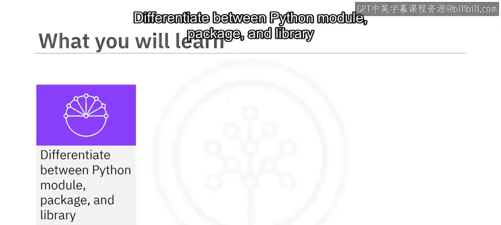

---

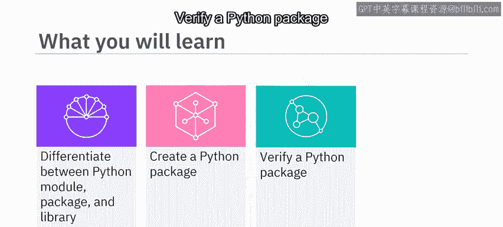

## 模块、包与库的概念 🔍

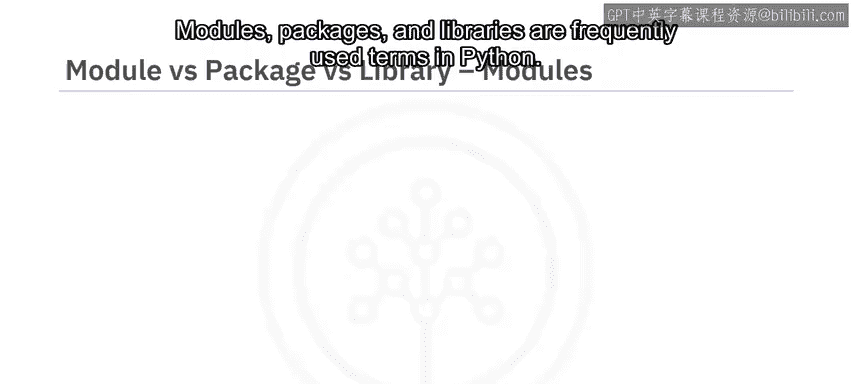

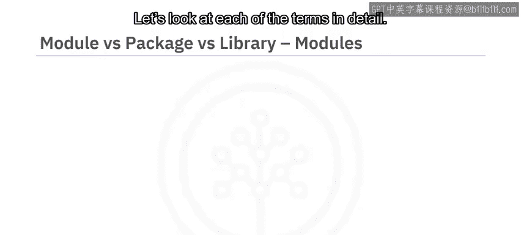

上一节我们介绍了课程目标，本节中我们来看看Python中几个核心术语：模块、包和库。

### Python 模块

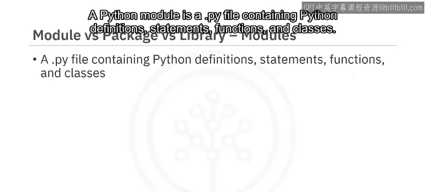

一个Python模块是一个包含Python定义、语句、函数和类的 `.py` 文件。

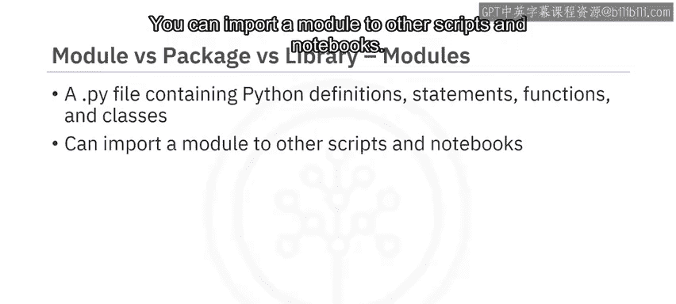

你可以将模块导入到其他脚本或笔记本中使用。例如，考虑一个名为 `module.py` 的模块，它包含两个函数。

以下是该模块中函数的代码示例：

```python
def square(number):
    return number ** 2

def doubler(number):
    return number * 2
```

如果该模块文件位于同一目录下，你可以导入并使用其中的函数。

考虑使用 `square` 函数配合 `print` 命令：

```python
print("4^2 =", square(4))
```

输出结果为：`4^2 = 16`。

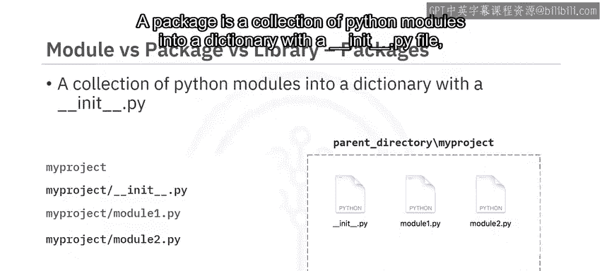

类似地，对于值为4的 `doubler` 函数：

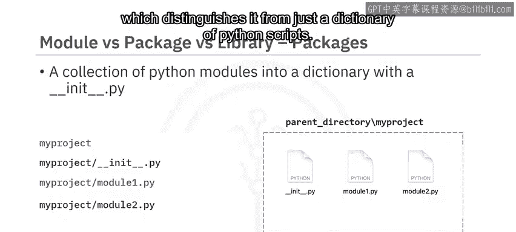

```python
print("2*4 =", doubler(4))
```

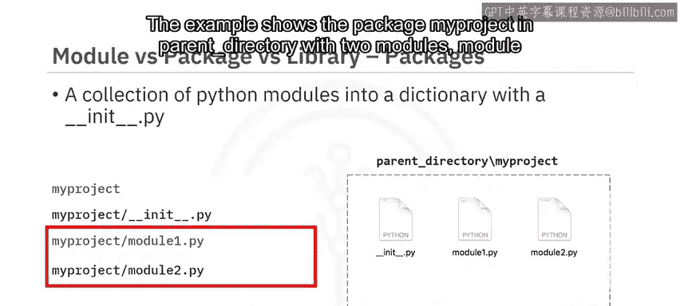

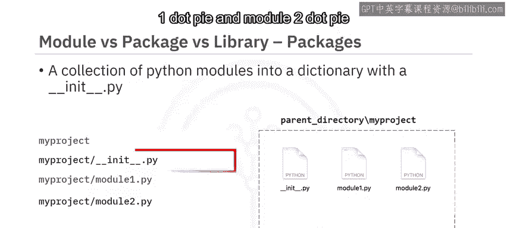

输出结果为：`2*4 = 8`。

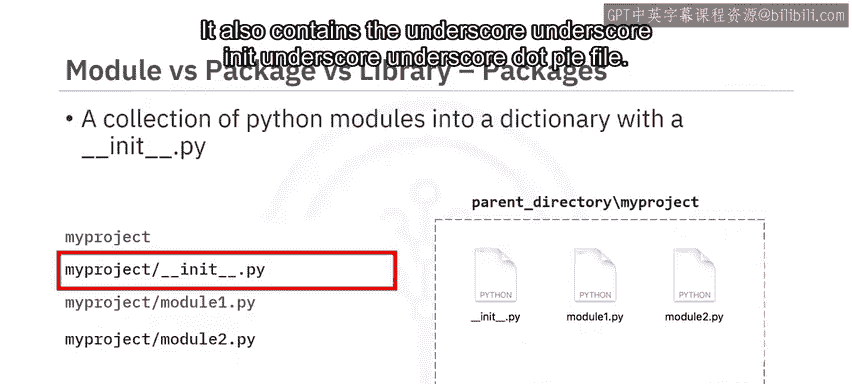

### Python 包


一个包是一个包含 `__init__.py` 文件的目录，该目录下汇集了多个Python模块。`__init__.py` 文件的存在将其与普通脚本目录区分开来。


示例展示了在父目录下的 `my_project` 包，其中包含两个模块：`module1.py` 和 `module2.py`。

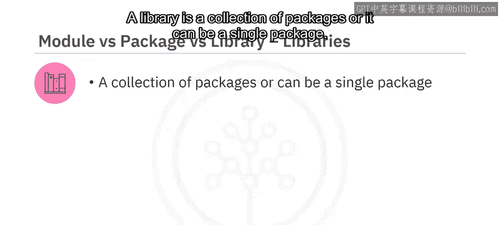

该包也包含 `__init__.py` 文件。

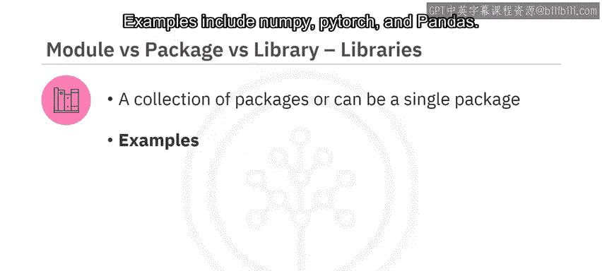

当你导入一个模块或包时，Python创建的对应对象类型始终是 `module`。

请注意，模块和包的区别仅存在于文件系统层面。

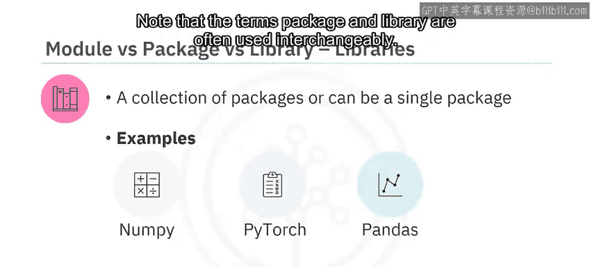

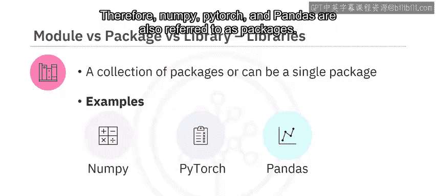

### Python 库

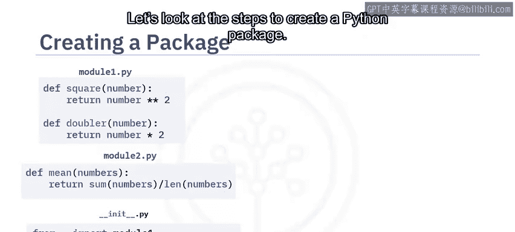

一个库是包的集合，或者它本身可以是一个单独的包。

示例包括 `numpy`、`torch` 和 `pandas`。

请注意，术语“包”和“库”经常互换使用。因此，`numpy`、`torch` 和 `pandas` 也常被称为包。

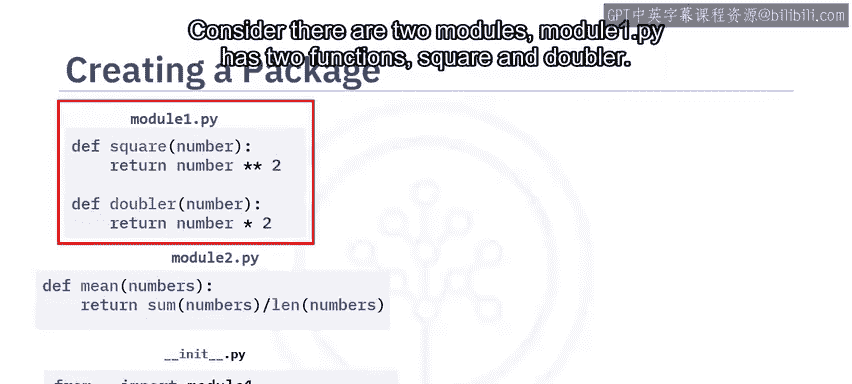

---

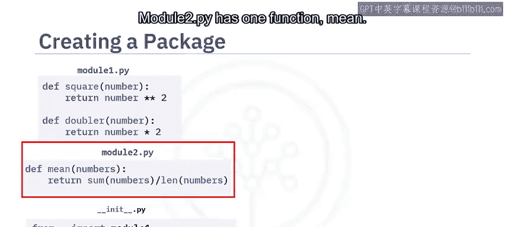

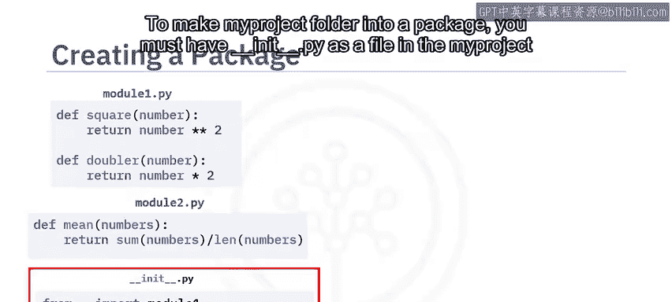

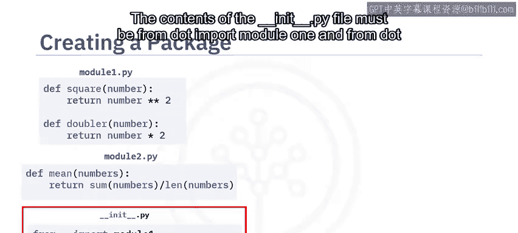

## 创建Python包的步骤 🛠️

上一节我们了解了核心概念，本节中我们来看看如何创建一个Python包。

考虑有两个模块：
*   `module1.py` 包含两个函数：`square` 和 `doubler`。
*   `module2.py` 包含一个函数：`mean`。

要将 `my_project` 文件夹变成一个包，你必须在 `my_project` 文件夹中有一个 `__init__.py` 文件。

`__init__.py` 文件的内容必须是：
```python
from . import module1
from . import module2
```

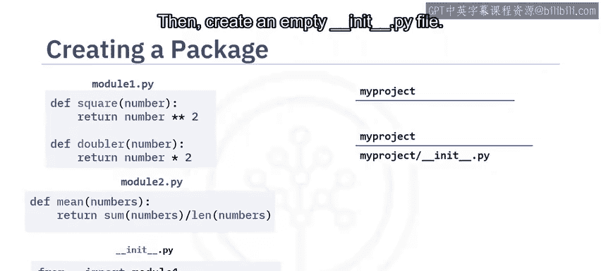


以下是创建包的典型步骤：

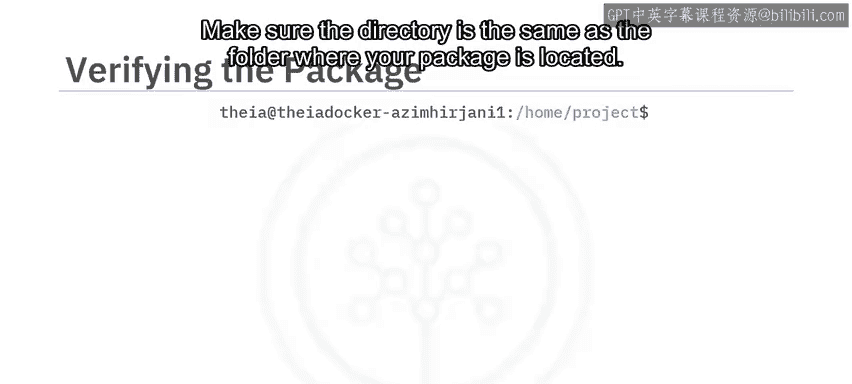

1.  创建一个以包名命名的文件夹。
2.  在该文件夹中创建一个空的 `__init__.py` 文件。
3.  创建所需的模块文件（如 `module1.py`, `module2.py`）。
4.  最后，在 `__init__.py` 文件中，添加引用包中所需模块的代码。

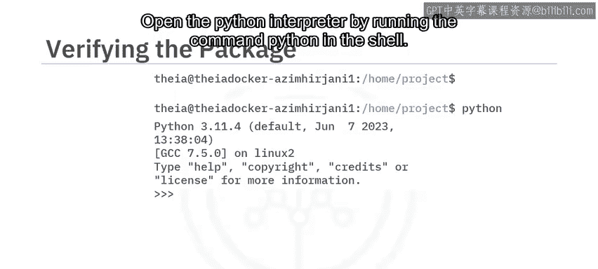

---

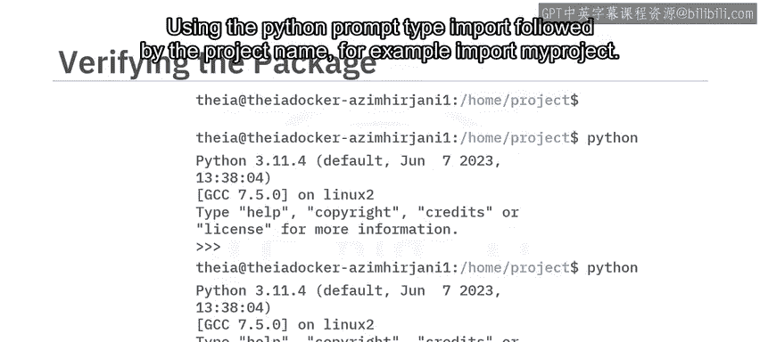

## 验证Python包 ✅

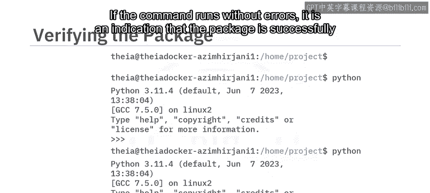

创建包之后，你需要验证它。

以下是验证包的步骤：

1.  打开一个bash终端。
2.  确保当前目录与你的包所在的文件夹处于同一层级。
3.  通过在shell中运行 `python` 命令来打开Python解释器。

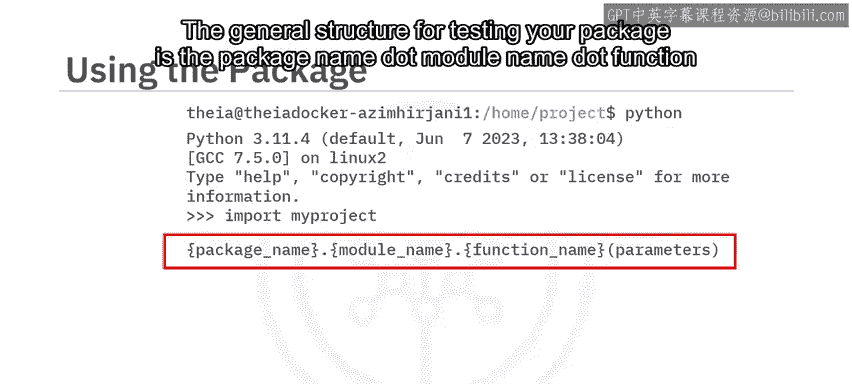

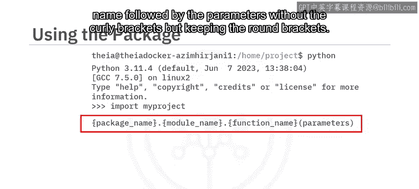

在Python提示符下，键入 `import` 后跟项目名称，例如：
```python
import my_project
```

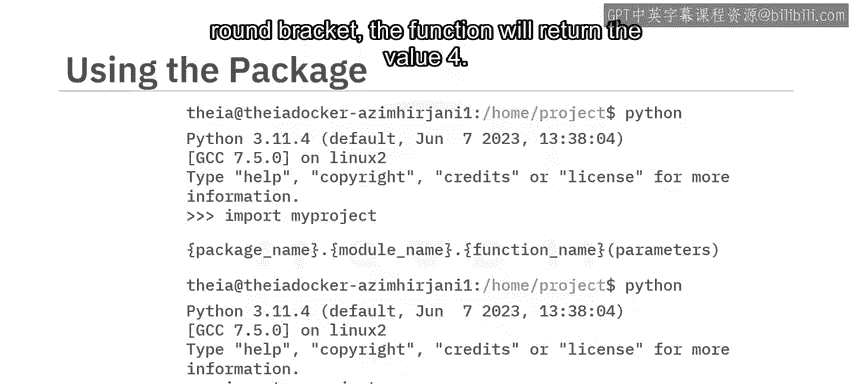

如果该命令运行无误，则表明包已成功加载。

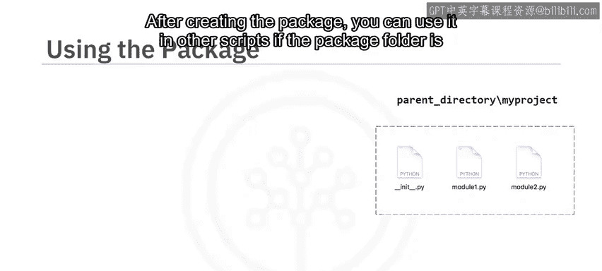

测试包中函数的一般结构是：`包名.模块名.函数名(参数)`。

例如，使用 `my_project.module1.square(2)`，该函数将返回值 `4`。

---

## 使用Python包 🚀

创建并验证包后，如果包文件夹位于同一目录下，你可以在其他脚本中使用它。

在这种情况下，你在父目录中有一个 `test.py` 文件。

你可以导入包中的函数，例如使用以下Python代码：

```python
from my_project.module1 import square, doubler
from my_project.module2 import mean

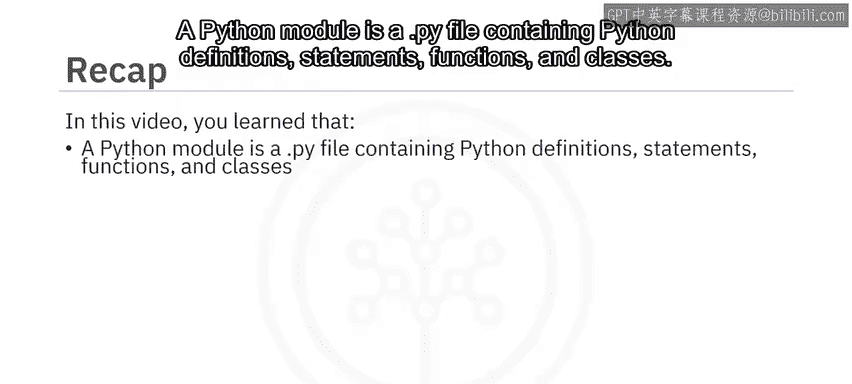

print("4^2 =", square(4))
print("2*4 =", doubler(4))
print("(2+1+3)/3 =", mean([2, 1, 3]))
```

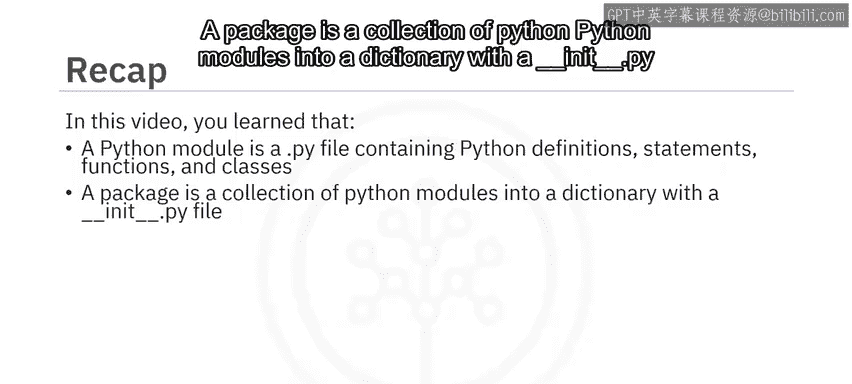

然后你可以运行这些函数并检查是否得到正确的结果。

---

## 总结 📝

本节课中我们一起学习了以下内容：


*   **Python模块**：是一个包含Python定义、语句、函数和类的 `.py` 文件。
*   **Python包**：是一个包含 `__init__.py` 文件的目录，该目录下汇集了多个Python模块。
*   **Python库**：是包的集合，或者它本身可以是一个单独的包。
*   **创建包**：创建一个以包名命名的文件夹，在其中创建空的 `__init__.py` 文件，创建所需模块，并在 `__init__.py` 文件中添加引用这些模块的代码。
*   **验证包**：可以通过bash终端和Python解释器导入包来验证。
*   **使用包**：如果包文件夹位于同一目录下，你可以在其他脚本中导入并使用它。