# 097：单元测试 🧪

在本节课中，我们将要学习单元测试。单元测试是一种系统化、可重复的代码测试方法。我们将了解其基本概念、工作流程，并通过一个简单的Python示例来学习如何编写单元测试。

## 概述

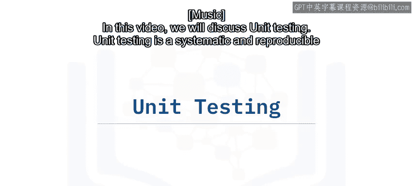

单元测试是一种验证代码单元是否按预期工作的方法。一个“单元”是应用程序中一个较小且可测试的部分，通常是函数或模块。我们将使用Python内置的`unittest`库来构建测试。

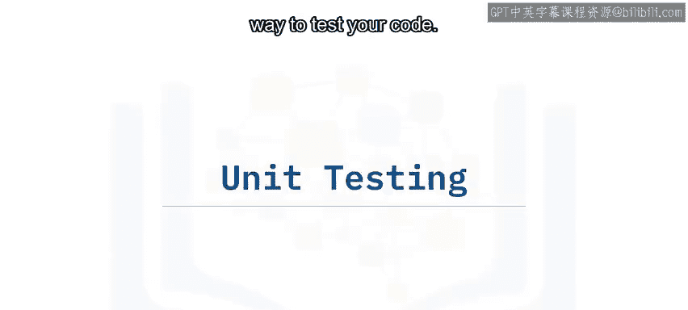

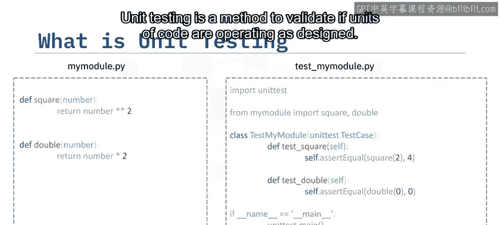

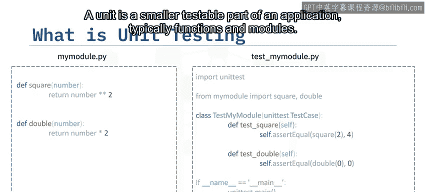

## 什么是单元测试？

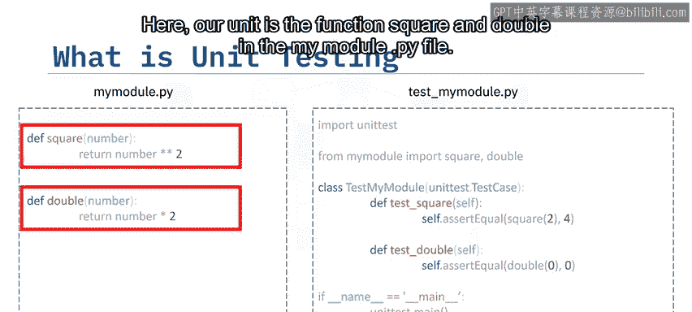

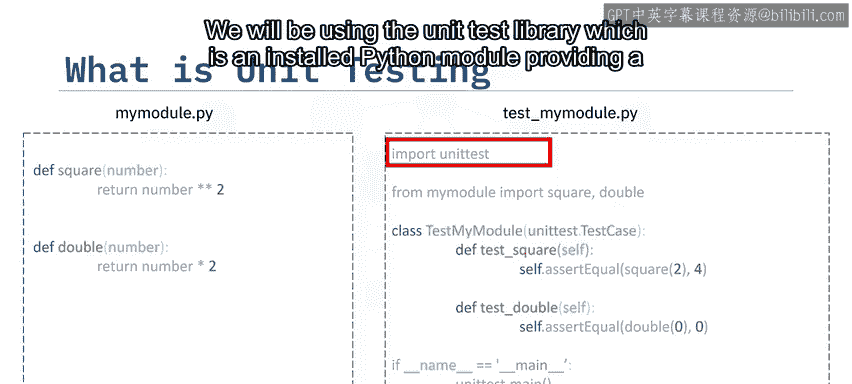

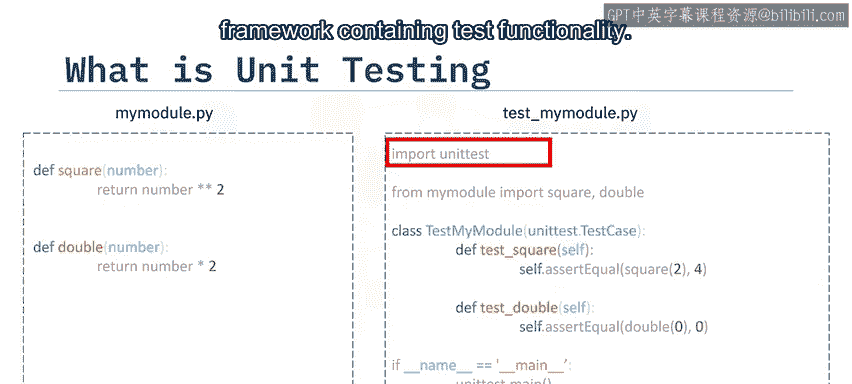

单元测试是一种系统化、可重复的测试代码的方法。其核心目的是验证代码中的各个单元是否按照设计运行。

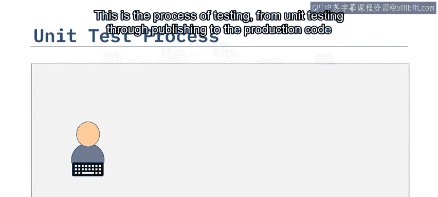

一个“单元”指的是应用程序中一个较小、可测试的部分，通常是函数或模块。在本例中，我们的单元是`my_module.py`文件中的`square`和`double`函数。

我们将使用`unittest`库，这是一个Python内置模块，提供了一个包含测试功能的框架。

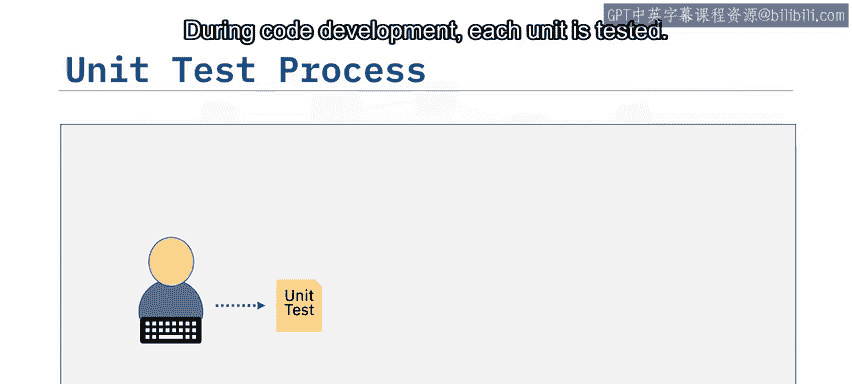

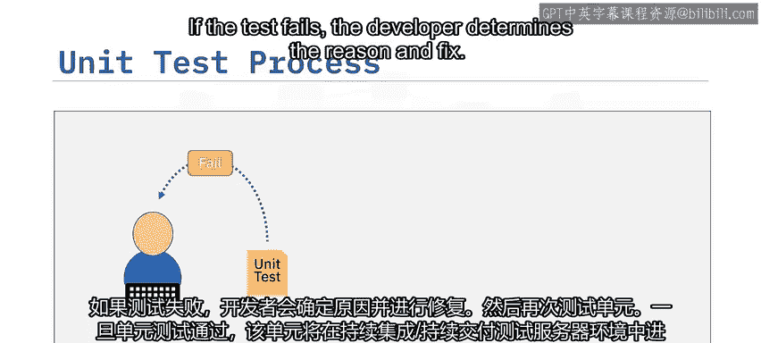

## 单元测试的工作流程

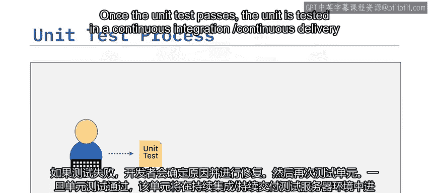

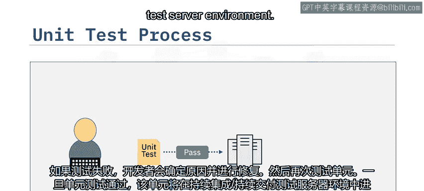

上一节我们介绍了单元测试的基本概念，本节中我们来看看从单元测试到发布到生产代码库的完整测试流程。

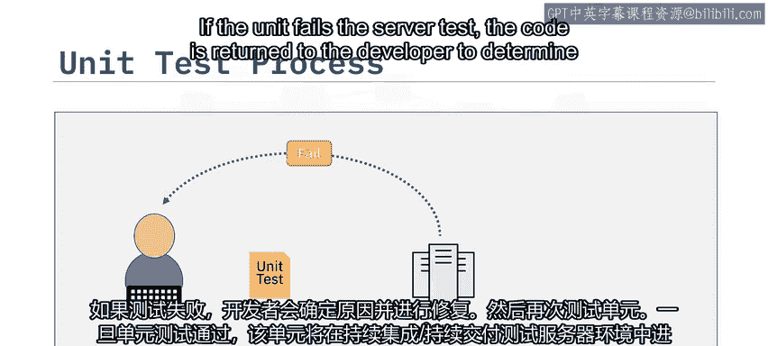

以下是测试流程的主要步骤：

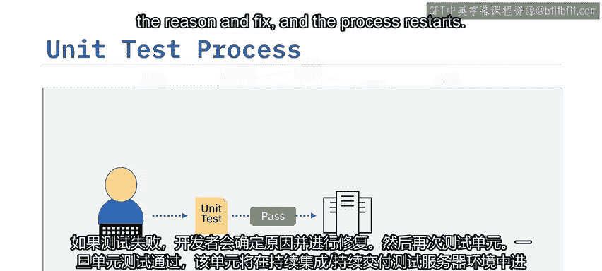

1.  **开发与单元测试**：在代码开发过程中，对每个单元进行测试。如果测试失败，开发者需确定原因并进行修复，然后重新测试该单元。
2.  **持续集成/持续交付测试**：一旦单元测试通过，代码会在持续集成/持续交付的服务器测试环境中进行测试。
3.  **问题修复与回归**：如果单元在服务器测试中失败，代码将返回给开发者以确定原因并进行修复，然后流程重新开始。
4.  **合并到主代码库**：一旦单元通过服务器测试，它将被合并到最终的主代码库中。

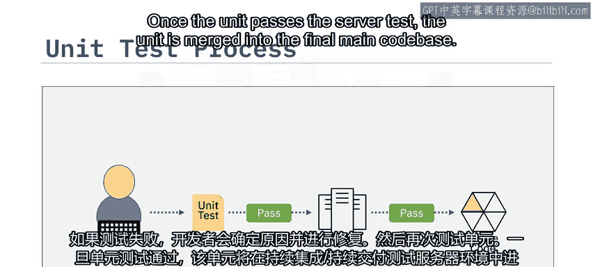

## 如何构建单元测试

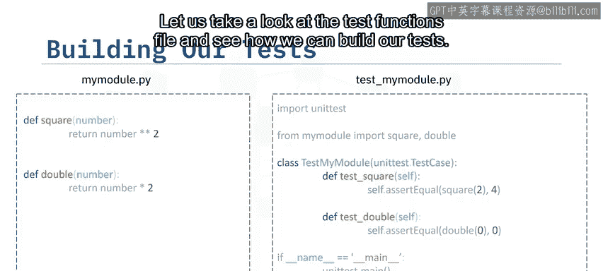

了解了工作流程后，现在让我们看看如何实际构建测试。我们将通过一个名为`test_functions.py`的文件来学习。

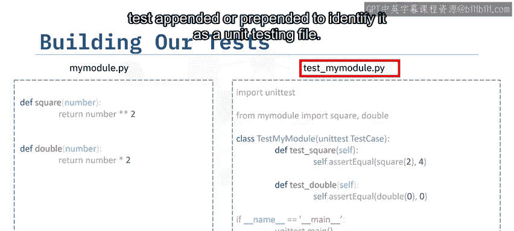

以下是构建单元测试文件的关键步骤：

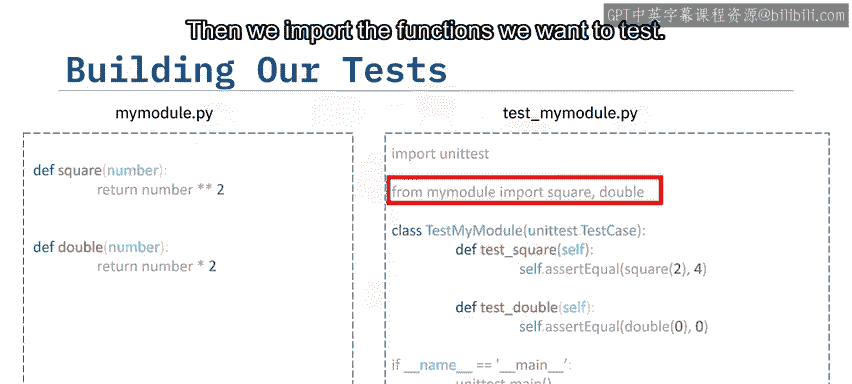

*   **文件命名**：首先，注意文件名添加了`test`前缀或后缀，以标识它是一个单元测试文件。这是一个良好的命名规范。
*   **导入库和函数**：接下来，我们导入`unittest`库以及我们想要测试的函数。
*   **创建测试类**：然后，我们创建一个测试类。良好的命名规范是：为你正在测试的文件名加上`Test`前缀作为类名，例如`TestMyModule`。
*   **继承TestCase类**：接着，让这个类继承`unittest`库中的`TestCase`类。这允许我们的类使用`TestCase`类中的方法。
*   **创建测试方法**：现在，我们在`TestMyModule`类中为每个要测试的函数创建一个方法。我们通过在被测函数名前加上`test_`来命名这些方法。请注意，这一步是强制性的，因为只有以`test`开头的方法才会被运行。
*   **编写测试用例**：最后，我们可以开始创建测试用例。这是通过使用`assertEqual`函数来完成的。
*   **添加执行入口**：为了在运行文件时执行测试，我们添加`if __name__ == '__main__': unittest.main()`代码块。

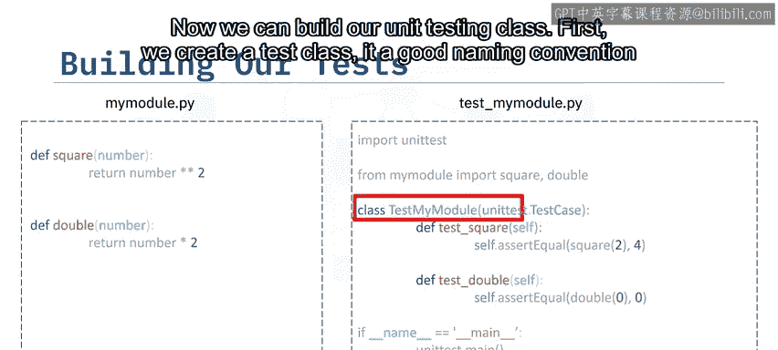

让我们通过代码来具体说明：

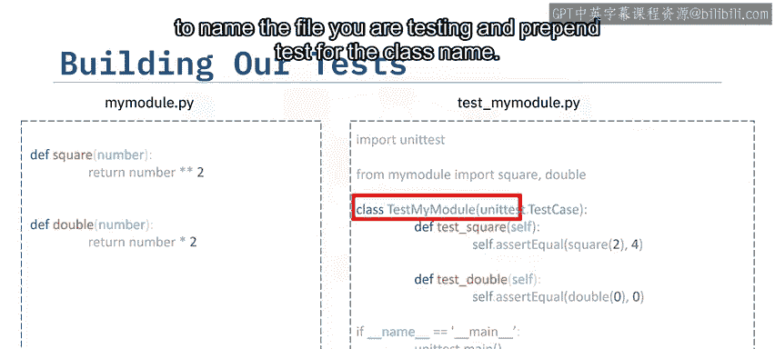

```python
# test_functions.py
import unittest
from my_module import square, double  # 导入要测试的函数

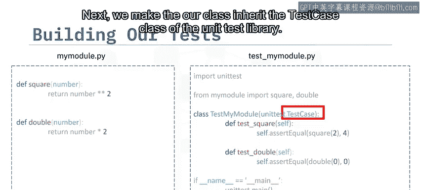

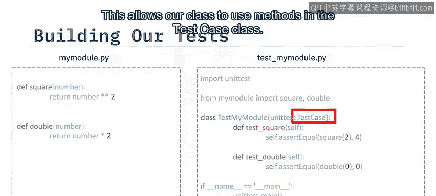

class TestMyModule(unittest.TestCase):  # 创建测试类并继承TestCase
    def test_square(self):  # 测试square函数的方法
        self.assertEqual(square(2), 4)  # 断言：square(2)应该等于4
        self.assertEqual(square(3.0), 9.0)  # 测试浮点数

    def test_double(self):  # 测试double函数的方法
        self.assertEqual(double(2), 4)
        self.assertEqual(double(-3.1), -6.2)

if __name__ == '__main__':
    unittest.main()  # 运行所有测试
```

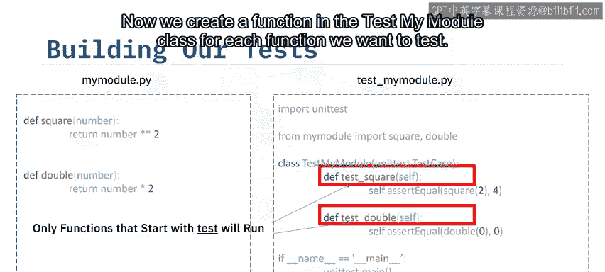

## 深入理解 assertEqual

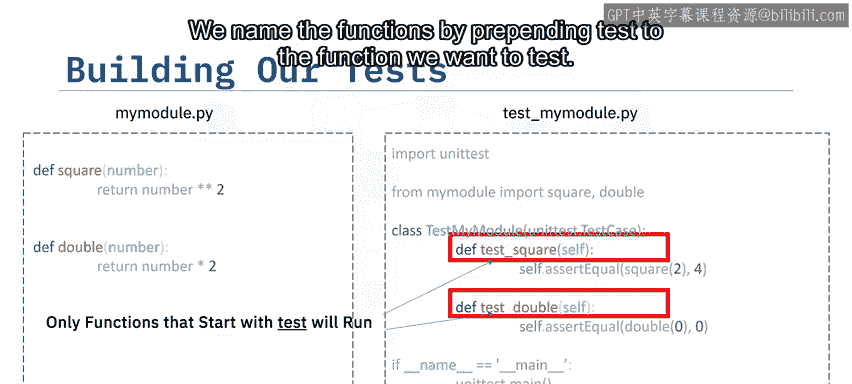

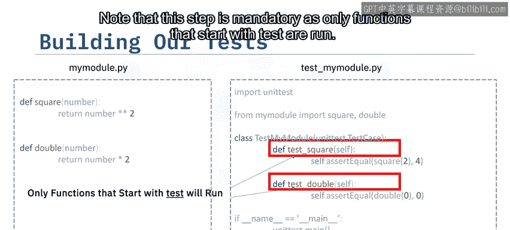

上一节我们构建了测试文件，本节中我们来仔细看看测试类中使用的`assertEqual`。

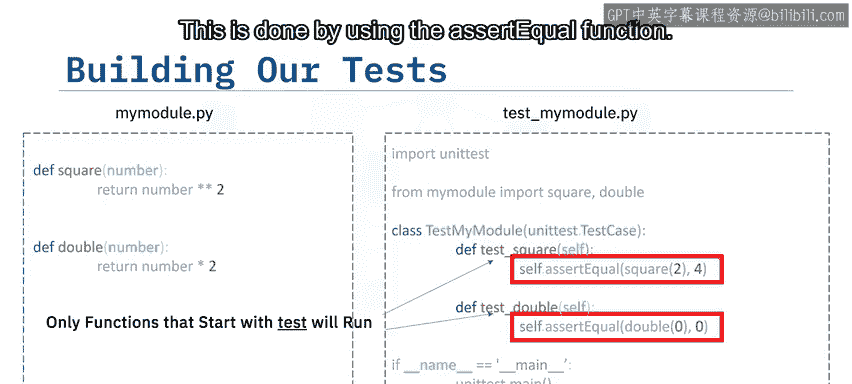

`assertEqual`比较两个值并判断它们是否相等。它用于检查函数是否为给定的输入返回了正确的值。

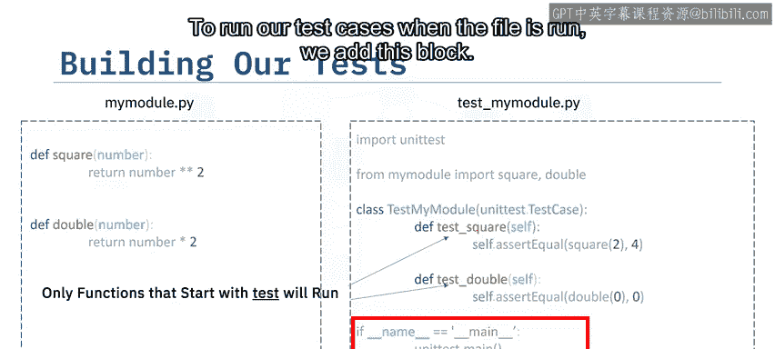

其基本结构如下：
`self.assertEqual(actual_value, expected_value)`

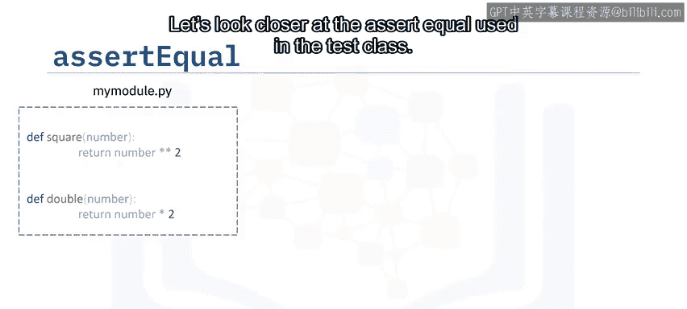

*   **实际值**：我们调用正在测试的函数。
*   **期望值**：我们放入函数预期返回的值。

例如，在第一个测试中，我们使用数字`2`测试`square`函数，如果函数运行正确，它应该返回`4`。

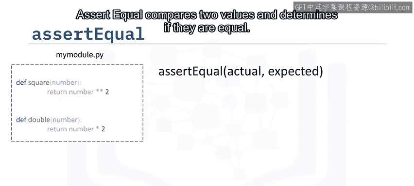

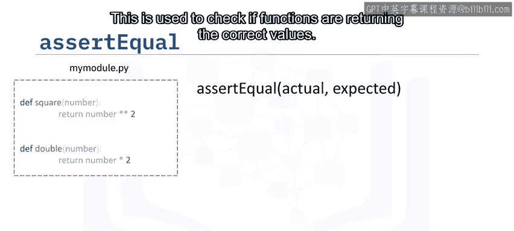

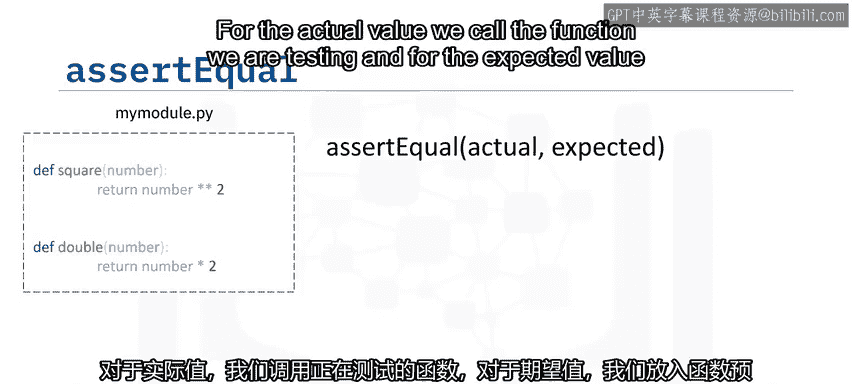

1.  首先，函数被求值：`square(2)`得到结果（例如`4`）。
2.  然后，将得到的实际值（`4`）与期望值（`4`）进行比较，看它们是否相等。

运行我们的测试文件后，如果函数实现正确，我们将得到类似“OK”的输出，表示两个测试都通过了。

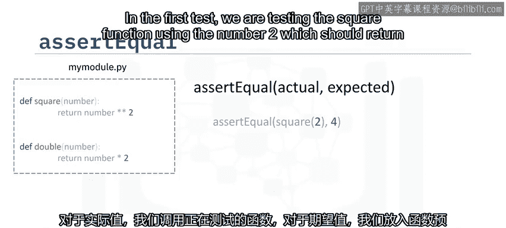

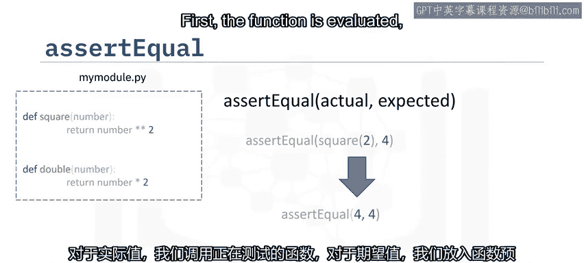

## 当测试失败时

但是，如果我们的函数没有正确实现会发生什么？

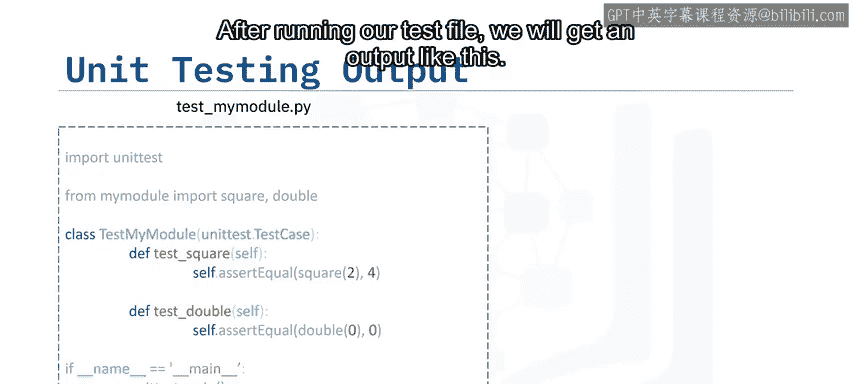

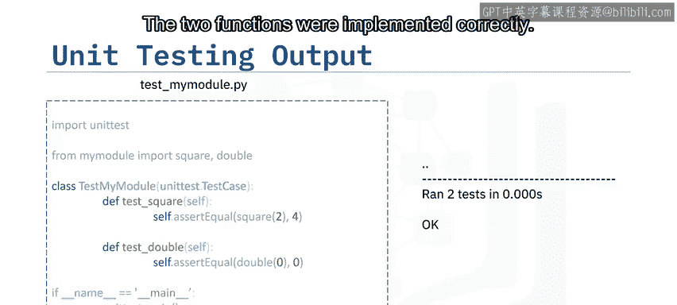

考虑以下情况，`square`函数被错误地实现为计算一个数的立方而不是平方：
```python
# my_module.py 中的错误实现
def square(n):
    return n * n * n  # 错误：这是立方，不是平方
```

在这种情况下，`assertEqual`的求值将如下所示：
`self.assertEqual(square(2), 4)` -> `self.assertEqual(8, 4)`
这将导致断言失败。

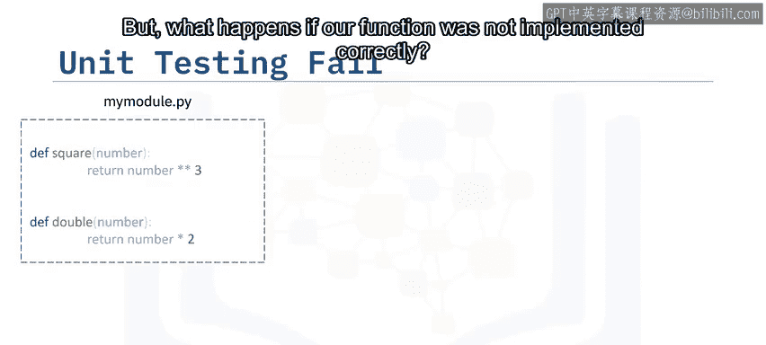

测试文件的输出将显示失败信息，我们可以轻松地看到哪个函数的单元测试失败了，以及`assertEqual`失败的原因和函数实际求值的结果是什么。

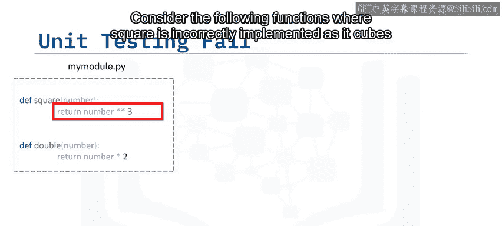

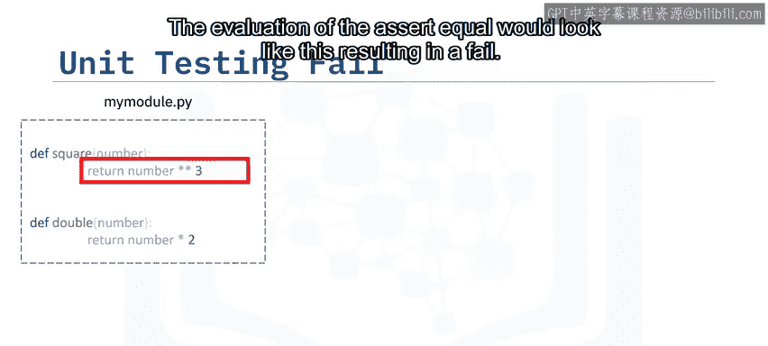

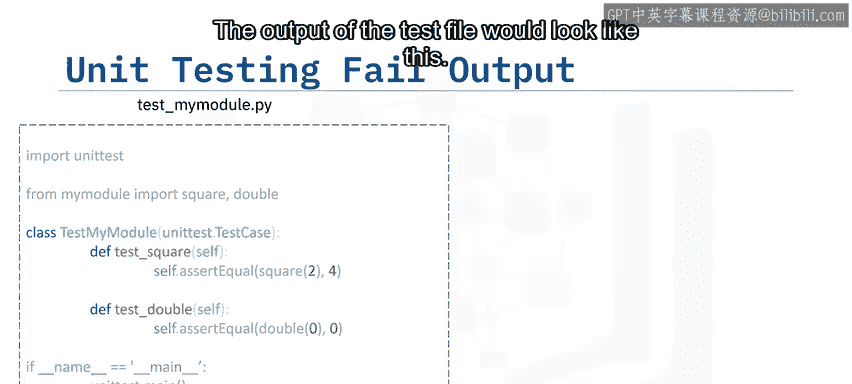

## 总结

本节课中我们一起学习了单元测试。我们了解到单元测试是验证代码单元功能性的系统化方法。我们探讨了从开发到集成的测试流程，并动手实践了如何使用Python的`unittest`库创建测试文件、编写测试类和方法，以及使用`assertEqual`进行断言。最后，我们还分析了测试通过和失败时的不同输出结果。掌握单元测试是保证代码质量、构建可靠AI应用的重要一步。