# 098：Python包创建教程 📦

在本节课中，我们将学习如何创建一个Python包。我们将从Python模块和包的基本概念讲起，然后逐步演示创建、验证和使用一个自定义包的完整流程。

---

## Python模块与包概述 📚

上一节我们介绍了Python脚本的基本概念，本节中我们来看看如何将代码组织成更高级的结构。

一个**Python模块**是一个包含Python定义、语句、函数和类的`.py`文件。我们可以将模块导入到其他脚本或笔记本中，以复用代码。

例如，假设有一个名为`module.py`的文件，其中包含两个函数：一个函数对输入进行平方运算并返回结果，另一个函数将输入翻倍并返回结果。

如果该模块文件与我们的脚本在同一目录下，我们可以导入它并使用其中的函数。

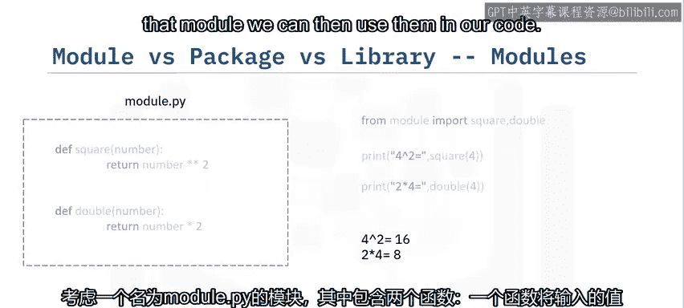

一个**Python包**则是将多个Python模块组织在一个包含`__init__.py`文件的目录中。这个特殊的文件将该目录标识为一个Python包，而不仅仅是一个普通的文件夹。

以下是一个包的示例结构：
```
my_package/
├── __init__.py
├── module1.py
└── module2.py
```

当你导入一个模块或包时，Python创建的对象类型始终是`module`。模块和包之间的区别主要在于文件系统层面。

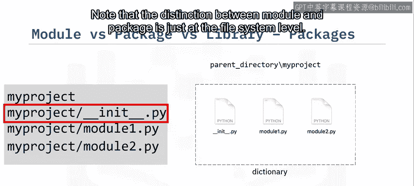

一个**库**是一个或多个包的集合。例如，NumPy或PyTorch都可以被称为库。值得注意的是，“包”和“库”这两个术语经常互换使用，因此PyTorch和NumPy也常被称为包。

---

## 创建Python包的步骤 🛠️

了解了基本概念后，现在我们来一步步创建一个自己的Python包。

以下是创建包的具体步骤：

1.  **创建包目录**：创建一个以包名命名的文件夹。
2.  **创建`__init__.py`文件**：在该文件夹内创建一个空的`__init__.py`文件。稍后我们将在此文件中添加代码。
3.  **创建模块**：在包目录内创建你的模块文件（例如`module1.py`）。
4.  **编辑`__init__.py`文件**：在`__init__.py`文件中添加代码，以引用包内的模块。这可以控制包的导入行为。
5.  **验证包**：打开终端，切换到包所在的目录，运行Python解释器，尝试导入你的包。如果没有错误，则表明包已成功加载。

---

## 验证与使用你的包 ✅

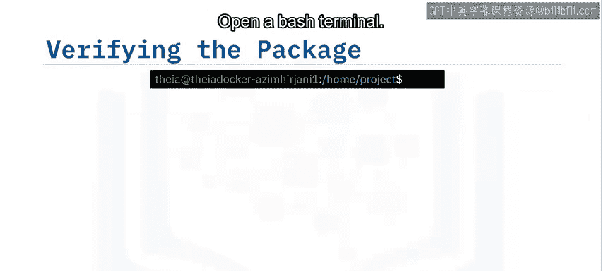

创建好包之后，我们需要验证它是否能正常工作，并学习如何使用它。

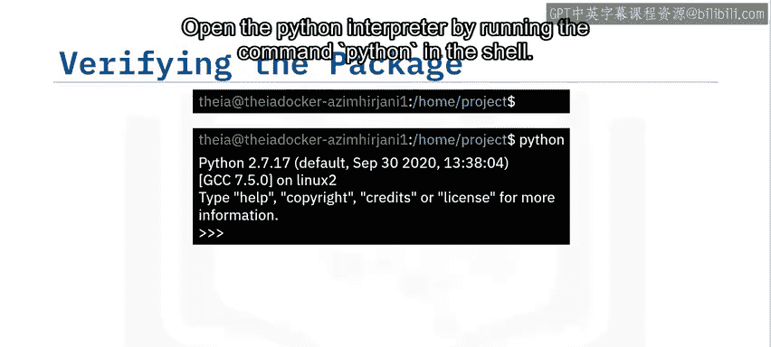

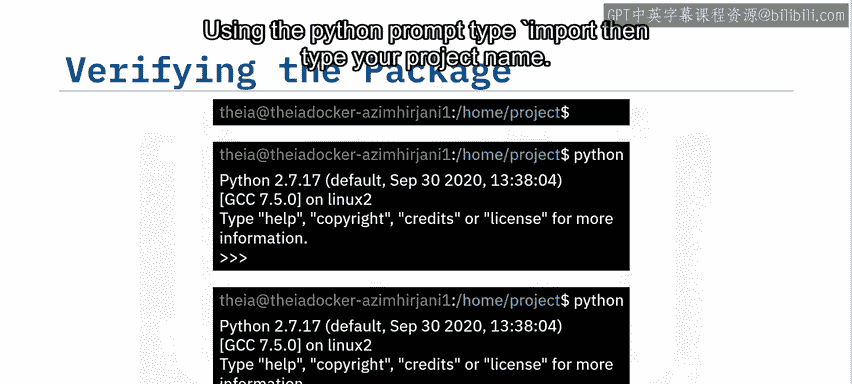

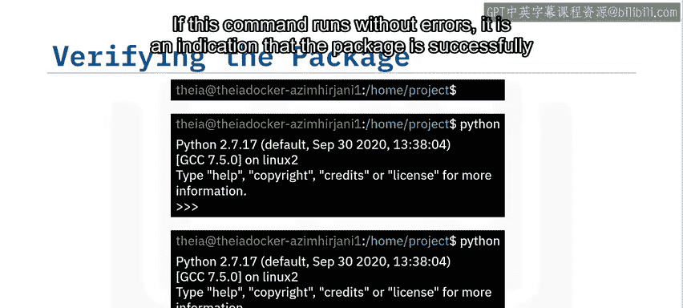

验证包的通用结构是：`包名.模块名.函数名(参数)`。

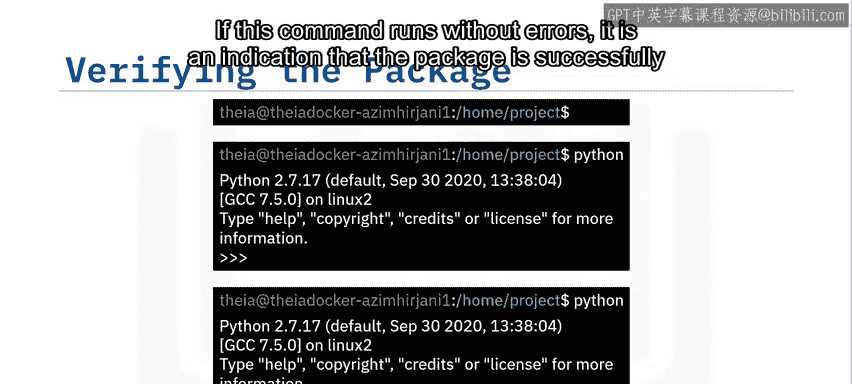

例如，使用我们创建的`my_package`：
```python
import my_package.module1
result = my_package.module1.square_function(5)
```

一旦包创建成功，并且包文件夹与脚本在同一目录下，我们就可以在其他脚本中使用它。

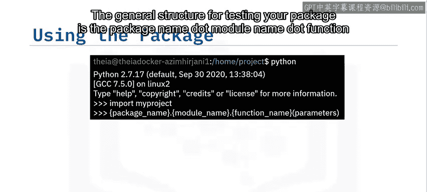

假设在父目录中有一个`test.py`文件，我们可以这样导入包中的函数：
```python
from my_package import module1
```

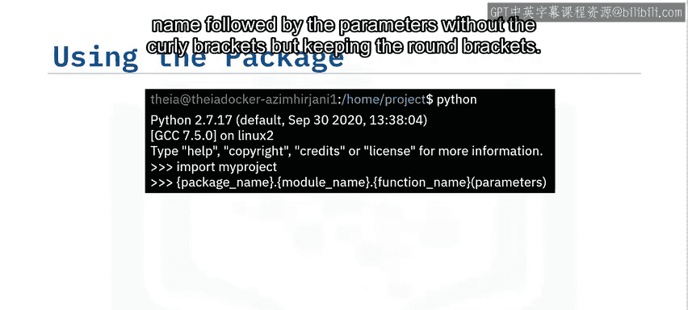

然后，我们可以运行这些函数并检查是否得到正确的结果。

---

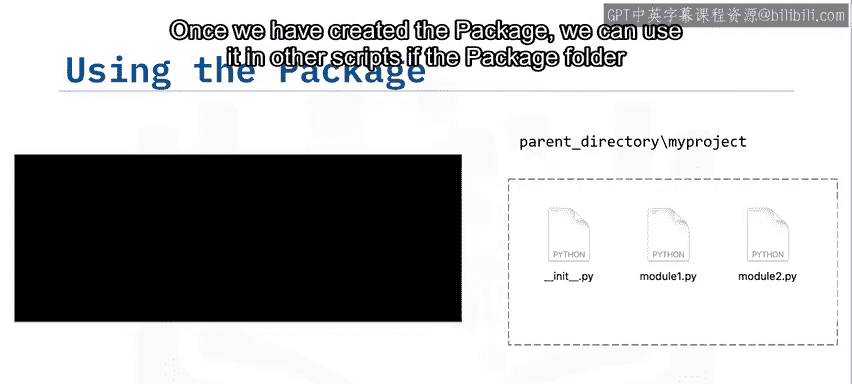

## 总结 🎯

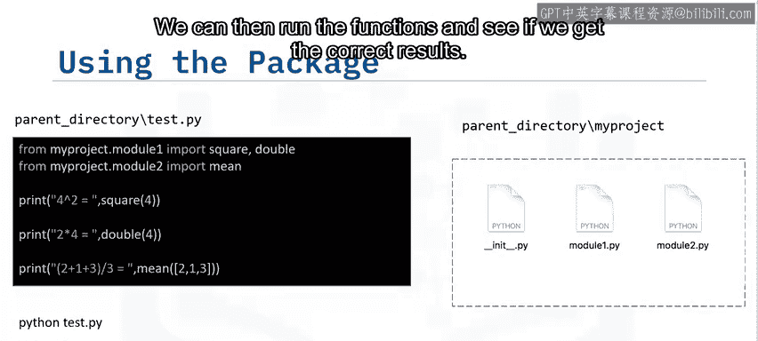

本节课中我们一起学习了Python包的核心知识。我们首先区分了模块、包和库的概念，然后详细讲解了创建一个Python包的五个步骤：创建目录、添加`__init__.py`文件、编写模块、配置初始化文件以及最终验证。最后，我们演示了如何在其他脚本中导入和使用自定义的包。掌握包的创建与管理，能帮助你更好地组织代码，构建更复杂的项目。