# 099：使用Flask创建Web应用程序 🚀


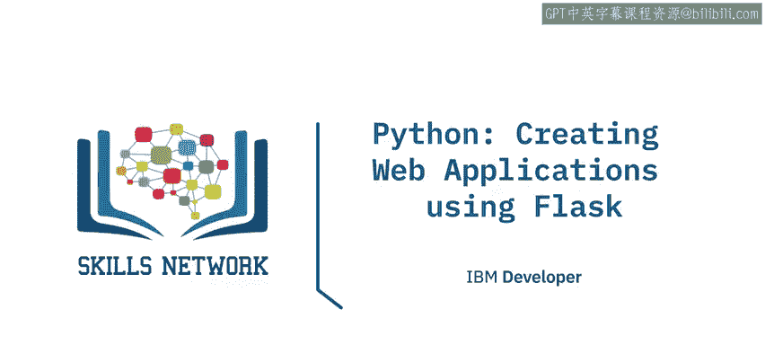

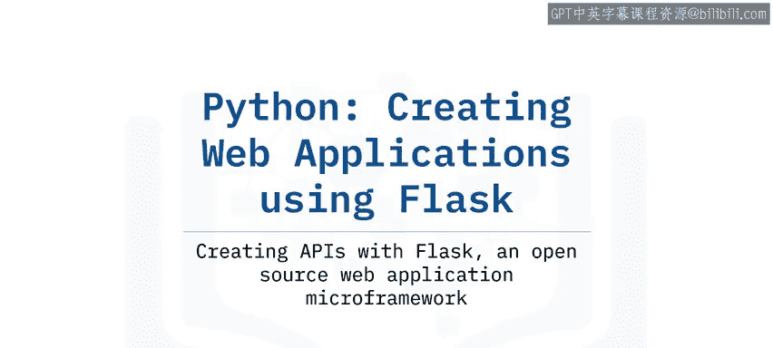

在本节课中，我们将要学习如何使用Flask微框架来创建Python Web应用程序。我们将了解什么是框架，探索Flask的核心特性，并通过一个简单的示例来演示如何构建和运行一个基础的Web应用。

---

## 什么是框架？🤔

在Python中，**框架**是为特定目的而开发和提供的一系列包或模块的集合。它通过自动化常见的开发任务，帮助开发者更高效地构建应用程序。

以下是流行的Python Web框架：
*   Flask
*   Django
*   Dash
*   Tornado
*   Web2py

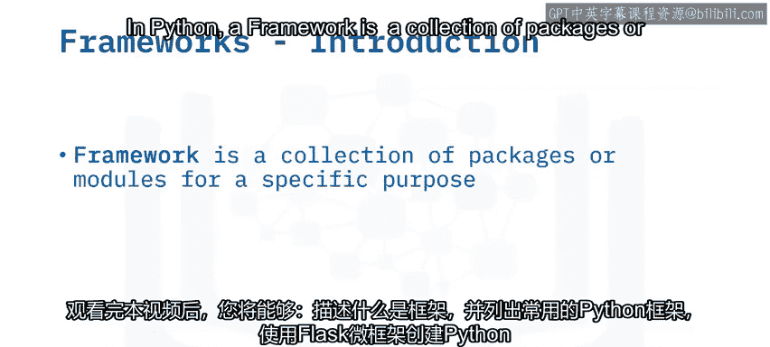

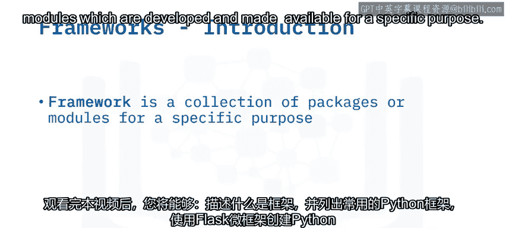

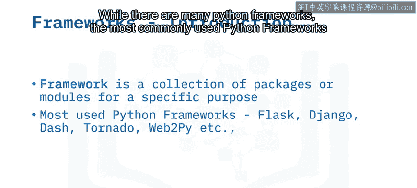

**微框架**是一种极简主义的Web应用框架。它允许你创建一个最基础的Web应用，但需要依赖其他包来获得更多功能。

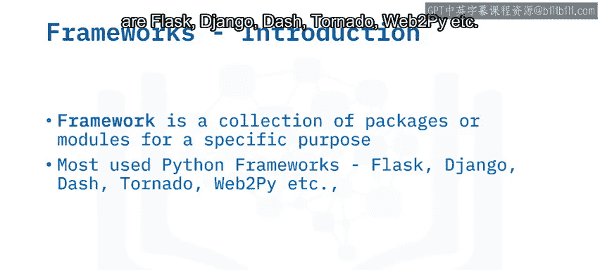

---

## 深入了解Flask 🔍

上一节我们介绍了框架的概念，本节中我们来看看Flask的具体细节。

Flask是一个用Python编写的开源、可扩展的微框架，用于快速、轻松地创建Web应用。

Flask基于两个核心组件构建：
1.  **Werkzeug**：一个Web服务器网关接口工具包。它实现了请求、响应和其他Web实用功能，使得在其之上构建Web框架成为可能。
2.  **Jinja2**：一个Python模板引擎，用于渲染动态网页。

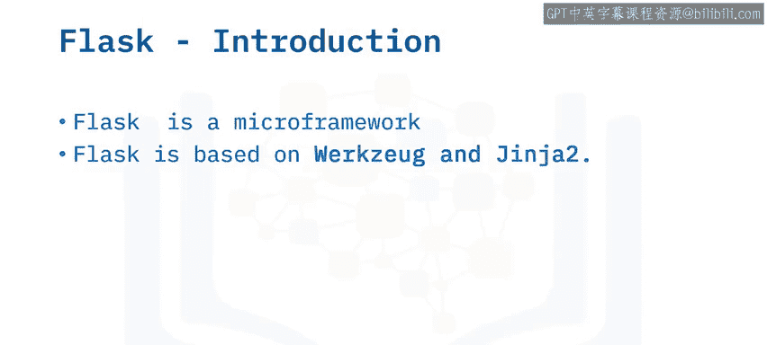

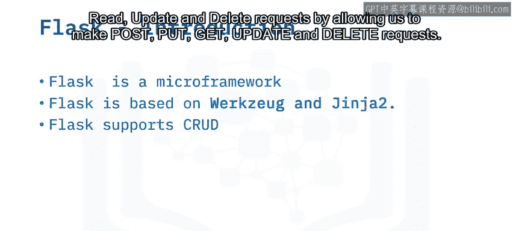

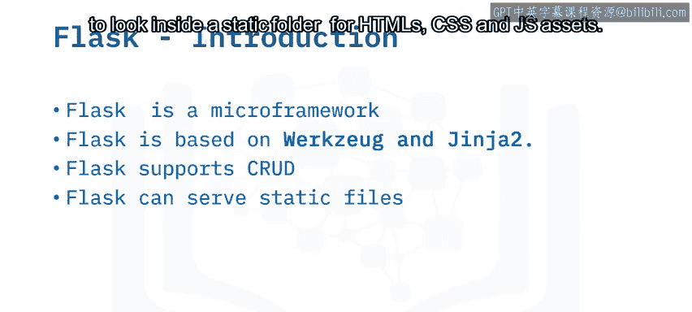

Flask支持CRUD操作（即创建、读取、更新、删除），允许我们发起`POST`、`PUT`、`GET`、`UPDATE`和`DELETE`请求。

Flask的主要特性包括：
*   **服务静态文件**：Flask应用被设置为在名为`static`的文件夹内查找HTML、CSS和JS资源。
*   **可扩展性**：尽管Flask本身是微框架，但它具有可扩展性。这意味着有许多包可以与Flask结合使用，以添加用户认证、数据存储等其他功能。

---

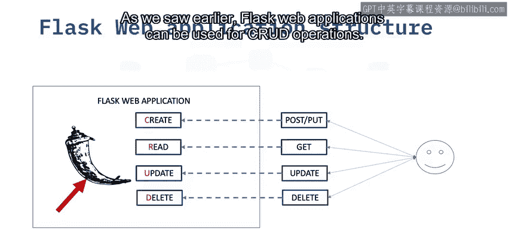

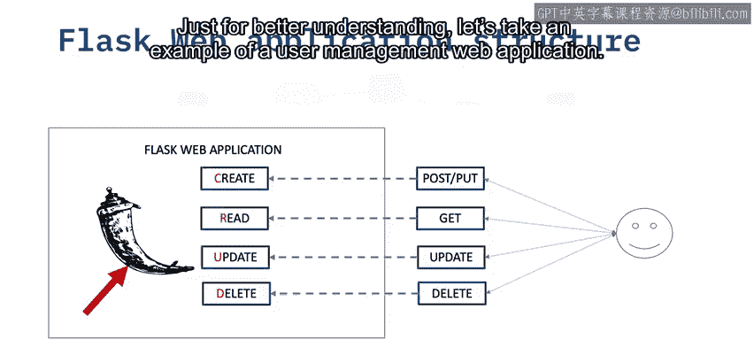

## Web应用中的CRUD操作 📝

为了更好地理解，让我们以一个用户管理Web应用为例。

以下是不同HTTP方法在CRUD操作中的应用：

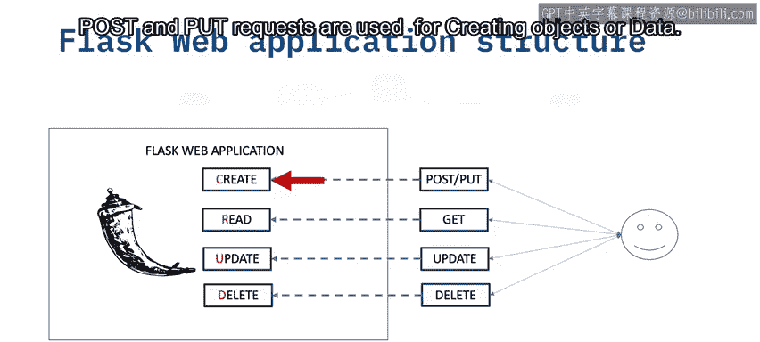

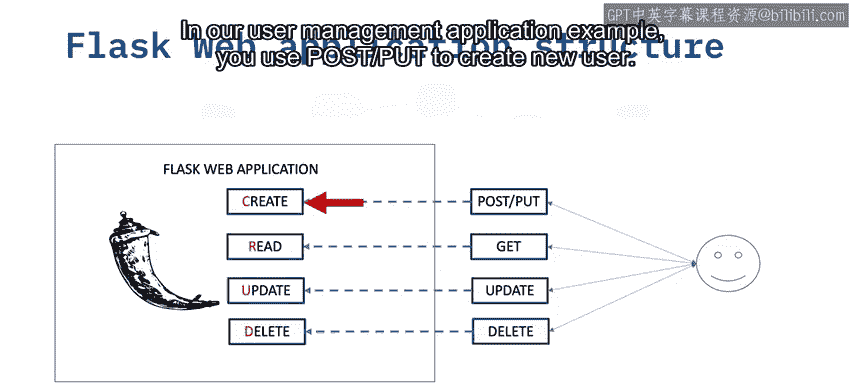

*   **创建 (Create)**：使用`POST`或`PUT`请求来创建新对象或数据。在我们的例子中，即创建一个新用户。两者的区别在于，`POST`每次请求都会创建，而`PUT`在第一次请求时创建，之后则更新它。大多数Web应用使用`POST`进行创建。
*   **读取 (Read)**：使用`GET`请求从服务器读取数据。在我们的例子中，即读取用户信息。
*   **更新 (Update)**：使用`UPDATE`请求来更新现有数据或对象。
*   **删除 (Delete)**：使用`DELETE`请求来删除现有数据或对象。

> 大多数Web应用倾向于使用`POST`进行创建、更新和删除操作，而使用`GET`进行读取操作。

Flask的API端点可以创建为返回多种形式的响应，例如字符串、JSON、HTML、错误对象等，同时还会返回一个响应状态码。

---

## 创建你的第一个Flask应用 🛠️

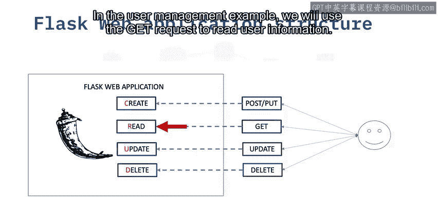

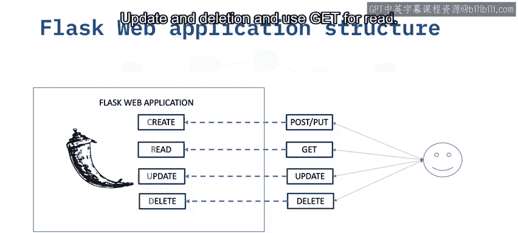

上一节我们介绍了Web应用的基本操作，本节我们来动手创建一个简单的Flask应用。

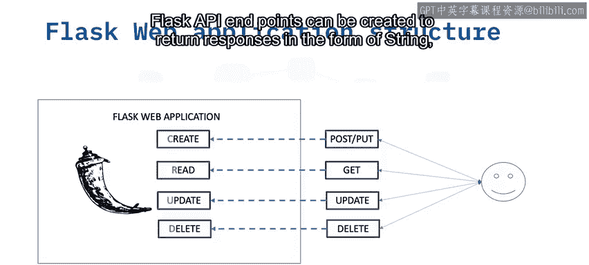

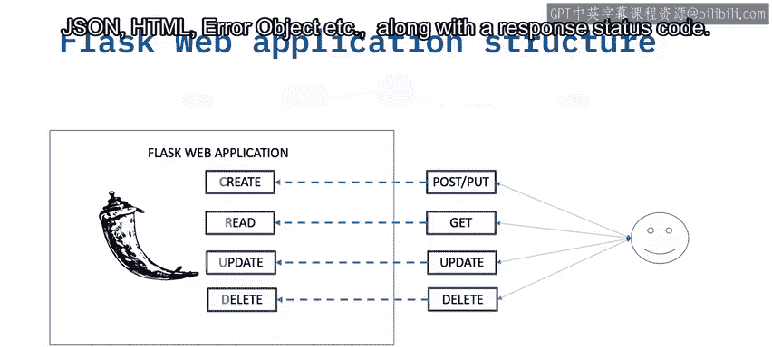

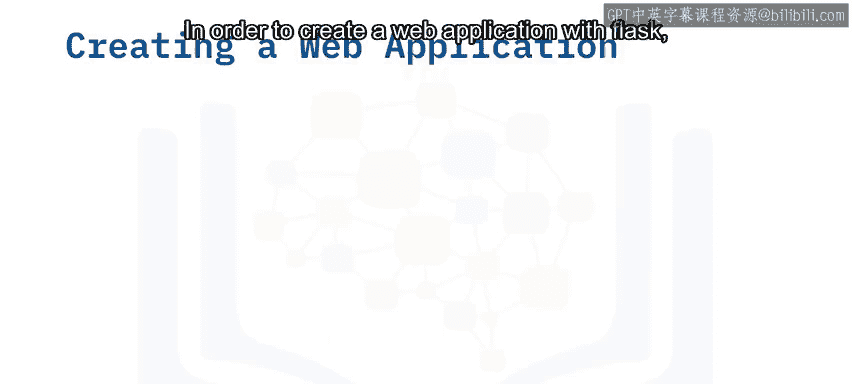

首先，我们需要安装Flask。使用Python的标准包管理器`pip`执行以下命令：

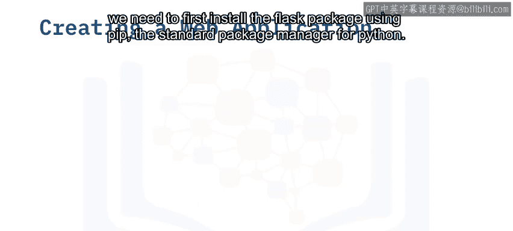

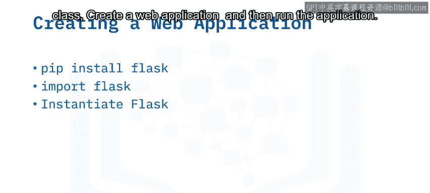

```bash
pip install flask
```

安装完成后，我们就可以开始创建Web应用了。基本步骤是：导入Flask，实例化Flask类以创建应用，然后运行应用。

让我们看一个示例Web应用，它服务于根API端点（`/`）的`GET`请求，并返回字符串“Hello World”作为响应。

```python
# 从flask包中导入Flask模块
from flask import Flask

# 实例化Flask类，创建一个名为“my_first_application”的Web应用
# ‘app’只是一个引用名，可以是任何名称，但为清晰起见，大多数应用使用‘app’
app = Flask("my_first_application")

# 定义路由和当访问此路由时将调用的方法
# 如果没有指定方法，默认为GET。这个端点现在将能够服务于根路径（‘/’）的GET请求
@app.route('/')
def hello():
    # 当访问定义的API端点时，将调用hello方法。它不接受参数，并返回字符串“Hello World”
    return 'Hello World!'

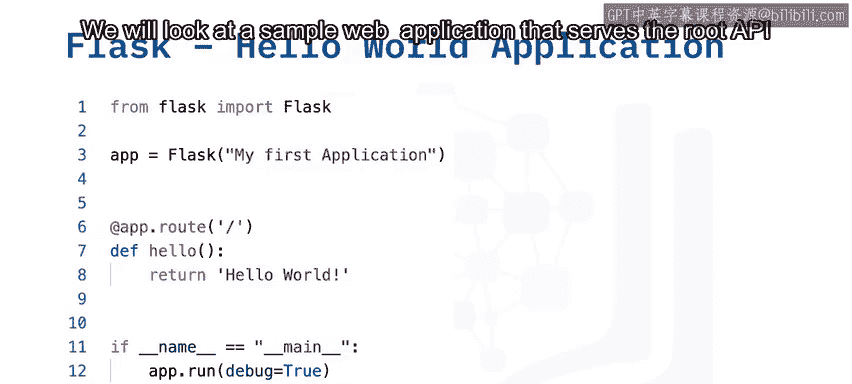

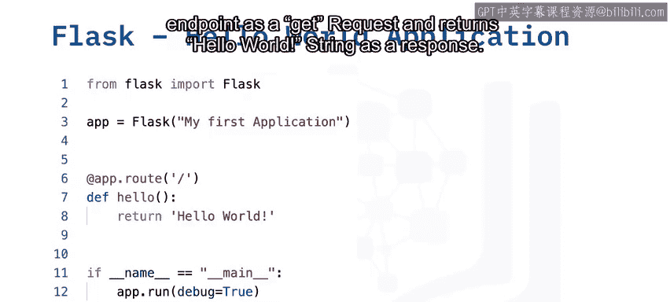

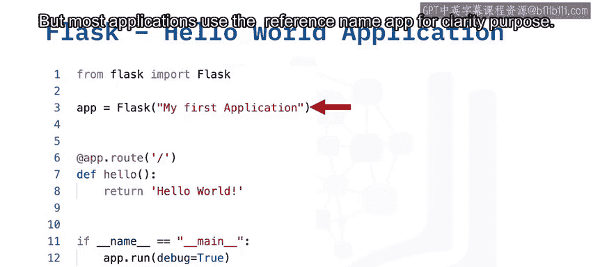

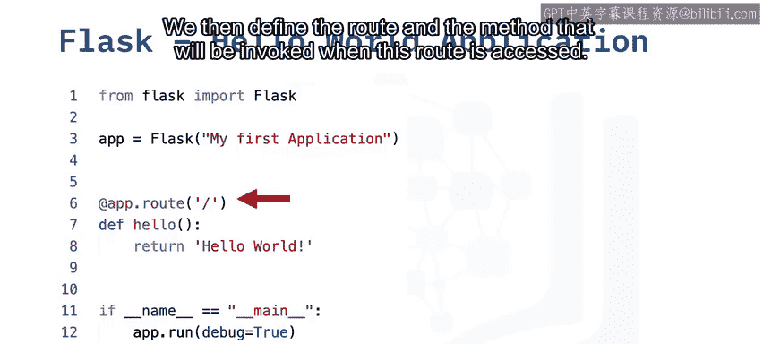

# 如果__name__属性被设置为‘__main__’，则运行Web应用
# 默认情况下，除非显式更改，否则__name__被设置为‘__main__’
if __name__ == '__main__':
    # 我们可以像运行任何其他Python应用一样保存和运行此代码
    app.run()
```

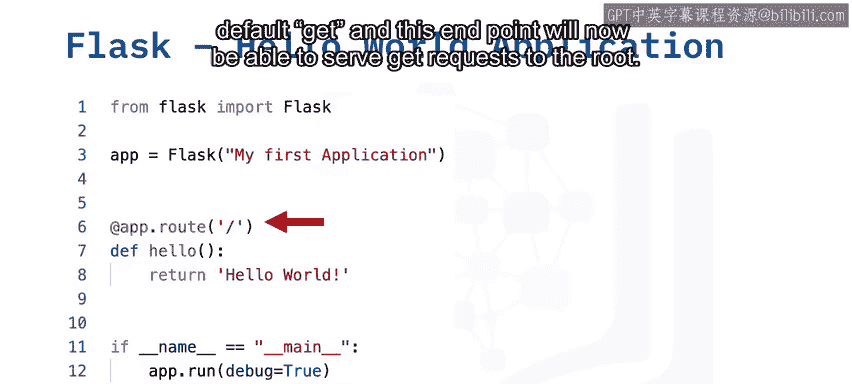

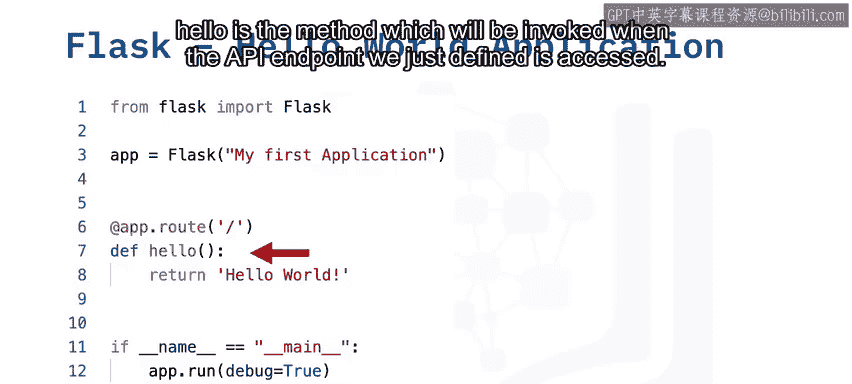

要启动开发环境下的服务器，只需将代码保存在一个Python文件中（例如 `app.py`），然后像运行其他Python脚本一样运行它：

```bash
python app.py
```

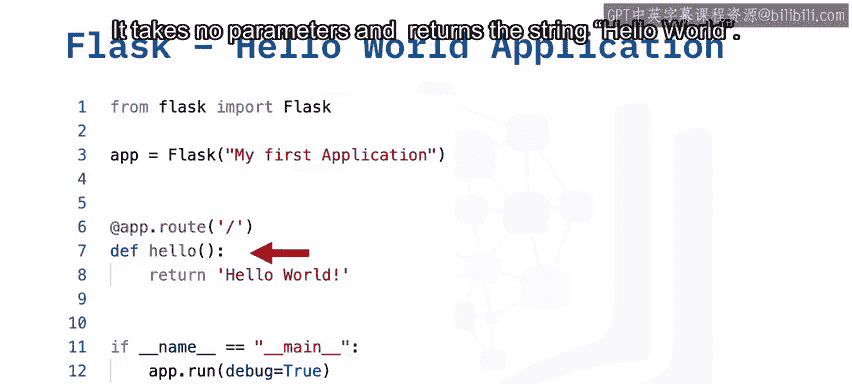

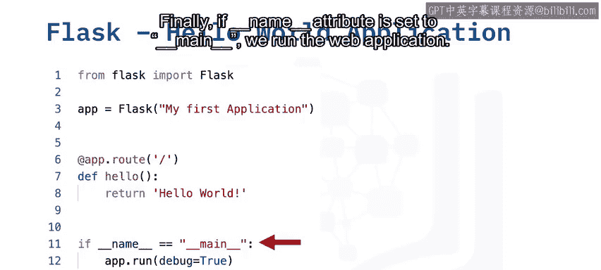

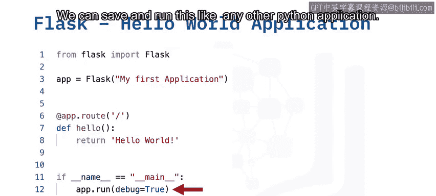

当Web应用服务器启动时，它会给出可以访问该应用的IP地址和端口（通常是 `127.0.0.1:5000`）。要检查端点，我们可以在浏览器中打开这个地址，看到从Web服务器应用返回的字符串“Hello World”。

---

## 使用模板和参数 📄

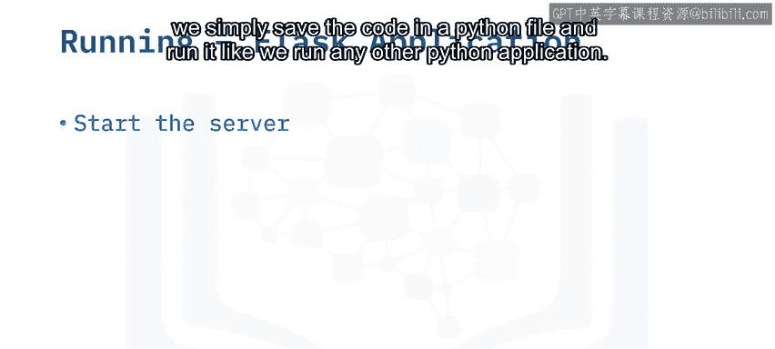

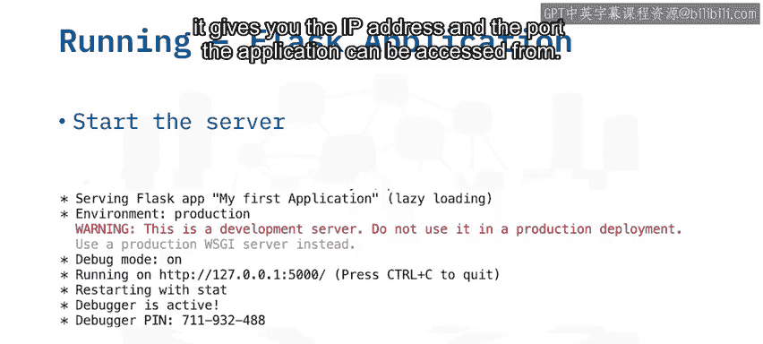

Flask应用可以服务静态和动态的HTML页面，这些页面被称为**模板**。

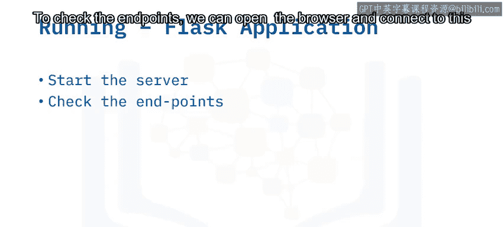

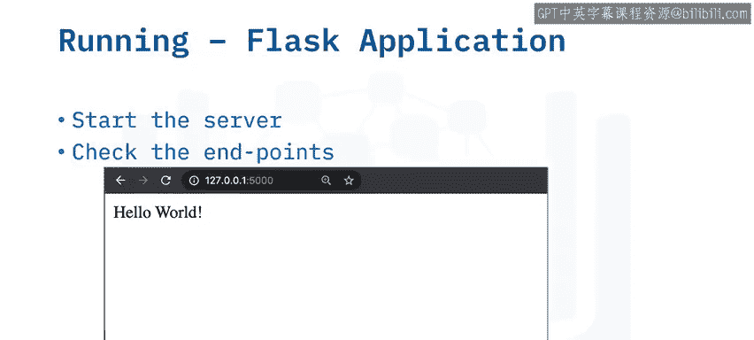

默认情况下，Flask应用在根目录下名为`templates`的目录中查找模板。如果这些模板需要使用图像、样式表或JavaScript文件，这些资源则存储在根目录下名为`static`的文件夹中。

*   **静态页面**：按原样渲染。
*   **动态页面**：通常包含为每个请求动态填充的信息。这些信息通常基于作为参数传递的值。参数可以通过URL传递，也可以作为请求参数传递。

让我们看一个更复杂的Flask应用示例。

首先，导入必要的模块：

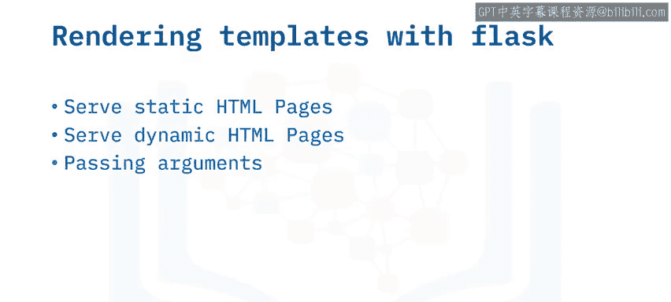

```python
from flask import Flask, request, render_template
```

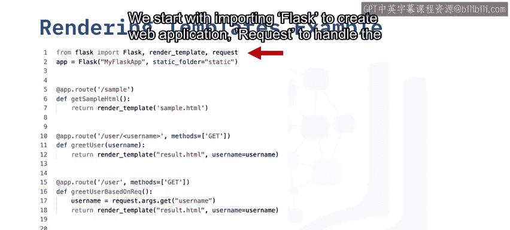

接下来，实例化Flask并（可选地）设置静态文件夹。默认文件夹名是`static`，但只要你显式设置，也可以使用不同名称的目录。

```python
app = Flask(__name__, static_folder='static')
```

在这个Web应用中，我们定义了三个端点：

1.  `/sample`：渲染一个静态HTML页面，该HTML中的图像来自`static`目录。
2.  `/user/<username>`：这里的`<username>`是URL中的参数。该方法已显式设置为`GET`（这只是为了展示如何设置请求类型）。页面使用我们在URL中传递的参数进行渲染。
3.  `/user`：`username`作为请求参数传递。页面使用我们作为请求传递的参数进行渲染。

你将在实验环节中看到这个示例的具体实现。

---

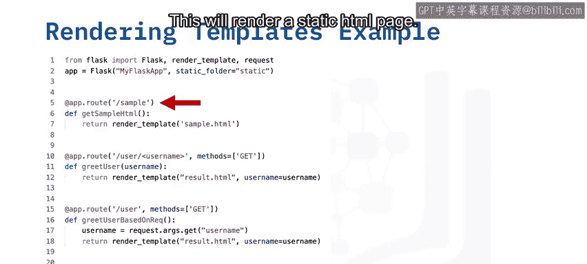

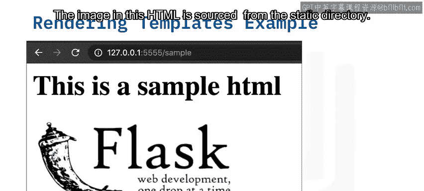

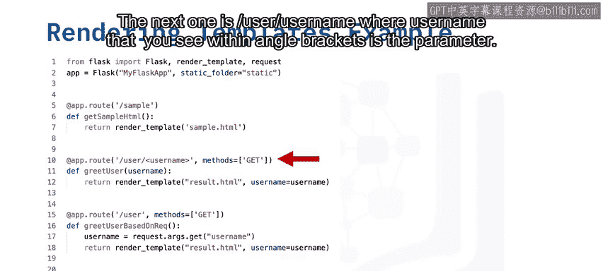

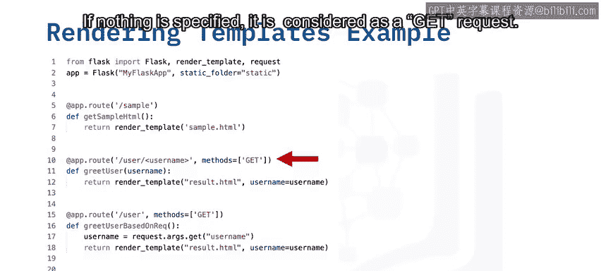

## 总结 📚

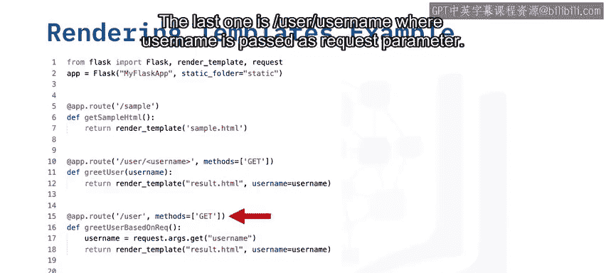

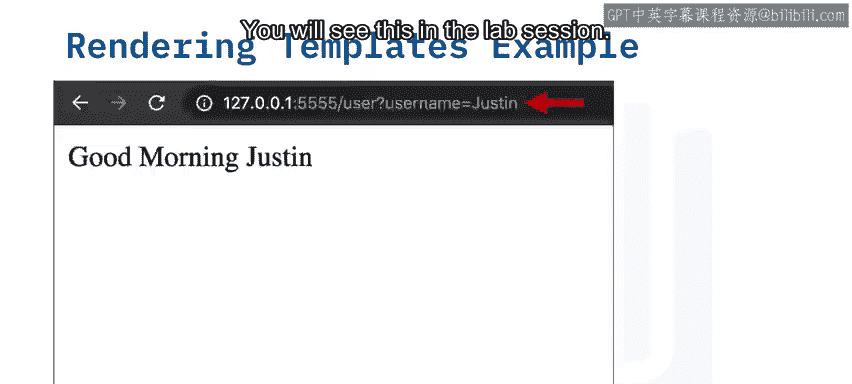

本节课中我们一起学习了以下内容：

*   **应用框架**自动化了与构建应用相关的常见任务。
*   **Flask微框架**可用于创建Web应用程序。
*   流行的Python应用框架包括Django、Flask、Tornado和Web2py。

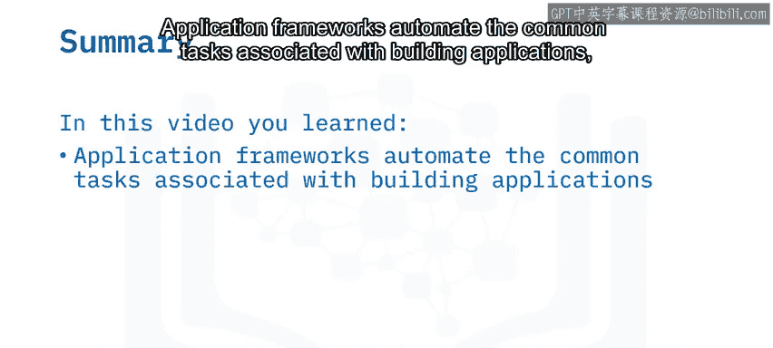

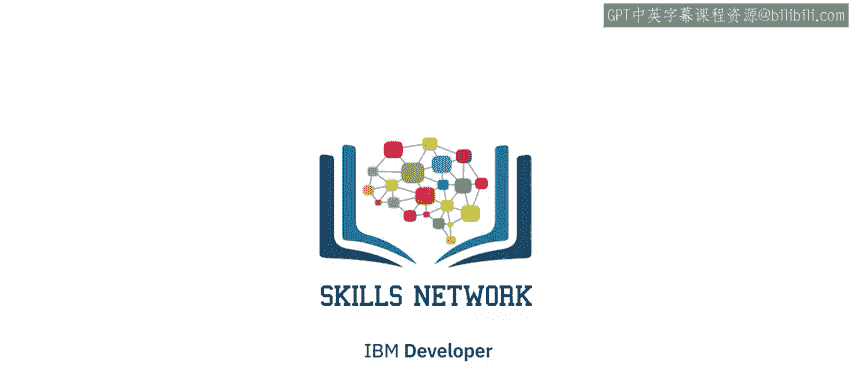

通过掌握Flask的基础，你已经迈出了使用Python构建动态Web应用的第一步。