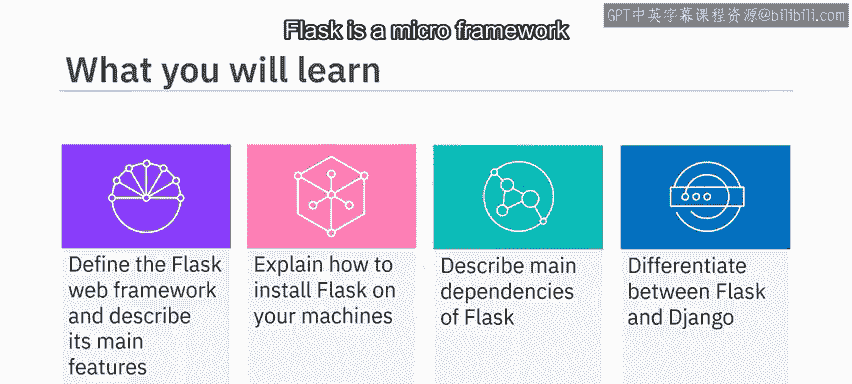
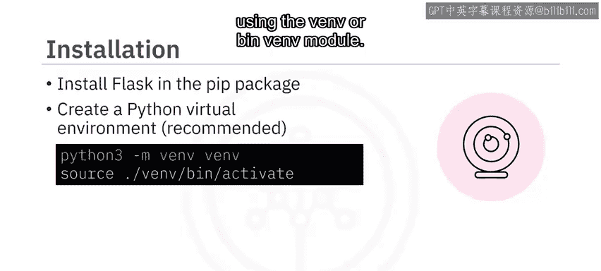
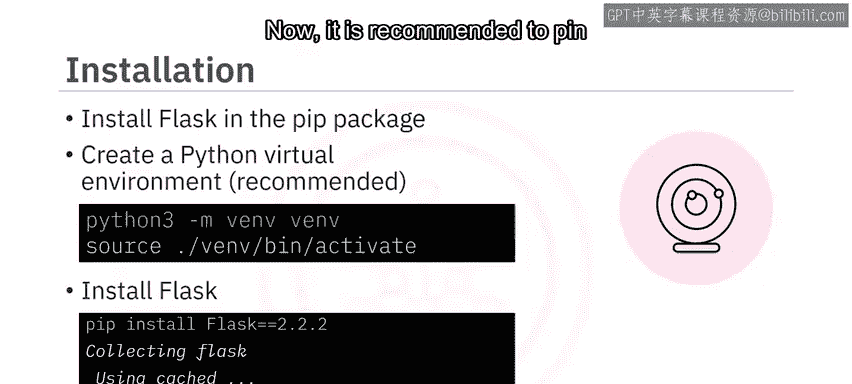
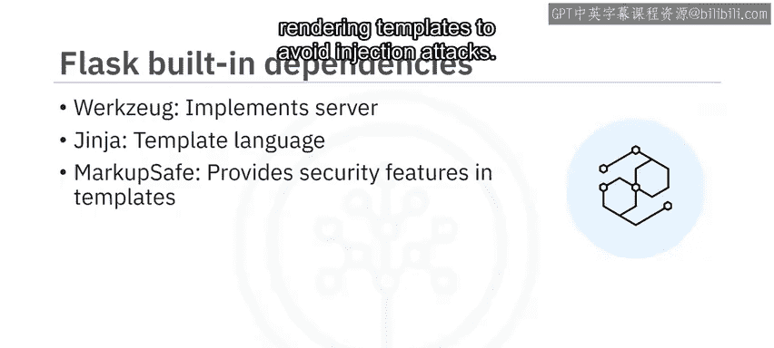
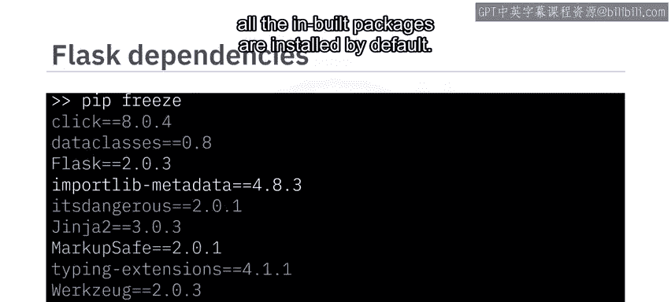
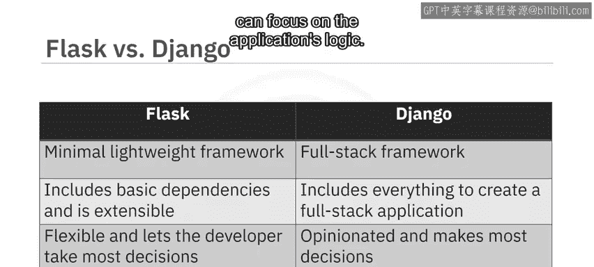

# 101：Flask简介 🚀

在本节课中，我们将要学习Flask Web框架。我们将定义Flask，描述其主要特性，解释如何安装Flask及其主要依赖，并阐明Flask与另一个Python Web框架Django之间的主要区别。



---

## 什么是Flask？🤔

Flask是一个用于创建Web应用程序的微框架。与其他一些大型框架不同，它不固执己见，也不将用户绑定到特定的工具集。

Flask的一个复杂依赖是Python。运行Flask 2.2.2需要Python的最低版本为3.7。Flask由Armin Ronacher于2004年创建，最初是一个愚人节玩笑。它因其易用性和可扩展性而迅速流行起来。Flask提供了创建Web应用程序所需的最小依赖，但它具有可扩展性，许多社区扩展为Flask添加了额外功能。

---

## Flask的主要特性 ✨

以下是Flask的核心功能列表：

*   **内置开发服务器**：Flask自带一个在开发模式下运行应用程序的Web服务器。
*   **调试器**：Flask配备了一个调试器，帮助调试应用程序。该调试器在浏览器中显示交互式回溯和堆栈跟踪。
*   **日志记录**：Flask使用标准的Python日志记录来处理应用程序日志。你可以使用相同的记录器来记录关于应用程序的自定义消息。
*   **测试支持**：Flask提供了一种测试应用程序不同部分的方法。此测试功能使开发人员能够遵循测试驱动开发方法。你可以使用像`pytest`和`coverage`这样的框架来确保代码按预期工作。
*   **请求与响应对象**：开发人员可以访问请求和响应对象，以提取参数和自定义响应。

上一节我们介绍了Flask的核心功能，本节中我们来看看它的一些附加特性。

以下是Flask的附加功能：

*   **静态文件支持**：该框架支持静态资源，如CSS文件、JavaScript文件和图像。Flask提供了在模板中加载静态文件的标签。
*   **模板引擎**：你可以使用Jinja2模板框架开发动态页面。这些动态页面可以显示可能随每个请求而变化的信息，或者检查用户是否已登录。
*   **路由与动态URL**：Flask提供路由功能，并支持动态URL，这对于RESTful服务极其有用。你可以为不同的HTTP方法创建路由，并在应用程序中提供重定向。
*   **错误处理**：你可以在Flask中编写在应用程序级别工作的全局错误处理器。
*   **会话管理**：Flask支持用户会话管理。

---

## 流行的社区扩展 📦

Flask的强大之处在于其可扩展性。以下是你可以添加到应用程序中的一些流行社区扩展：

*   **Flask-SQLAlchemy**：为Flask添加了对名为SQLAlchemy的ORM的支持，为开发人员提供了一种在Python中处理数据库对象的方法。
*   **Flask-Mail**：提供了设置SMTP邮件服务器的能力。
*   **Flask-Admin**：让你可以轻松地为Flask应用程序添加管理界面。
*   **Flask-Uploads**：允许你向应用程序添加自定义的文件上传功能。

除了上述扩展，这里还有一些其他有用的扩展：

*   **Flask-CORS**：允许你的应用程序处理跨源资源共享，使跨源JavaScript请求成为可能。
*   **Flask-Migrate**：为SQLAlchemy ORM添加数据库迁移功能。
*   **Flask-User**：添加用户认证、授权和其他用户管理活动。
*   **Marshmallow**：为你的代码添加了广泛的对象序列化和反序列化支持。
*   **Celery**：一个强大的任务队列，可用于简单的后台任务和复杂的多存储程序和调度。

---

## 如何安装Flask ⚙️



Flask可通过名为`pip`的Python包管理器获取，并且`pip`在实验环境中可用。但是，如果要在你自己的机器上安装，建议首先使用`venv`或`pipenv`模块创建一个虚拟环境。

你可以使用以下命令安装Flask 2.2.2：
```bash
pip install flask==2.2.2
```



建议在你的应用程序中固定依赖项的版本号。这确保了应用程序可以在不同的环境（如开发、预发布和生产）中从头开始复现。这也确保了当包在没有版本号的情况下自动更新时，不会意外引入新的问题和错误。

---

## Flask的内置依赖 🔧

Flask附带了一些内置依赖，这些依赖实现了各种功能：



*   **Werkzeug**：实现了WSGI（Web服务器网关接口）。这是应用程序和服务器之间的标准Python接口。
*   **Jinja2**：一种模板语言，用于渲染应用程序中的页面。
*   **MarkupSafe**：随Jinja2一起提供。它在渲染模板时转义不受信任的输入，以避免注入攻击。
*   **ItsDangerous**：用于安全地签名数据。这有助于确定数据是否被篡改，并用于保护Flask的会话Cookie。
*   **Click**：一个用于编写命令行应用程序的框架。它提供了`flask`命令，并允许添加自定义管理命令。

要查看内置依赖，你可以在虚拟环境中使用`pip freeze`命令，可以看到所有未内置的包默认都已安装。



---

## Flask与Django的对比 ⚖️

现在，我们来了解另一个Python Web框架Django。以下是Flask和Django之间的一些关键区别：

*   **定位与规模**：Flask旨在成为一个非常轻量级的框架。而Django是一个全栈框架。因此，Flask只提供创建Web应用程序所需的基本依赖，但开发人员可以选择提供附加功能的其他扩展。另一方面，Django包含了创建全栈应用程序所需的一切。
*   **灵活性与约定**：Flask非常灵活。你可以以即插即用的方式添加和移除组件。另一方面，Django是固执己见的，它为开发人员做出了大部分决策，以便他们可以专注于应用程序的逻辑。



---

## 总结 📝


本节课中我们一起学习了Flask Web框架。我们了解到Flask是一个附带最少依赖的微框架，用于构建网站。Flask具有调试服务器、路由、模板和错误处理等功能。Flask可以通过使用社区扩展进行扩展。Flask可以作为Python包安装。与Flask相比，Django是一个全栈框架。