# 102：Flask基本应用程序和路由 🚀

在本节课中，我们将要学习如何创建和运行一个带有基本路由的Flask应用程序，解释如何从服务器向客户端返回JSON响应，并描述Flask中可用的各种配置选项。

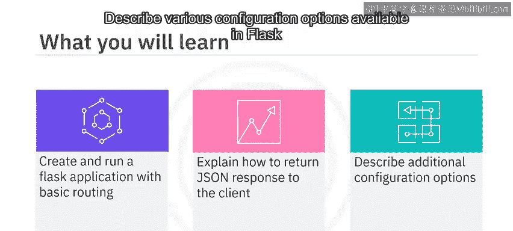

---

## 创建第一个Flask应用程序

在创建第一个Flask应用程序之前，请确保你已经安装了Flask。

接下来，创建一个Python文件作为你的服务器，我们将这个文件命名为 `app.py`。

现在，让我们在这个文件中编写代码。首先，从 `flask` 模块中导入大写的 `Flask` 类。

```python
from flask import Flask
```

接着，实例化Flask类的一个对象作为你的应用。构造函数接受一个参数 `__name__`，你通过传入内置变量 `__name__` 来设置应用模块的名称。这个名称用于在文件系统上查找资源，并被扩展用于提供调试信息。

```python
app = Flask(__name__)
```

现在你已经定义了服务器，让我们添加第一个路由。你希望在调用服务器而不添加路径时，向客户端返回一条消息。因此，你需要使用 `@app` 装饰器来定义一个路由，该装饰器将路径作为参数。最后，你可以从方法中返回文本或HTML。

让我们看一下代码。`@app` 装饰器定义在 `hello_world` 方法上。它接受参数 `/`，并返回加粗的HTML消息“我的第一个Flask应用程序正在运行”。

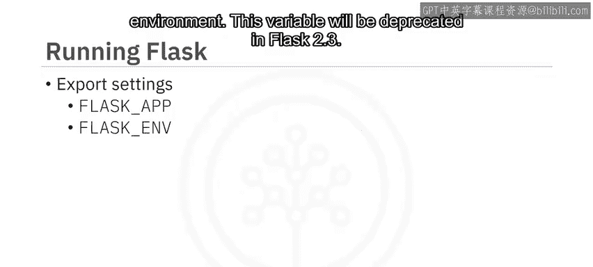

```python
@app.route('/')
def hello_world():
    return '<b>我的第一个Flask应用程序正在运行</b>'
```

---

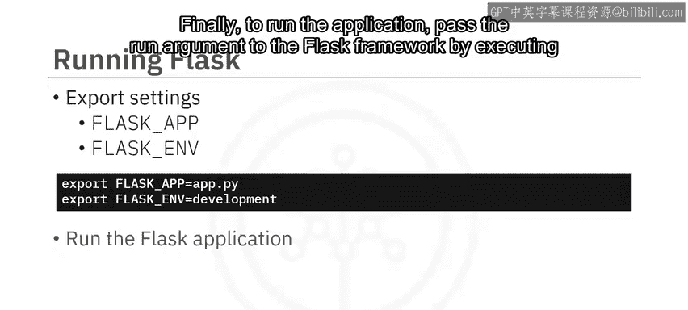

## 运行你的应用程序

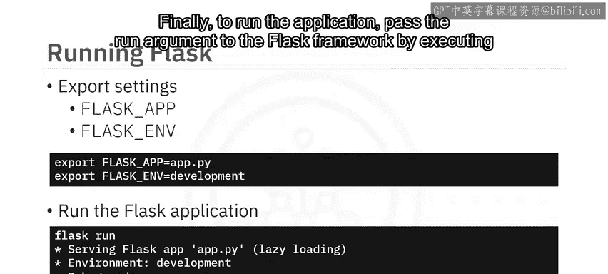

下一步是运行你的应用程序。第一步是创建几个系统环境变量。你需要一个名为 `FLASK_APP` 的变量，它包含主服务器文件的名称。此外，你还需要一个 `FLASK_ENV` 变量来定义开发或生产环境。这个变量在Flask 2.3中将被弃用。

如你所见，你已经将 `FLASK_APP` 环境变量定义为包含中央服务器的文件名，并将 `FLASK_ENV` 设置为 `development`。最后，通过执行 `flask run` 命令，将 `run` 参数传递给Flask框架来运行应用程序。

```bash
export FLASK_APP=app.py
export FLASK_ENV=development
flask run
```

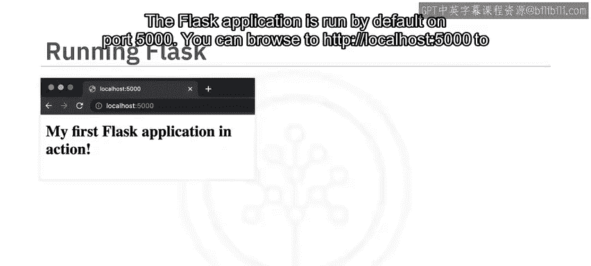

Flask应用程序默认在5000端口上运行。你可以浏览 `http://localhost:5000` 来查看你的消息。让我们也使用浏览器开发者工具来查看从服务器返回的信息。请求的URL是 `http://localhost:5000`，请求方法是 `HTTP GET`。响应的状态码为200，表示成功响应。响应头中的内容类型是 `text/html`，服务器正在运行，Python版本为3.6.15。

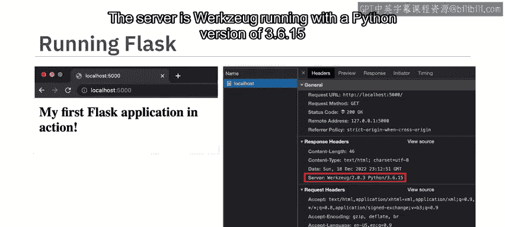

恭喜你成功运行了第一个Flask应用程序。

---

## 配置选项与运行方式

现在，你需要在运行每个应用程序之前设置环境变量。你可以通过使用 `--app` 来标识要运行的Python文件，并添加 `--debug` 来启用开发模式，从而向Flask命令传递配置。调试标志还会在源文件更改时启用自动重启，这在开发应用程序并希望立即看到更改时非常有用。

在你的例子中，应用存储在一个名为 `app.py` 的文件中，因此你可以省略这个参数，因为Flask默认会在当前目录中查找 `app.py`。

现在，输出应该看起来像这样，屏幕显示Flask应用程序像以前一样在开发模式下运行。

---

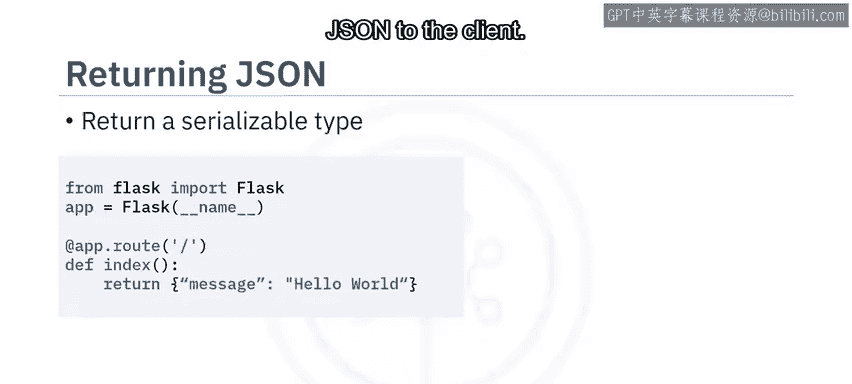

## 从Flask应用程序返回JSON

有多种方法可以从Flask应用程序返回JSON。一种方法是返回一个可序列化的对象，如字典或列表。在给定的代码中，你返回一个Python字典，Flask将使用Python的 `json` 模块将JSON返回给客户端。

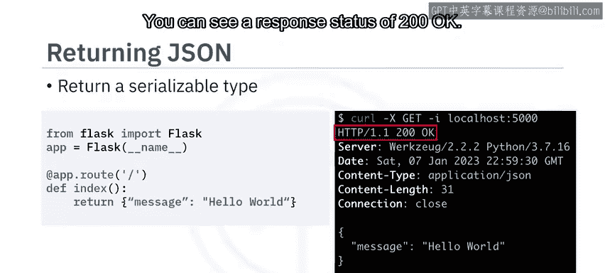

```python
@app.route('/data')
def return_data():
    return {'message': 'Hello from JSON!'}
```

让我们使用 `curl` 命令测试这是否有效。你将向 `localhost:5000/data` 发出GET请求，可以看到响应状态为200 OK。除了HTML，你还可以看到响应的内容类型是 `application/json`。

最后，你可以看到返回的JSON。但请注意，如果你返回一个更复杂的对象（如类），请确保它是可序列化的。

第二种方法是使用Flask提供的 `jsonify` 方法。此方法接受键值对作为输入，并返回相应的JSON。让我们看一个例子。

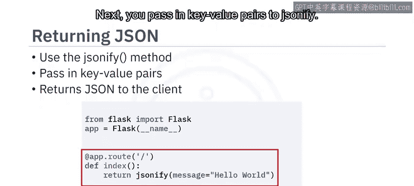

你首先从Flask导入 `jsonify`，然后将键值对传递给 `jsonify`。

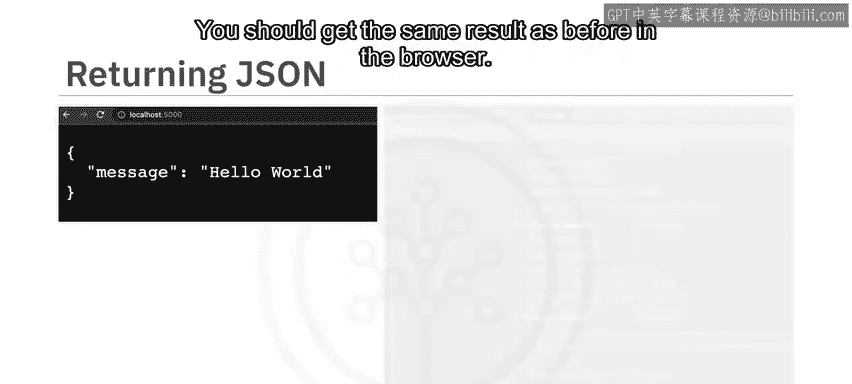

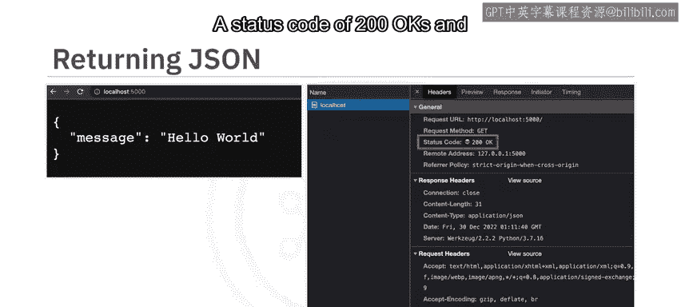

```python
from flask import jsonify

@app.route('/data_jsonify')
def return_data_jsonify():
    return jsonify(message='Hello from JSONify!')
```

你应该在浏览器中得到与之前相同的结果，开发者工具应该看起来相同，状态码为200 OK，返回的内容类型为 `application/json`。

---

## Flask的其他配置选项

现在，你已经了解了Flask的两个配置：`FLASK_ENV` 和 `FLASK_APP` 变量。Flask提供了许多其他配置选项，你可能在应用程序中使用。

以下是部分核心配置选项：
*   **ENV**：指示应用程序运行的环境（生产或开发）。
*   **DEBUG**：启用调试模式。
*   **TESTING**：启用测试模式。
*   **SECRET_KEY**：用于签署会话cookie的密钥。
*   **SESSION_COOKIE_NAME**：会话cookie的名称。
*   **SERVER_NAME**：绑定主机和端口。
*   **JSONIFY_MIMETYPE**：默认为 `application/json`。

此外，还有其他方法可以向Flask提供配置选项。Flask提供了一个 `config` 对象，你可以将配置选项插入到这个对象中。如果你已经有环境变量，可以将它们加载到 `Config` 对象中。最后，你可以将配置选项保存在一个单独的JSON文件中，并使用 `config` 对象提供的 `from_file` 方法加载它们。

---

## 应用程序结构

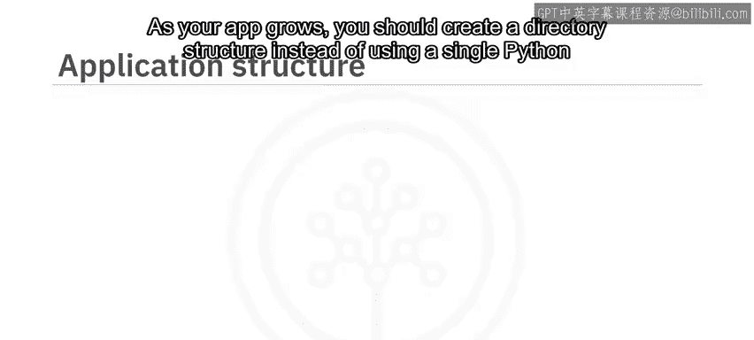

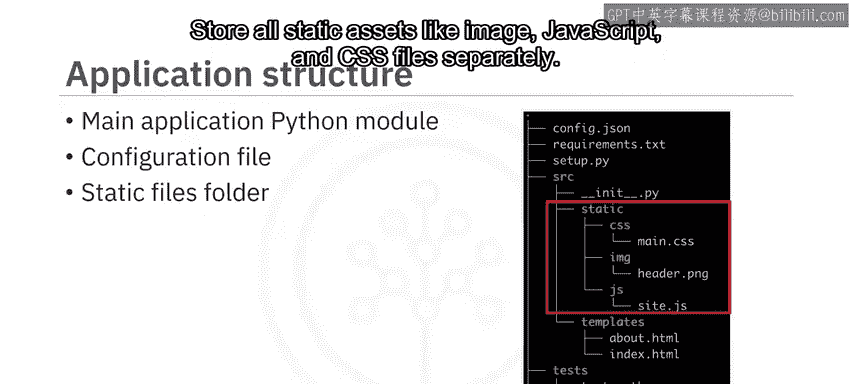

随着应用程序的增长，你应该创建一个目录结构，而不是使用单个Python文件。构建应用程序的方式有很多种，这里是一个例子：
*   将主要源代码存储在其模块目录中。
*   将所有配置存储在其文件中。
*   将所有静态资源（如图像、JavaScript和CSS文件）单独存储。
*   将所有动态内容存储在模板目录中。
*   将所有测试文件放在测试目录中。
*   拥有一个可以激活的虚拟环境，以安装正确版本的依赖项。

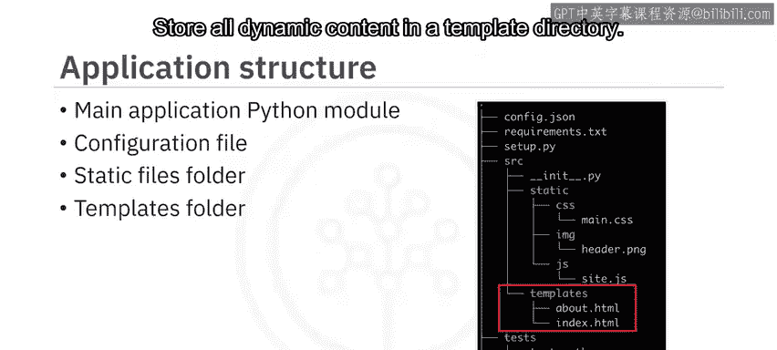

---

## 总结

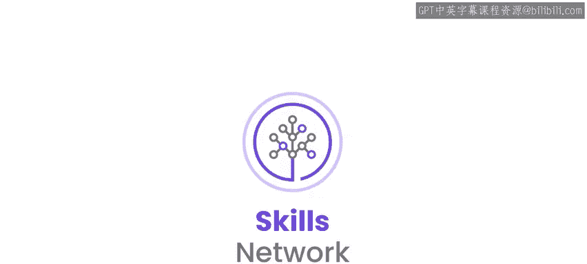

本节课中我们一起学习了：
1.  你可以通过实例化Flask类来创建服务器。
2.  使用 `@app` 装饰器来创建URL处理器。
3.  返回字符串消息，或使用 `jsonify` 方法返回JSON对象。
4.  可以从环境变量、Python文件和 `app.config` 对象直接设置应用程序配置。