# 103：使用GET和POST模式的请求和响应对象 🚀


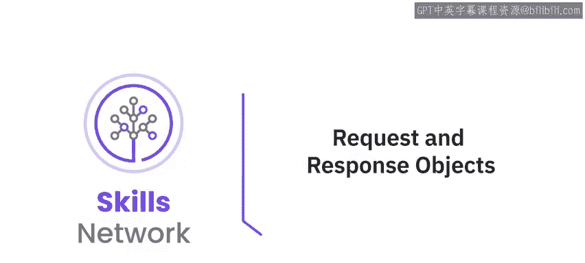

在本节课中，我们将学习Flask框架中的两个核心对象：请求对象（Request Object）和响应对象（Response Object）。你将了解如何自定义路由以响应不同的HTTP方法，如何从请求中提取数据，以及如何构建和定制返回给客户端的响应。

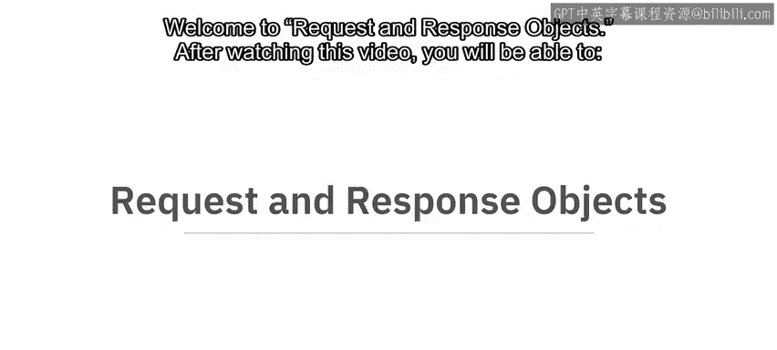

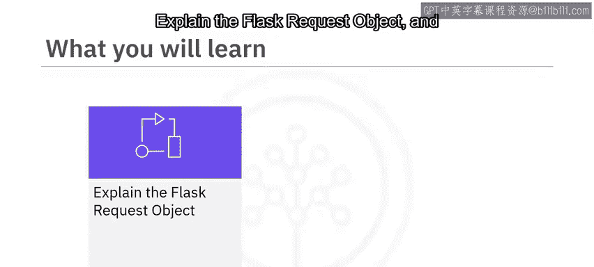

---

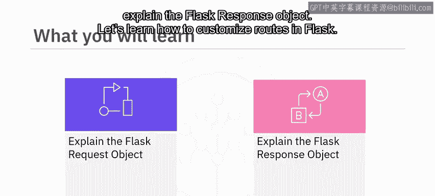

## 自定义Flask路由 🔧

上一节我们介绍了Flask的基础，本节中我们来看看如何自定义路由以处理不同的HTTP请求。

Flask使用路由装饰器 `@app.route` 来定义路径。默认情况下，该装饰器只响应GET请求。客户端只能向指定路径发送GET请求。

现在，你可以传入第二个参数 `methods` 来控制路径响应哪些HTTP方法。

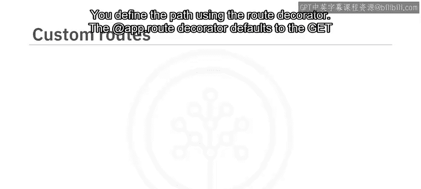

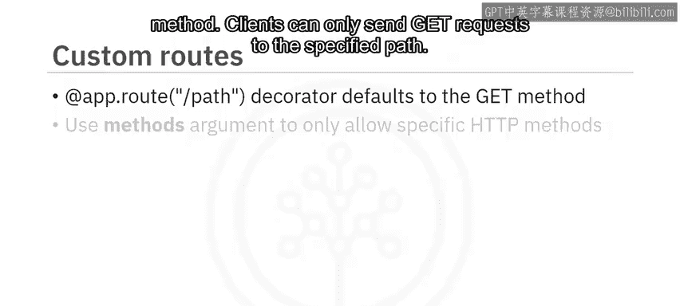

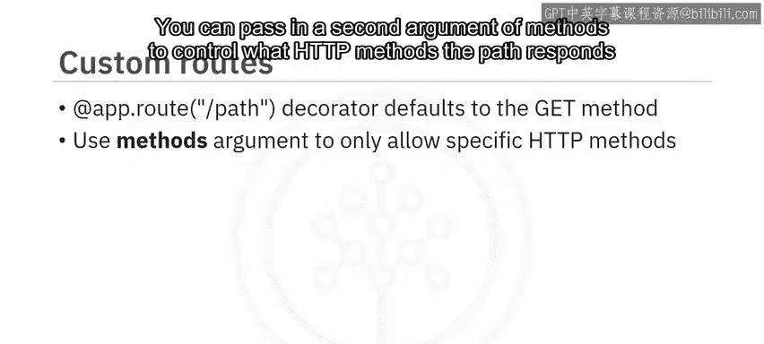

以下是两个功能相同的方法示例。第一段代码中，GET方法是隐式声明的；而第二段代码则明确指定了GET方法。

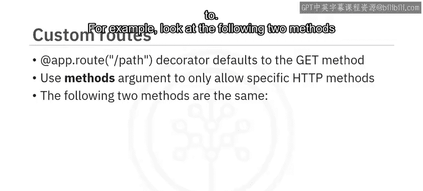

```python
# 隐式指定GET方法
@app.route('/path')
def handle_path():
    return 'Response'

# 显式指定GET方法
@app.route('/path', methods=['GET'])
def handle_path_explicit():
    return 'Response'
```

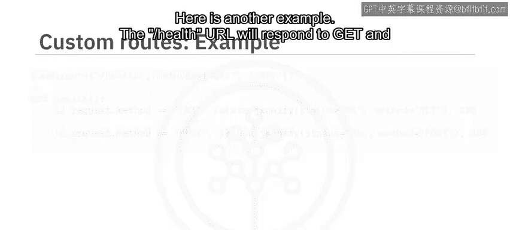

---

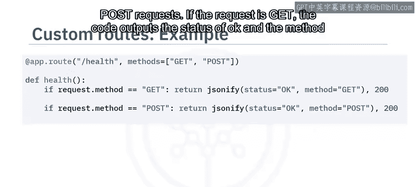

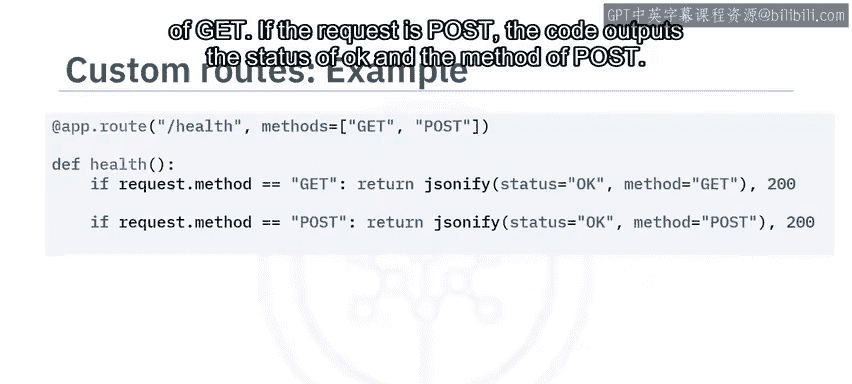

## 处理GET和POST请求示例 📝

以下是另一个例子。`/health` 这个URL将同时响应GET和POST请求。

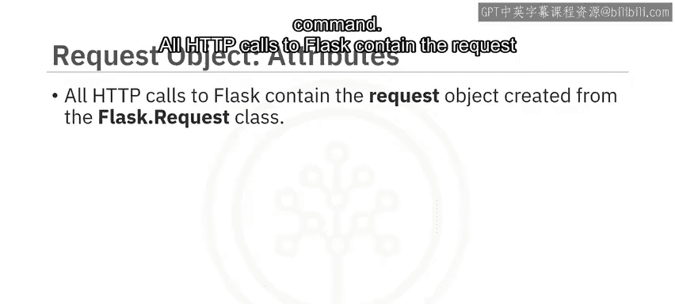

如果请求是GET方法，代码将输出状态“0”和方法“GET”。
如果请求是POST方法，代码将输出状态“0”和方法“POST”。

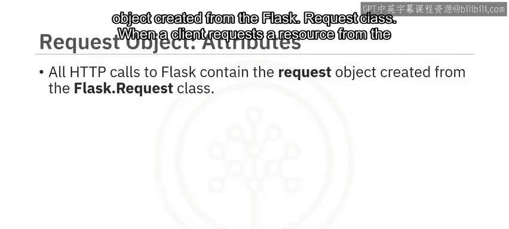

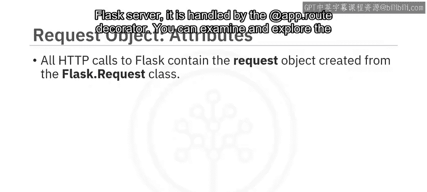

以下是使用curl命令发送GET请求的输出：
```
Status: 0, Method: GET
```

以下是使用curl命令发送POST请求的输出：
```
Status: 0, Method: POST
```

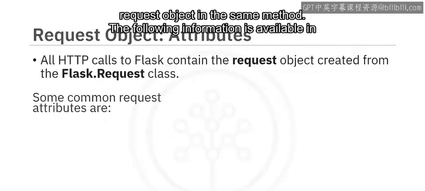

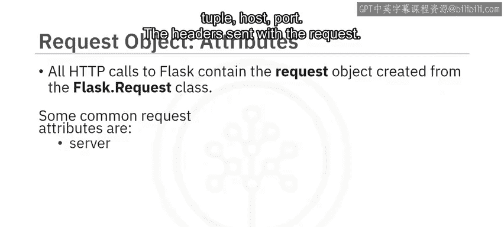

---

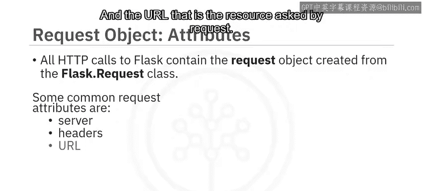

## Flask请求对象详解 🔍

所有发送到Flask的HTTP调用都包含一个请求对象，该对象由 `flask.request` 类创建。当客户端向Flask服务器请求资源时，该请求由 `@app.route` 装饰器处理的方法处理。你可以在同一个方法中检查和探索这个请求对象。

现在，请求对象中可用的信息包括：
*   服务器的地址（以 `(host, port)` 元组形式）。
*   随请求发送的头部信息。
*   客户端请求的资源URL。

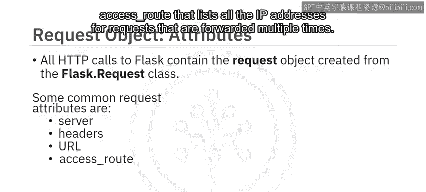

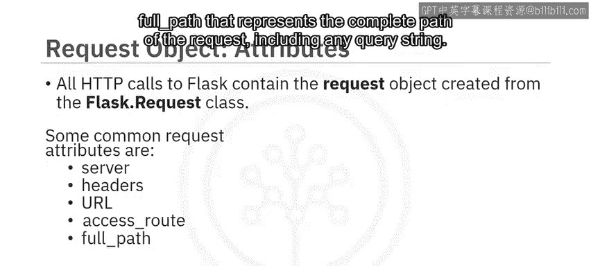

以下是请求对象中可访问的其他属性列表：

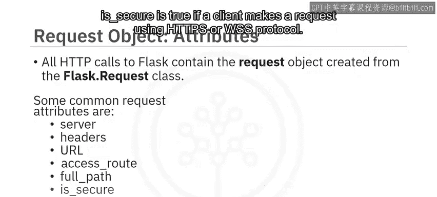

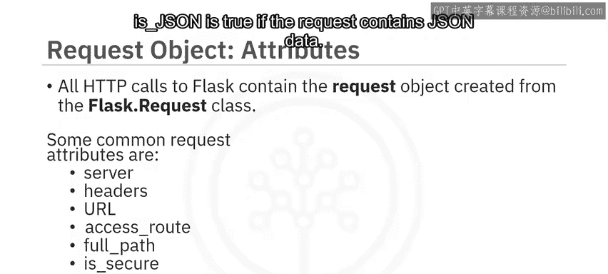

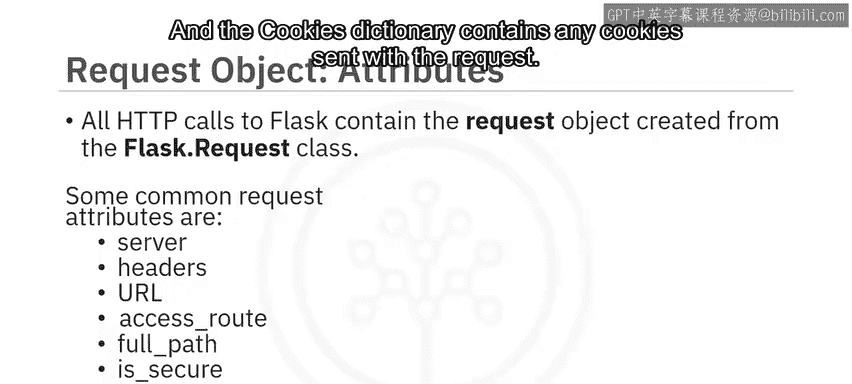

*   **`access_route`**：列出请求被多次转发时的所有IP地址。
*   **`full_path`**：表示请求的完整路径，包括任何查询字符串。
*   **`is_secure`**：如果客户端使用HTTPS或WSS协议发出请求，则为 `True`。
*   **`is_json`**：如果请求包含JSON数据，则为 `True`。
*   **`cookies`**：字典，包含随请求发送的任何Cookie。

此外，你还可以从请求头中访问以下数据：

*   **`Cache-Control`**：包含如何在浏览器中缓存的信息。
*   **`Accept`**：告知服务器客户端理解的内容类型。
*   **`Accept-Encoding`**：指示客户端支持的内容编码。
*   **`User-Agent`**：标识客户端应用程序、操作系统或版本。
*   **`Accept-Language`**：请求特定的语言和区域设置。
*   **`Host`**：指定所请求服务器的主机和端口号。

你可以用自定义的请求对象替换默认的请求对象，但这通常是可选的，因为Flask请求类的属性和方法通常足够使用。

---

## 请求对象属性实战演示 💻

现在，让我们看看当客户端发出请求时，服务器上打印出的一些实际值。在这个例子中，客户端是来自终端的curl命令，请求的服务器是 `127.0.0.1`（即localhost）的5000端口。

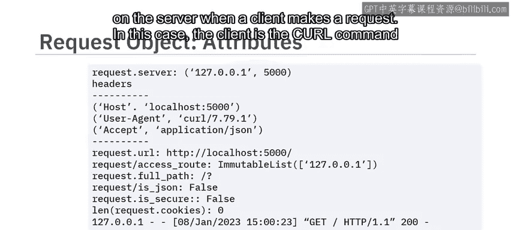

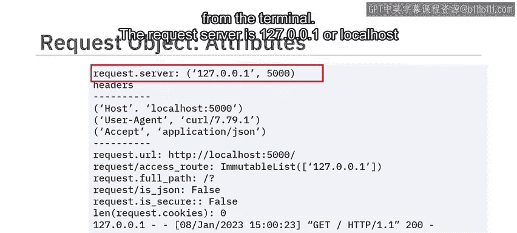

接下来，打印出一些头部信息：
*   `Host` 是 `localhost:5000`。
*   `User-Agent` 是 `curl/7.79.1`。
*   客户端请求的内容类型是 `application/json`。

让我们再看一些请求对象的属性：
*   请求的URL是 `http://localhost:5000/`。
*   `access_route` 列表包含单个值 `127.0.0.1`。
*   请求的完整路径是根路径，由单个正斜杠 `/` 表示。
*   `is_json` 为 `False`，因为我们没有随GET请求发送任何数据。
*   `is_secure` 为 `False`，因为URL是HTTP而不是HTTPS。
*   `cookies` 字典的长度为0。

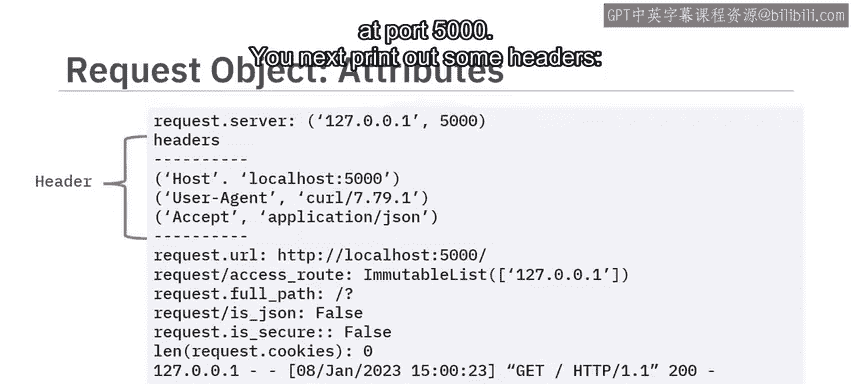

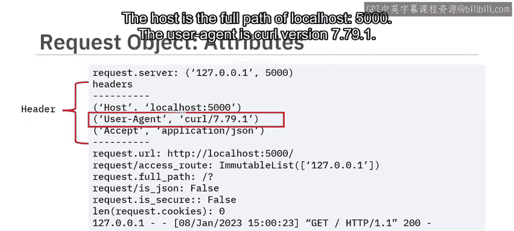

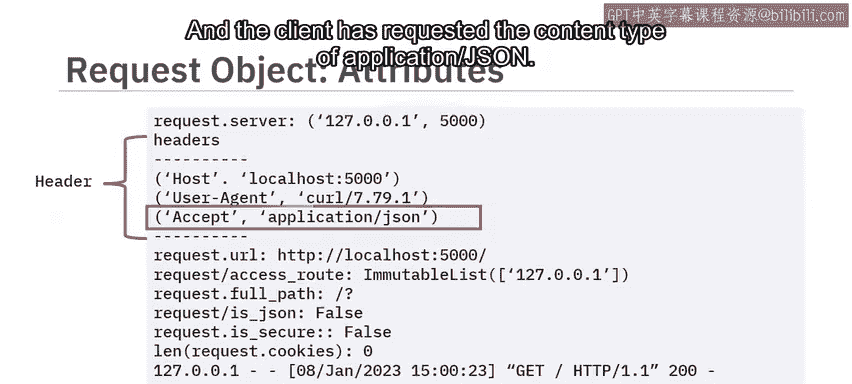

---

## 从请求对象获取数据 🛠️

有多种方法可以从请求对象获取信息。

*   使用 `get_data()` 以字节形式访问POST请求中的数据，然后你需要负责解析这些数据。
*   你也可以使用 `get_json()` 方法获取POST请求中已解析为JSON的数据。

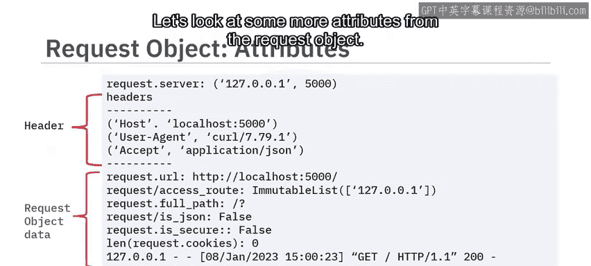

现在，Flask还提供了更聚焦的方法来从请求中获取确切信息，这样你就不必将数据解析成特定类型。

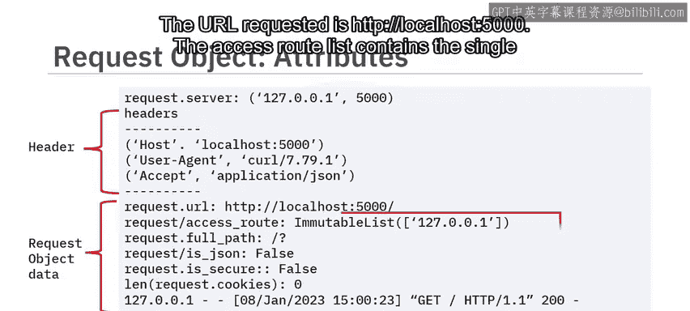

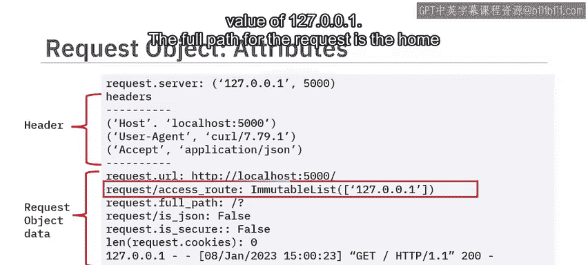

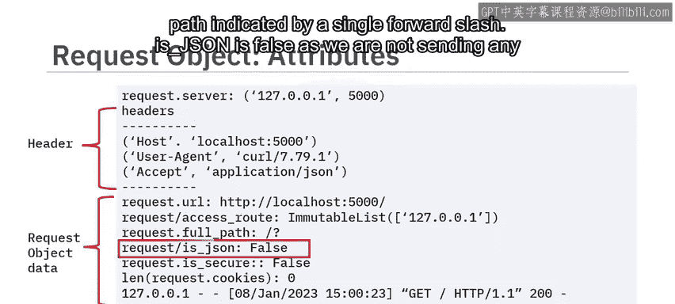

以下是这些方法的列表：

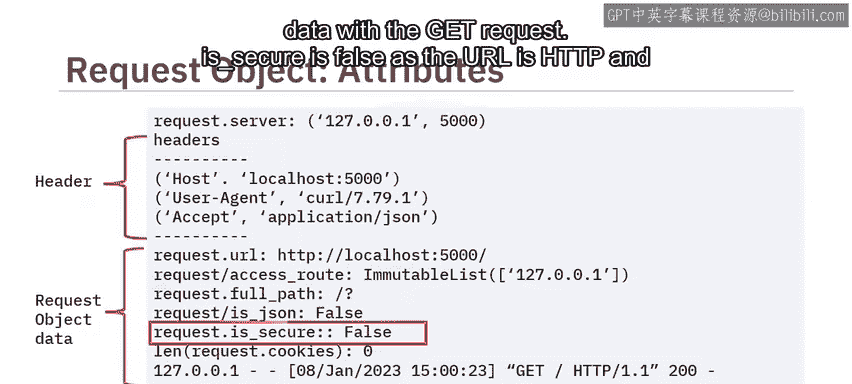

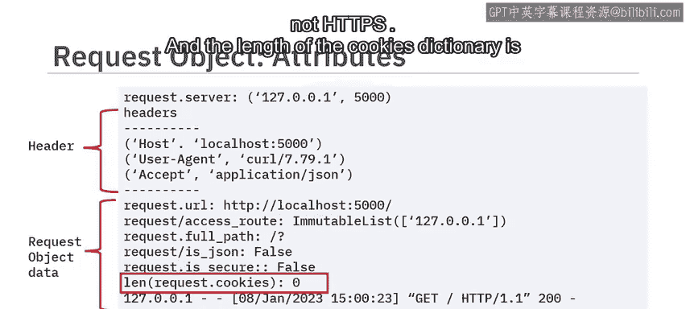

*   **`args`**：以字典形式提供查询参数。
*   **`json`**：将数据解析为字典。
*   **`files`**：提供用户上传的文件。
*   **`form`**：包含表单提交中发布的所有值。
*   **`values`**：将 `args` 数据与 `form` 数据结合。

---

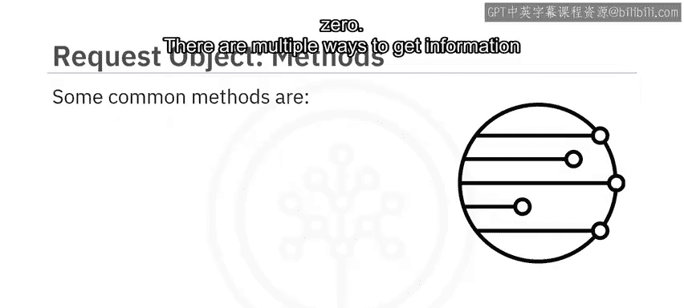

## 提取请求中的特定值 📥

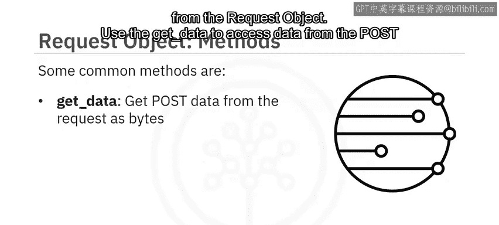

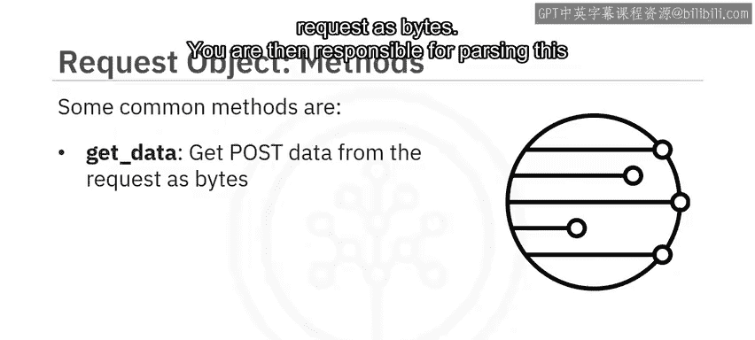

既然你知道了请求对象的样子以及从请求参数和主体获取数据的方法，现在让我们看看如何从这些数据中提取特定的值。

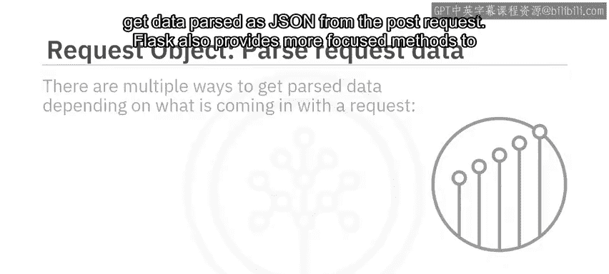

到目前为止，你所看到的方法的返回类型要么是 `MultiDict`、`ImmutableMultiDict`，要么是 `CombinedMultiDict`。所有这些数据结构的行为都类似于Python字典，你可以使用索引或 `get` 方法来提取值。

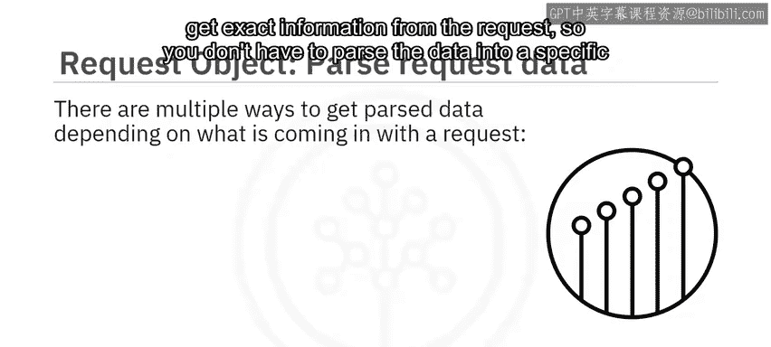

对于给定的URL `http://localhost:5000/?course=capstone&rating=10`，我们想要提取查询参数 `course` 和 `rating`。

首先，在你的方法中导入Flask和request模块。
然后，使用索引提取 `course` 参数的值。
接着，使用 `get` 方法提取 `rating` 参数的值。

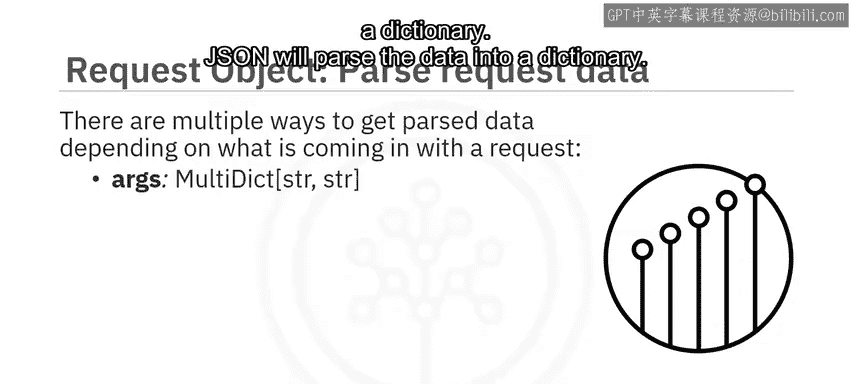

`get` 方法在参数不存在时返回 `None` 值，而索引方法会返回错误并导致服务器以400错误请求停止。

浏览器中显示的消息表明请求的 `course` 为 `capstone`，`rating` 为 `10`。

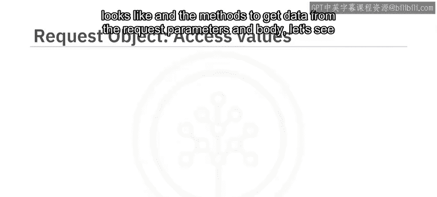

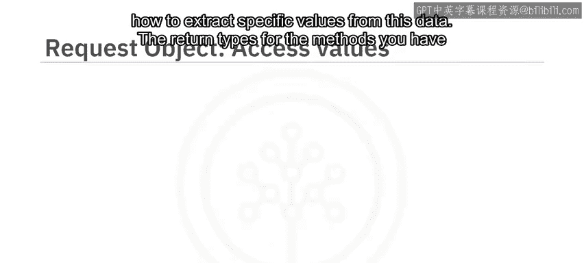

```python
from flask import Flask, request

@app.route('/')
def index():
    course = request.args['course']  # 使用索引
    rating = request.args.get('rating')  # 使用get方法
    return f'Course: {course}, Rating: {rating}'
```

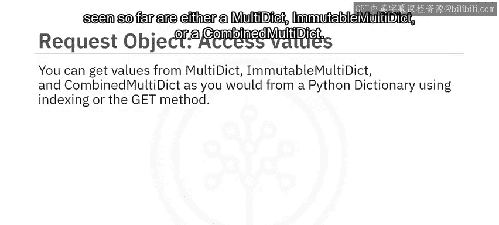


---

## Flask响应对象详解 📤

Flask会提供一个响应对象，就像它提供请求对象一样。你可以使用响应对象向客户端发送自定义属性和头部信息。

一些常见的响应属性包括：

*   **`status_code`**：指示请求的成功或失败。
*   **`headers`**：提供关于响应的更多信息。
*   **`content_type`**：显示所请求资源的媒体类型。
*   **`content_length`**：响应消息主体的大小。
*   **`content_encoding`**：指示应用于响应的任何编码，以便客户端知道如何解码数据。
*   **`mime_type`**：设置响应的媒体类型。
*   **`expires`**：包含响应被视为过期的日期或时间。

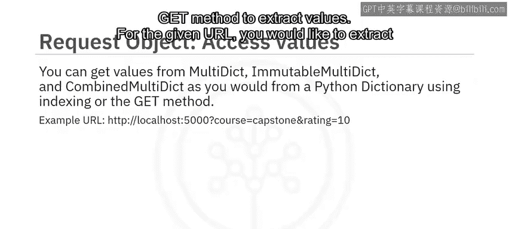

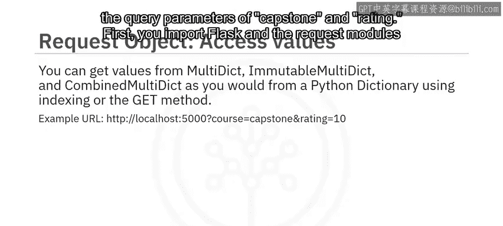

响应对象上还有一些标准方法：

*   **`set_cookie()`**：在客户端设置浏览器Cookie。
*   **`delete_cookie()`**：删除客户端上的Cookie。

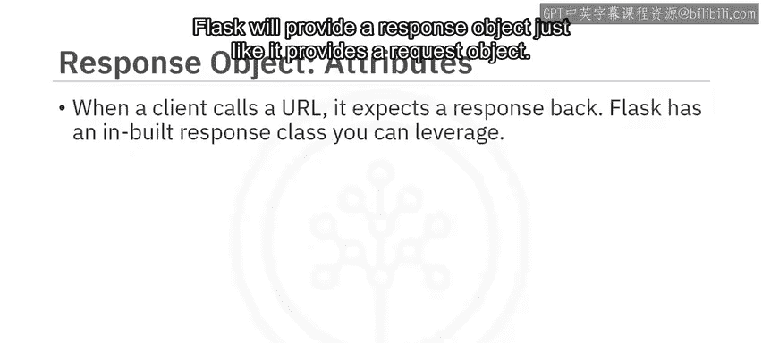

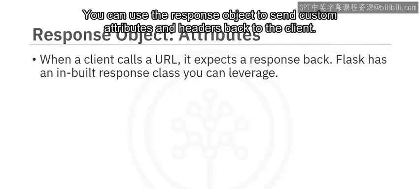

---

## 使用响应对象的不同方法 🎯

现在让我们学习Flask如何使用不同的方法与响应对象协作。

*   当你从 `@app.route` 方法返回数据时，会自动为你创建一个状态码为200、MIME类型为HTML的响应对象。
*   `jsonify()` 也会自动创建一个响应对象。
*   你可以使用 `make_response()` 来创建自定义响应。
*   Flask提供了一个特殊的 `redirect()` 方法来返回302状态码并将客户端重定向到另一个URL。
*   最后，Flask提供了一个 `abort()` 方法来返回带有错误条件的响应。

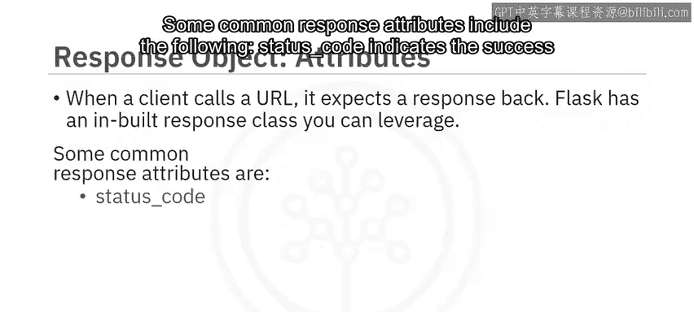

```python
from flask import Flask, jsonify, make_response, redirect, abort

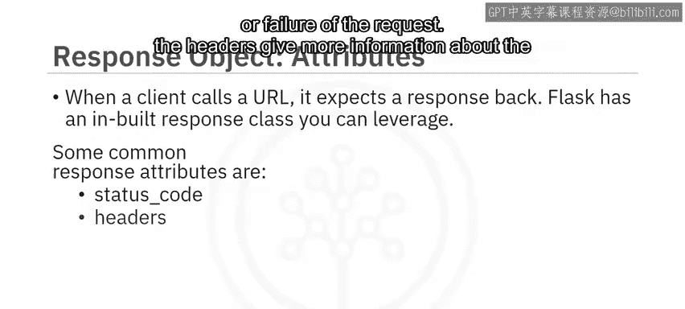

app = Flask(__name__)

# 自动创建响应
@app.route('/auto')
def auto_response():
    return 'Hello, World!'  # 自动创建200 OK, text/html响应

# 使用jsonify
@app.route('/json')
def json_response():
    return jsonify({'message': 'Hello, JSON!'})

# 使用make_response创建自定义响应
@app.route('/custom')
def custom_response():
    resp = make_response('Custom Response')
    resp.headers['X-Custom-Header'] = 'Value'
    resp.status_code = 201
    return resp

# 重定向
@app.route('/old')
def old_location():
    return redirect('/new')

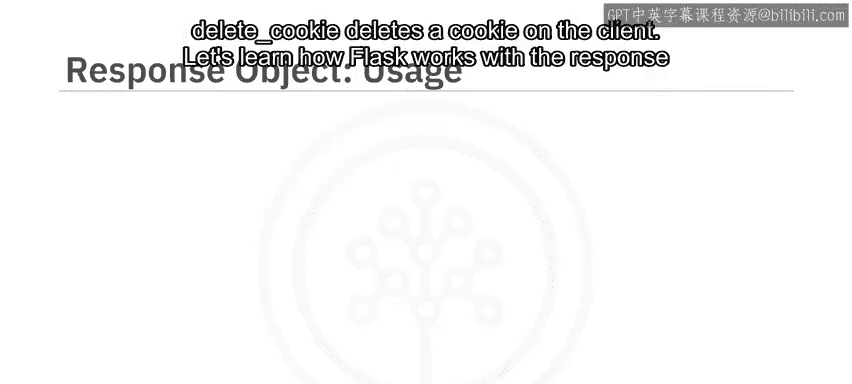

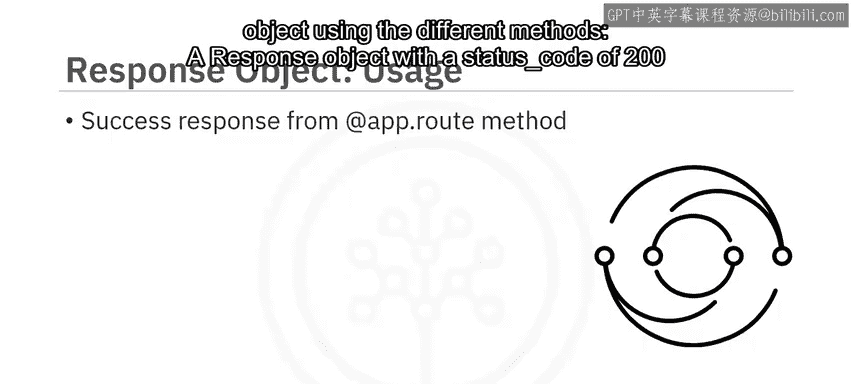

# 中止请求（返回错误）
@app.route('/error')
def cause_error():
    abort(404)  # 返回404 Not Found
```

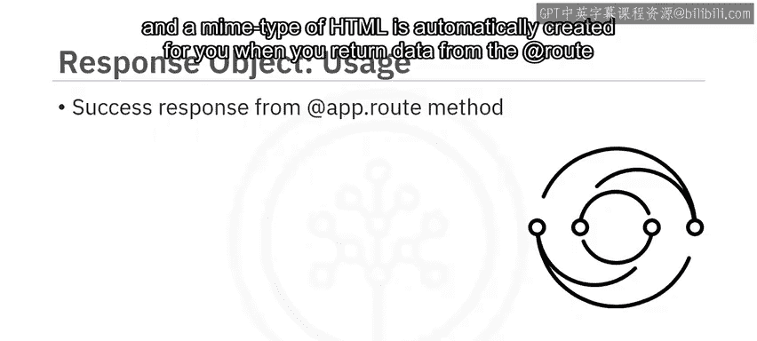

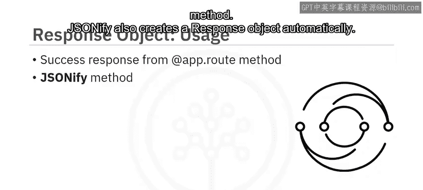

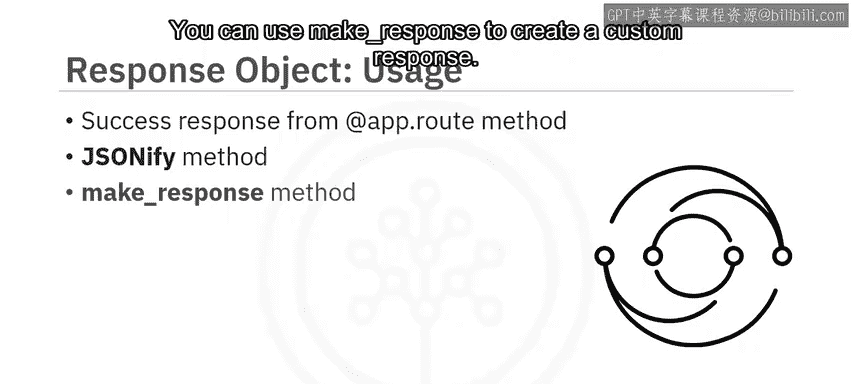

---

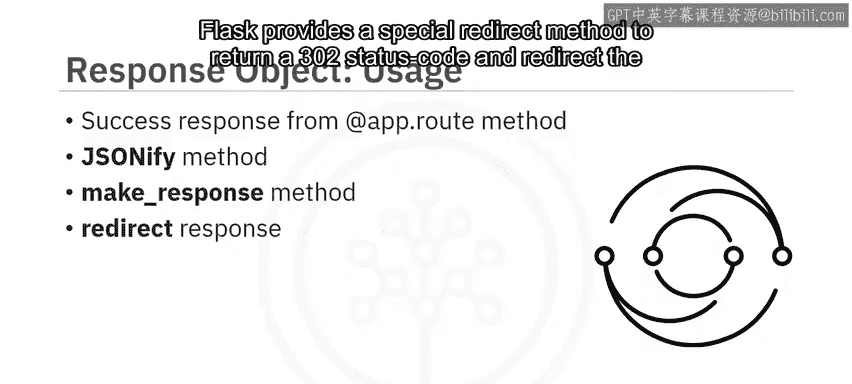

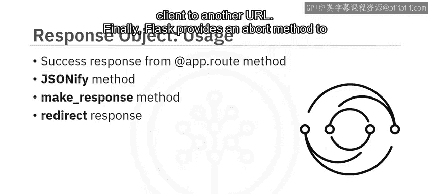

## 总结 📚

本节课中我们一起学习了Flask框架中请求与响应对象的核心用法。

你了解到，Flask为每个客户端调用提供了一个请求对象和一个响应对象。你可以从Flask请求中获取额外信息，如头部信息。你可以解析请求对象以获取查询参数、请求主体和其他参数。并且，你可以在将响应发送回客户端之前，在响应对象上设置状态码和其他属性。

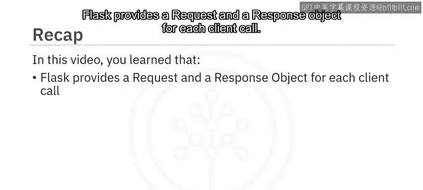

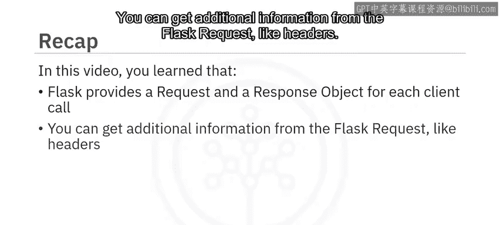

掌握这些对象是构建灵活、健壮的Web应用程序和API的基础。