# 104：动态路由 🛣️


在本节课中，我们将要学习如何在Flask框架中调用外部API，以及如何通过动态路由向Flask传递参数。掌握这些技能对于构建能够与外部服务交互、并能灵活处理不同请求的RESTful API至关重要。


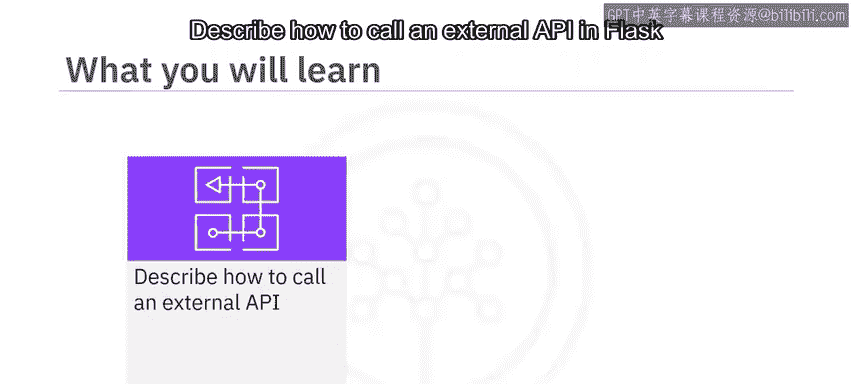

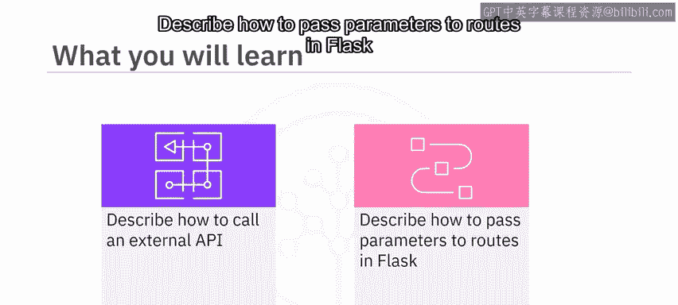

## 在Flask中调用外部API 📡

上一节我们介绍了Flask的基本路由概念，本节中我们来看看如何让Flask应用与外部API进行通信。

在Flask中调用外部API最简单的方法是使用Python的 `requests` 库。你可以将外部API返回的JSON数据直接返回给你的客户端，也可以在将结果发送给客户端之前对其进行处理。

以下是调用外部API的一个具体示例：

```python
import flask
import requests

app = flask.Flask(__name__)

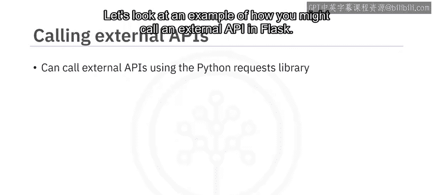

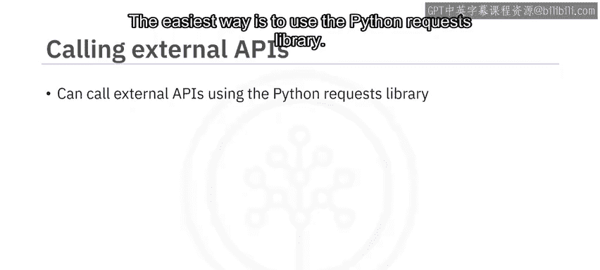

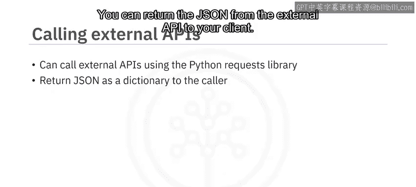

@app.route(‘/author‘)
def get_author():
    # 使用requests库请求Open Library API，搜索作者Michael Crichton的信息
    res = requests.get(‘https://openlibrary.org/search.json?author=Michael Crichton‘)

    # 检查来自Open Library API的响应状态码
    if res.status_code == 200:
        # 如果响应是200，将JSON返回给客户端
        return res.json()
    elif res.status_code == 404:
        # 如果响应是404，发送错误信息
        return ‘Something went wrong.‘, 404
    else:
        # 对于其他任何响应，返回状态码500和服务器错误信息
        return ‘Server error.‘, 500
```

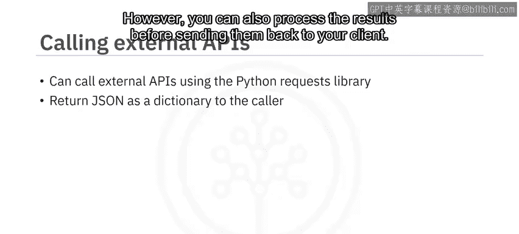

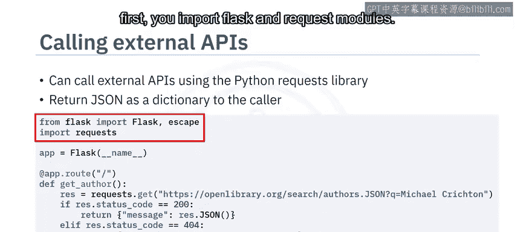

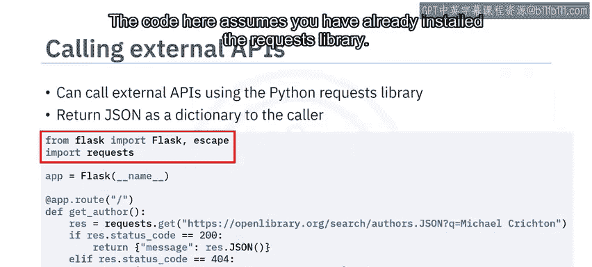

在这个示例中，代码首先导入了必要的模块，定义了一个路由 `/author`。当访问该路由时，它会向外部API发起请求，并根据返回的状态码决定向客户端返回何种内容。


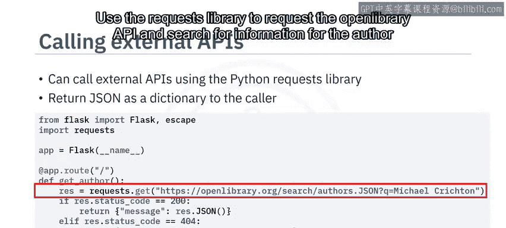

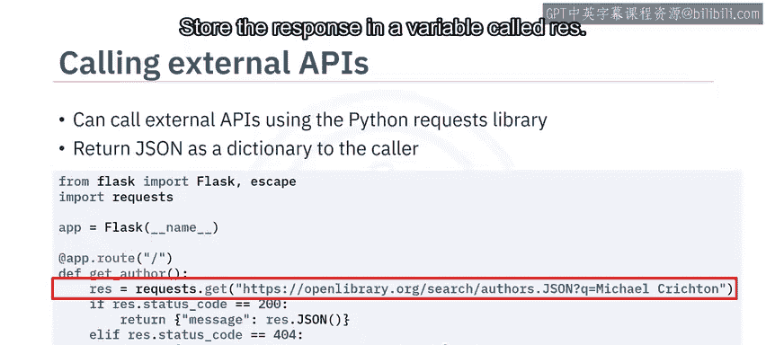

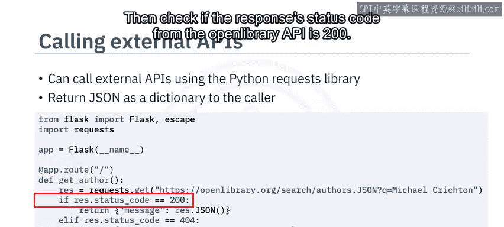

## 动态路由与参数传递 🔄

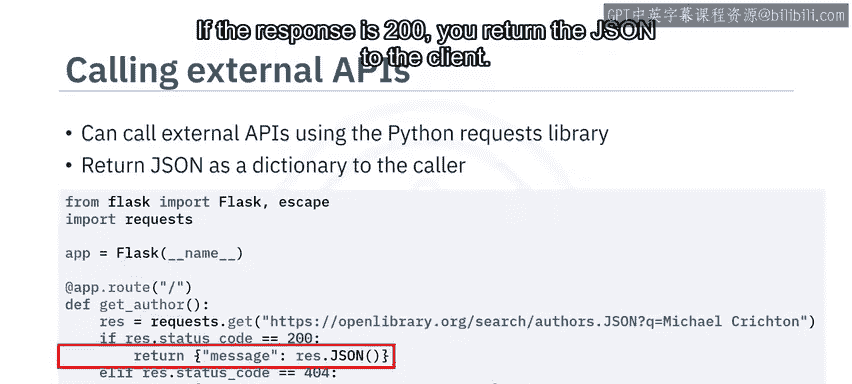

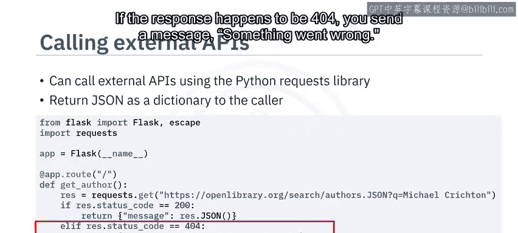

在开发RESTful API时，经常需要将资源ID作为请求URL的一部分发送。例如，创建一个根据国际标准书号（ISBN）返回图书信息的端点，但ISBN不应硬编码在代码中，而应由客户端通过URL提供。Flask为此提供了动态路由功能。

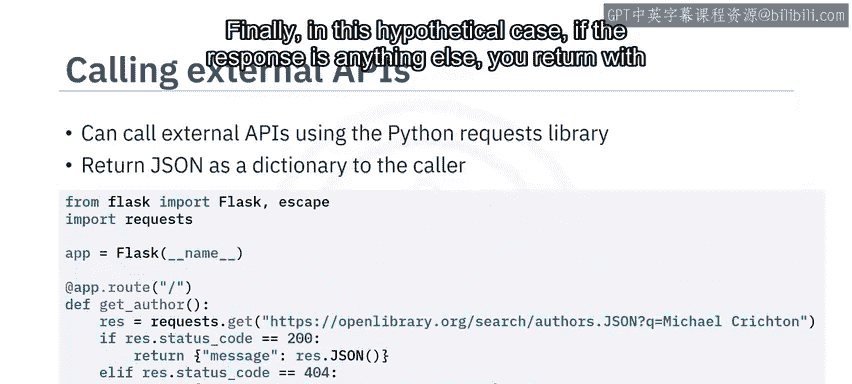

现在让我们看一个具体例子，将名为 `isbn` 的变量作为URL的动态部分：

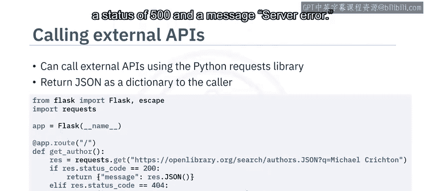

```python
@app.route(‘/book/<isbn>‘)
def get_book_by_isbn(isbn):
    # 将ISBN变量传递给Open Library API
    res = requests.get(f‘https://openlibrary.org/isbn/{isbn}.json‘)
    # 将结果返回给客户端
    return res.json()
```

Flask还允许你设置参数类型，框架会利用这些信息来验证传入的请求。例如，你可以创建一个端点来获取旧金山机场的航站楼数量：

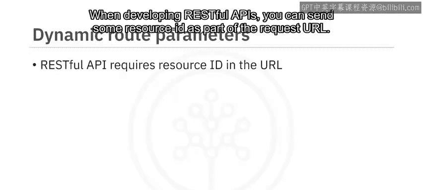

```python
@app.route(‘/terminals/<string:airport_code>‘)
def get_terminals(airport_code):
    # 此路由装饰器会在用户在URL末尾发送一个字符串时触发
    # 根据机场代码查询并返回航站楼数量
    # ... 查询逻辑 ...
    return {‘terminals‘: terminal_count}
```

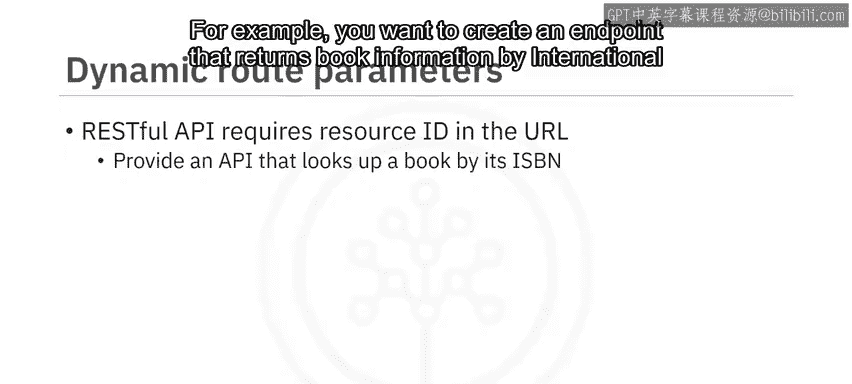

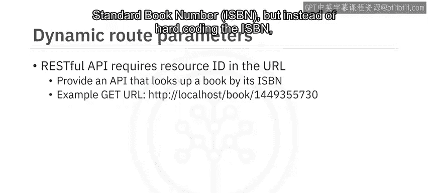

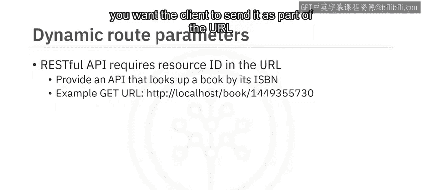

同样地，在上一个ISBN的例子中，你可以指定ISBN为数字类型：

```python
@app.route(‘/book/<int:isbn>‘)
def get_book_by_isbn(isbn):
    # 现在isbn参数被验证为整数类型
    # ... 处理逻辑 ...
```

以下是Flask中其他一些参数类型的示例：

*   **`string`**: 默认类型，接受任何不包含斜杠的文本。
*   **`int`**: 接受正整数。
*   **`float`**: 接受正浮点数。
*   **`path`**: 类似 `string`，但接受斜杠，可用于表示路径。
*   **`uuid`**: 接受UUID格式的字符串。


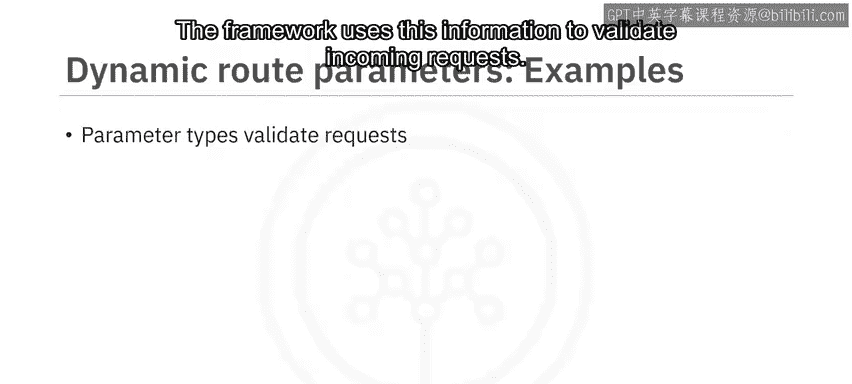

## 复杂参数类型示例：UUID 🆔

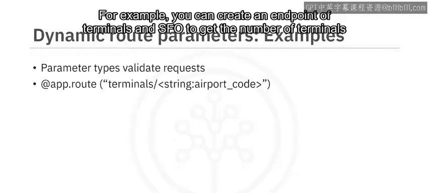

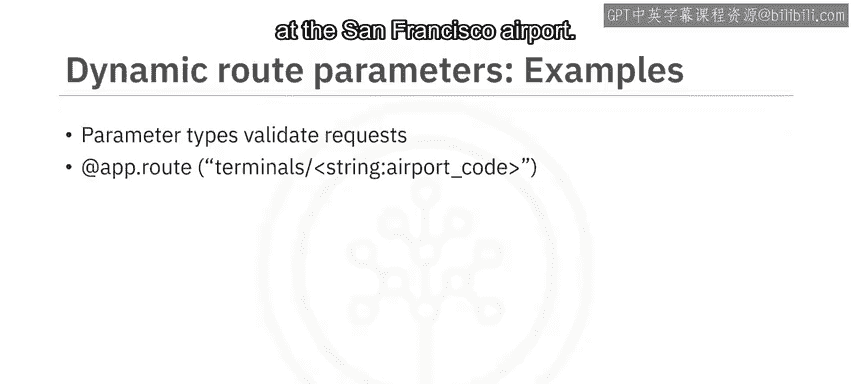

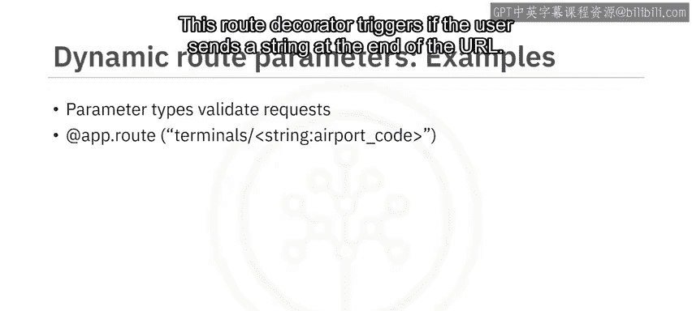

虽然 `string`、`int` 和 `float` 是简单参数，但你也可以使用更复杂的类型，例如 `uuid` 来表示通用唯一标识符。

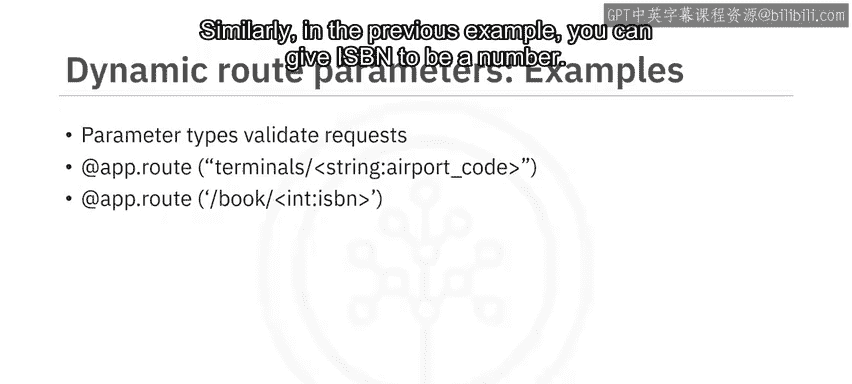

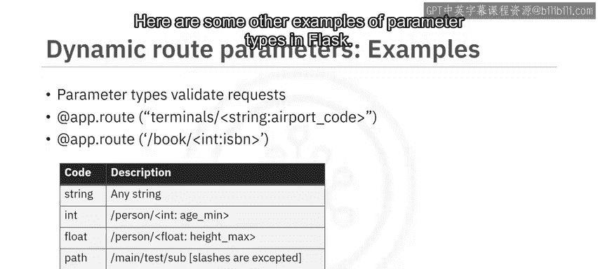

以下是一个使用UUID的示例。你可以创建一个端点，通过特定的UUID来获取网络信息：

```python
import uuid

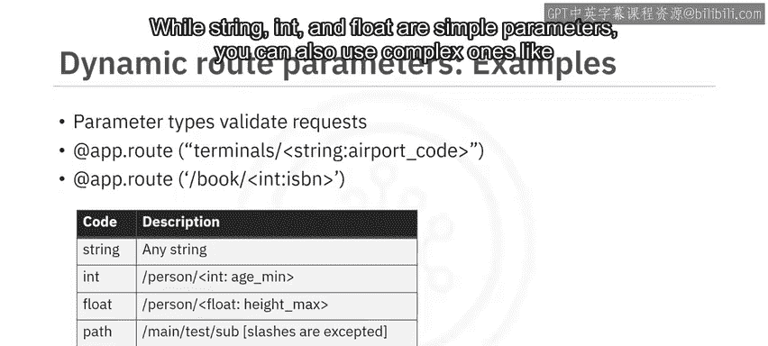

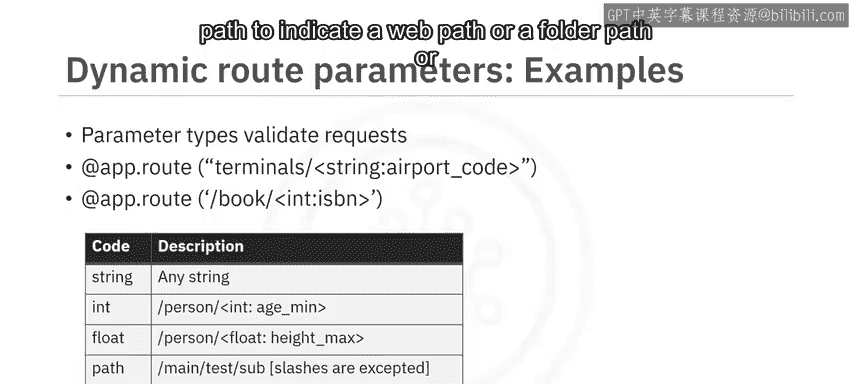

@app.route(‘/network/<uuid:network_id>‘)
def get_network_info(network_id):
    # 此路由期望一个UUID类型的变量network_id
    # UUID作为参数传递给方法
    # 假设有一个函数能根据UUID查找网络
    network = find_network_by_uuid(network_id)

    if network:
        # 如果找到UUID，返回成功消息和网络信息
        return {‘status‘: ‘success‘, ‘network‘: network}, 200
    else:
        # 否则，返回错误代码和相应消息
        return {‘status‘: ‘error‘, ‘message‘: ‘Network not found.‘}, 404
```

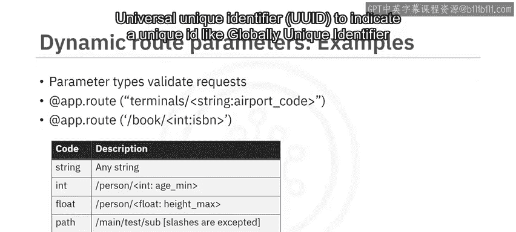

在这段代码中，路由期望一个 `uuid` 类型的 `network_id` 变量。这个UUID被作为参数传递给处理函数，函数根据该UUID查找网络并返回相应结果。


## 总结 📝

本节课中我们一起学习了Flask框架中两个重要的高级功能。

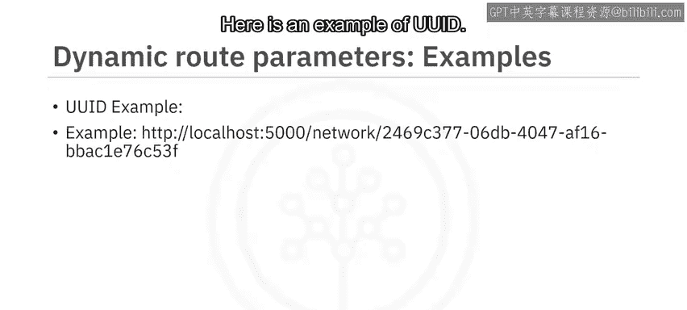

首先，我们了解了如何在Flask应用中调用外部API，这通过使用 `requests` 库实现，并需要妥善处理不同的HTTP响应状态码。

其次，我们深入探讨了动态路由。你学会了：
*   如何解析请求对象以获取查询参数、请求体等信息。
*   如何在将响应发送回客户端之前，在响应对象上设置状态码。
*   如何使用动态路由和参数类型验证来创建灵活且健壮的RESTful API端点。


掌握动态路由和外部API调用，将使你能够构建出功能更加强大、交互性更好的Web应用和微服务。