# 105：错误处理 🛠️


在本节课中，我们将要学习API开发中的错误处理机制。你将了解HTTP状态码的不同类别，掌握如何在Flask框架中处理和返回错误，从而构建出更健壮、更友好的Web服务。

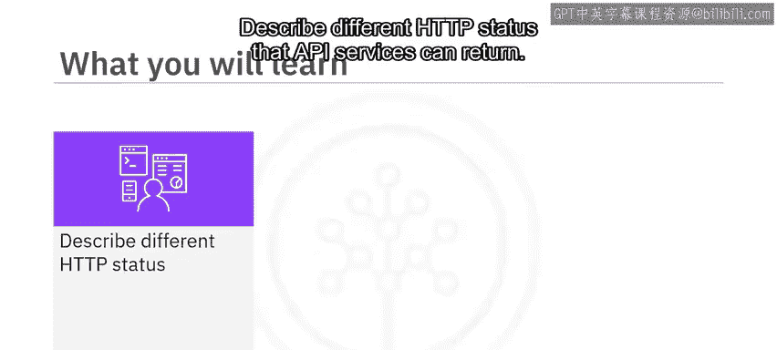

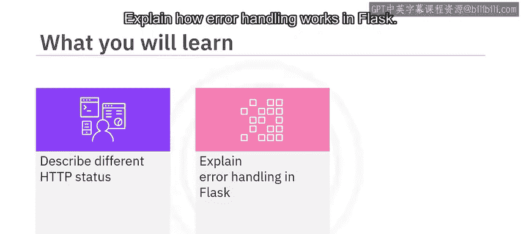

---

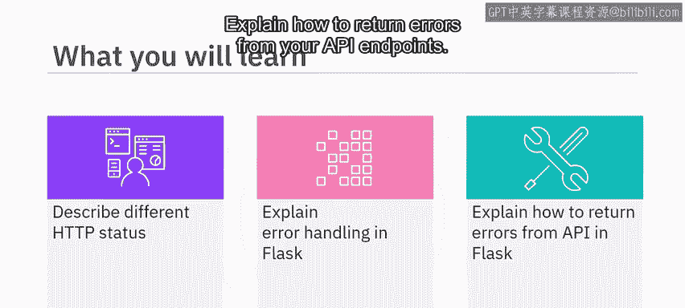

## HTTP状态码概述

每一个HTTP响应都包含一个三位数的状态码，用于指示请求的成功或错误状态。客户端负责解析这个状态码。有效的状态码范围是100到599。

这些状态码按每100个为一组进行分类：
*   **100-199**：信息性状态码，表示请求已被接收，正在处理。
*   **200-299**：成功状态码，表示请求已被成功接收、理解并接受。
*   **300-399**：重定向状态码，表示需要客户端采取进一步的操作以完成请求。
*   **400-499**：客户端错误状态码，表示请求包含语法错误或无法完成。
*   **500-599**：服务器错误状态码，表示服务器在处理请求的过程中发生了错误。

本课程中编写的API将遵循此规范。例如，当客户端请求一个不存在的资源时，你可以返回一个**404**状态码；对于格式错误的请求，可以返回**400**状态码。

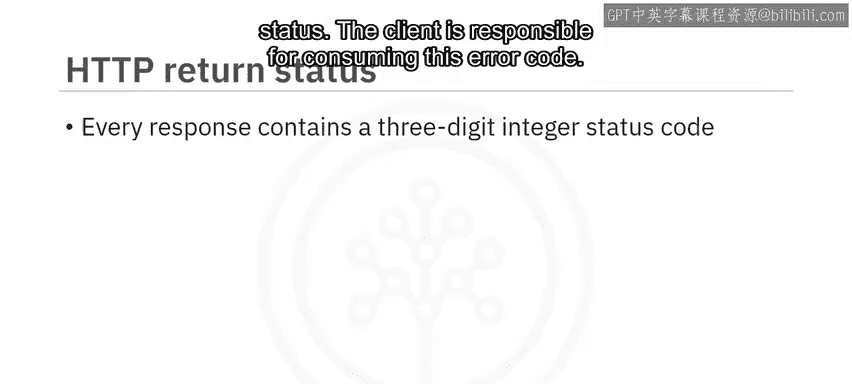

---

## Flask中的默认状态码

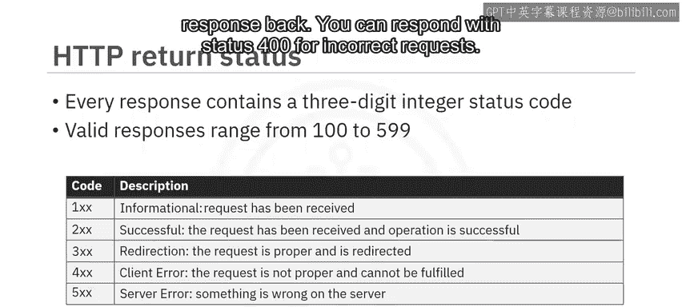

Flask服务器在从 `@app.route` 装饰的方法返回时，默认会自动返回**200 OK**状态。当你使用 `jsonify` 方法响应请求时，默认也会返回200。

以下代码执行时，将返回一个状态码为200的成功响应：
```python
return jsonify({"message": "Success"})
```

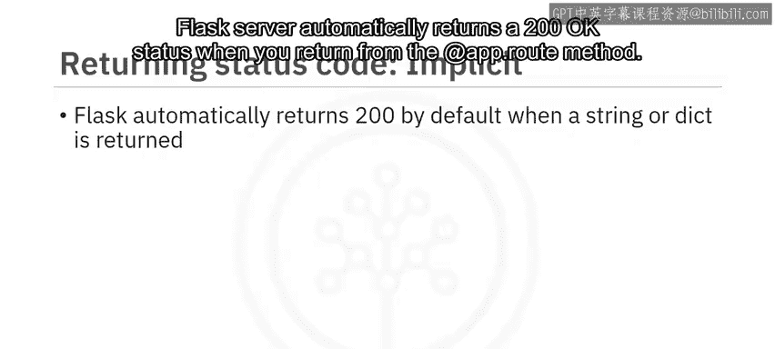

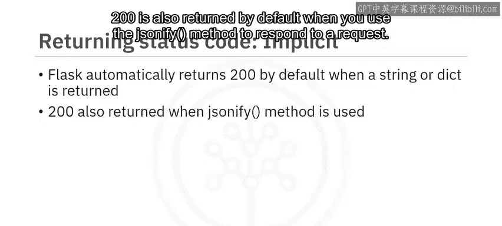

---

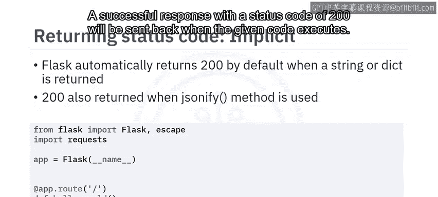

## 如何返回自定义状态码

你的代码可以返回非默认的状态码。Flask允许你通过一个元组来发送响应内容和状态码。

在下面的代码中，你返回了一条HTML响应信息，并显式设置了状态码为200：
```python
return "<h2>My first application in action</h2>", 200
```

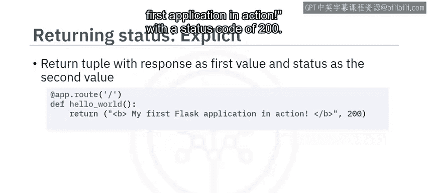

你也可以使用 `make_response` 方法来显式设置状态码。下面的代码返回与上一段代码相同的HTML消息和HTTP状态码200，但这里使用了 `make_response` 方法：
```python
resp = make_response("<h2>My first application in action</h2>")
resp.status_code = 200
return resp
```

---

## 常用HTTP状态码示例

上一节我们介绍了如何返回自定义状态码，本节中我们来看看一些在本课程中可能会用到的具体状态码。

以下是几个关键状态码的说明：
*   **200**：默认的成功状态，表示请求已成功处理。
*   **201**：告知客户端服务器已成功创建了资源。
*   **202**：表示请求已被接受，正在处理中，常用于批处理操作。
*   **204**：服务器成功处理了请求，但没有返回任何内容。此状态适用于你希望浏览器不执行任何操作（例如，用户停留在当前页面）的场景。
*   **400**：表示无效请求。可能意味着参数缺失、格式不正确或以其他方式无效。
*   **401**：表示身份验证凭证缺失或无效。
*   **403**：表示客户端凭证权限不足，无法完成请求。
*   **404**：表示服务器找不到请求的资源。
*   **405**：表示请求的方法（如GET， POST）不被支持。
*   **500**：表示服务器内部发生错误。


---

## 在API端点中返回错误

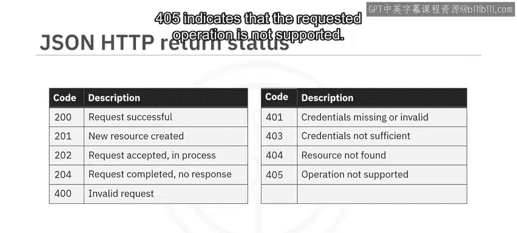

既然你了解了不同的HTTP状态码，作为开发者，你需要从服务中返回正确的代码。让我们看一个例子。

这个 `search_response` 方法会查找名为 `q` 的数据库查询参数。服务在解析你的查询后，会调用模拟的 `fetch_from_database` 方法。

以下是该方法的逻辑：
1.  如果资源存在，代码会将资源返回给客户端，服务器会隐式返回**200**状态码。
2.  如果资源未找到，则返回**404**状态码。

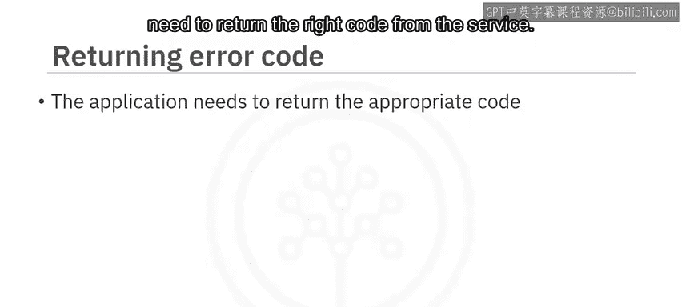

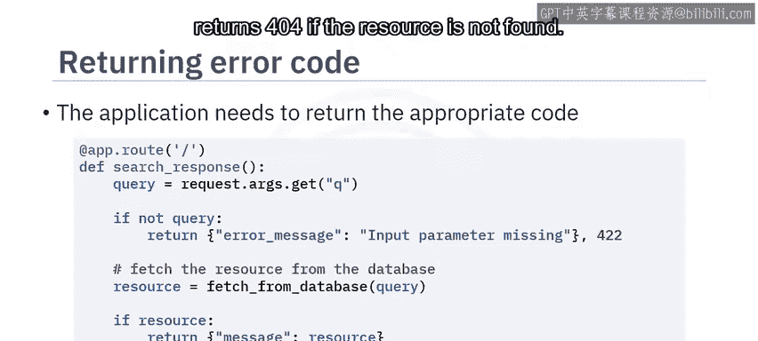

现在，让我们使用 `curl` 程序来调用这个端点。
1.  调用路由时不提供查询参数：`curl` 程序返回消息“input parameter missing”，状态码为**422**。
2.  使用正确的资源ID调用路由：`curl` 命令返回资源作为响应体，状态码为**200**。
3.  使用一个不存在的资源调用路由：`curl` 命令返回消息“resource not found”，状态码为**404**。

---

## 应用级错误处理

Flask提供了一种在应用级别处理错误消息的方法。这里我们看到一个处理**404**错误的方法，它返回消息“API not found”并附带**404**状态码。
```python
@app.errorhandler(404)
def not_found(error):
    return jsonify({"error": "API not found"}), 404
```


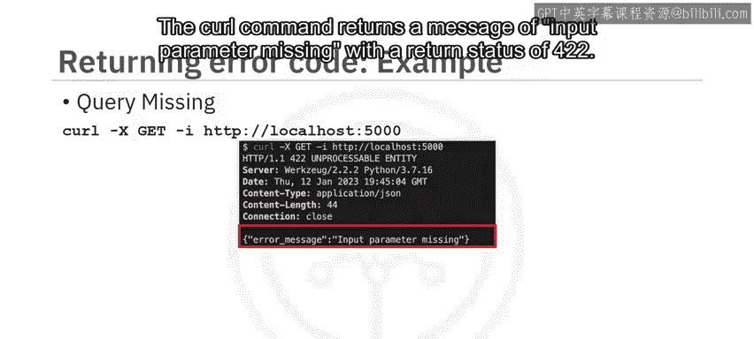

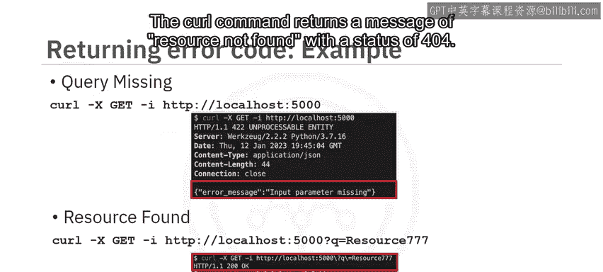

同样，这段代码创建了一个处理**500**错误的处理器，并返回消息“something went wrong on the server”。
```python
@app.errorhandler(500)
def internal_error(error):
    return jsonify({"error": "Something went wrong on the server"}), 500
```

---

## 总结

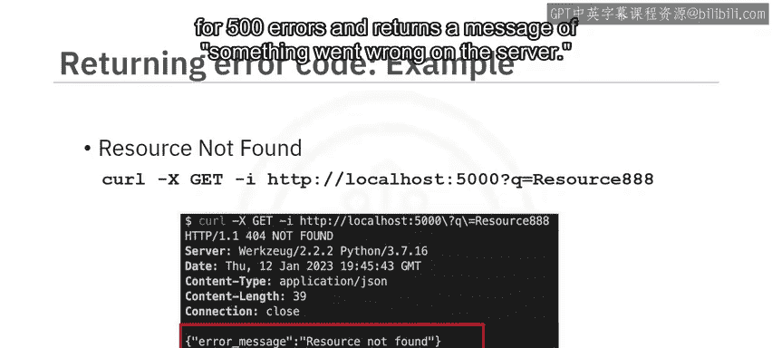

本节课中我们一起学习了Web API错误处理的核心知识。

你了解到HTTP响应需要一个状态码来指示请求处理的结果。HTTP状态码分为多个类别，分别表示成功、客户端错误或服务器错误。Flask在响应时会隐式返回成功的**200**状态码，但你也可以显式提供其他状态码。此外，Flask还提供了强大的应用级错误处理器，帮助你统一管理错误响应。

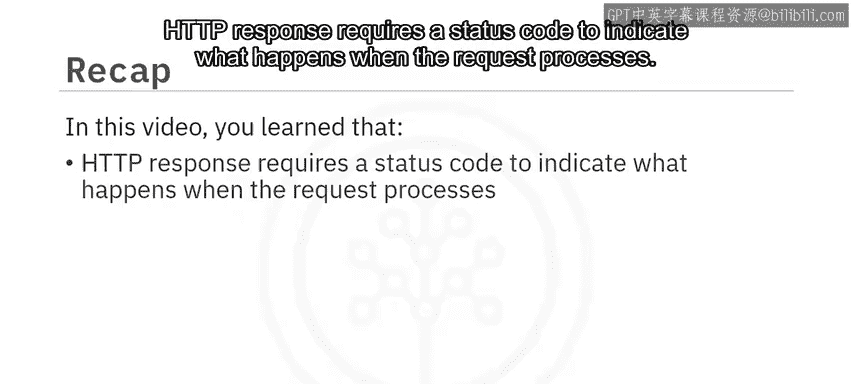

通过合理使用这些状态码和错误处理机制，你可以使你的API更易于调试和使用，为用户提供更清晰的反馈。