# 107：课程简介

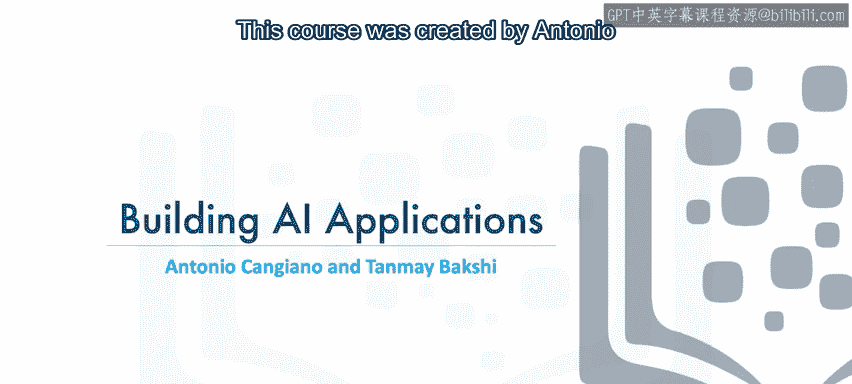

在本节课中，我们将要学习《构建AI应用》这门课程的整体介绍。这门课程由IBM的开发者与AI倡导者Antonio Kanggano和Taanmei Bkhi创建，并得到了他们的同事Sophia Chai和Y Yao的贡献。我们将了解课程的目标、先决条件以及你将通过本课程构建的项目。

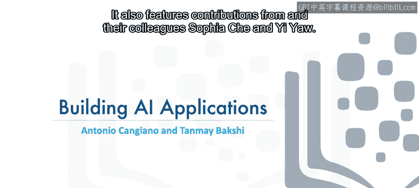

## 📚 课程概述

欢迎来到《构建AI应用》课程。本课程将教你如何集成多种人工智能服务，以构建更智能、更有用的应用程序。

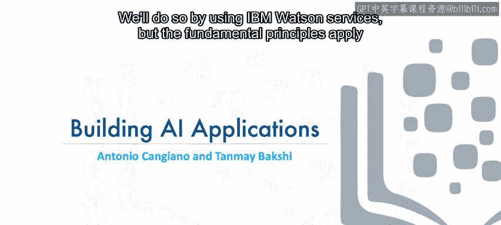

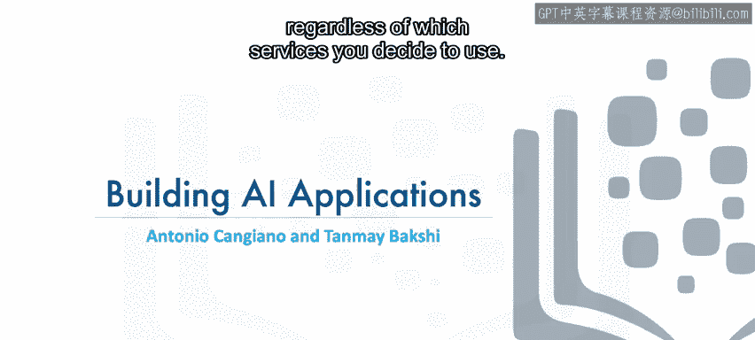

我们将通过使用IBM Watson服务来实现这一目标，但无论你决定使用哪种服务，其基本原理都是通用的。

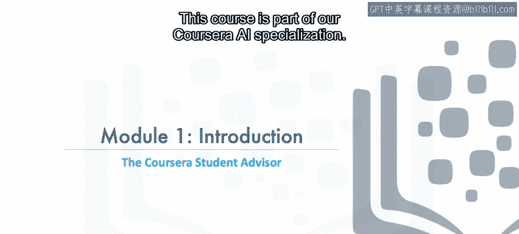

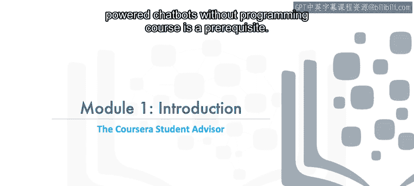

## 🔗 先决条件与课程定位

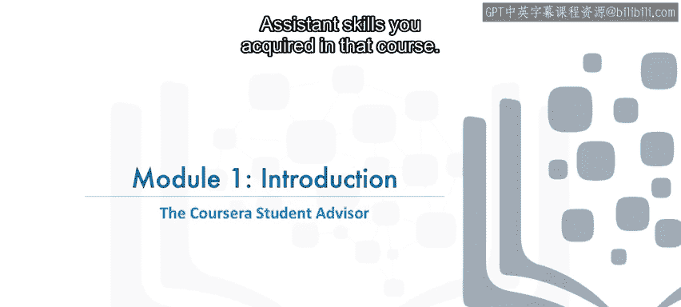

本课程是我们Coursera AI专项课程的一部分。因此，学习Antonio的《无需编程构建AI驱动的聊天机器人》课程是先决条件。

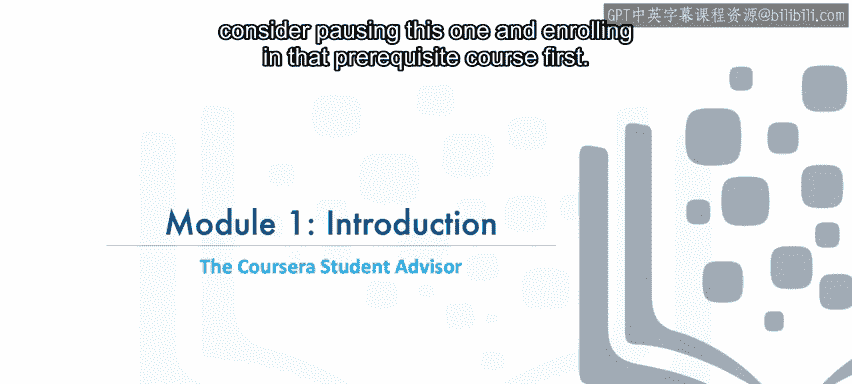

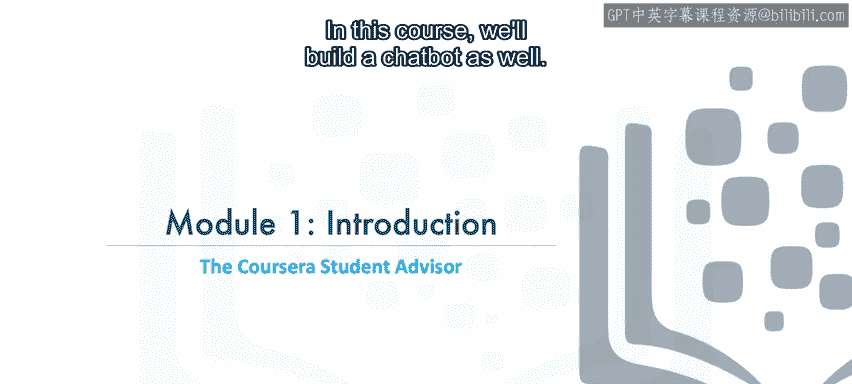

本课程建立在你从先修课程中获得的Watson Assistant技能之上。如果你尚未学习该课程，建议暂停本课程，先注册学习先修课程。

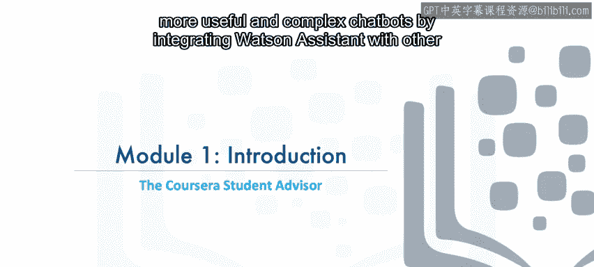

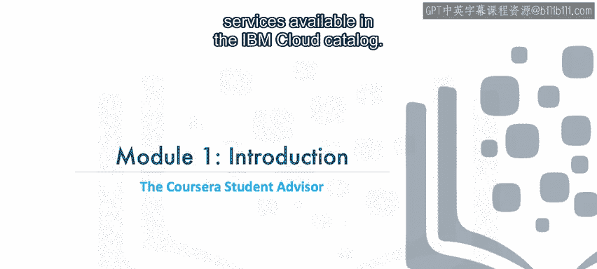

## 🤖 课程核心项目：构建学生顾问聊天机器人

在本课程中，我们同样将构建一个聊天机器人。但这一次，你将学习如何通过将Watson Assistant与IBM Cloud目录中的其他服务集成，来创建更有用、更复杂的聊天机器人。

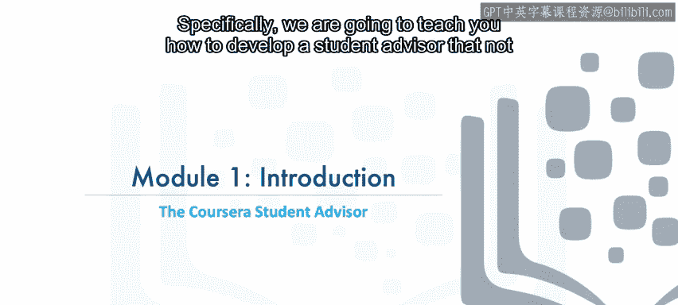

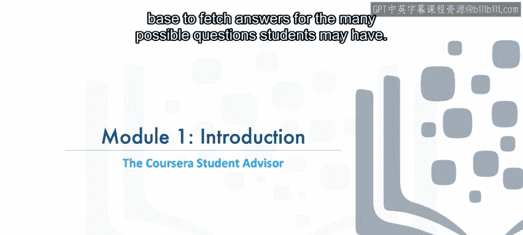

具体来说，我们将教你如何开发一个学生顾问。这个顾问不仅能使用预设答案响应用户，还能利用现有的知识库，为学生可能提出的众多问题获取答案。

在模块6的最终项目中，你将通过为Coursera平台本身开发一个学生顾问，来展示你新获得的技能，给我们留下深刻印象。

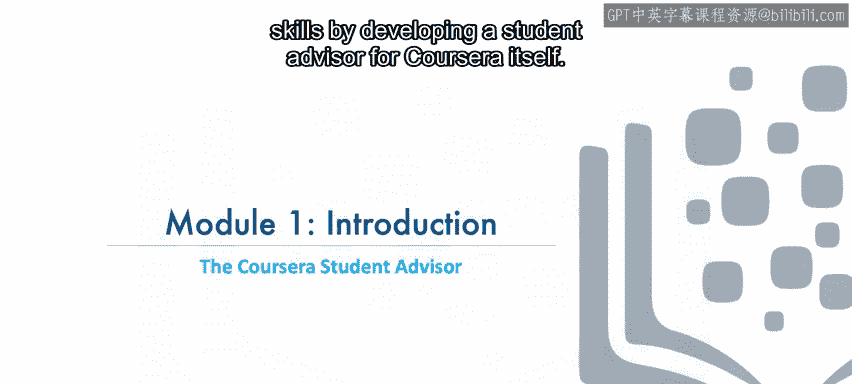

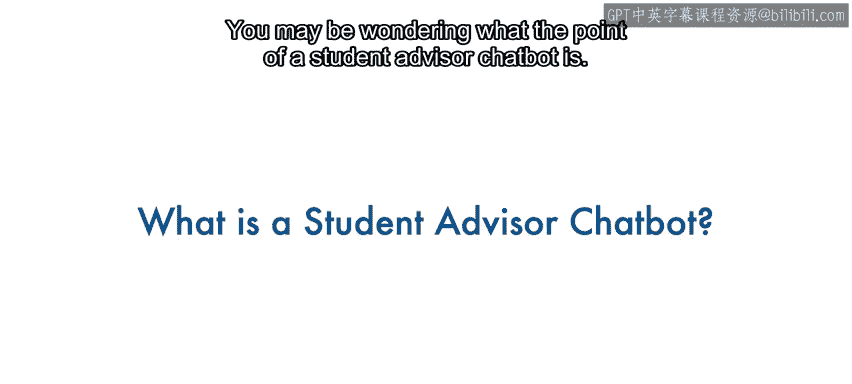

## ❓ 学生顾问聊天机器人的价值

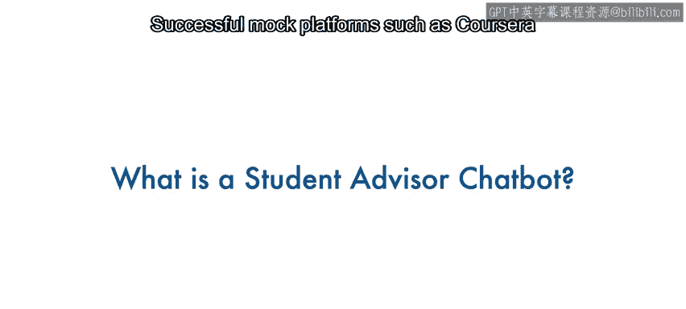

你可能会好奇学生顾问聊天机器人的意义是什么。

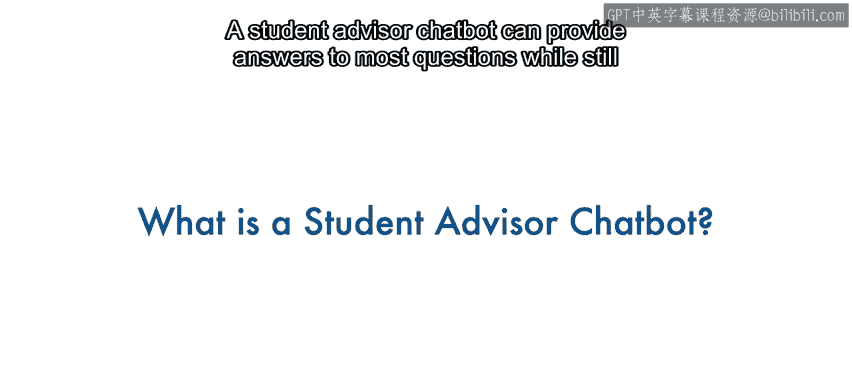

像Coursera这样成功的慕课平台，会收到大量来自像你这样的在线学习者的支持问题。

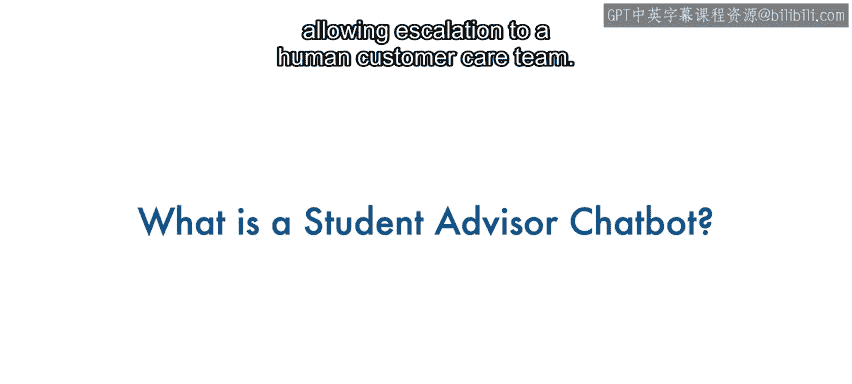

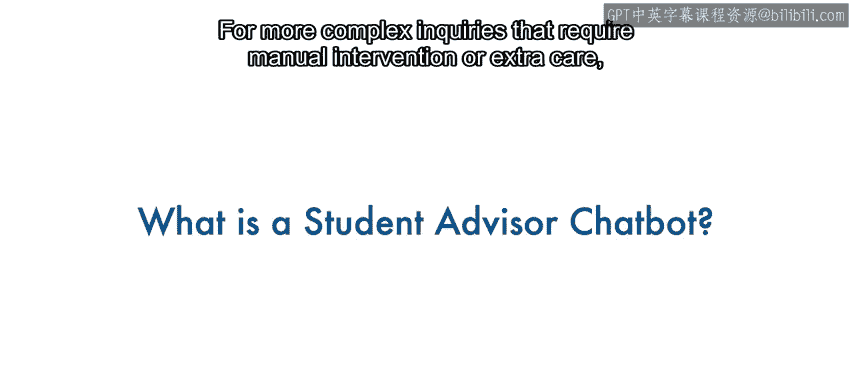

一个学生顾问聊天机器人可以为大多数问题提供答案，同时仍允许将更复杂、需要人工干预或额外关怀的咨询升级至人工客服团队处理。

以下是学生可能提出的几类问题示例：

*   关于平台本身及其使用的问题。例如，他们可能会问“旁听课程和付费课程有什么区别？”
*   在线学习者也可能向聊天机器人寻求职业发展建议。他们可能会问“我应该学习哪门课程来了解聊天机器人？”或者说“我想成为一名数据科学家”。如果聊天机器人能在此处提供一些指导，那将非常棒。
*   用户也可能遇到一些技术问题，聊天机器人可以显著减少人工支持团队需要处理的工单数量。

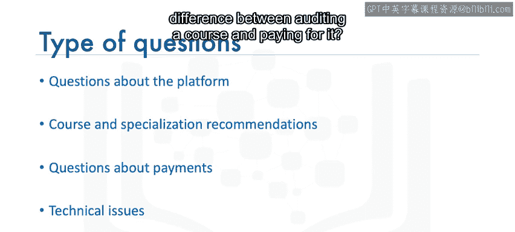

这使我们能够以较低成本扩展客户服务规模，同时为学生提供7x24小时的答案支持。

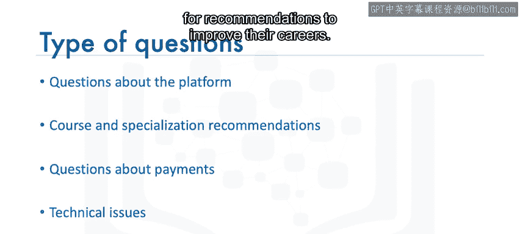

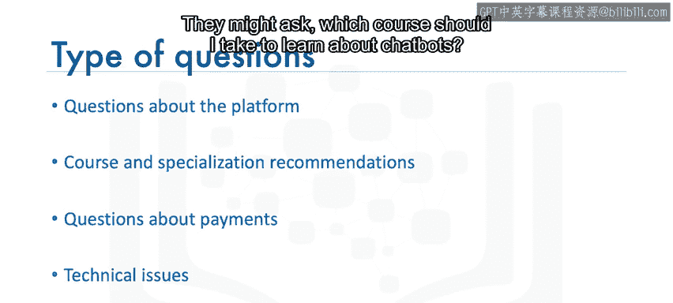

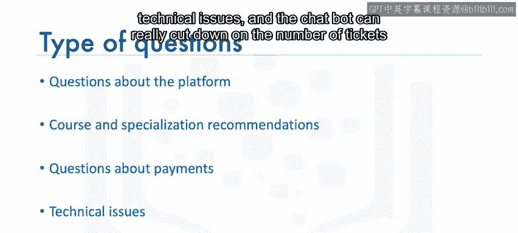

更重要的是，相同的技能可以应用于为各种企业创建聊天机器人，而不仅仅是像Coursera这样的慕课平台。

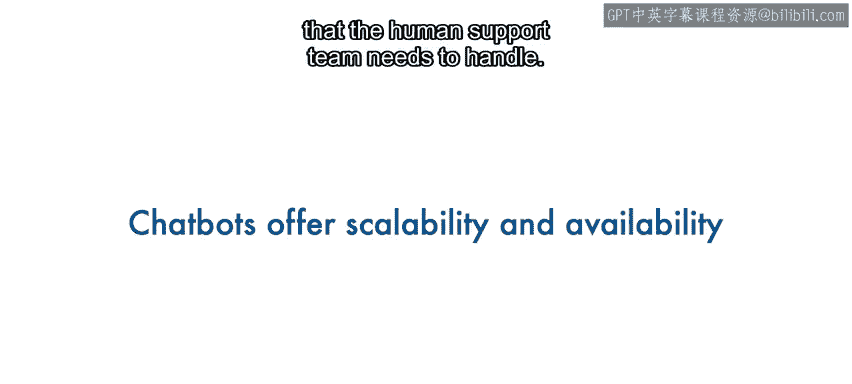

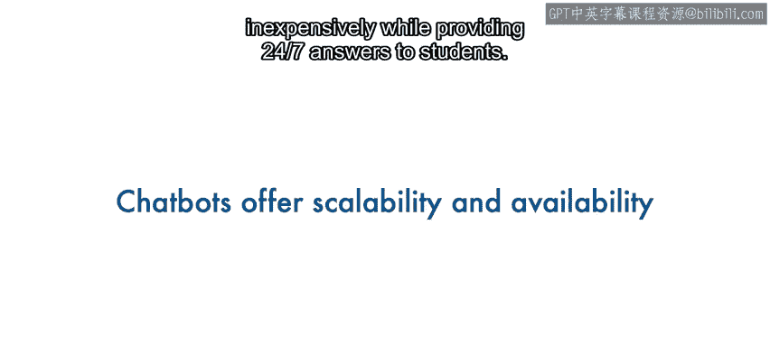

## 🎯 课程技能的广泛适用性

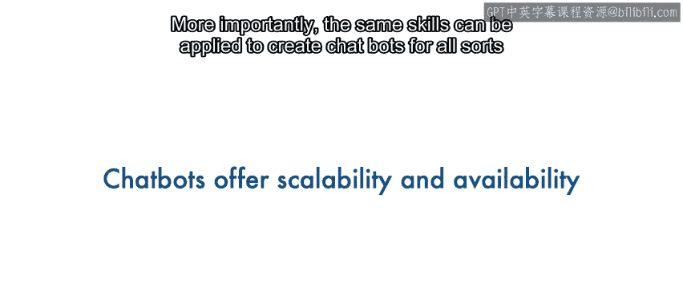

你在本课程中学到的知识，无论你构建何种聊天机器人，都将使你受益匪浅。此外，学习如何集成各种AI服务，即使你最终构建的应用程序根本不包含聊天机器人，也会带来回报。

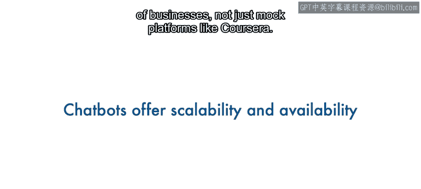

在下一个视频中，我们将讨论在本课程中将采用哪些AI技术。

## 📝 总结

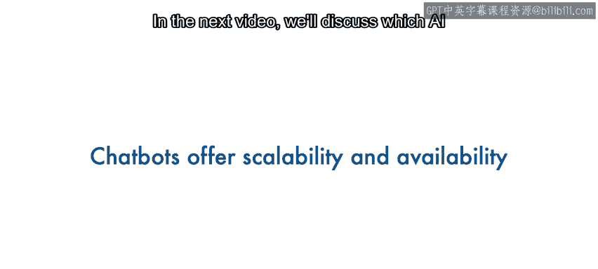

本节课中，我们一起学习了《构建AI应用》课程的简介。我们了解了课程的目标是集成多种AI服务构建复杂应用，明确了先修课程的要求，并认识了核心项目——一个能利用知识库回答问题的学生顾问聊天机器人。我们还探讨了这类机器人的实际价值及其技能的广泛适用性。接下来，我们将深入探讨本课程将使用的具体AI技术。