# 108：构建AI应用程序 🚀

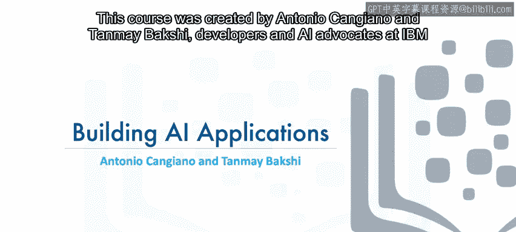

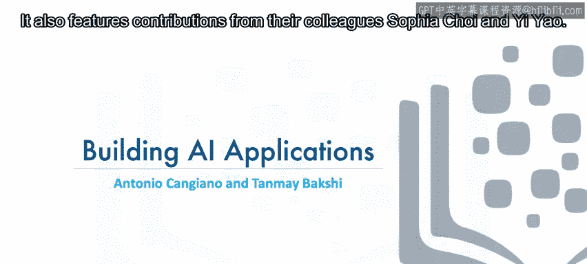

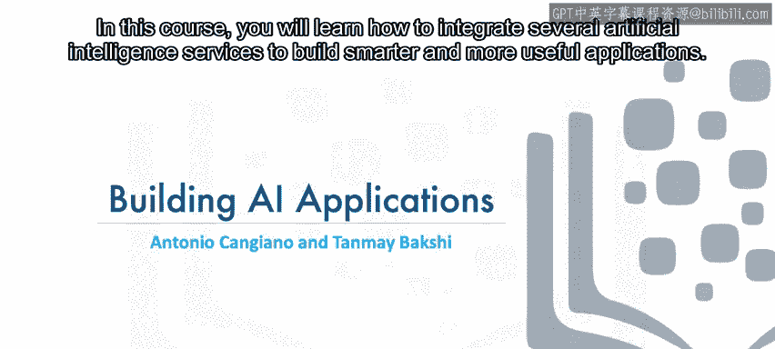

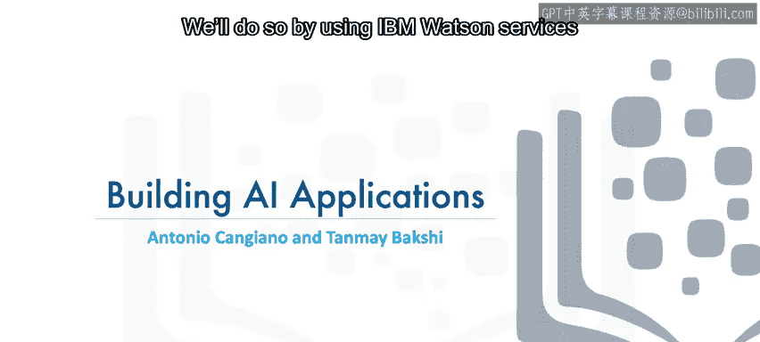

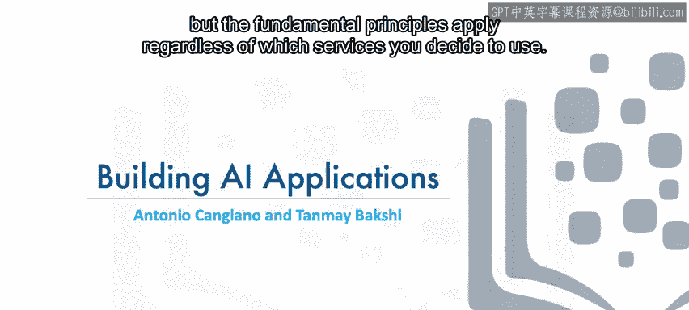

在本课程中，我们将学习如何集成多种人工智能服务，以构建更智能、更有用的应用程序。我们将以IBM Watson服务为例进行实践，但所学的核心原理适用于任何你选择使用的服务。

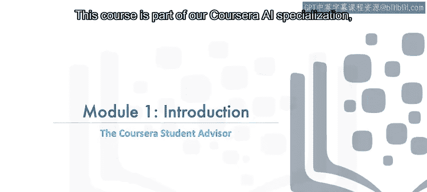

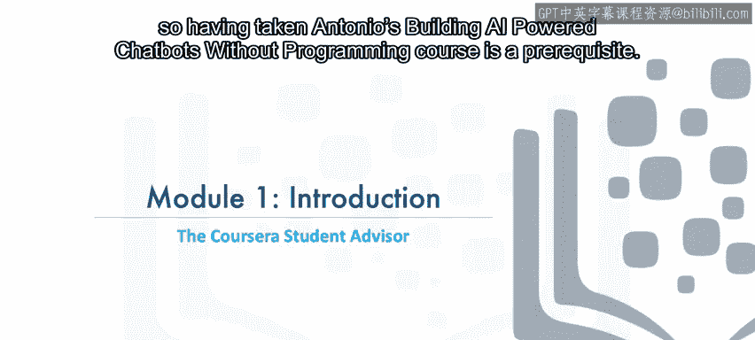

本课程由IBM的开发者与AI倡导者Antonio Kanggano和Tanmei Bkhi创建，并得到了他们同事Sophia Chai和Y Yao的贡献。它是我们Coursera AI专业课程的一部分，学习本课程的前提是已经完成了Antonio的“无需编程构建AI驱动的聊天机器人”课程。

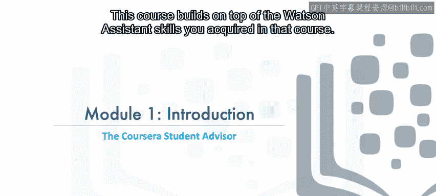

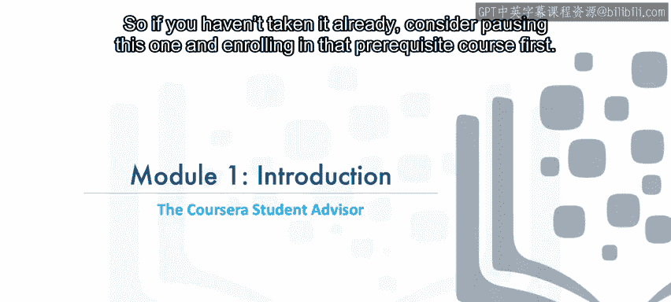

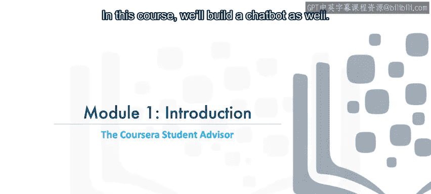

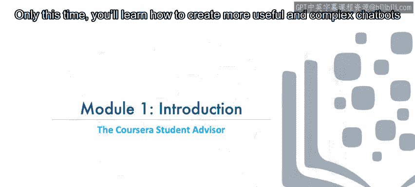

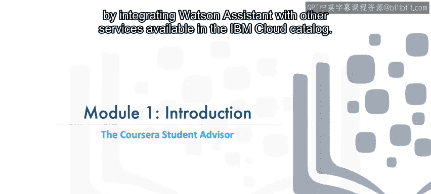

上一节我们介绍了课程背景，本节中我们来看看本课程的具体目标。本课程将建立在你在前置课程中获得的Watson Assistant技能之上。如果你尚未学习前置课程，建议先暂停本课程，完成前置学习。在本课程中，我们同样会构建一个聊天机器人，但这次你将学习如何通过将Watson Assistant与IBM Cloud目录中的其他服务集成，来创建更有用、更复杂的聊天机器人。

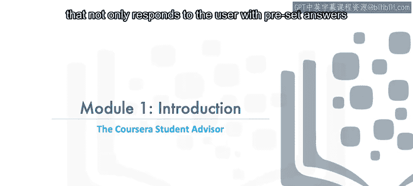

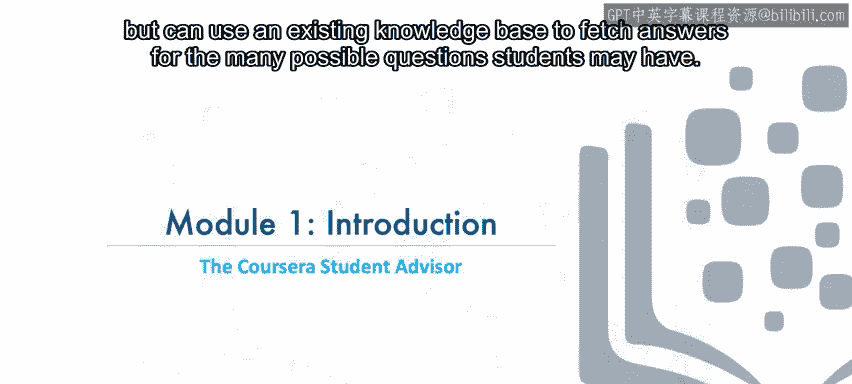

具体来说，我们将教你开发一个学生顾问机器人。这个机器人不仅能使用预设答案回复用户，还能利用现有的知识库，为学生们可能提出的各种问题寻找答案。在模块6的最终项目中，你将运用新掌握的技能，为Coursera平台本身开发一个学生顾问机器人，以此展示你的学习成果。

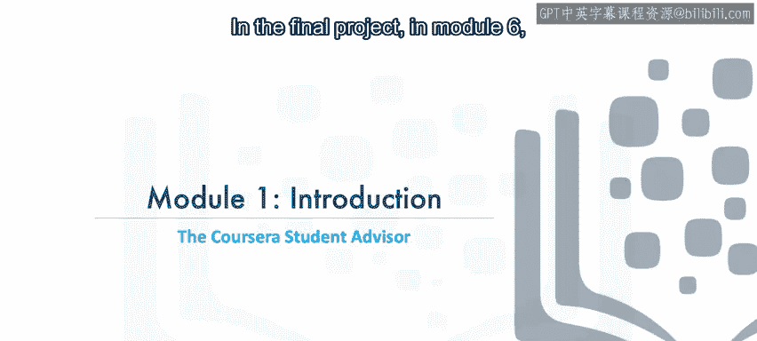

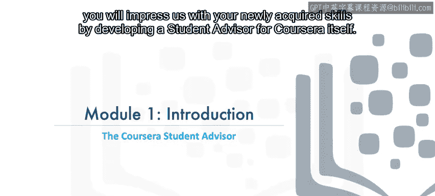

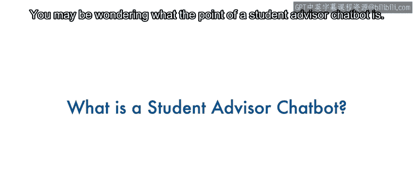

你可能会好奇学生顾问聊天机器人有什么用处。像Coursera这样成功的慕课平台会收到大量来自像你一样的在线学习者的支持性问题。学生顾问聊天机器人可以为大多数问题提供答案，同时仍能将更复杂、需要人工干预或特别关注的问题转交给人工客服团队处理。

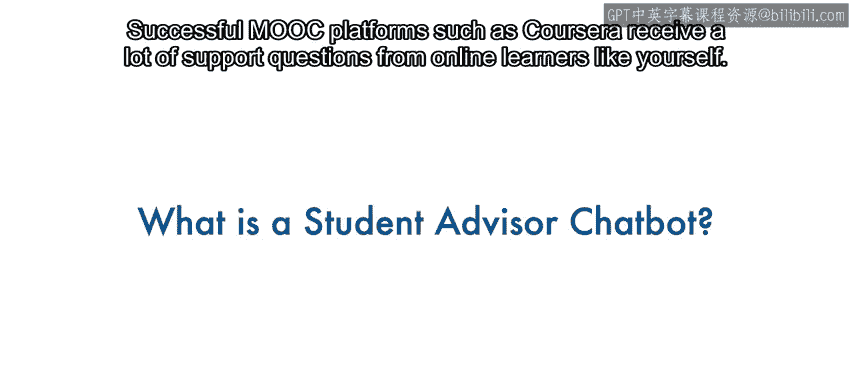

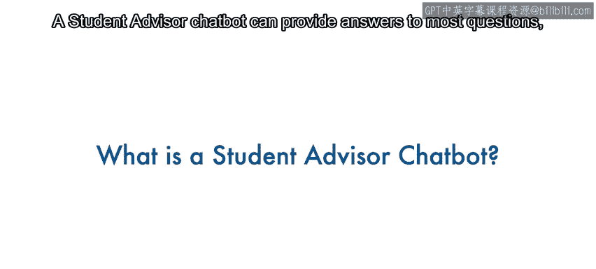

以下是学生可能提出的几类问题示例：
*   关于平台本身及其使用的问题，例如：“旁听课程和付费课程有什么区别？”
*   寻求职业发展建议的问题，例如：“我应该学习哪门课程来了解聊天机器人？”或“我想成为一名数据科学家。”
*   遇到技术问题时寻求帮助。

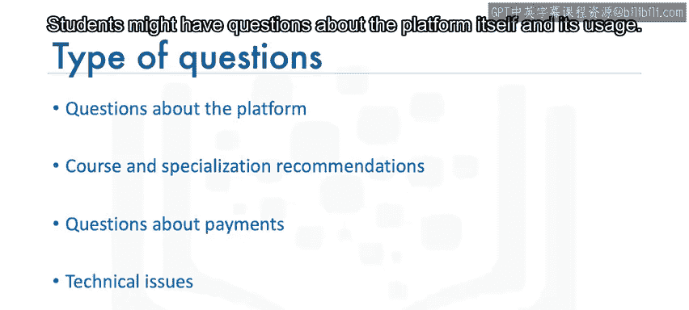

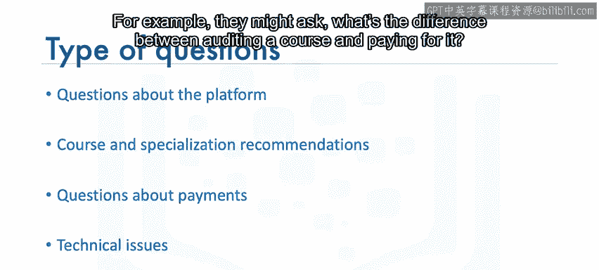

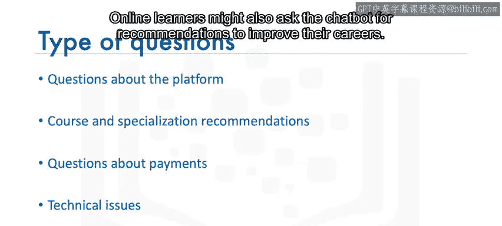

这样的机器人能够以低成本扩展客户服务规模，并为学生提供7x24小时的解答。更重要的是，相同的技能可以应用于为各种企业创建聊天机器人，而不仅仅是像Coursera这样的慕课平台。

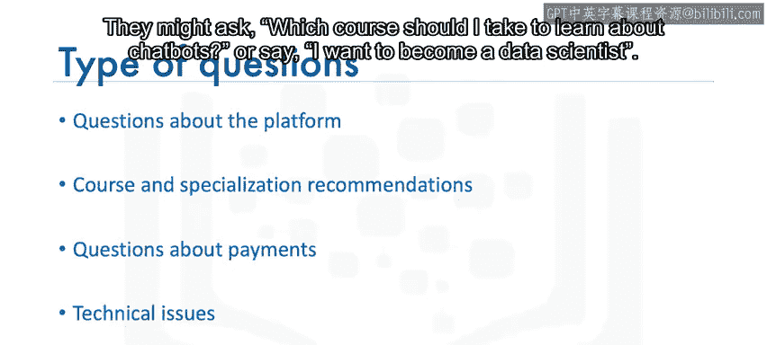

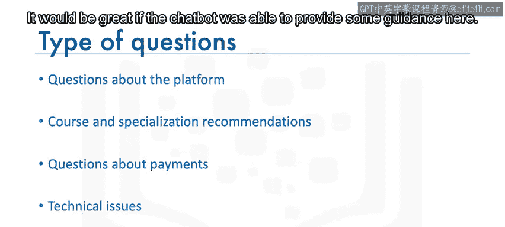

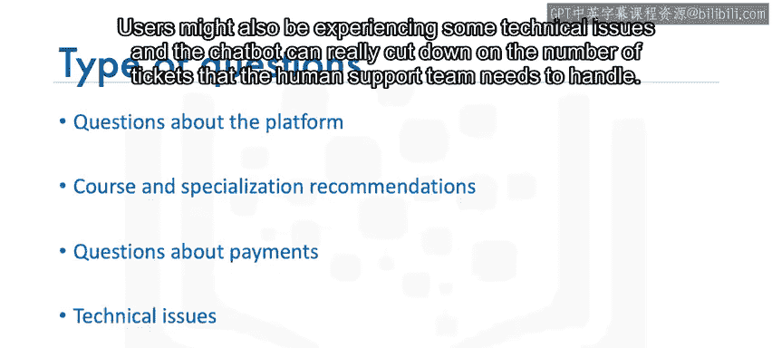

你在本课程中学到的知识，无论你构建何种聊天机器人都会很有用。此外，学习如何集成各种AI服务，即使你最终构建的应用程序根本不包含聊天机器人，也会让你受益匪浅。

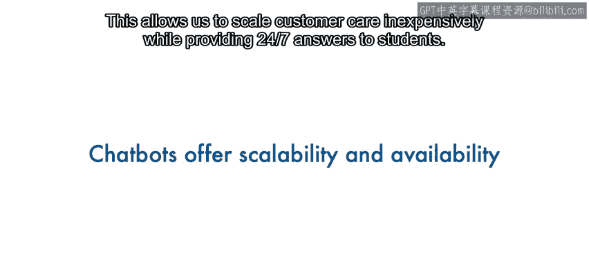

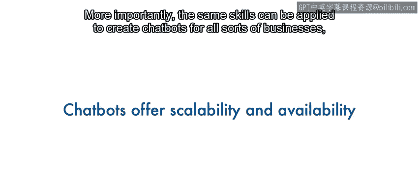

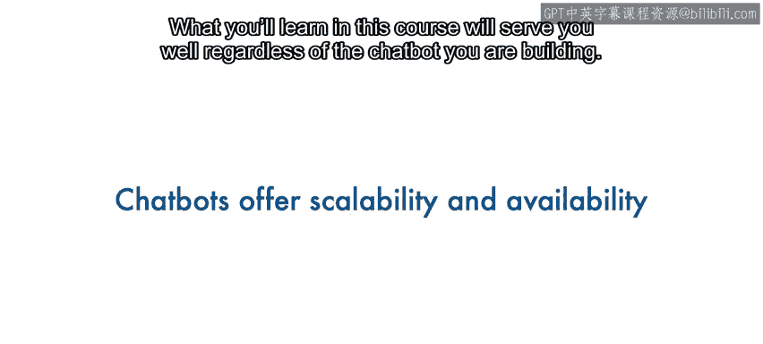

在下一节视频中，我们将讨论在本课程中将运用哪些AI技术。

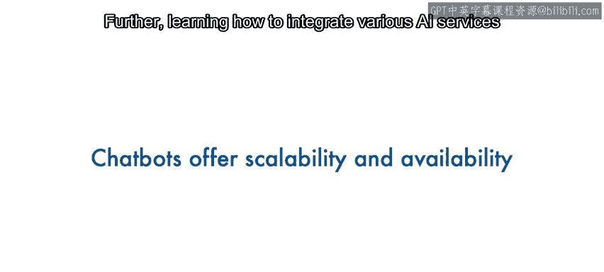

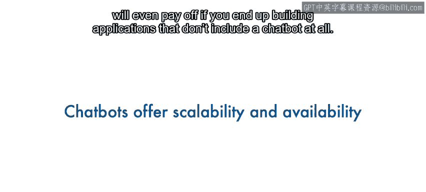

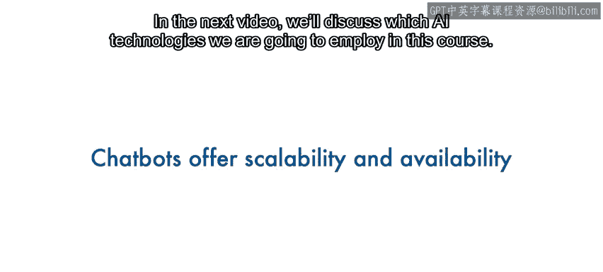

本节课中我们一起学习了本课程的目标和意义：通过集成多种AI服务来构建功能强大的学生顾问聊天机器人，并了解了其实际应用场景和价值。