# 109：使用Watson Assistant创建聊天机器人 🚀

在本节课中，我们将学习如何使用IBM Watson Assistant服务创建一个基础的聊天机器人。我们将从启动服务实例开始，逐步完成定义对话技能、创建意图与实体，并最终构建一个能够处理基本学生咨询的对话流程。

---

## 概述

本模块包含两个实验。第一个实验中，我们将为学生顾问创建一个基础的聊天机器人。第二个实验中，我们将为这个聊天机器人集成Watson Discovery的响应功能。本视频将展示你在第一个实验中需要完成的操作。现在，请专注于理解视频内容，你将在实际实验环节中执行相同的步骤。

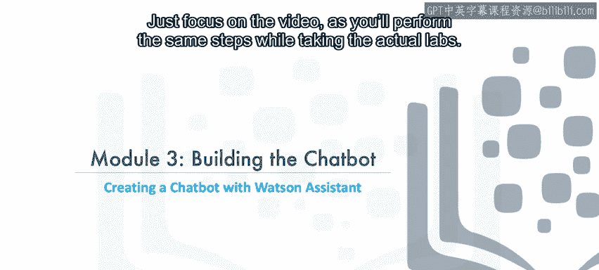

---

## 启动Watson Assistant实例

首先，我们需要启动Watson Assistant服务实例。


---

## 创建助手

在服务中，我们将为学生顾问创建一个新的助手。

我们将它命名为 **Student Advisor Chatbot**。我们会启用预览链接，以便快速与朋友或同事分享机器人进行测试。

---

## 添加对话技能

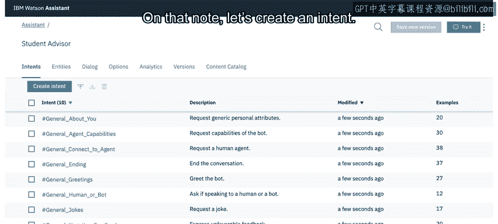

创建好助手后，我们需要为其添加一个对话技能。

我们将这个技能简单地命名为 **Student Advisor**。由于我们的聊天机器人将使用英语，因此需要确保选择英语作为语言。

---

## 选择内容目录

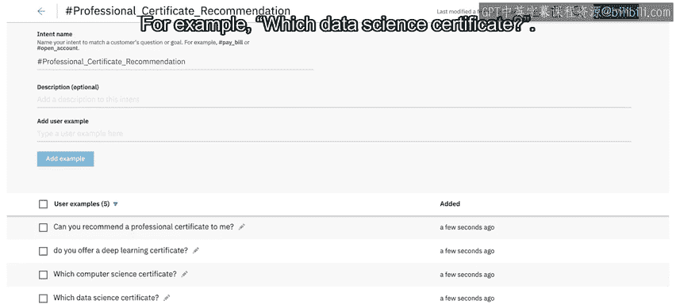

创建对话技能后，我们选择内容目录。

这里会看到一个预定义的意图列表，这些意图适用于大多数聊天机器人和不同行业。我们将添加 **General** 目录到我们的技能中，这样我们的机器人就能处理闲聊对话。

一系列以 **general** 为前缀的意图会被添加到我们的意图列表中。这使我们能轻松区分这些预定义意图和我们即将自定义的意图。

---

## 创建自定义意图

接下来，让我们创建自己的意图。


我们将创建一个名为 **#enrollment_cost** 的意图，并添加一些学生可能提出的关于课程费用的查询示例。

然后，我们再创建一个意图来处理用户关于Coursera专业证书的提问。

同样，我们需要添加一些用户可能提出的问题示例，例如：
```
which data Science certificate?
```

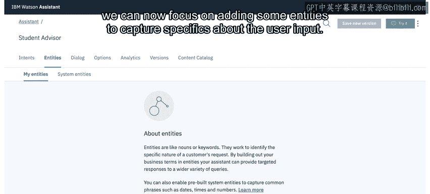

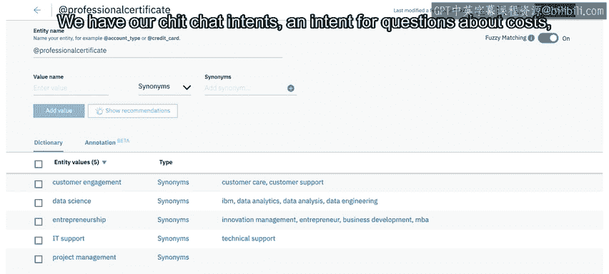


---

## 创建实体

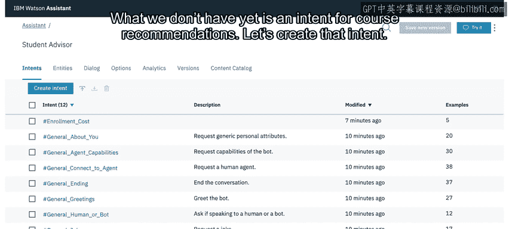

处理完意图后，我们现在可以专注于添加一些实体，以捕获用户输入中的具体信息。

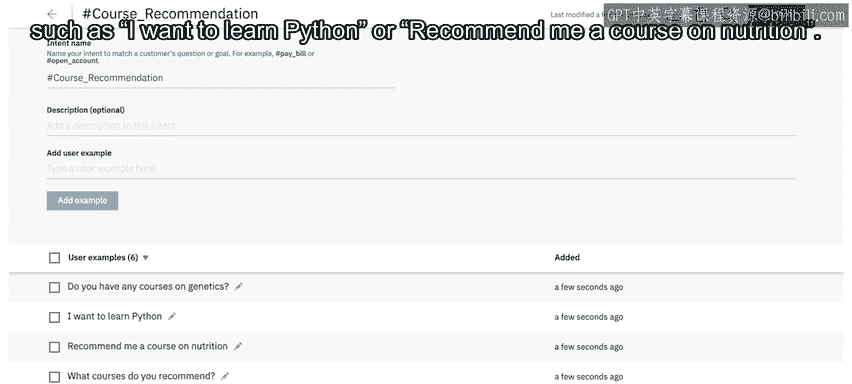

我们将创建一个名为 **@professional_certificate** 的实体。毕竟，可用的专业证书数量有限，我们可以通过实体来识别它们。

我们将为每个专业证书添加一个值到实体中，同时添加一些同义词。例如，`data analysis` 和 `data engineering` 也应被检测为数据科学证书的查询示例。

顺便一提，你现在观看的这个视频课程，正是即将上线的新AI专业证书的一部分。请务必查看。

---

## 创建课程推荐意图

目前，我们有了闲聊意图、关于费用的意图、关于专业证书的意图，以及一个用于区分不同证书的实体。


但我们还缺少一个用于课程推荐的意图。让我们来创建它。

我们将这个意图命名为 **#course_recommendation**，并添加一些示例，例如：
```
I want to learn Python.
```
或
```
recommend me a course on nutrition.
```


---

## 构建对话流程

现在我们已经完成了基础的意图和实体设置，是时候创建对话流程了。

系统会默认为我们创建 **Welcome** 和 **Anything else** 节点。

我们将编辑 **Welcome** 节点来优化聊天机器人的开场白。在响应中，我们将添加：
```
Hello, I'm a student advisor chatbot. I can help you with your questions about our site and give you course recommendations.
```

接下来，我们需要处理一些基本的闲聊互动。为了让对话机器人结构清晰，我们将专门为闲聊节点添加一个文件夹。这个文件夹是一个容器，有助于我们保持组织性，因此我们无需为其指定条件。

以下是我们要添加到文件夹中的节点：

*   **问候节点**：我们首先添加一个处理问候的节点，其条件使用我们的 **#general_greetings** 意图。
*   **感谢节点**：我们重复此过程，添加另一个子节点来处理用户的感谢。这个节点的条件将是 **#general_positive_feedback** 意图，并提供一些典型的响应，每次由聊天机器人随机选择，例如 `You're very welcome.` 或 `No problem.`。
*   **道别节点**：最后，我们将第三个子节点添加到闲聊文件夹中。这个节点将处理道别，条件是 **#general_ending** 意图，响应将是一系列道别语变体，例如 `See you!` 或 `Have a great day.`。

现在，聊天机器人可以问候用户、处理基本闲聊，并且得益于 **Anything else** 节点，当它无法理解用户时，可以通知用户。虽然功能尚不完善，但我们的聊天机器人已初具雏形。

---

## 添加特定领域节点

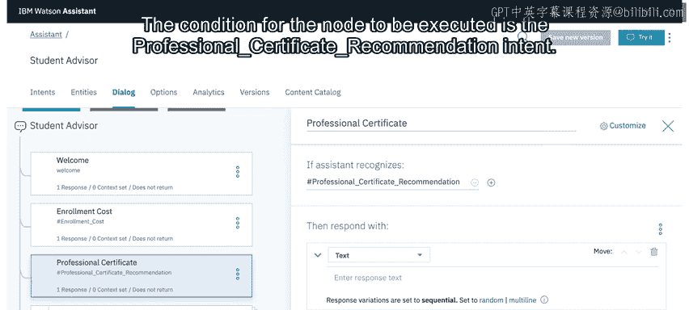

折叠闲聊文件夹后，我们将能够选择 **Welcome** 节点并在其下方添加节点。

以下是我们要添加的特定领域节点：

*   **注册费用节点**：这个节点将处理注册费用查询，因此其条件是 **#enrollment_cost** 意图，并在其响应中提供适当的解释。
*   **专业证书节点**：接下来，我们选择刚刚创建的 **Enrollment Cost** 节点，在其下方创建另一个节点。这个节点将处理专业证书的推荐和请求。节点执行的条件是 **#professional_certificate_recommendation** 意图。


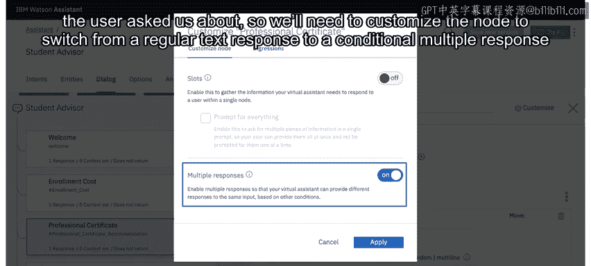

响应将取决于用户询问的专业证书类型。因此，我们需要将节点从常规文本响应自定义为条件多响应。

启用多响应后，我们将能够为每个可用的专业证书实体值提供特定的响应。


最后，我们将设置一个条件为 **true** 的响应，它将作为我们的后备情况。这个响应将提供一个指向Coursera网站上列出所有专业证书页面的链接。

*   **课程推荐节点**：我们将为第三个也是最后一个特定领域节点（即我们的课程节点）重复此过程。对于这个节点，我们将条件设置为 **#course_recommendation** 意图，并暂时将响应留空。实际上，Coursera目录中的课程太多，无法为每个课程硬编码响应。相反，我们将在本模块后面的实验4中，通过利用Discovery以编程方式访问相关课程列表。

---

## 测试与总结

作为快速完整性测试，我们可以启动“试用”面板，验证聊天机器人是否能正确响应示例查询，例如：
```
Can you recommend a professional certificate?
```

现在轮到你了。在下一个实验中，你将亲自重复这些步骤。到实验结束时，你将拥有一个与本视频中看到的相同的基础聊天机器人。祝你好运。

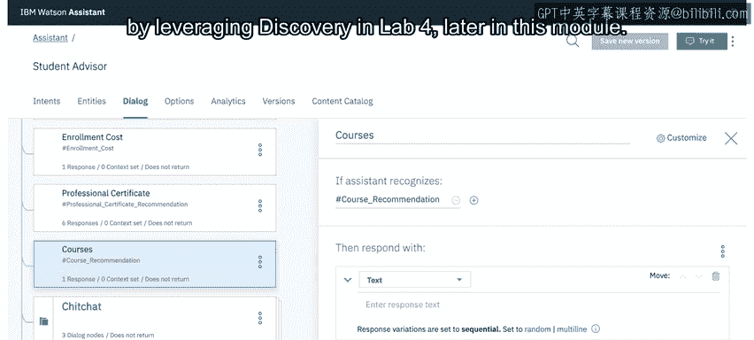
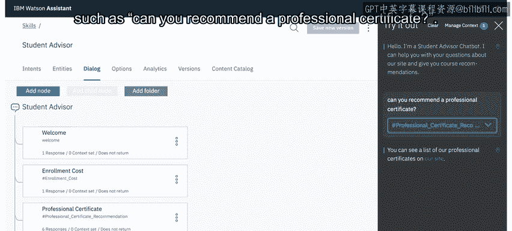
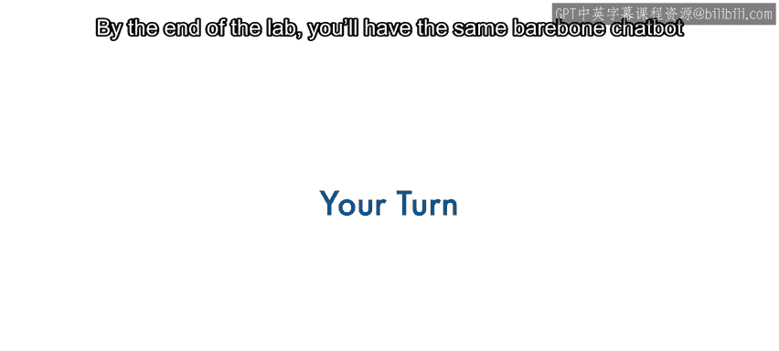

---


## 总结


本节课中，我们一起学习了使用Watson Assistant创建聊天机器人的基础流程。我们从启动服务、创建助手和对话技能开始，然后定义了处理不同用户目标的意图（如询问费用、证书推荐和课程推荐）以及用于识别具体信息的实体。最后，我们构建了包含欢迎语、闲聊处理和特定领域响应的对话树。虽然当前机器人功能尚简，但它已具备了核心的对话框架，为后续集成更强大的功能（如Watson Discovery）奠定了基础。