# 111：为AI助手集成Watson语音服务 🎤

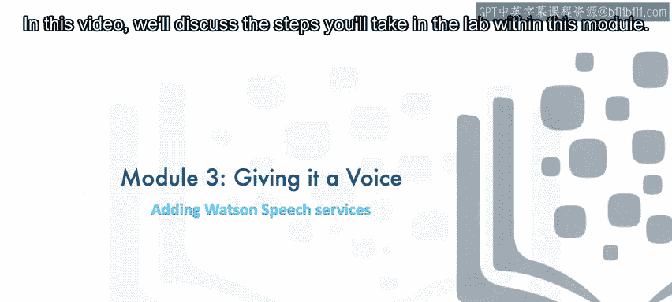

在本节课中，我们将学习如何将IBM Watson的语音服务集成到您已创建的AI助手中。您将了解如何通过语音与助手进行交互，包括将用户的语音输入转换为文本，以及将助手的文本回复合成为语音输出。本节主要聚焦于理解核心概念，具体的实践操作将在后续的实验环节进行。

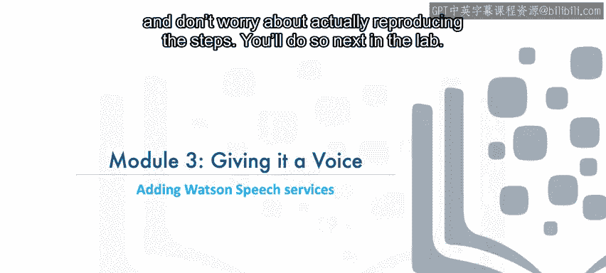

## 实验目标与架构概述

实验5的目标是帮助您将Watson语音服务与您创建的助手集成。其整体架构非常简单。

用户通过音频提供输入，Watson语音转文本服务会将用户的录音转录成文本。随后，这段文本被传递给助手以生成Watson的回复。最后，助手的文本回复通过文本转语音服务合成为音频。

## 核心流程详解

接下来，我们详细拆解实现语音交互的各个步骤。

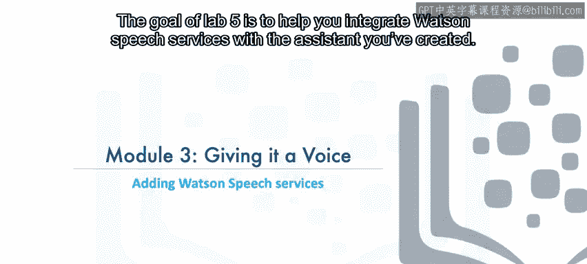

### 1. 获取用户语音输入

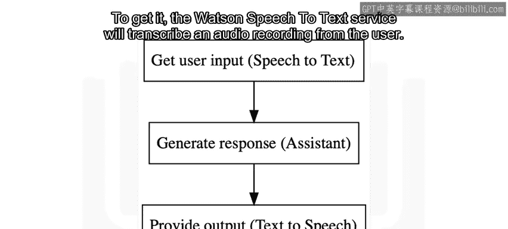

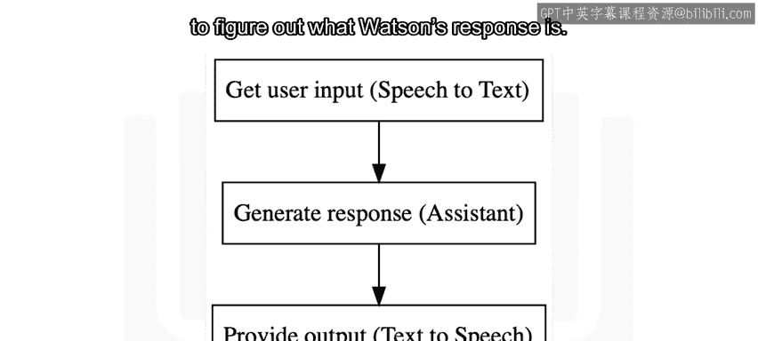

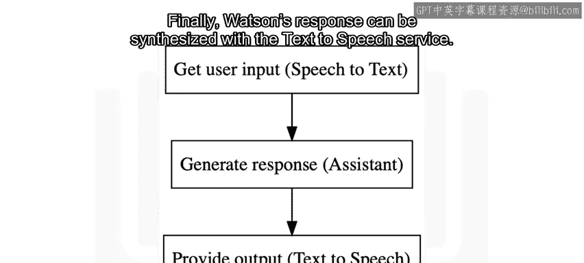

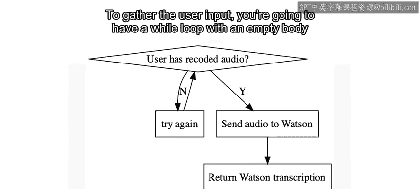

程序将运行一个`while`循环，其循环体为空（使用`pass`语句）。这个循环会持续运行，直到用户录制了一段音频并将其保存在当前工作目录中。

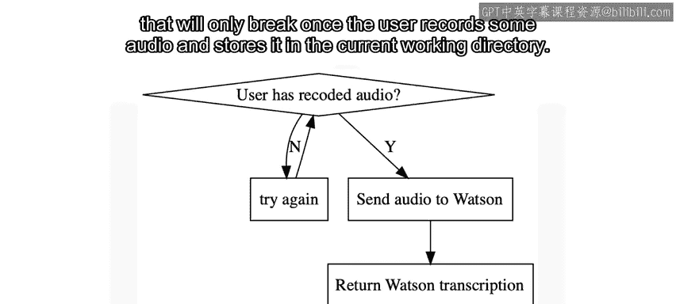

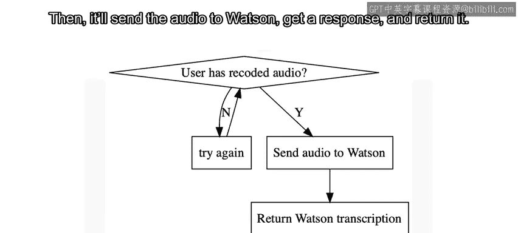

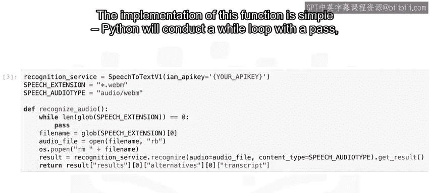

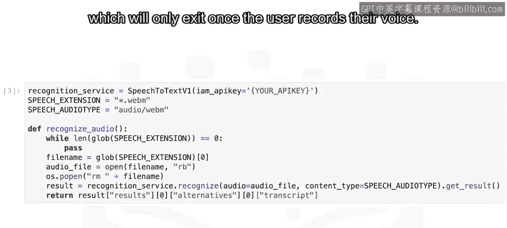

```python
while 条件未满足:
    pass
```

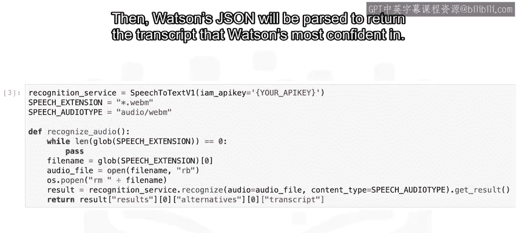

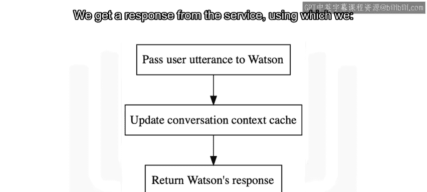

### 2. 调用语音转文本服务

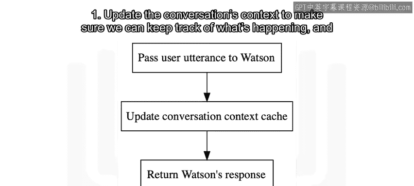

一旦检测到音频文件，程序会将其发送给Watson语音转文本服务。服务会返回一个JSON响应，我们需要从中解析出Watson置信度最高的文本转录结果。

### 3. 调用助手服务并管理上下文

获得的文本随后被传递给Watson助手服务。我们从服务获得响应后，需要做两件事：
1.  更新对话的上下文，以确保能跟踪对话的进展。
2.  获取给用户的文本回复。

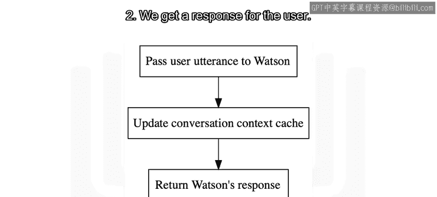

当前的上下文被存储为一个全局变量，它始终保存最新的对话状态。每次用户发送消息并获得响应后，都会从Watson的JSON响应中更新这个上下文。

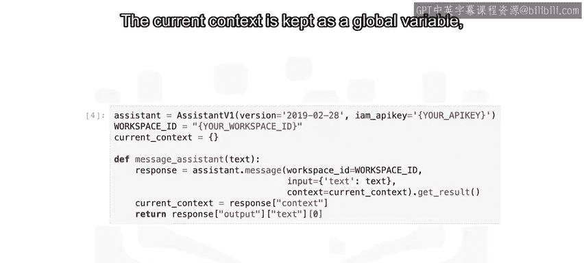

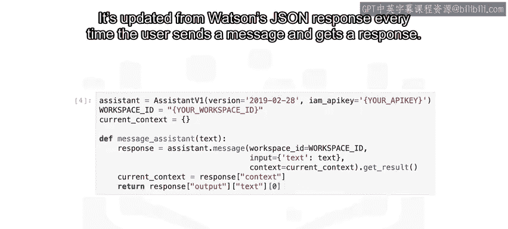

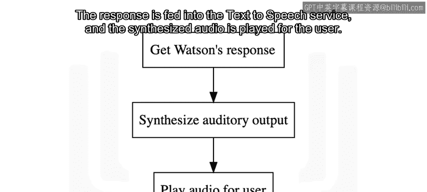

### 4. 合成并播放语音回复

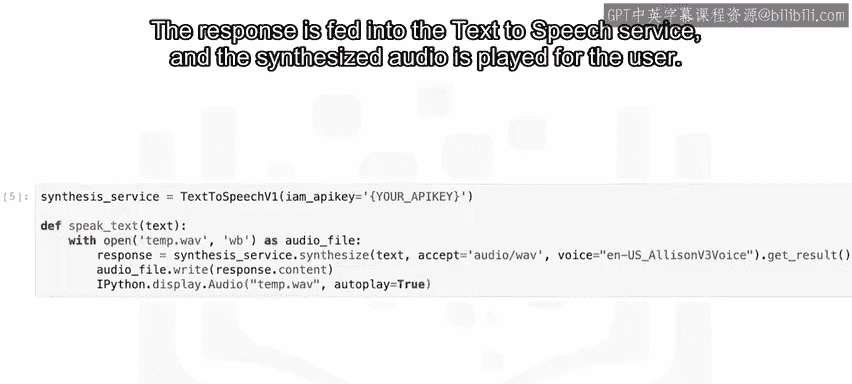

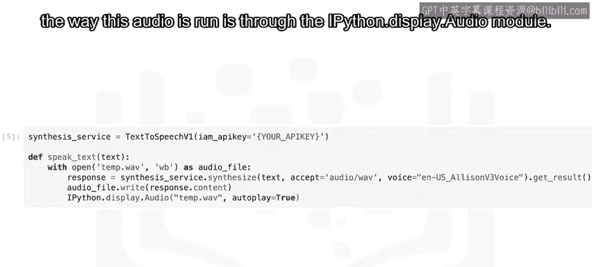

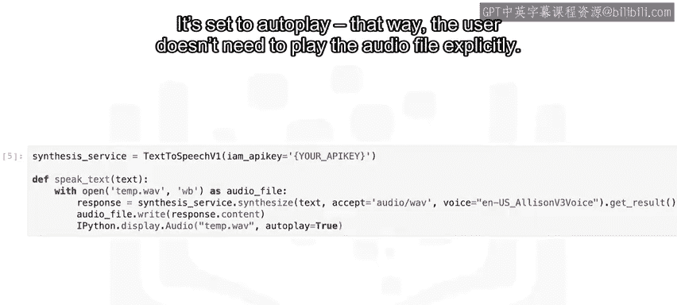

助手的文本回复被送入Watson文本转语音服务，合成为音频。由于代码运行在Jupyter Notebook环境中，音频通过`IPython.display.Audio`模块播放，并设置为自动播放，这样用户就无需手动点击播放按钮。

## 主循环与用户操作

最后，您将运行主循环。这个主循环会等待用户录制音频，然后执行获取转录文本、传递给助手、记录上下文、将回复转为语音并最终播放Watson回复的完整流程。


在Jupyter Lab中录制语音，您需要：
1.  点击屏幕左侧的调色板选项卡。
2.  选择“录制音频”。
3.  弹出的新窗口会显示一个麦克风图标，点击它开始录音。
4.  完成后，点击停止按钮。

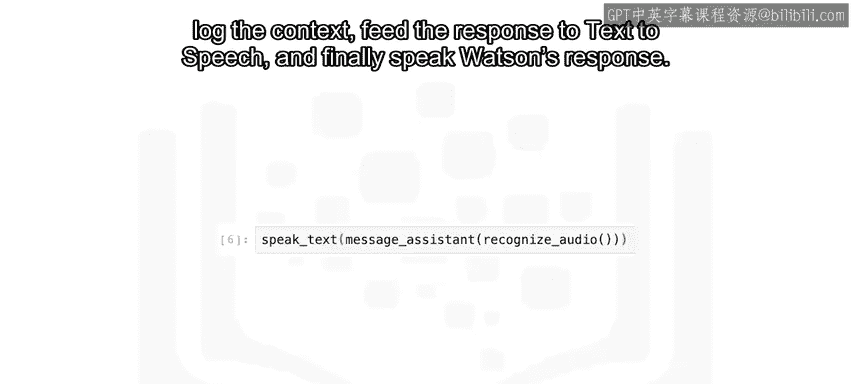

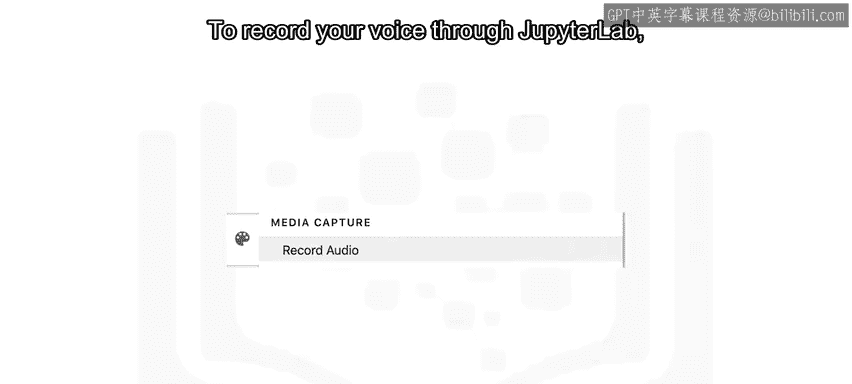


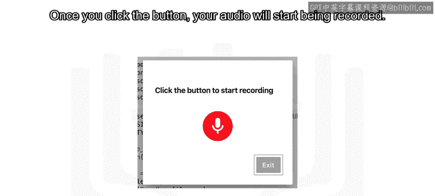

录制完成后，当前工作目录中会生成一个`.webm`格式的音频文件。

## 总结与展望


本节课中，我们一起学习了为AI助手集成Watson语音服务的核心概念与流程。我们了解了如何通过一个循环等待语音输入，如何调用语音转文本和文本转语音服务，以及如何管理对话上下文以实现连贯的交互。


虽然您即将看到的实现代码本身较为简洁，但它背后所代表的“与计算机进行端到端的语音通信”是一个极其复杂的领域。现在，是时候开始动手实践了。