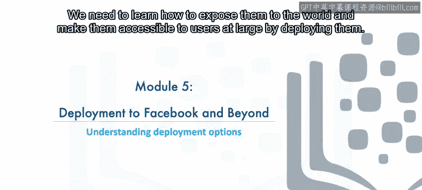
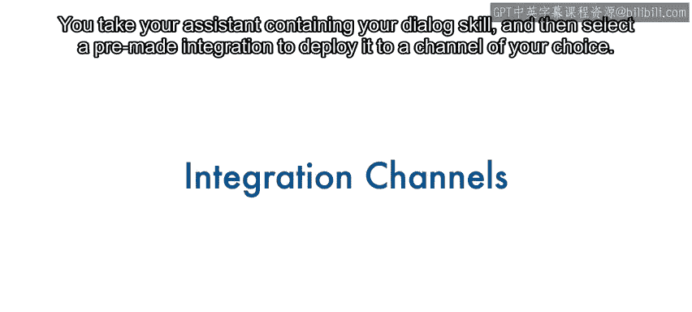
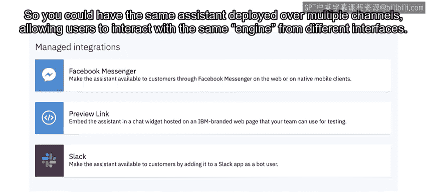
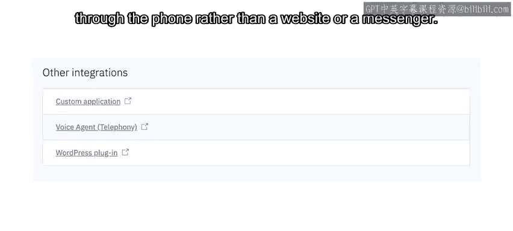
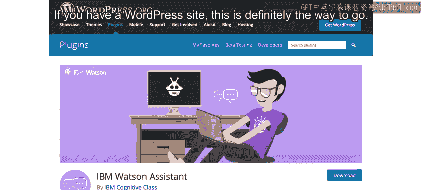
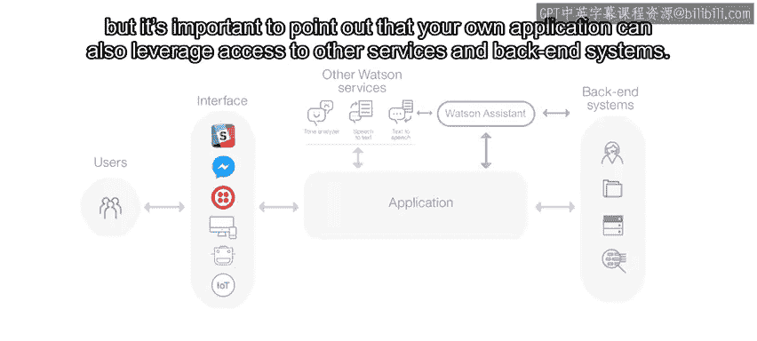
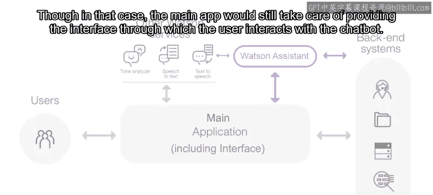
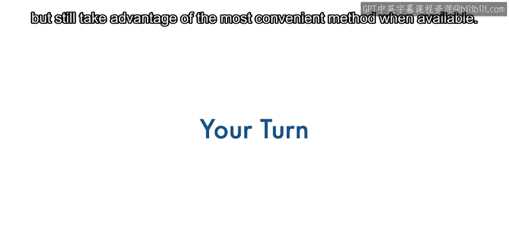

# 112：了解部署选项 🚀

在本节课中，我们将学习如何将构建好的Watson Assistant聊天机器人部署到不同的渠道和平台，使其能够被最终用户访问和使用。我们将探讨多种部署方法，从简单的预置集成到更灵活的自定义代理应用方案。

---

## 概述

通过前面的学习，我们已经掌握了如何集成不同服务来构建由AI驱动的聊天机器人。无论你构建的是聊天机器人还是更通用的应用程序，这些原则都适用。现在，我们需要讨论如何将这些成果部署出去。将聊天机器人锁定在自己的账户中是没有意义的，我们必须学习如何将其暴露给外界，让广大用户能够访问。

## 部署选项概览

Watson Assistant提供了多种方式将你的聊天机器人部署到用户面前。以下是几种主要的途径。

### 1. 预置集成渠道

集成是部署Watson Assistant聊天机器人最简单的方法之一。你只需选择包含对话技能的助手，然后选择一个预制的集成方案，即可将其部署到你选择的渠道。

在本课程中，我们已经见过一种预置集成——预览链接。除此之外，还有其他几种可用的集成渠道，包括：

*   **Facebook Messenger**
*   **Slack**
*   **Intercom**（仅限Plus和Premium用户使用，因此在Watson Assistant的免费实例中看不到此选项）

这些集成极大地简化了将Watson Assistant连接到Facebook Messenger和Slack等界面的过程。重要的是，要将Watson Assistant视为对话引擎，而不是界面本身。用户可以在Facebook Messenger中输入消息，该输入会被发送给Watson Assistant，后者提供响应并发送回来，最终由Messenger显示给用户。因此，你可以将同一个助手部署到多个渠道，允许用户从不同的界面与同一个引擎交互。

### 2. 语音代理与WordPress插件

除了托管的集成渠道，我们还有更多部署助手的选择。

上一模块我们已经讨论过**语音代理**。这种部署方式使你的客户可以通过电话与你的聊天机器人交谈，而不是通过网站或即时通讯工具。

**WordPress**是另一个流行的选择，这要归功于我们功能齐全的插件。将聊天机器人部署到WordPress网站非常简单：一键安装插件，再一键激活，然后复制你的Watson Assistant凭证即可完成。你的WordPress网站上就会弹出一个漂亮的聊天框。这可以说是目前将Watson Assistant聊天机器人部署到网站的最简单方法。该插件也提供了丰富的选项，因此你几乎可以自定义聊天框界面的所有方面，用户正是通过这个界面与聊天机器人交互。如果你拥有WordPress网站，这绝对是最佳选择。

### 3. 自定义代理应用方法

那么，如果你想将聊天机器人部署到一个没有现成托管集成或插件的界面或即时通讯工具上，该怎么办呢？从概念上讲，这相当简单。Watson Assistant通过API提供服务。

因此，你只需要一个充当中间人的**代理应用程序**。这个应用程序将从界面（例如某个消息应用）收集输入，并通过API调用将其发送给Watson Assistant。一旦获得响应，代理应用会将其发送回界面，显示给用户。

这种方法甚至可以用于那些已有集成渠道（如Facebook和Slack），只是使用预置集成更加方便。然而，了解如何自己构建代理应用非常重要，这能确保你始终可以将Watson Assistant集成到你偏好的任何渠道。

到目前为止，你已经知道Watson Assistant可以直接从对话节点调用其他服务。但同样重要的是要指出，你自己的应用程序也可以利用对其他服务和后端系统的访问权限。

这可以为你提供极大的灵活性。在某些情况下，界面和你的应用程序之间可能没有区别，因为你只是将聊天机器人添加到自己的Web或移动应用中，而不是将其部署到第三方渠道。对于复杂的场景，也可以让你的应用程序与一个代理应用程序通信，以保持职责分离。这样，你的代理应用只专注于与Watson Assistant通信，而主应用程序则专注于为应用用户提供的实际功能。不过，在这种情况下，主应用程序仍然需要负责提供用户与聊天机器人交互的界面。

本模块的实验将向你展示如何使用托管集成，以及如何采用代理应用方法进行部署。

通过这种方式，你将能够将聊天机器人部署到任何渠道，同时在可用时仍能利用最便捷的方法。

---

## 总结

在本节课中，我们一起学习了Watson Assistant聊天机器人的多种部署选项。我们了解了便捷的预置集成渠道（如Facebook Messenger、Slack）、针对特定平台的解决方案（如WordPress插件），以及最灵活的自定义代理应用方法。掌握这些知识后，你将能够根据项目需求和目标平台，选择最合适的方式将你的AI聊天机器人交付给最终用户，使其真正发挥作用。