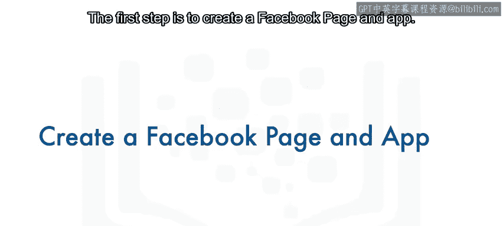
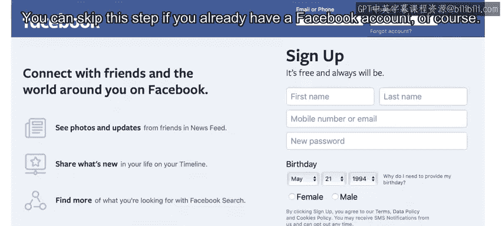
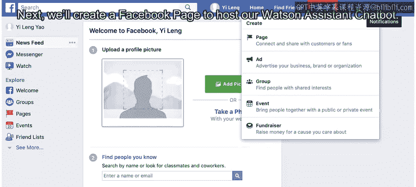
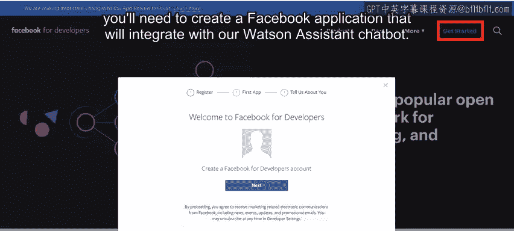
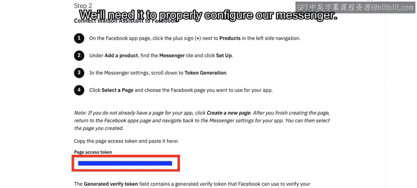
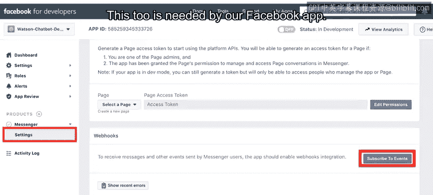
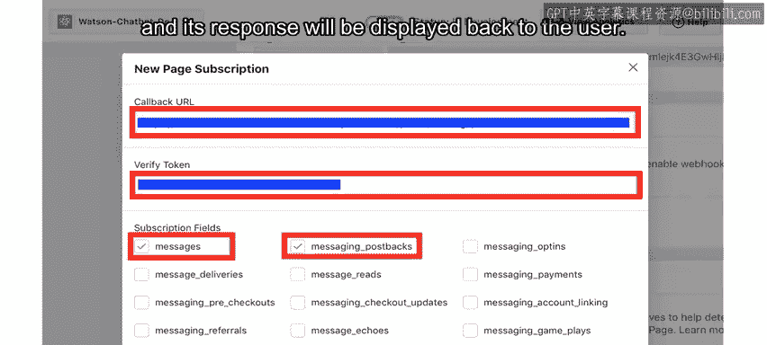
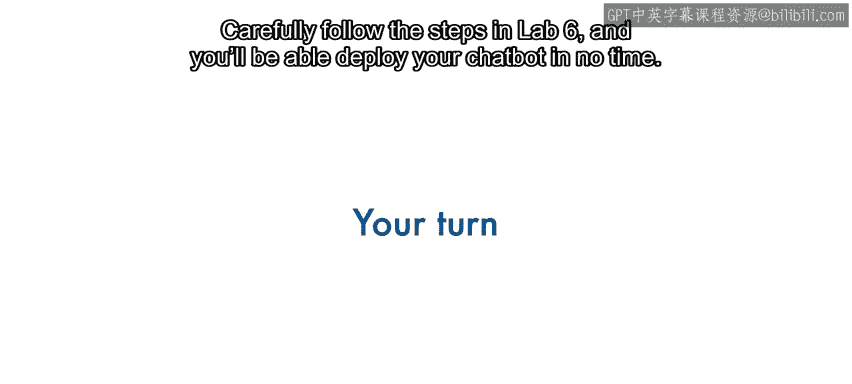

# 113：将聊天机器人部署到Facebook Messenger 🚀

在本节课中，我们将学习如何将之前课程中构建的基础聊天机器人，集成并部署到Facebook Messenger平台。我们将逐步完成从创建Facebook页面和应用，到最终连接Watson Assistant的整个过程。

---

## 创建Facebook页面与应用

上一节我们介绍了课程目标，本节中我们来看看部署的第一步：创建必要的Facebook资源。

首先，你需要注册一个Facebook账户。如果你已拥有账户，可以跳过此步骤。

接下来，你需要创建一个Facebook公共主页，用于承载我们的Watson Assistant聊天机器人。

现在，你已创建了Facebook公共主页，接下来需要创建一个Facebook应用，以便与我们的Watson Assistant聊天机器人进行集成。

为此，你需要一个Facebook开发者账户。拥有账户后，即可创建你的Facebook应用。

系统会要求你选择一个应用场景。对于我们的目的而言，这些场景并不适用，因此可以直接跳过此步骤。

---

## 获取应用凭证

为了使你的Watson聊天机器人能够连接到Facebook应用，你需要获取Facebook应用的**应用密钥**。此密钥可在应用设置的“基本”部分找到。

---

## 连接Watson Assistant与Facebook

现在我们需要将Watson Assistant连接到我们的Facebook公共主页。我们将通过应用的“产品”部分来完成此操作。

具体来说，我们需要为应用添加Messenger功能。

我们需要编辑权限，以允许Messenger访问我们的应用。

然后选择我们想要集成的公共主页。

为你的Facebook公共主页生成**页面访问令牌**。

凭借这些凭证（即**应用密钥**和**页面访问令牌**），我们就可以将Messenger与Watson Assistant集成。

启动你的Watson Assistant实例，并选择“集成”部分。在这里，你需要添加一个集成。

选择“Facebook Messenger”集成。将你的Facebook应用的**应用密钥**凭证粘贴到“应用密钥”框中。

将来自Facebook应用的**页面访问令牌**粘贴到“页面访问令牌”框中。

然后，记下生成的**验证令牌**。我们需要用它来正确配置我们的Messenger。

我们还需要生成一个**回调URL**并记下它。这个URL同样是我们Facebook应用所需要的。

---

## 在Facebook应用中完成配置

回到Facebook，我们Messenger的设置允许我们订阅事件。

在这里，我们将能够粘贴从Watson Assistant获得的**回调URL**和**验证令牌**，并选择“messages”和“messaging_postbacks”作为订阅字段。

这确保了用户消息将被传递给Watson Assistant，并且其回复将显示回给用户。

我们还需要选择要监控此类事件的公共主页。

至此，我们的Watson Assistant聊天机器人就已与Facebook Messenger集成完毕。

---

## 测试与发布

你将能够通过在你的Facebook应用页面上使用Messenger来测试聊天机器人。然而，要做到这一点，你首先需要将自己添加为测试人员。

在本实验提供的材料中，我们为你提供了额外的步骤，以便在你对集成工作方式满意后，将其向公众开放。

现在，轮到你动手实践了。仔细遵循实验6中的步骤，你将能够很快部署你的聊天机器人。

---

## 总结

本节课中，我们一起学习了将Watson Assistant聊天机器人部署到Facebook Messenger的完整流程。我们涵盖了创建Facebook页面与应用、获取关键凭证、在Watson Assistant中配置集成，以及在Facebook开发者后台完成最终设置的核心步骤。通过遵循这些步骤，你可以将AI对话能力扩展到广泛的Messenger用户。