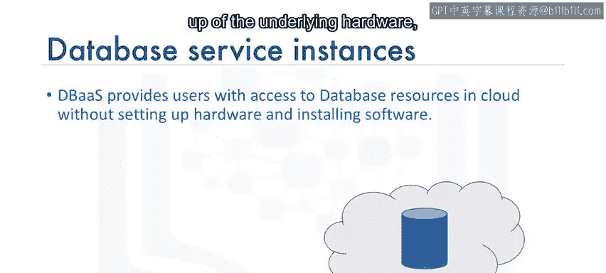
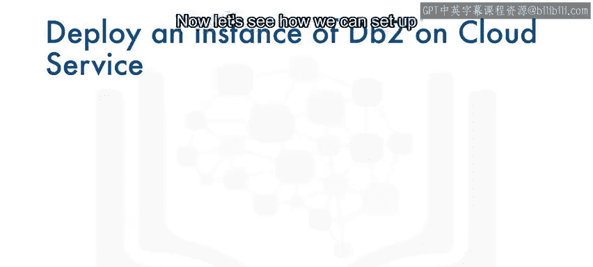
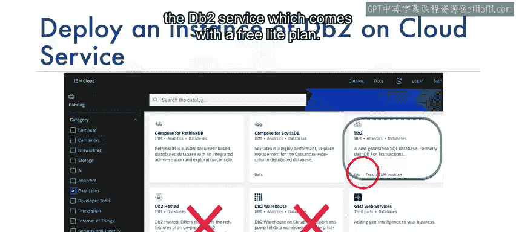
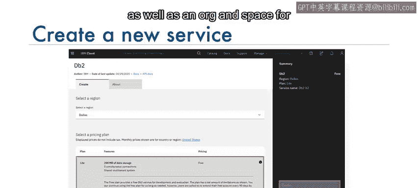
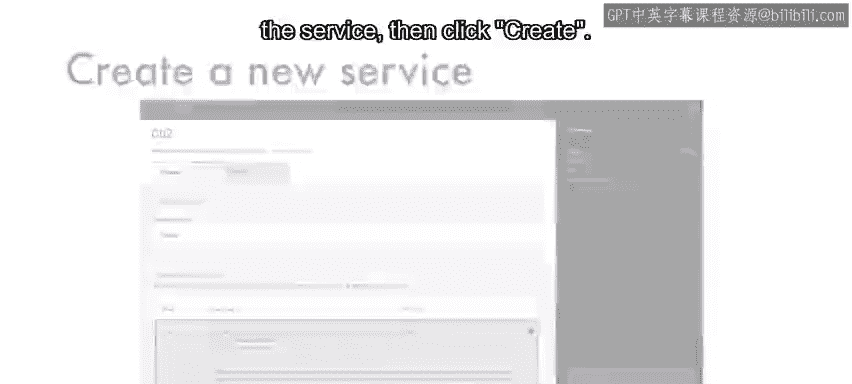
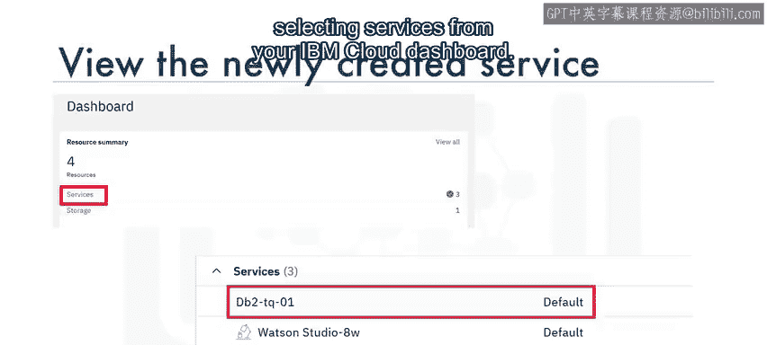
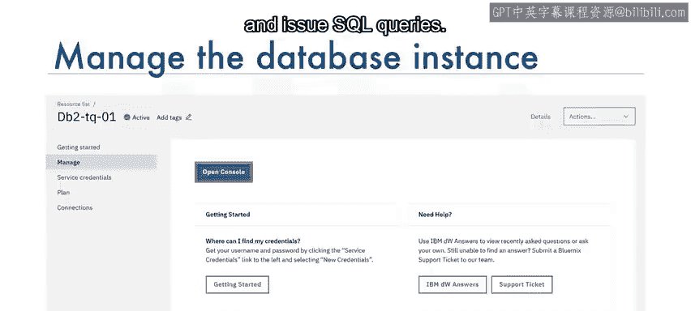
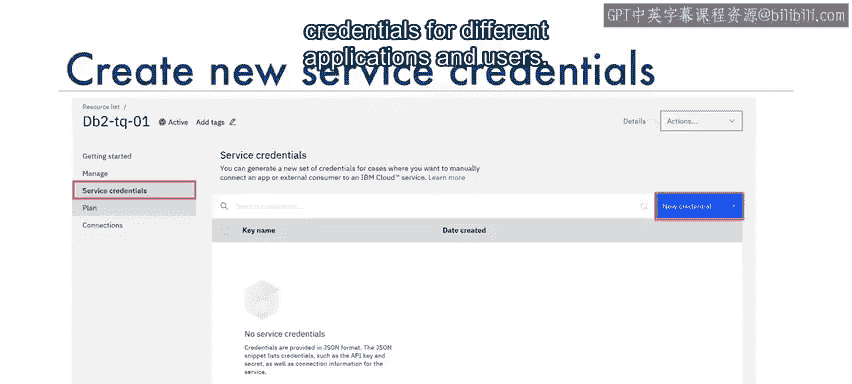
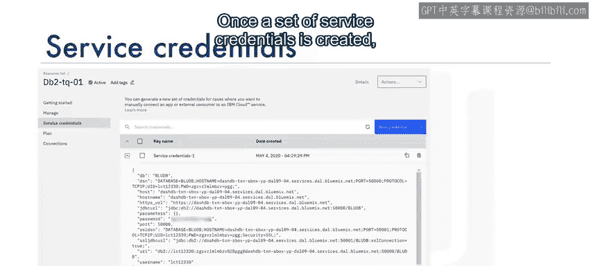
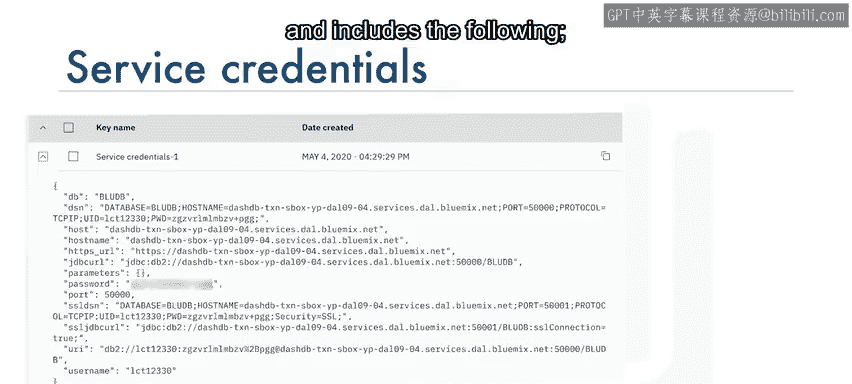

# 115：如何在云上创建数据库实例 🗄️

在本节课中，我们将学习云数据库的核心概念，并演示如何在IBM Cloud上创建一个DB2数据库服务实例，以便为后续的SQL查询学习提供实践环境。

## 概述：什么是云数据库？

要学习SQL，首先需要一个可供练习查询的数据库。一个简便的方法是在云上创建一个数据库实例，并使用它来执行SQL语句。

完成本课后，你将能够：
*   理解与云数据库相关的基本概念。
*   列举几种云数据库。
*   描述数据库服务实例。
*   演示如何在IBM DB2 on Cloud上创建服务实例。

---

## 云数据库基础概念

云数据库是一种通过云平台构建和访问的数据库服务。它具备传统数据库的许多功能，并增加了云计算的灵活性。

使用云数据库的优势包括：
*   **易于使用**：用户几乎可以从任何地方，通过供应商的API、Web界面或自己的应用程序（无论是在云端还是远程）访问云数据库。
*   **可扩展性**：云数据库可以在运行时扩展或收缩其存储和计算能力，以适应不断变化的需求和使用情况，因此组织只需为实际使用的资源付费。
*   **灾难恢复**：在发生自然灾害、设备故障或停电时，数据通过在地理上分布区域的云端远程服务器上的备份得以保持安全。

以下是云端关系型数据库的一些例子：
*   IBM DB2 on Cloud
*   IBM Cloud上的Databases for PostgreSQL
*   Oracle Database Cloud Service
*   Microsoft Azure SQL Database
*   Amazon Relational Database Service (RDS)

这些云数据库可以在云端运行，既可以作为由你管理的虚拟机，也可以根据供应商的不同，作为托管服务提供。数据库服务根据服务计划的不同，可以是单租户或多租户的。

---

## 数据库服务实例

要在云中运行数据库，你必须首先在你选择的云平台上配置一个数据库服务实例。

数据库即服务（DBaaS）实例为用户提供了对云端数据库资源的访问，而无需设置底层硬件、安装数据库软件和管理数据库。

数据库服务实例将在相关的表中保存你的数据。一旦数据加载到数据库实例中，你就可以使用Web界面或应用程序中的API连接到该实例。

一旦连接成功，你的应用程序就可以向数据库实例发送SQL查询。数据库实例随后将SQL语句解析为对数据库中数据和对象的操作。

任何检索到的数据都将作为结果集返回给应用程序。

---

## 实践：创建IBM DB2 on Cloud实例

上一节我们介绍了云数据库服务实例的概念，本节中我们来看看如何在IBM Cloud上实际创建一个DB2数据库实例。

IBM DB2 on Cloud是在云端为你提供的SQL数据库。你可以像使用任何数据库软件一样使用DB2 on Cloud，但无需承担高昂的硬件设置或软件安装和维护开销。

以下是创建DB2服务实例的步骤：

1.  **导航至IBM Cloud目录并选择DB2服务**。
    *   注意：DB2服务有多个变体，包括DB2 Hosted和DB2 Warehouse。出于我们的目的，我们将选择附带免费Lite计划的DB2服务。

2.  **选择Lite计划**。
    *   如果需要更改默认设置，你可以输入服务实例名称、选择部署区域以及服务的组织和空间，然后点击“创建”。

    

3.  **从IBM Cloud仪表板管理实例**。
    *   你可以通过从IBM Cloud仪表板选择“服务”来查看你创建的IBM DB2服务。

    *   在此仪表板中，你可以管理你的数据库实例。例如，你可以点击“打开控制台”按钮来启动数据库实例的Web控制台。该Web控制台允许你创建表、加载数据、浏览表中的数据以及执行SQL查询。

4.  **获取连接凭证**。
    *   为了从你的应用程序访问数据库实例，你将需要服务凭证。首次使用时，你需要创建一组新凭证。你也可以选择为不同的应用程序和用户创建多组凭证。

    *   创建一组服务凭证后，你可以将其视为一个JSON代码片段。凭证包含建立数据库连接所需的详细信息，包括以下内容：
        *   **数据库名称**和**端口号**
        *   **主机名**：这是你的数据库实例所在的云端服务器的名称。
        *   **用户名**和**密码**：这是你连接时将使用的用户ID和密码。
        *   注意：你的用户名默认也是创建表的**模式名**。

    

---

## 总结

本节课中，我们一起学习了云数据库的核心优势与概念，并逐步演示了如何在IBM Cloud上创建并配置一个DB2数据库服务实例。你现在已经知道，云数据库实例（DBaaS）免去了硬件设置和软件管理的麻烦，并可以通过服务凭证从应用程序进行连接。

现在你已了解如何在云上创建数据库实例，下一步就是实际去创建一个。