# 117：创建Discovery集合 🗂️

在本节课中，我们将学习如何创建并使用Watson Discovery集合。我们将从探索一个预置的新闻集合开始，了解其强大的查询功能，然后动手为Coursera的课程内容创建一个自定义集合，为后续构建智能聊天机器人打下基础。

---

## 概述与目标

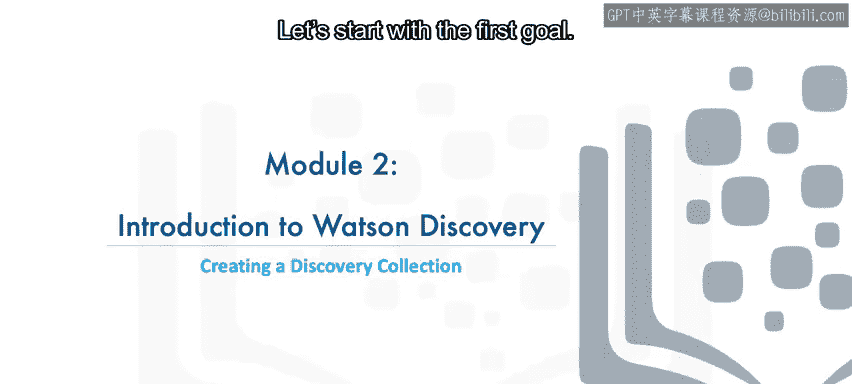

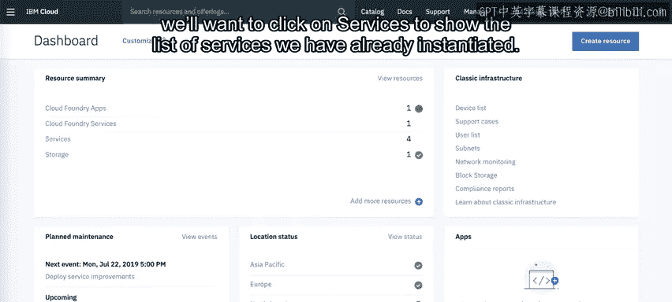

本模块实验的目标是让您熟悉Watson Discovery集合，并创建一个包含Coursera课程内容的专用集合。您可以在观看本视频时专注于理解步骤，实际操作将在实验环节完成。

## 探索预置的新闻集合

上一节我们介绍了本课的目标，本节中我们来看看如何访问和探索Watson Discovery服务。

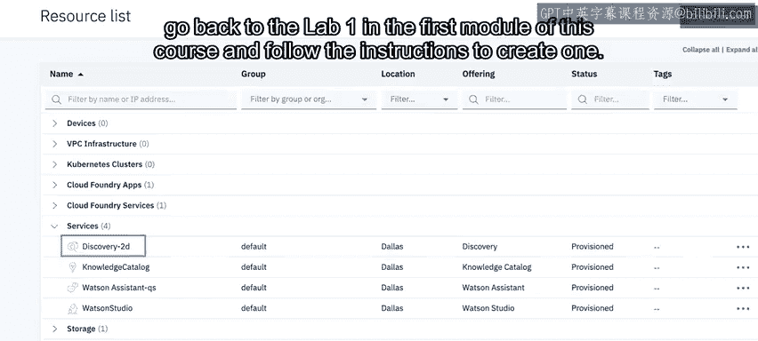

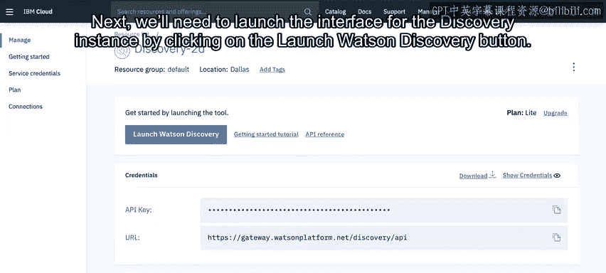

首先，从IBM Cloud仪表板开始。点击“服务”以查看已实例化的服务列表。在列表中找到您的Discovery服务并点击其名称。


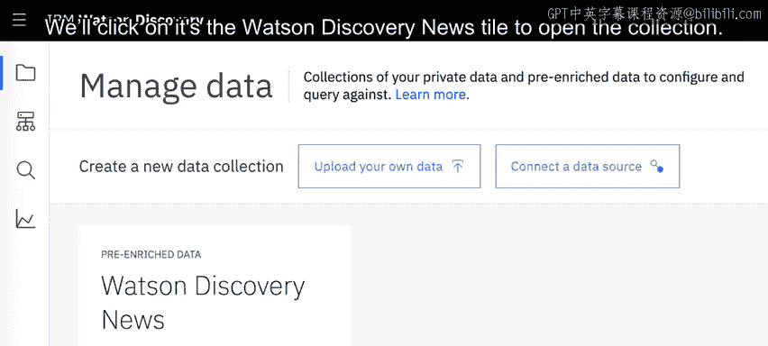

> **注意**：如果您的账户中没有Discovery实例，请返回本课程第一个模块的实验1，按照说明创建一个。

接下来，点击“启动Watson Discovery”按钮，启动Discovery实例的管理界面。


界面会显示一个自动为我们创建的默认新闻集合，以及两个用于从其他来源或本地驱动器数据创建集合的按钮。我们可以先探索这个新闻集合。点击“Watson Discovery News”磁贴以打开该集合。

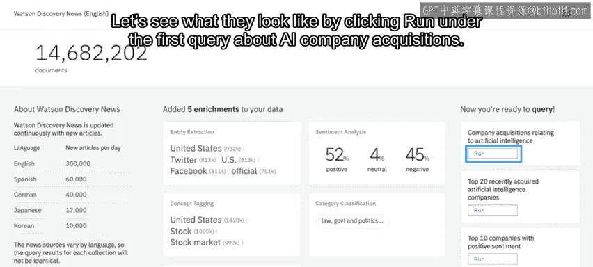


这个集合是自动添加和管理的，它包含了来自多种出版物、多种语言的数百万篇近期新闻文章。例如，我的集合显示仅英文每天就新增30万篇文章。这些文章不仅仅是原始数据，Watson会分析它们并自动添加有用的元数据来分类其中的信息，以便我们能够查询这个庞大的数据集。

事实上，为了让我们快速上手，屏幕右侧提供了一些预构建的查询。让我们点击第一个关于“AI公司收购”的查询下的“运行”按钮，看看结果如何。


在左侧，您会注意到这个查询是通过**Discovery查询语言**定义的。其他选项包括自然语言和方便的可视化模式。`enriched_text.concepts.text:"artificial intelligence"` 是Discovery查询语言的写法，意思是我们要获取所有被Watson识别为与“人工智能”概念相关的文档。

但是，我们不需要所有可能的结果。我们希望将查询过滤到公司收购相关的内容。因此，您会注意到查询在屏幕左下角对文档进行了过滤。这里使用的Discovery查询语言要求：从我们已经选出的所有关于AI的文章中，筛选出包含“收购”行为，特别是收购任何“公司”类型实体的文章。

本质上，我们是在筛选讨论公司收购的AI文章。

在右侧的结果中，您会看到显示了104篇相关匹配文档中的前10篇。对于每篇文章，我们都获得了各种有用的信息，包括标题、URL、文本、Watson用于分类文章的概念和关键词，以及文章的情感是积极、消极还是中性。

请想一想，我们免费获得了多么强大的功能：一个由Watson分类的海量新闻集合，以及智能查询它的能力。如果您是一名记者，这将是一个无比宝贵的工具。

## 创建自定义课程集合

那么，如果您不是记者呢？好消息是，在处理您自己的数据时，您同样可以驾驭这种力量。

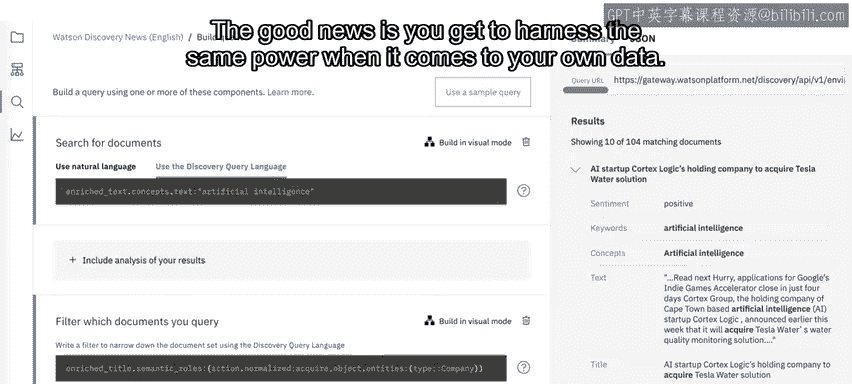


在本课程中，我们将开发一个能够帮助Coursera学生解答问题的聊天机器人。根据经验，许多学生会询问课程推荐。由于Coursera有海量的主题，在聊天机器人中硬编码每个主题是不可行的。因此，我们将转而依靠Discovery来处理此类查询。但首先，我们需要创建一个包含课程数据的集合。让我们看看如何完成这一步。

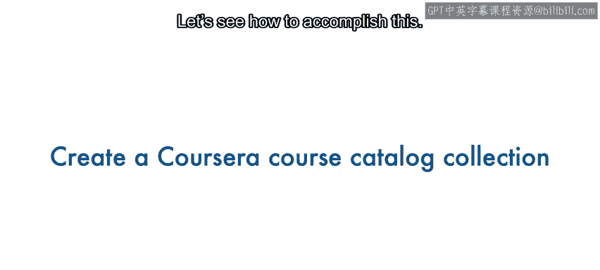


在您Discovery服务的“管理数据”部分，您会看到我们之前讨论过的两个按钮。在本模块的实验中，您将下载一个包含Coursera课程子集的JSON文件。因此，这里我们点击“上传您自己的数据”。

点击后，会弹出一个窗口要求我们输入集合名称。我们将集合命名为“Coursera courses”，由于我们的课程主要是英文，保留默认语言为英语，然后点击“创建”。

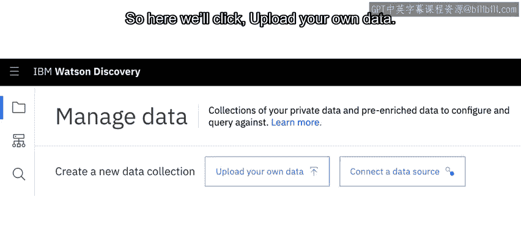
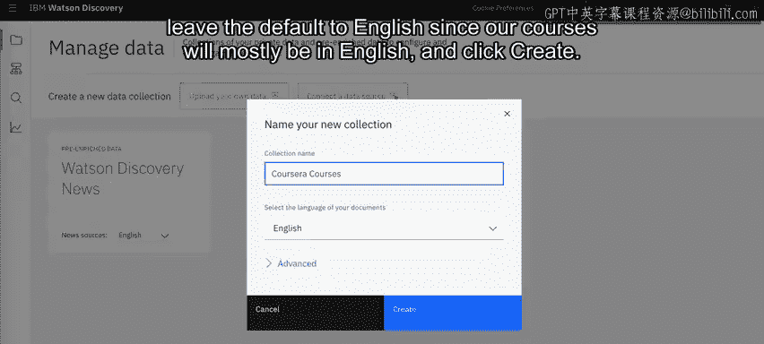


在这里，我们可以点击云图标或拖拽文件来上传到我们的集合中。在实验练习期间，您将下载并解压一个包含500个课程文件的ZIP文件。

每个文件都具有以下JSON结构：
```json
{
  "name": "课程名称",
  "slug": "用于重构课程URL的短标识",
  "description": "课程描述文本"
}
```
最重要的部分是课程名称（`name`）、用于重构课程URL的短标识（`slug`），以及描述（`description`）。描述包含了Watson将用来判断课程内容和与用户查询相关性的文本。

一旦我们点击那个云上传图标，系统将提示选择我们下载的文件。选择您解压ZIP文件的文件夹后，您可以按 `Ctrl+A`（在Mac上是 `Command+A`）来选择文件夹内的所有文件，然后点击“打开”。

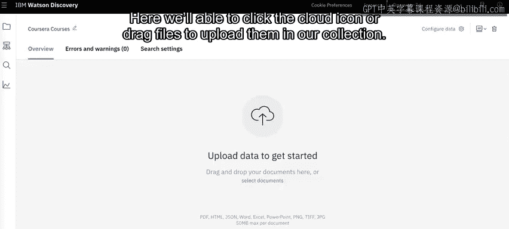

上传过程需要一点时间，但最终您会看到有500个文档已添加到您的集合中。您可能会收到一些关于“id”是受保护键的警告，但由于它不包含对我们课程有用的信息，可以安全地忽略JSON文件中这个特定键未被导入的事实。


您还会注意到，有选项可以为我们的原始数据添加一些**富集**功能。我们通过点击右侧的“添加富集”链接来实现。在这里，我们将从下拉菜单中选择“description”字段，因为描述是我们文档中数据最多的字段。

接下来，点击“添加富集”来丰富这个字段。从出现的弹出窗口中，我们将添加“关键词提取”和“概念标记”。还有许多其他选项可用。出于我们聊天机器人的目的，我们的查询将简单地匹配课程与用户关键词的相关性。

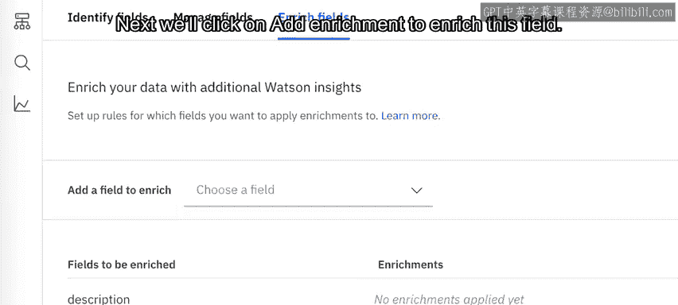

添加完两个富集功能后，点击右上角的“X”关闭弹出窗口。


您会注意到，“description”字段现在拥有了两个富集功能。最后，我们可以点击“将更改应用于集合”按钮。


作为完整性检查，我们可以点击Discovery的“查询”部分（左侧的放大镜图标），然后点击“搜索文档”。在这里，我们可以尝试查询一些内容，例如“Python”，然后点击底部的“运行查询”。我们应该看到一系列相关课程，这确认了我们的集合状态良好，已准备好被查询。

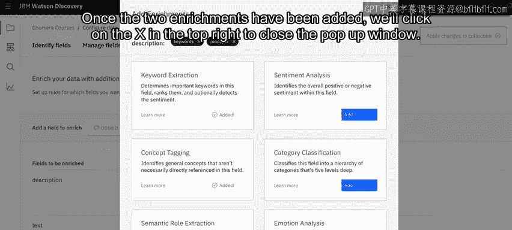

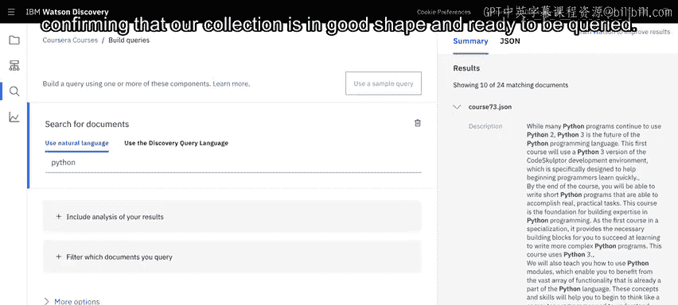

## 总结

在本节课中，我们一起学习了Watson Discovery的核心功能。我们首先探索了强大的预置新闻集合及其查询语言，然后逐步创建了一个包含Coursera课程数据的自定义集合，并为其添加了关键词提取和概念标记等富集功能，使其能够智能地响应用户的课程查询。


现在您已经了解了基本流程，接下来轮到您进行实验2了。

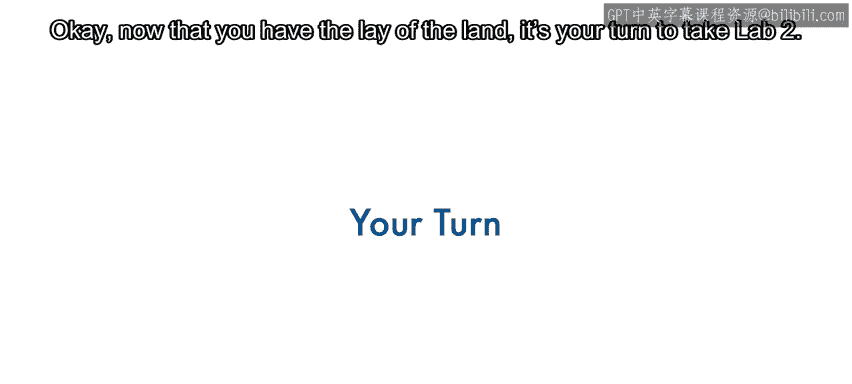

