# 119：向聊天机器人添加Watson Discovery 🧠

在本节课中，我们将学习如何将Watson Discovery服务集成到您的聊天机器人中。我们将通过使用IBM Cloud Functions（无服务器函数）作为桥梁，使Watson Assistant能够查询Discovery服务中的课程数据，从而为机器人提供智能问答能力。

---

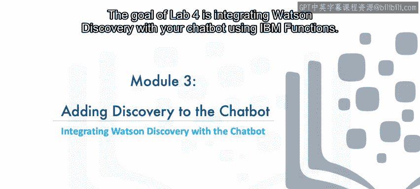

## 概述与准备工作

上一节我们介绍了Watson Discovery的基本概念。本节中，我们来看看如何将其与聊天机器人进行实际集成。

首先，您需要确保拥有一个已配置好的Watson Discovery服务实例。如果尚未创建，请返回本课程第一模块的实验一，按照说明创建一个。

### 获取Discovery服务凭证

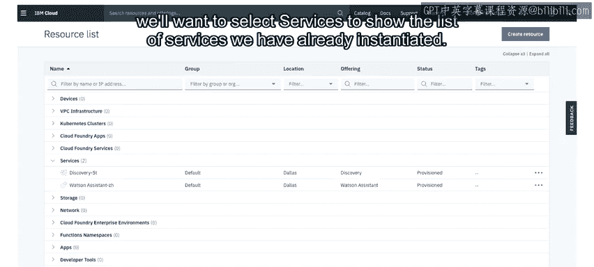

从IBM Cloud仪表板开始操作。

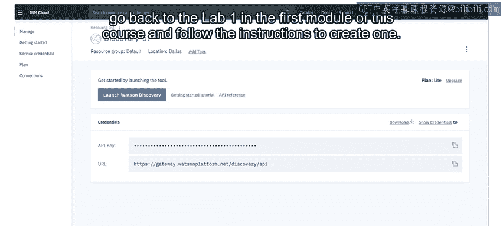

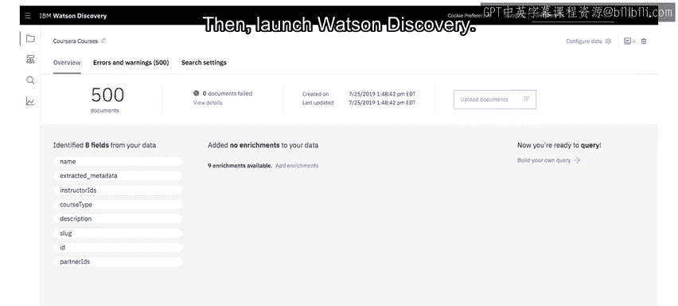

1.  选择“服务”以查看已实例化的服务列表。
2.  在列表中找到您的Discovery服务并选中它。
3.  获取该Discovery实例的API密钥和URL，并记录下来以备后用。
4.  启动Watson Discovery工具。

### 获取课程集合凭证

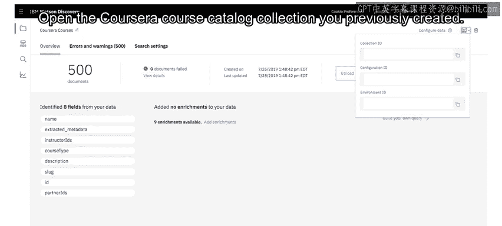

接下来，打开您之前创建的“Coursera Course catalog”集合。

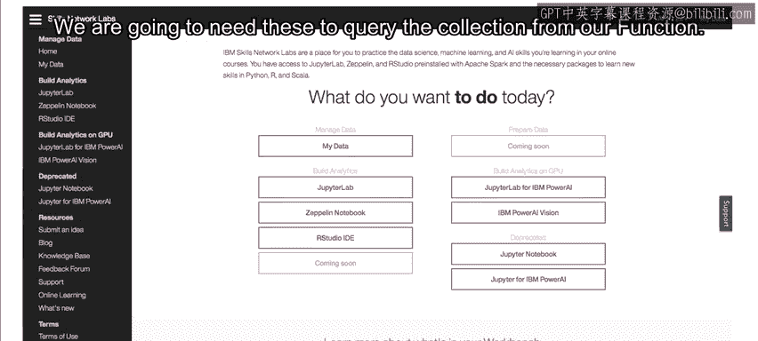

1.  选择“API”选项，为此集合获取一些凭证。
2.  记录下**集合ID**和**环境ID**。我们稍后需要通过函数查询此集合，将需要这些信息。

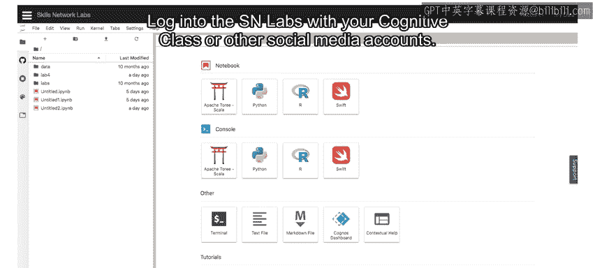

---

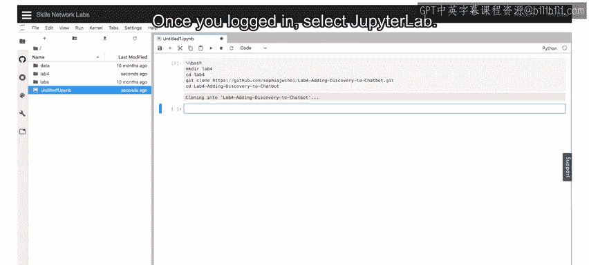

## 配置实验环境

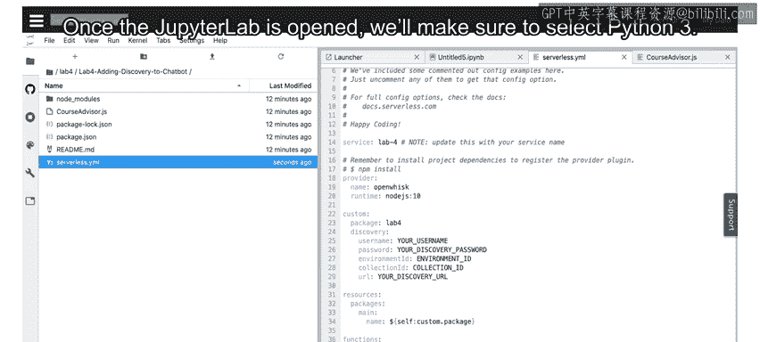

现在，让我们导航到Skills Network实验环境。

1.  使用您的Cognitive Class或其他社交媒体账户登录SN Labs。
2.  登录后，选择启动Jupyter Lab。此过程可能需要几分钟才能完成。
3.  Jupyter Lab启动后，请确保选择“Python 3”内核。

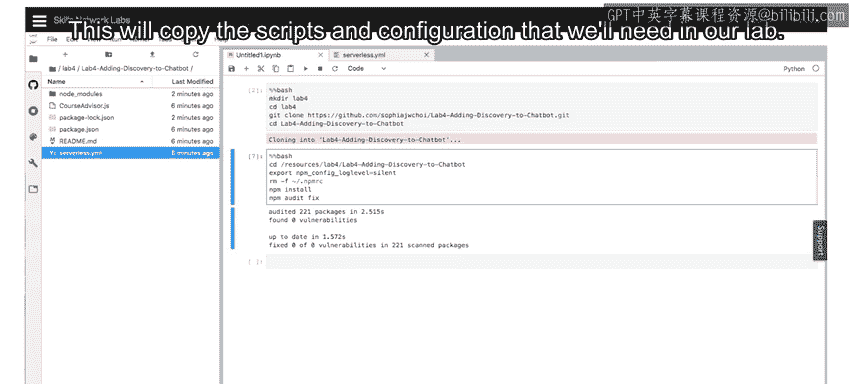

### 设置实验文件

Jupyter Lab笔记本界面如下所示。在第一个单元格中，您将复制实验提供的代码行，然后运行该单元格以执行它。

这将复制我们实验中所需的脚本和配置文件。

此时，您应该在Jupyter Lab环境中看到一个“lab 4”文件夹。此文件夹包含我们无服务器函数的所有代码和配置。该函数将连接到Discovery服务并为我们从集合中检索课程列表。

1.  选择“lab 4”文件夹，然后进入“lab4-adding-discovery-to-chatbot”子文件夹。
2.  您会看到一个名为`serverless.yml`的文件。在此文件中，替换我们之前记录的凭证值，并保存配置。

### 安装依赖并登录IBM Cloud

接下来，您需要创建另一个单元格，从实验中复制更多代码，然后运行这个新单元格。这将安装一些与IBM Cloud交互所需的库。

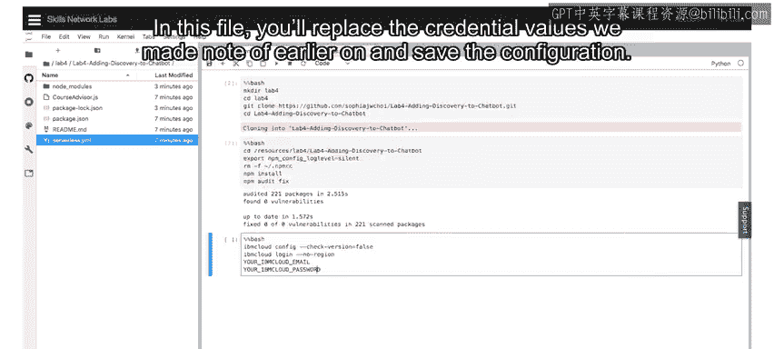

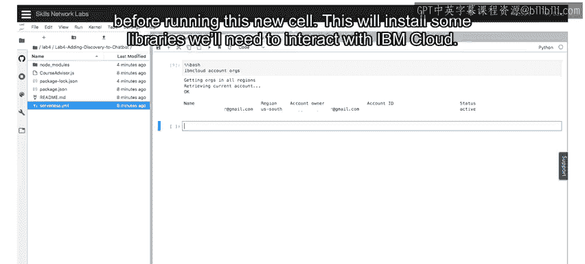

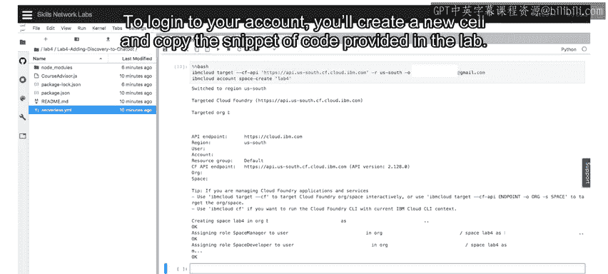

然后，您需要从笔记本登录您的IBM Cloud账户。

1.  创建一个新单元格，并复制实验中提供的代码片段。
2.  在此处指定您的IBM Cloud凭证并运行该单元格。
3.  运行后将输出一些关于我们账户的信息，以便我们可以从IBM Cloud账户中检索**区域**和**组织名称**。我们将使用该信息在该组织和区域内创建一个空间。

---

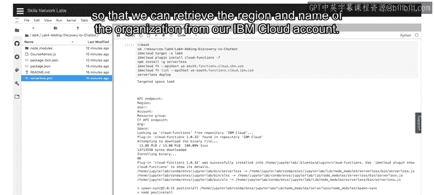

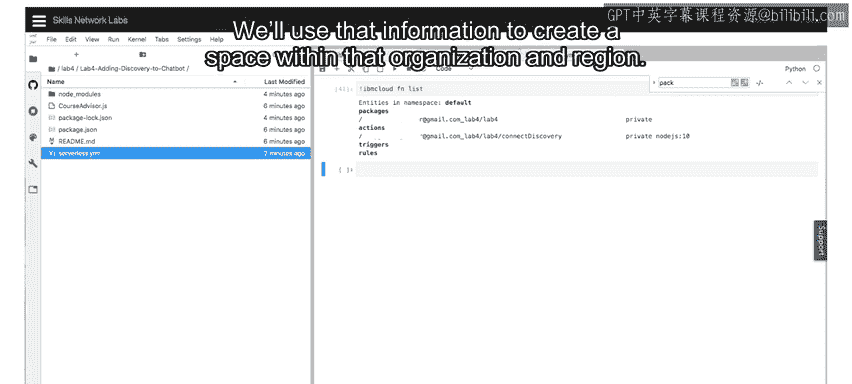

## 部署无服务器函数

接下来，我们将目标指向该空间，为我们的无服务器基础设施安装一些必需的库，并将我们的JavaScript函数部署到Cloud Functions。

我们可以随时列出创建的所有函数。在我们的例子中，只会有一个以“/connect-discovery”结尾的函数。

### 获取函数的API密钥

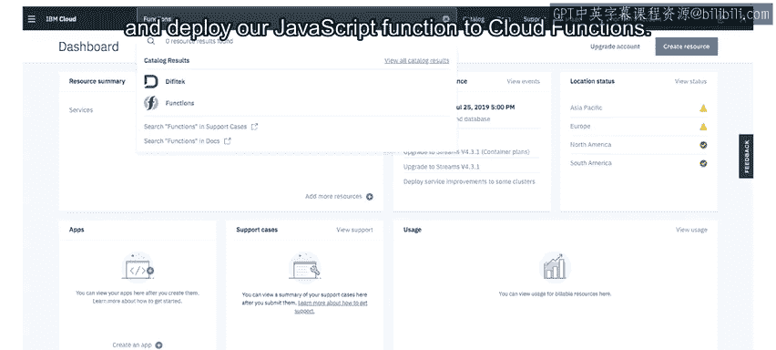

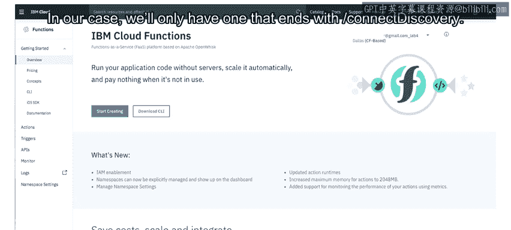

接着，我们需要获取该函数的API密钥，以便稍后可以从Watson Assistant调用它。

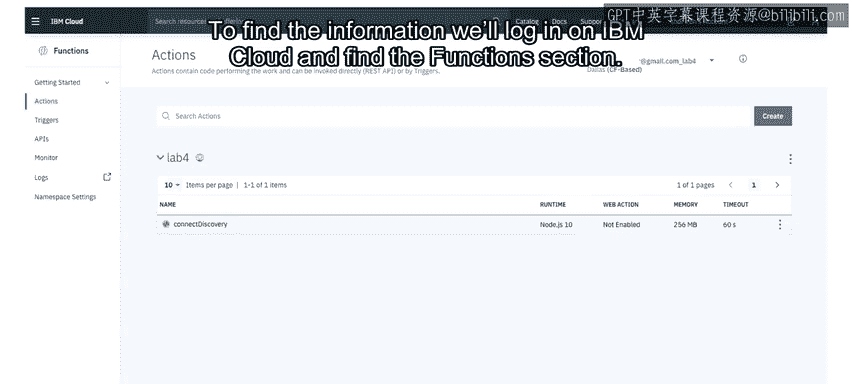

要查找此信息，我们需要在IBM Cloud上登录并找到“函数”部分。

1.  我们将看到一个操作列表，并选择我们创建的那个。
2.  从这里，选择“端点”，我们将在此处获取该操作的URL并进行复制。
3.  然后选择“API密钥”以显示并复制基于Cloud Foundry的API密钥。

这些将用于在Watson Assistant中进行配置。

---

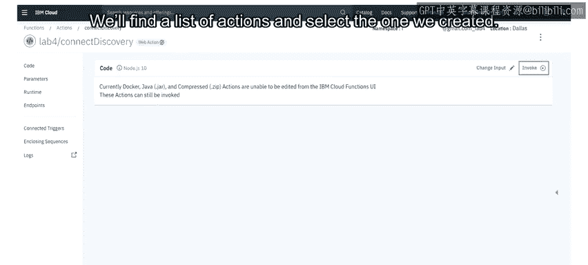

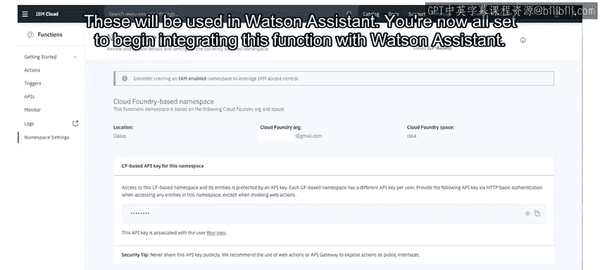

## 在Watson Assistant中集成函数

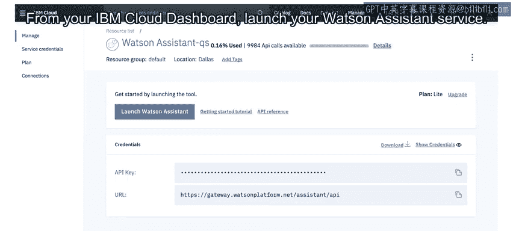

现在，您已准备就绪，可以开始将此函数与Watson Assistant集成。

从您的IBM Cloud仪表板启动您的Watson Assistant服务。

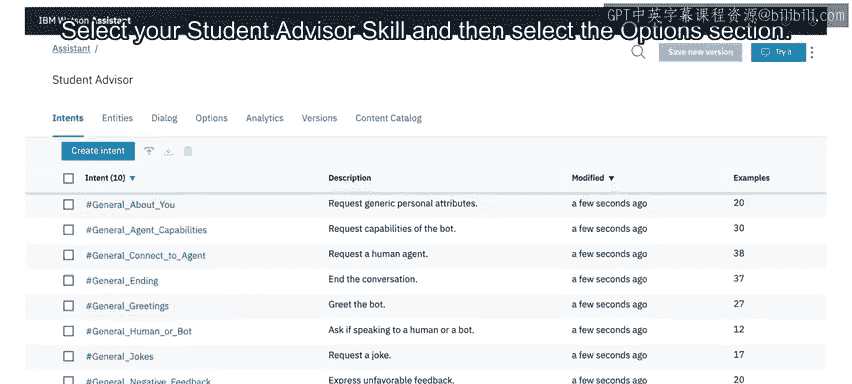

1.  选择您的“Student Advisor”技能，然后选择“选项”部分。
2.  在这里，您将有机会提供我们操作的URL，以及我们从先前步骤中获取的、基于Cloud Foundry的API密钥派生的授权凭证。
3.  最后，保存这些凭证。

### 配置对话节点

在对话流程中，找到“courses”节点，并在其下方添加一个名为“discovery”的子节点。

我们需要自定义“courses”节点以使用Webhook。

1.  找到相关部分并将其切换为“开启”。
2.  现在，我们将添加一个参数：`input` 作为键，`"<? input.text ?>"` 作为其值。
3.  向下滚动，并将返回变量设置为 `webhook_result_1`。
4.  接下来，我们将指示该节点的最终操作应为跳转到我们创建的“discovery”节点。具体来说，我们将跳转到评估该节点的条件。

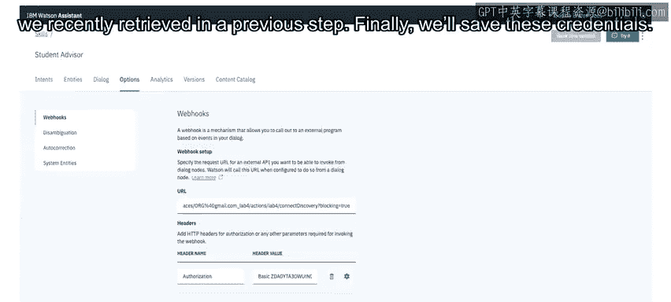

### 配置Discovery响应节点

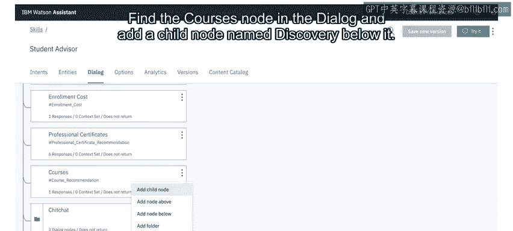

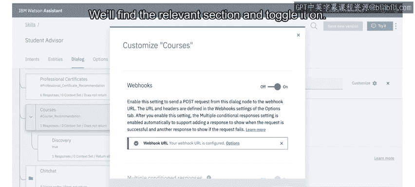

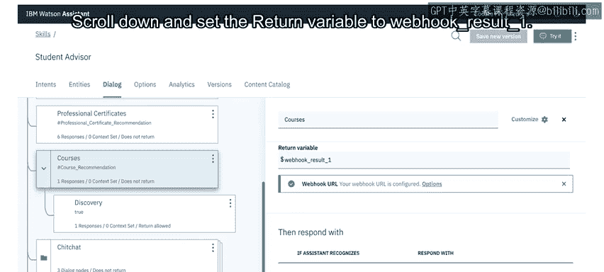

选中新节点后，将其条件设置为 `true`，因为我们希望在提供课程推荐时始终执行它。

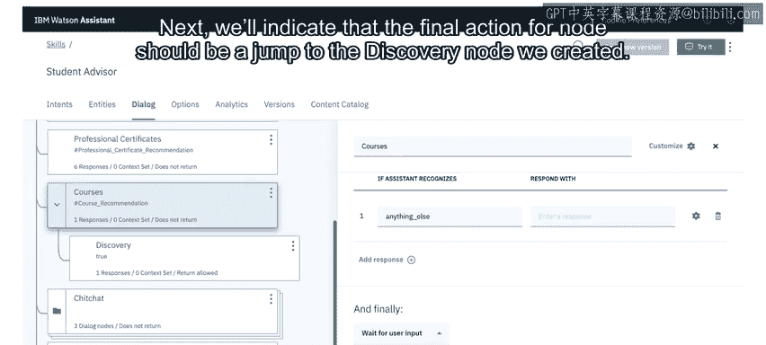

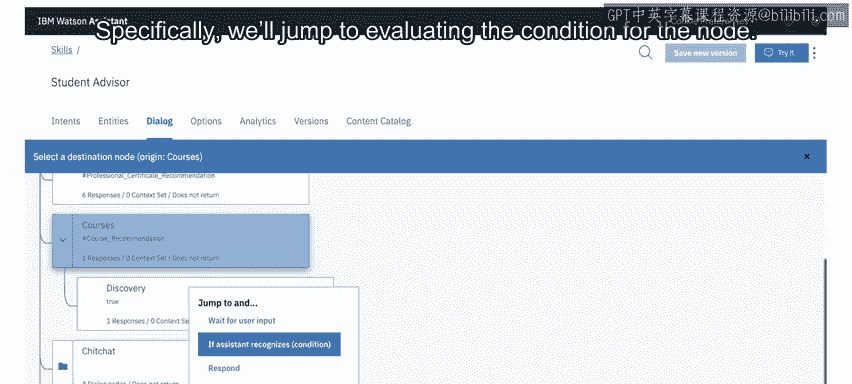

添加以下示例响应，该响应通过我们之前定义的函数从Discovery检索相关课程列表。

```json
<? webhook_result_1.response.result.join(‘, ‘) ?>
```

---

## 测试与总结

现在您已全部设置完成。尝试在“Try it out”面板中运行“recommend me a course on databases”来确认节点是否按预期工作。

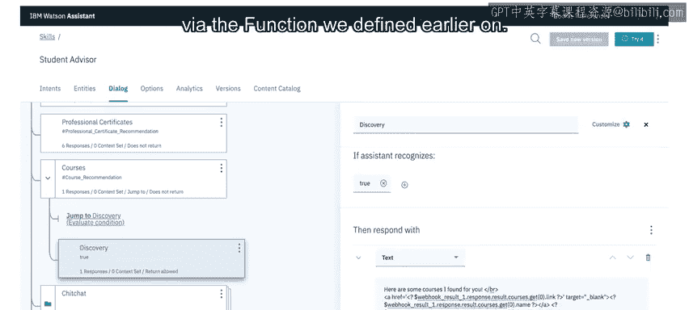

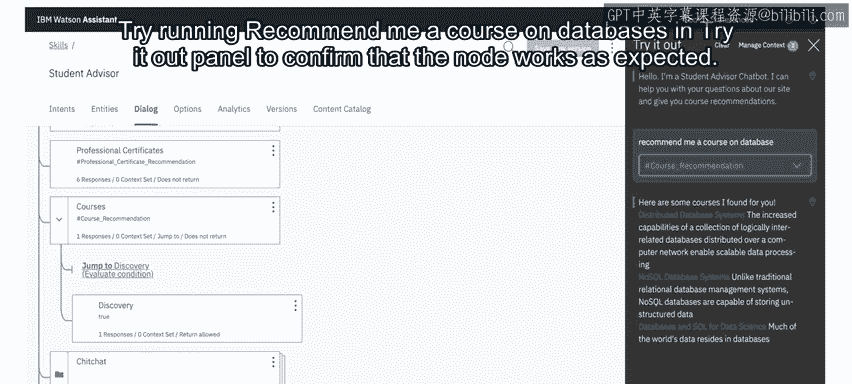

如果您看到类似于下图的结果，则说明您已成功完成本实验的所有设置。在本课程的下一部分，您将找到实验环节，有机会亲自实践这些步骤。

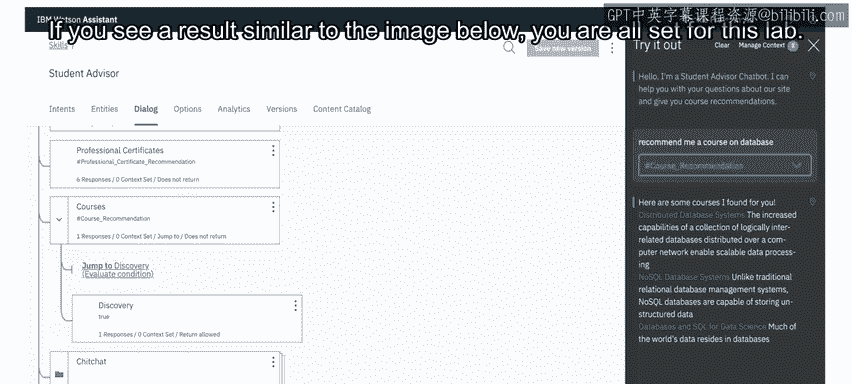


本节课中，我们一起学习了将Watson Discovery集成到聊天机器人的完整流程。我们通过IBM Cloud Functions创建了一个无服务器函数作为中间件，在Watson Assistant中配置了Webhook来调用该函数，并最终实现了根据用户查询从Discovery知识库中智能检索并推荐课程的功能。这套方法为聊天机器人增添了强大的外部知识查询能力。