# 120：结论与后续步骤 🎯

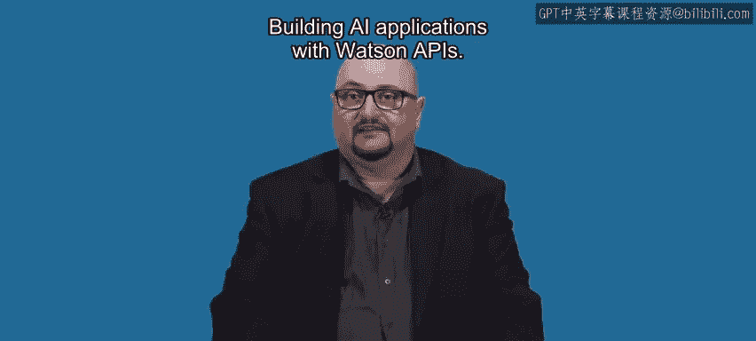

在本节课中，我们将回顾整个课程的核心内容，并探讨完成学习后如何继续提升技能、深化实践，以及规划在人工智能领域的职业发展路径。

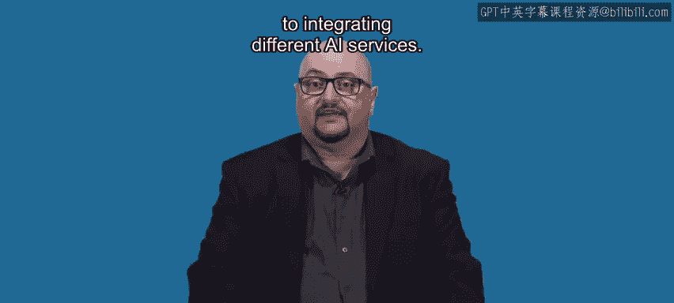

恭喜你完成了使用Watson API构建人工智能应用的课程。希望你享受这个过程，并学到了在集成不同AI服务时所需的宝贵技能。

## 课程内容回顾 📚

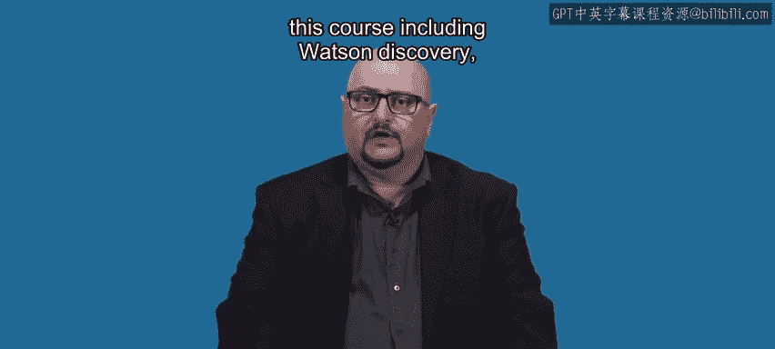

上一节我们完成了核心项目的构建，本节中我们来整体回顾一下课程涵盖的知识点。

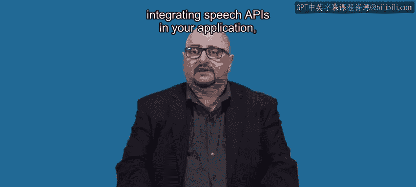

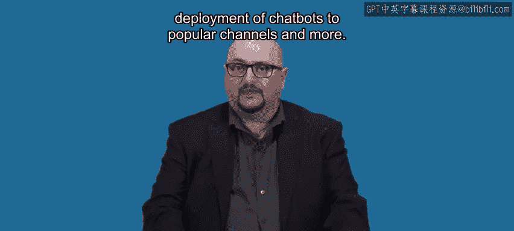

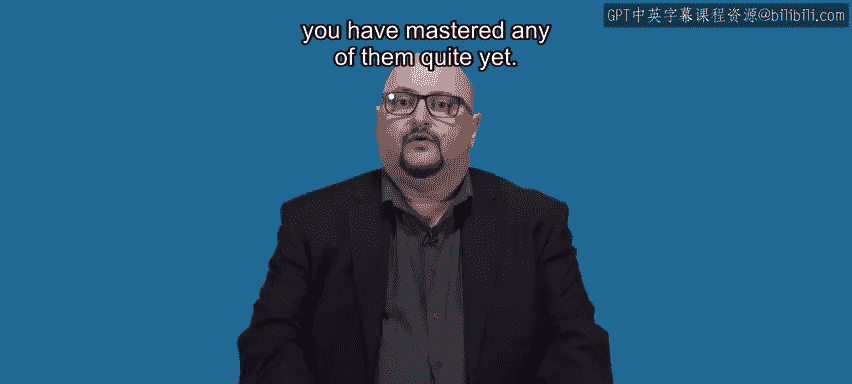

本课程覆盖了相当广泛的内容，包括：
*   Watson Discovery服务
*   从对话节点调用API
*   使用无服务器函数
*   在应用中集成语音API
*   将聊天机器人部署到主流渠道

如果你感觉尚未完全掌握其中任何一项，这是完全正常的。掌握技能需要持续的练习。

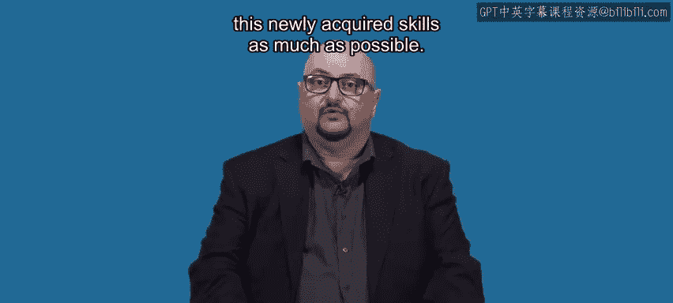

## 后续学习建议 🚀

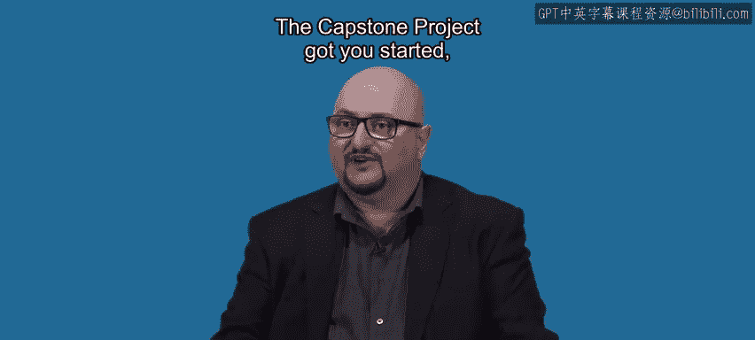

了解了课程的核心内容后，接下来我们看看如何巩固所学并继续前进。

我的建议始终是尽可能多地练习这些新获得的技能。顶点项目为你开了个头，但我建议你继续开展自己的其他项目。

以下是你可以采取的后续步骤：
*   **持续实践**：基于课程项目，构思并实现你自己的AI应用创意。
*   **深化学习**：我鼓励你继续学习IBM人工智能专业认证中的其他相关课程。
*   **获取认证**：更好的选择是在Coursera上完成IBM AI专业证书。

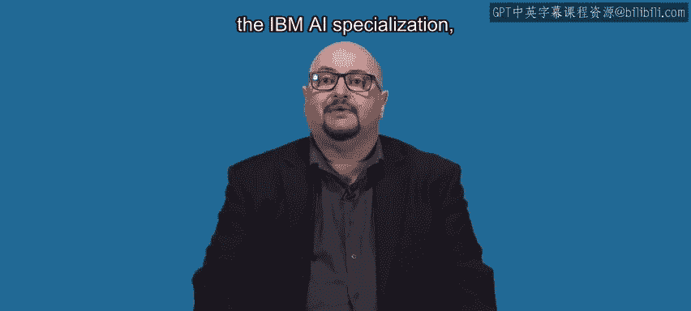

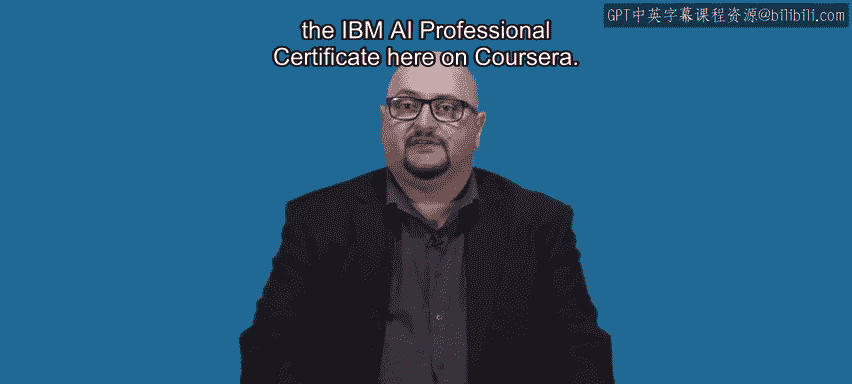

获取证书将使你在众多对AI领域感兴趣但缺乏技能和资质证明的人群中脱颖而出。除了为你提供更深入的技能外，它还能展示你对持续技术学习的承诺。

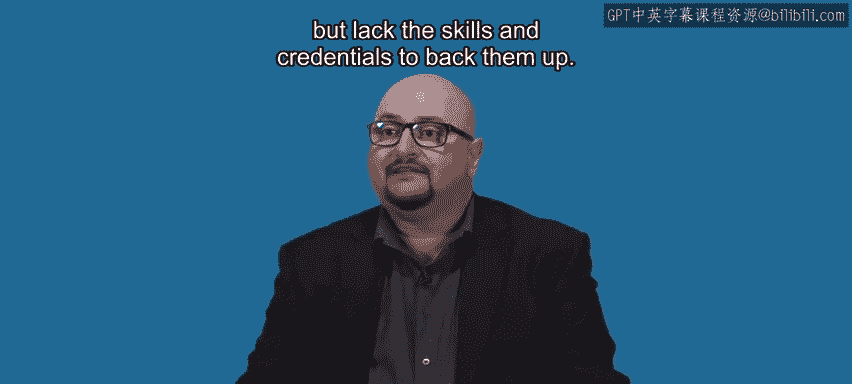

我衷心期待看到你成功进入人工智能行业，并实现你的职业目标。

## 总结 ✨

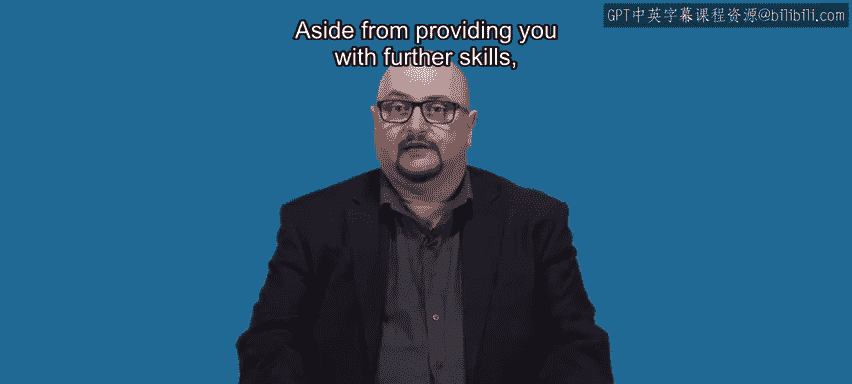

本节课中我们一起学习了课程的总结与未来规划。我们回顾了使用Watson API构建AI应用的关键模块，并明确了通过持续实践、深化学习和获取专业认证来巩固技能、推进职业发展的清晰路径。记住，学习是一个持续的旅程，保持好奇与练习是通往精通的桥梁。