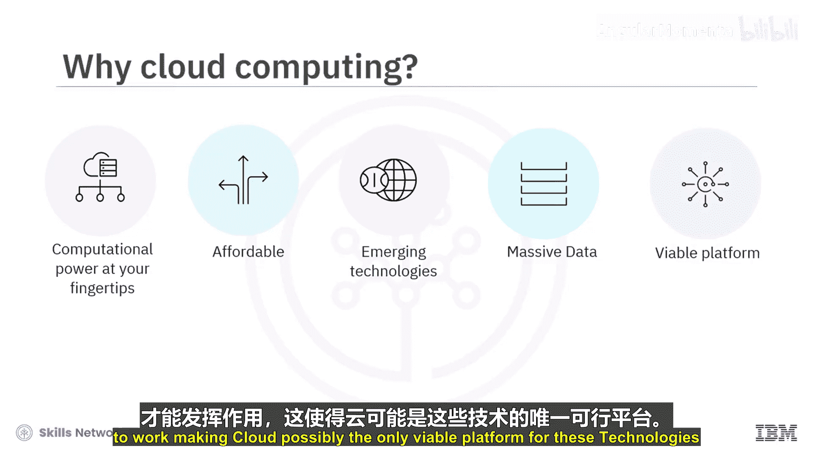
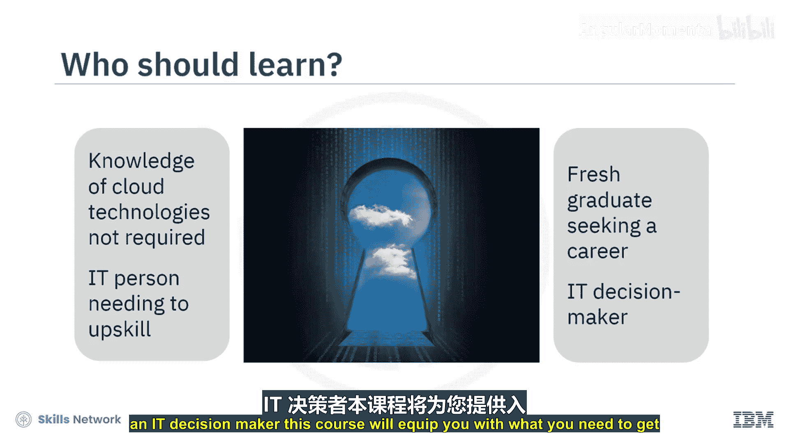
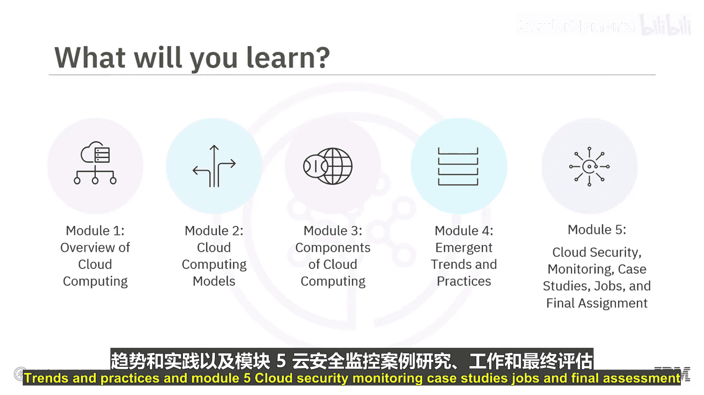
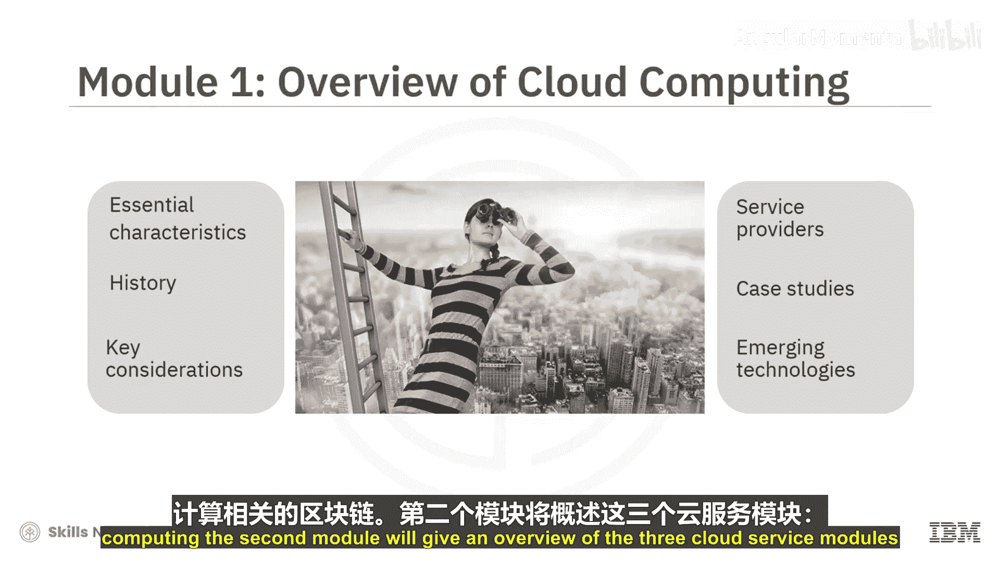
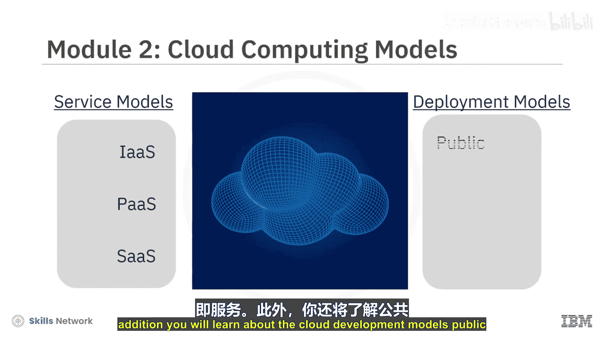
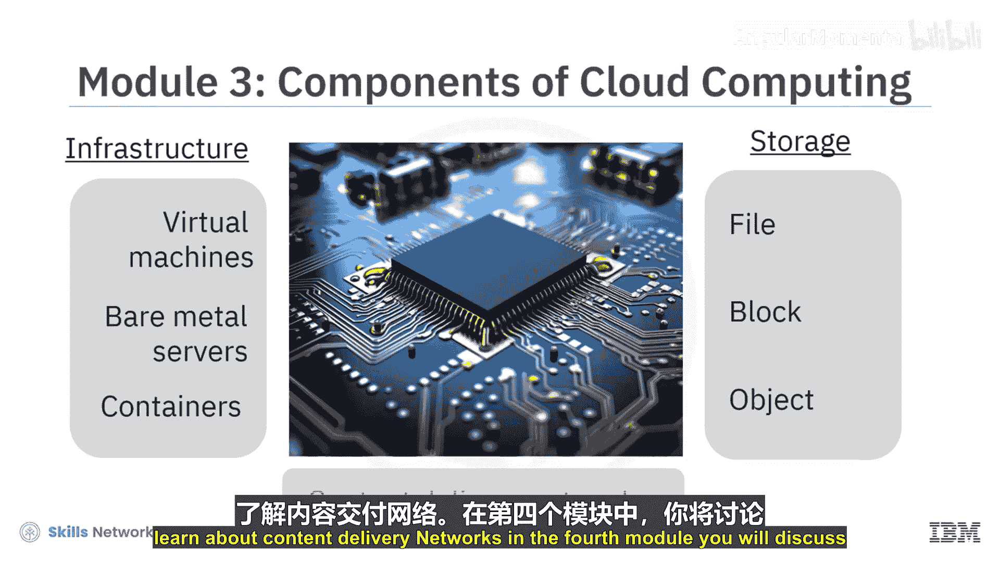
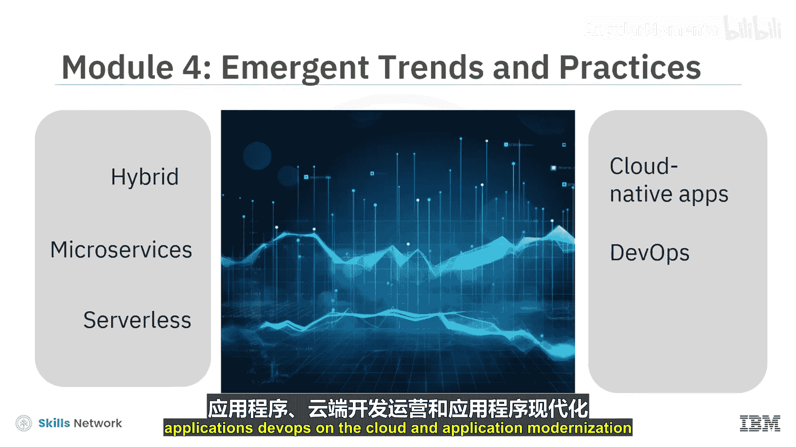
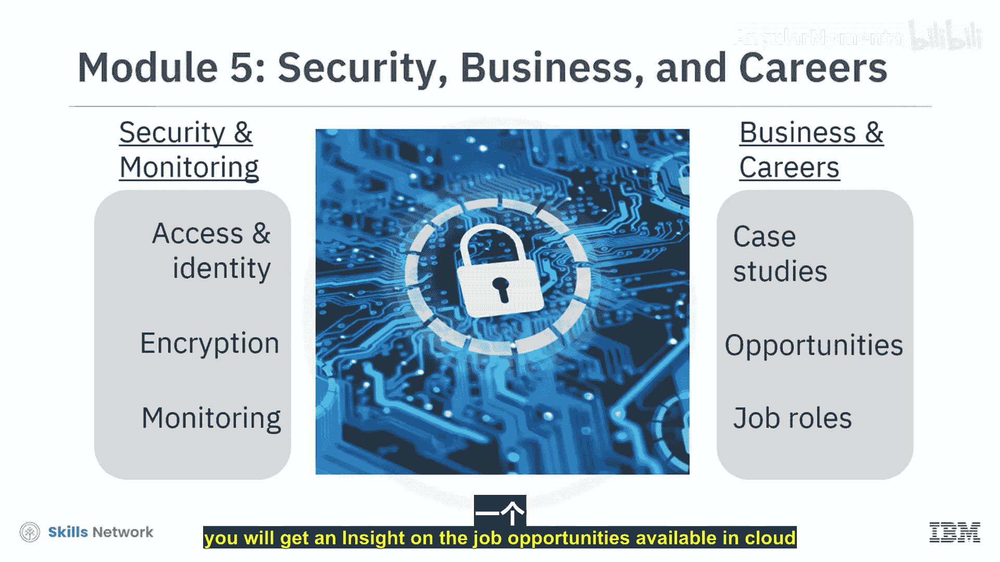
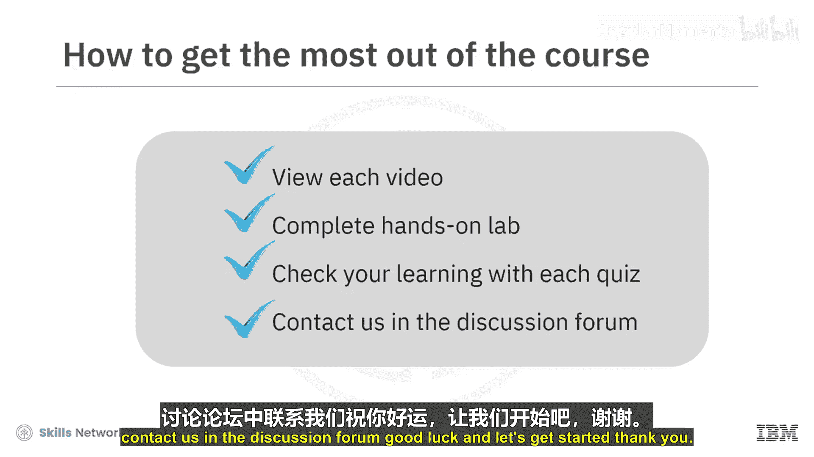

云计算导论：P01-01：课程欢迎与概述 🌟

在本课程中，我们将学习云计算的基础知识，为您成为一名云从业者奠定必要的技能基础。

如今，云计算代表着一个巨大且仍在以前所未有速度增长的市场。曾经被视为大型企业特权的强大计算能力，现在即使是最小的企业和个人开发者也能通过云触手可及。此外，云计算的“按需付费”经济模式使得这些计算能力变得非常经济实惠。

如果我们审视当今时代的一些关键新兴技术，例如人工智能、物联网、区块链和分析，所有这些技术都需要处理海量数据，并需要巨大的存储空间和计算能力才能运行，这使得云平台可能成为支撑这些技术的唯一可行平台。

本课程面向所有人。无论您是否具备云计算技术背景，是希望提升技能或探索该领域的IT人士，是寻求在云计算领域开启职业生涯的应届毕业生，还是IT决策者，本课程都将为您提供入门所需的知识。

---

本课程将通过以下模块向您介绍云计算的核心概念：

*   **模块一：** 云计算概述
*   **模块二：** 云计算模型
*   **模块三：** 云计算组件
*   **模块四：** 新兴趋势与实践
*   **模块五：** 云安全、案例研究、工作机会与最终评估

---

在第一个模块中，您将学习云计算的基本特征、历史与演进、关键考量因素以及服务提供商。您还将探索一些与云计算相关的案例研究和新兴技术，如物联网、人工智能和区块链。

接下来，第二个模块将概述三种云服务模型：**基础设施即服务 (IaaS)**、**平台即服务 (PaaS)** 和 **软件即服务 (SaaS)**。此外，您还将了解云的部署模型：公有云、社区云、私有云和混合云。

在第三个模块中，您将学习云基础设施的组件，例如**虚拟机 (VM)**、**裸机服务器**和**容器**。您还将深入了解云存储的类型，如文件存储、块存储和对象存储。此外，您将学习内容分发网络 (CDN)。

在第四个模块中，我们将讨论云计算的新兴趋势，例如混合云、微服务和无服务器计算。您还将探索云原生应用、云上的 DevOps 以及应用现代化。

在第五个模块中，您将学习云安全以及如何管理访问和身份。此外，您还将学习云加密和监控。本模块还将涵盖不同行业垂直领域的一些案例研究，并让您了解云计算领域可用的工作机会。

在最后的模块中，您可以通过最终测验来检验您在课程中学到的知识。还有一个荣誉项目，您可以在动手实验室内应用您的技能和知识。您将通过构建一个 **Docker 容器镜像**，将其上传到 IBM Cloud Container Registry，并使用名为 **IBM Code Engine** 的无服务器技术来部署一个应用程序（无需编程知识）。

---

课程内容非常丰富。为了从本课程中获得最大收益，请完整观看每个视频，完成所有动手实验，并通过每个测验检查学习效果。

我们非常高兴能陪伴您开启云计算之旅。如果您在学习任何课程材料时遇到困难，请随时在讨论论坛中联系我们。祝您好运，让我们开始吧！