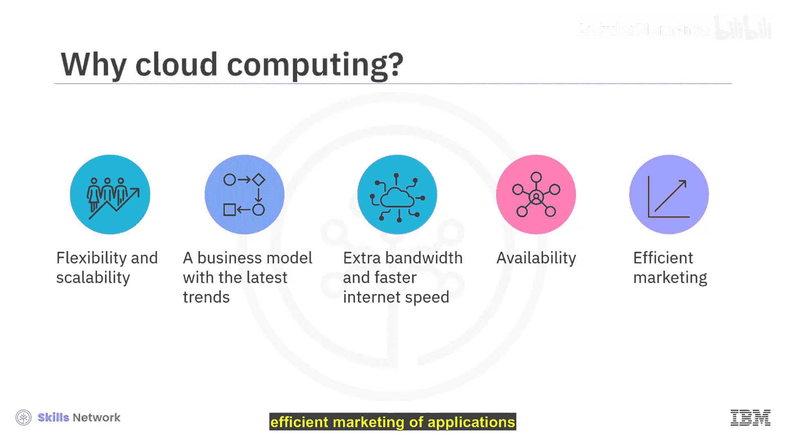
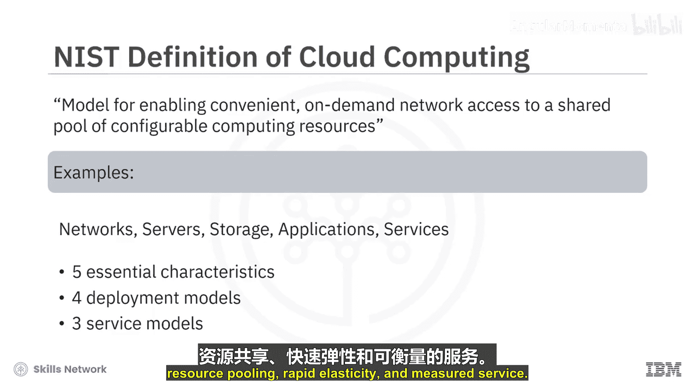
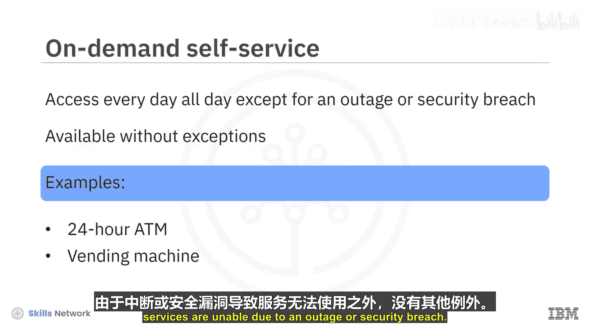
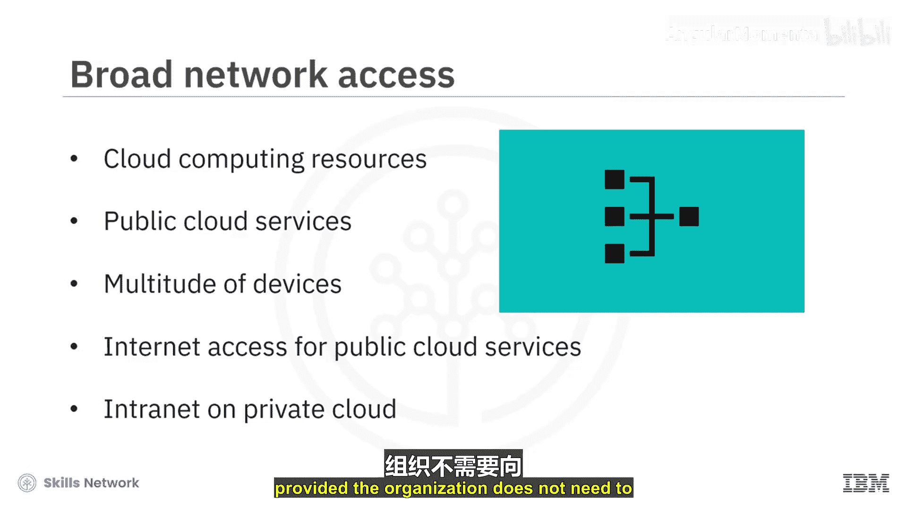
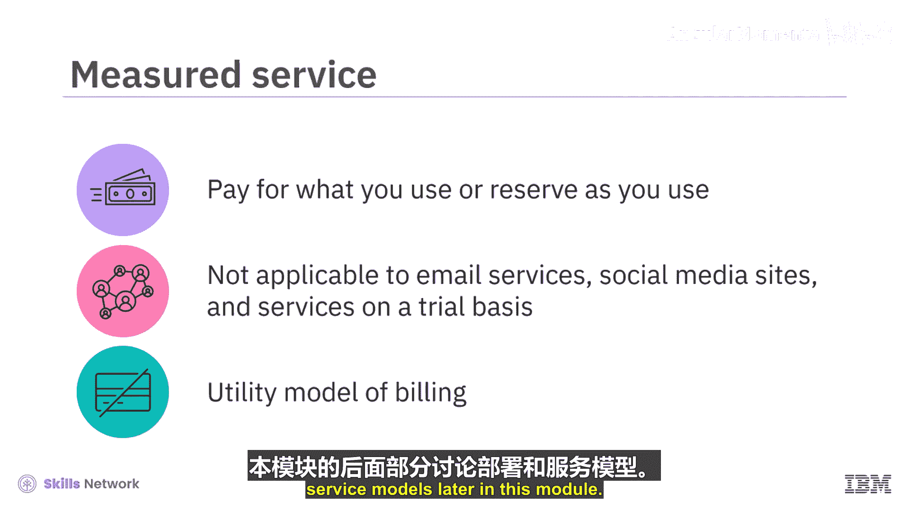

# 002：云计算的定义与基本特征 ☁️

在本节课中，我们将学习云计算的定义及其五个基本特征。我们将探讨为何企业会选择云计算而非传统的本地服务器托管，并深入理解美国国家标准与技术研究院对云计算的定义。

## 概述

云计算为企业提供了比本地服务器托管更高的灵活性和可扩展性。它是一种结合了虚拟化等技术与最新趋势的业务模式或服务。例如，当需要额外带宽时，基于云的服务可以即时满足需求，而无需等待复杂且昂贵的IT基础设施升级。用户只要有互联网连接，就可以从任何地方使用云服务定制其应用程序。此外，云计算还能实现应用程序的高效营销，同时无需过多考虑维护和成本。

为了对云计算有一个统一的理解，让我们从美国国家标准与技术研究院的定义开始。

## NIST的云计算定义

NIST将云计算定义为一种模型，用于实现对可配置计算资源池的便捷、按需网络访问。这些资源可以被快速配置和释放，而只需最少的管理工作或与服务提供商的交互。

**计算资源**的例子包括网络、服务器、存储、应用程序和服务。

这个云模型由**五个基本特征**、**四种部署模型**和**三种服务模型**组成。让我们从理解云的五个基本特征开始。

## 云的五个基本特征

以下是云计算的五个核心特征。

### 1. 按需自助服务

第一个特征意味着你可以在需要时随时访问云资源。例如，一个24小时服务的ATM机或办公室、商店里的自动售货机。服务全年全天候可用，无论当天是国定假日、周末还是节日。除了因服务中断或安全漏洞导致无法使用的情况外，没有例外。

### 2. 广泛的网络访问

广泛的网络访问意味着云计算资源可以通过网络进行访问。公共云服务通常可以从任何地方、任何具备互联网连接和浏览器功能的设备上访问。如今，我们不仅可以通过台式机或笔记本电脑访问云服务，还可以使用许多其他设备，如平板电脑、iPad、智能手机、电子阅读器、智能穿戴设备等。再次强调，访问公共云服务必须要有互联网接入。然而，在本地私有云中，如果组织不需要面向全球公众，仅使用内联网就足以访问云服务。

### 3. 资源池化

通过资源池化，消费者在使用共享模式时可以节省成本。这种模式为云提供商带来了规模经济，他们可以将这种效益传递给客户，从而使云计算更具成本效益。计算资源被汇集起来，使用多租户模型为多个消费者服务。云资源根据需求动态分配和重新分配，客户无需关心这些资源的物理位置。

### 4. 快速弹性

快速弹性意味着你可以根据需求增加或减少资源，这是云弹性属性的体现。资源可以垂直扩展或水平扩展。一个理想的例子是：在假日促销等在线购物用户数量激增时增加资源，而在销售期过后则相应减少。

### 5. 可计量服务

可计量服务意味着你只需为你使用或预留的资源付费，即用即付。然而，可计量服务并不适用于某些云服务，例如Gmail、Hotmail、Yahoo等通用电子邮件服务，Facebook、Twitter、WhatsApp等社交媒体网站，以及AWS、Azure、GCP等基于试用评估的云服务，这些服务根据各自服务提供商的政策是免费提供的。可计量服务也被称为**计费的效用模型**，你在使用后、在预定义周期（如每月电费账单）结束时被收费。

我们将在本模块的后续部分讨论部署模型和服务模型。

## 总结

本节课中，我们一起学习了云计算的核心定义及其五个基本特征：按需自助服务、广泛的网络访问、资源池化、快速弹性和可计量服务。理解这些特征是掌握云计算价值与运作方式的基础。在接下来的课程中，我们将继续探讨云计算的部署模型和服务模型。