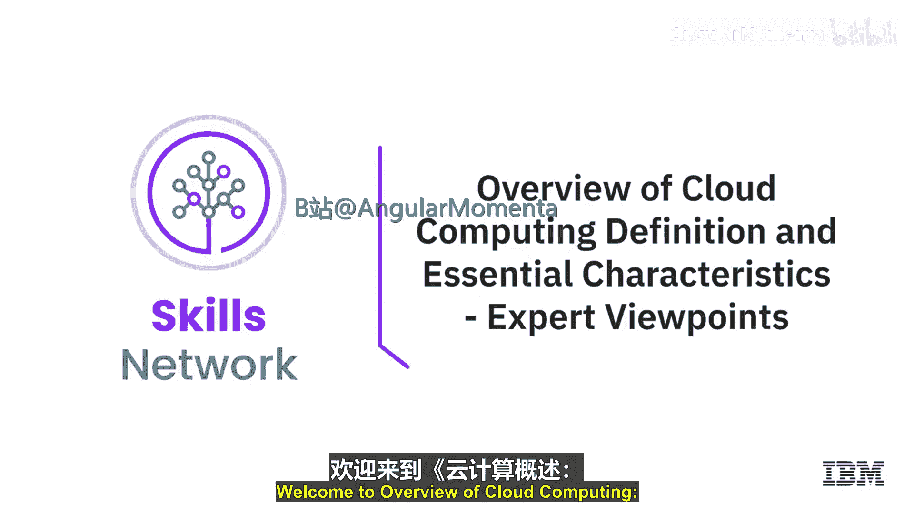
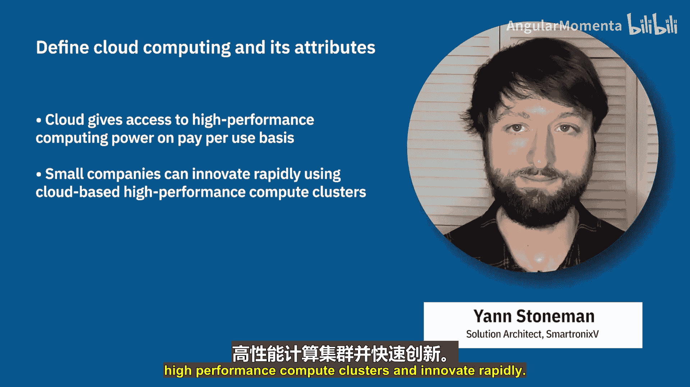

# 003：云计算的定义与核心特征 😊

在本节课中，我们将聆听几位云原生与应用开发领域的专家，共同探讨云计算的定义及其独特的核心特征。

## 概述

本节视频汇集了多位专业人士的观点，旨在从不同角度阐明云计算是什么，以及它具备哪些关键属性。通过他们的分享，我们可以构建一个更全面、更立体的理解。

## 专家观点：定义与特征

以下是专家们对云计算的定义及其核心特征的阐述。

**云原生开发者视角**
作为云原生开发者，云计算对我而言可归结为两点：**按需**与**自助服务**。这意味着作为一名开发者，我应该能够登录一个门户，立即获取我所需要的精确数量的服务。我不需要等待采购或基础设施服务部门为我分配或配置资源。这一特性贯穿整个技术栈，从基础设施即服务（IaaS）、平台即服务（PaaS）到软件即服务（SaaS）。

**分布式系统视角**
对我而言，云计算是在全球范围内、大规模部署代码或基础设施的能力。其关键特征包括**分布式架构**、**高可用性**、**弹性恢复能力**和**可扩展性**。

**服务交付视角**
云计算指的是通过互联网（或称“云”）交付计算服务，这些服务可以包括服务器、数据库、网络、分析等。其关键属性包括**灵活的成本模型**、**全球规模**、**缩短的资源部署时间**、**更高的生产力和性能**，以及**更高的可靠性和安全性**。

**资源管理视角**
对我而言，云计算意味着**无限的计算、数据库和机器学习能力**，并且能够即时使用这些能力。与数据中心需要订购、设置并自行管理可用性不同，在云计算中，云服务提供商为你管理服务的物理安全，而你只需管理其上的内容。

**API驱动视角**
我将云计算总结为一套**API驱动的服务**，用于管理企业计算中所有方面的计算和网络资源。你可以将其视为由软件定义的虚拟化资源。其他关键特征包括：资源是**弹性**的，可以根据需求增长或收缩（例如，高需求假日期间的电子商务）；计算成本是**动态**的，因此你无需为硬件投入资本支出，而是为云资源支付运营费用。

**应用广度视角**
对我而言，云计算不是一个“是或否”的问题，而是一个**连续体**。如今，几乎所有事物都在使用云计算。关键在于，你可以浅尝辄止，例如仅将云计算用于身份验证（使用社交登录），也可以全面投入，将整个项目托管在云基础设施上。这两种方式都利用了云技术。每当你从“云”中获取计算能力或存储空间时，你就在使用云技术。理解这一点很重要：如今，几乎所有事物都是云。

**本质与价值视角**
有个玩笑说，云计算就是“通过互联网使用别人的电脑”。这仅在非常狭隘的意义上成立。云计算真正提供的是**可用性**、**一致性**和**可扩展性**，这些特性在你自行运行机器时很可能无法实现。在最佳状态下，云计算允许你**抽象掉那些你可能不关心的管理事务**，从而专注于你真正关心的事情。借助云中的高性能计算，你可以轻松获得极其快速的计算机集群，并且只在需要时为其付费。得益于云计算，小型公司也能够建立高性能计算集群并快速创新。

## 总结

本节课中，我们一起学习了多位专家对云计算的定义和核心特征的解读。综合来看，云计算的核心在于通过互联网提供**按需**、**自助服务**的弹性计算资源，其关键特征包括**可扩展性**、**高可用性**、**成本灵活性**以及允许用户从繁琐的基础设施管理中**抽象**出来，专注于业务逻辑和创新。理解这些多样化的观点，有助于我们更全面地把握云计算的本质与价值。