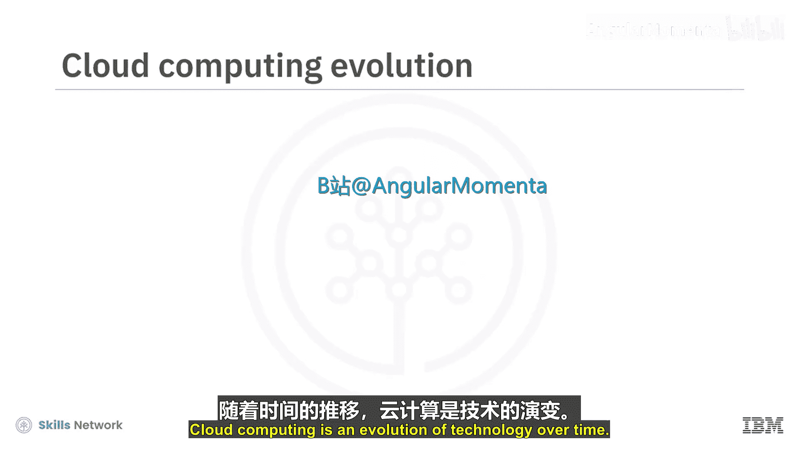
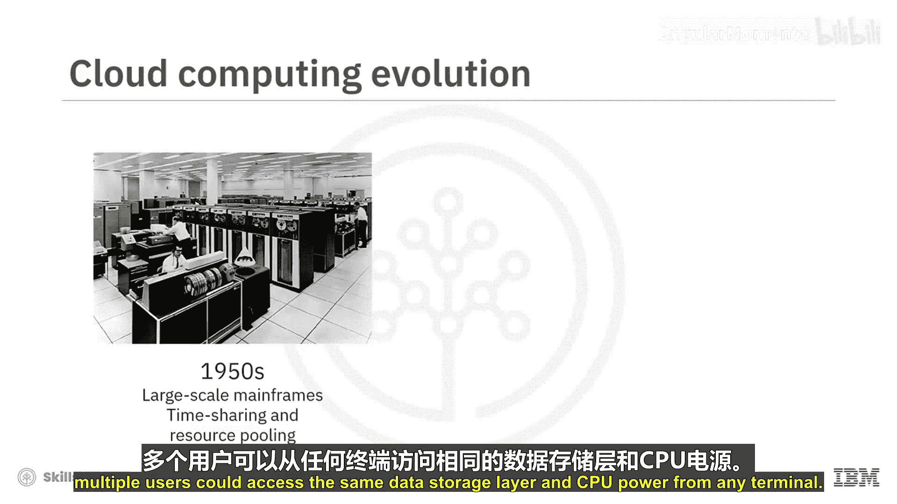
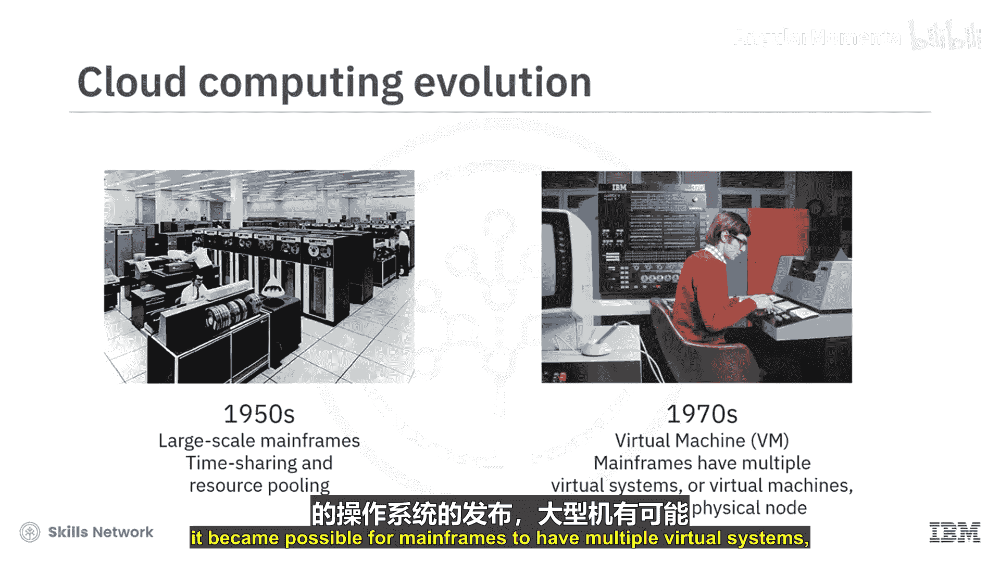
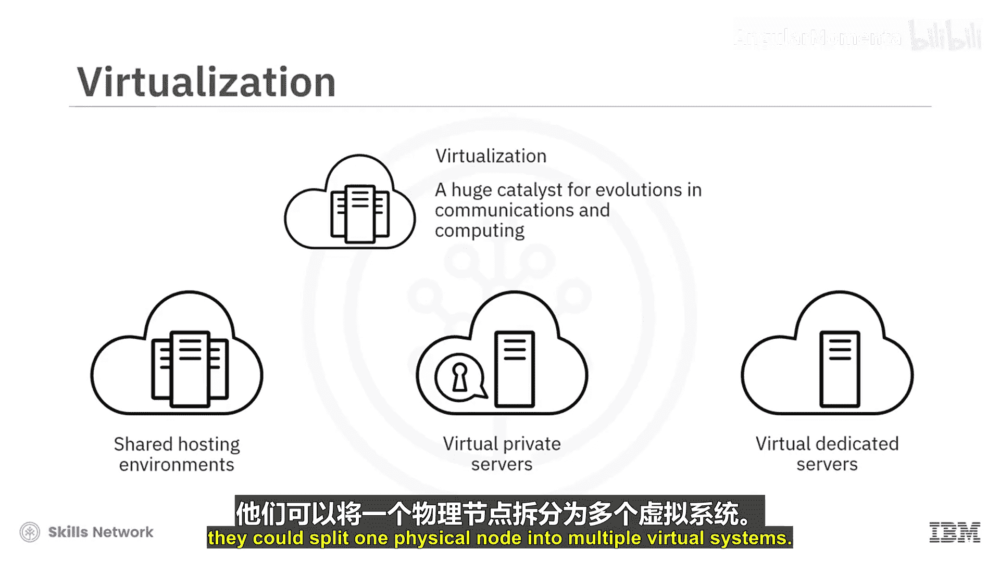
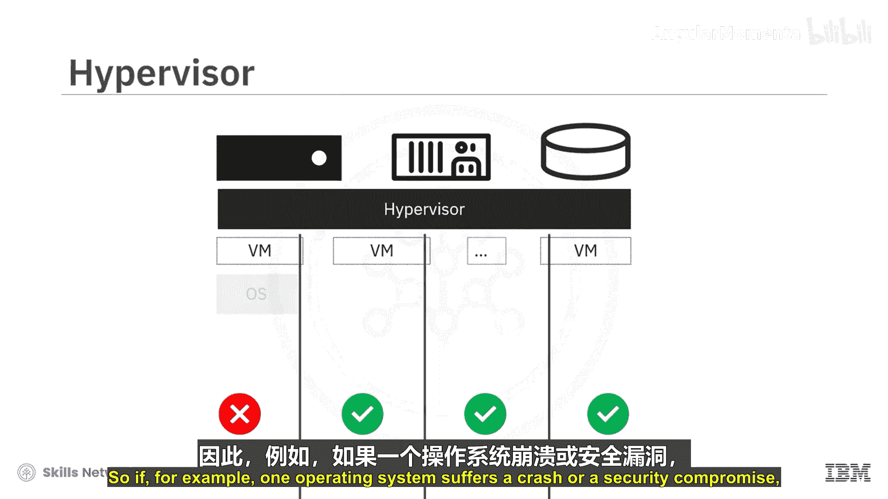
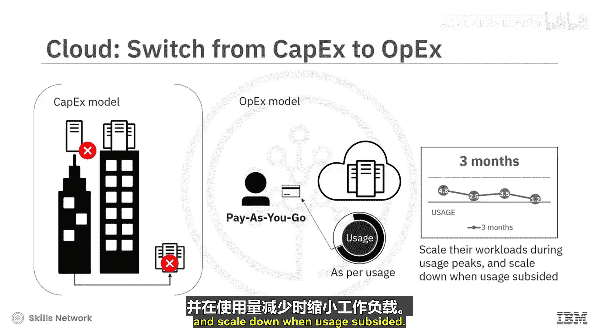
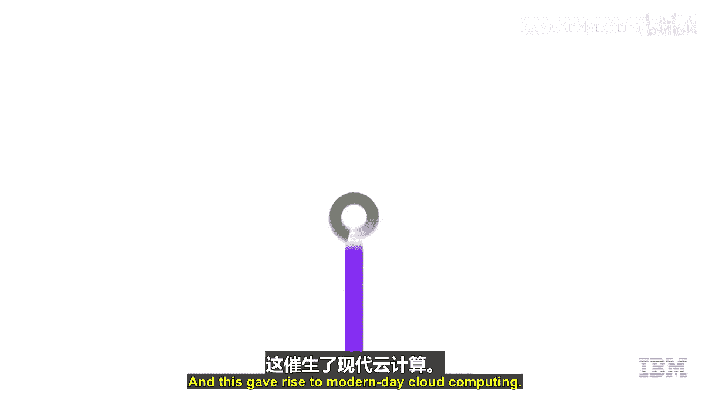

云计算导论：P4：云计算的历史与演进 🚀

在本节课中，我们将要学习云计算是如何从早期的大型机概念逐步演进到今天我们所熟知的按需服务模型的。我们将回顾几个关键的技术突破，包括虚拟化技术和按使用付费的商业模式，这些共同塑造了现代云计算的面貌。

---

云计算是技术随时间演进的产物。

云计算的概念可以追溯到20世纪50年代，当时出现了具有强大处理能力的大型机。

分时共享或资源池化的实践随之发展起来，旨在通过使用哑终端来高效利用大型机的计算能力。这些哑终端的唯一目的就是提供对大型机的访问。

多个用户可以从任何终端访问相同的数据存储层和CPU计算能力。

上一节我们介绍了资源共享的早期形式，本节中我们来看看虚拟化技术的出现。

到了20世纪70年代，随着一种名为虚拟机（VM）的操作系统发布，大型机得以在单个物理节点上运行多个虚拟系统或虚拟机。

虚拟机操作系统在20世纪50年代共享访问大型机应用的基础上进一步发展，允许在相同的物理硬件上存在多个独立的计算环境。

每个虚拟机都运行着客户操作系统，这些系统表现得好像拥有自己的内存、CPU和硬盘一样，尽管这些实际上是共享资源。

因此，虚拟化成为了一个技术驱动力，也是通信和计算领域一些最重大演进的重要催化剂。

大约20年前，硬件设备仍然相当昂贵。随着互联网变得更加普及，以及降低硬件成本的需求日益迫切，服务器被虚拟化到共享托管环境、虚拟私有服务器和虚拟专用服务器中，这利用了虚拟机操作系统提供的相同功能。

例如，如果一家公司需要X台物理系统来运行其应用程序，他们可以将一个物理节点分割成多个虚拟系统。

理解了虚拟化的基本概念后，接下来我们介绍一个关键组件：管理程序。

管理程序是一个薄软件层，它允许多个操作系统并行运行，共享相同的物理计算资源。管理程序还在逻辑上隔离虚拟机，为每个虚拟机分配一部分底层的计算能力、内存和存储，防止虚拟机相互干扰。

例如，如果一个操作系统崩溃或遭到安全破坏，其他系统可以继续运行。

随着技术和管理程序的改进，能够可靠地共享和交付资源，一些公司决定将云的优势带给用户。这些用户自身并没有大量的物理服务器来构建云计算基础设施。

由于服务器已经在线，启动一个新实例是即时的。用户现在可以从更大的可用资源池中订购云资源，并按使用量付费，这也被称为**按需付费（Pay-As-You-Go）**。

这种按需付费或效用计算模型成为云计算兴起的关键驱动力之一。

按使用量付费的模式允许公司甚至个人开发者像使用电力单位一样，在他们使用时才为计算资源付费。这使得他们可以从资本支出（CapEx）模式转向更利于现金流的运营支出（OpEx）模式。

这种模式吸引了各种规模的公司，包括那些拥有很少或没有硬件的公司，甚至那些拥有大量硬件的公司。因为现在，他们无需进行大量的资本支出购买硬件，而是可以在需要时按需支付计算资源费用。

它还允许他们在使用高峰期扩展工作负载，并在使用量下降时缩减规模。这催生了现代云计算。

---

本节课中我们一起学习了云计算的演进历程。我们从20世纪50年代的大型机资源共享开始，经历了70年代虚拟机技术的出现，再到管理程序实现硬件资源的有效分割与隔离。最终，技术的成熟与“按需付费”商业模式的结合，使得云计算作为一种便捷、弹性且成本效益高的服务得以普及，彻底改变了我们获取和使用计算资源的方式。