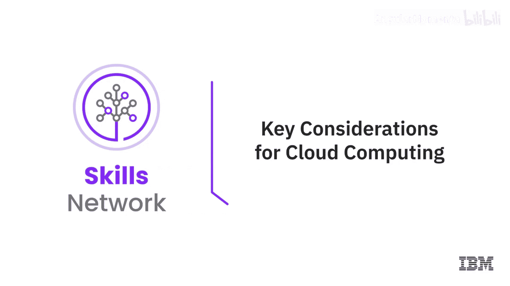
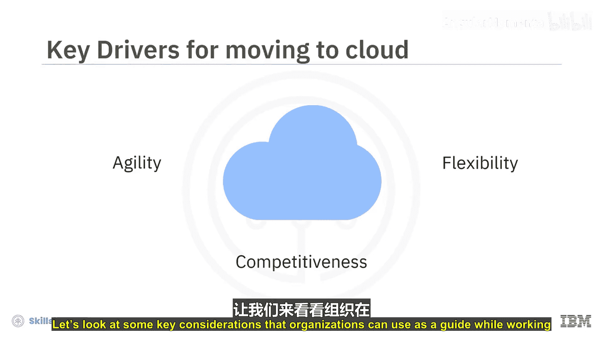
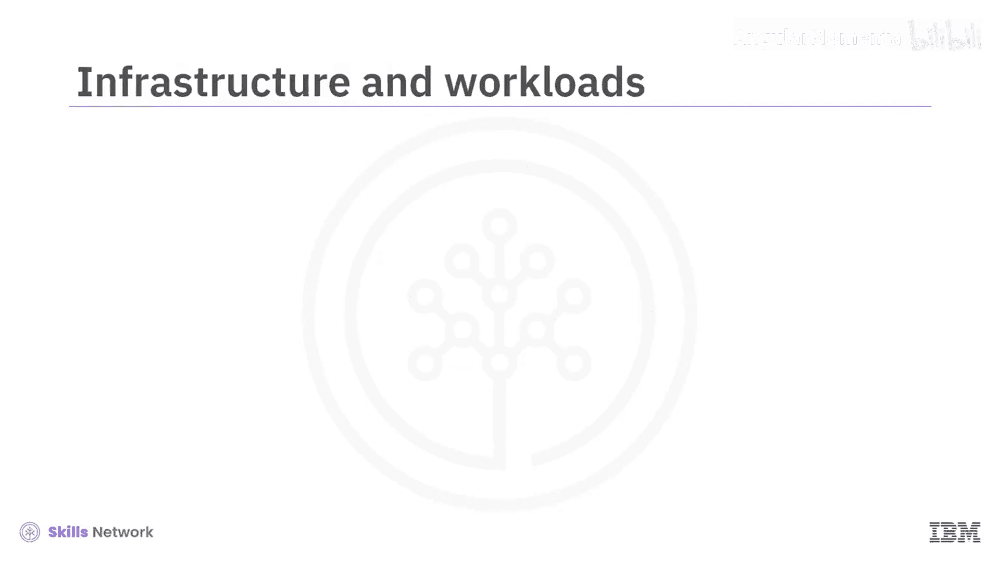
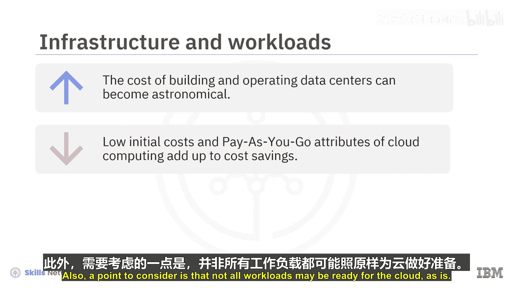
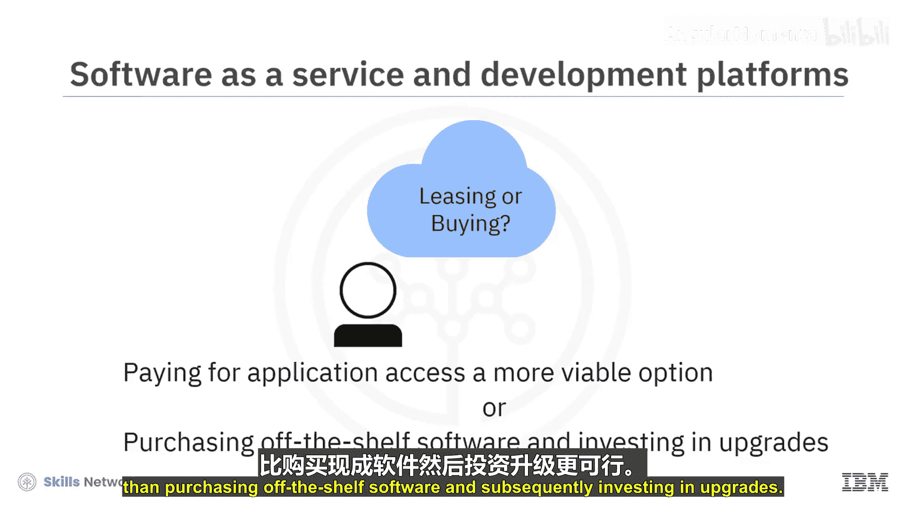
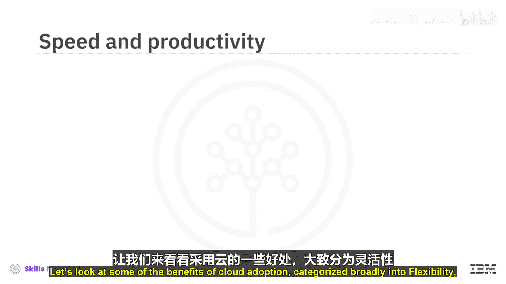
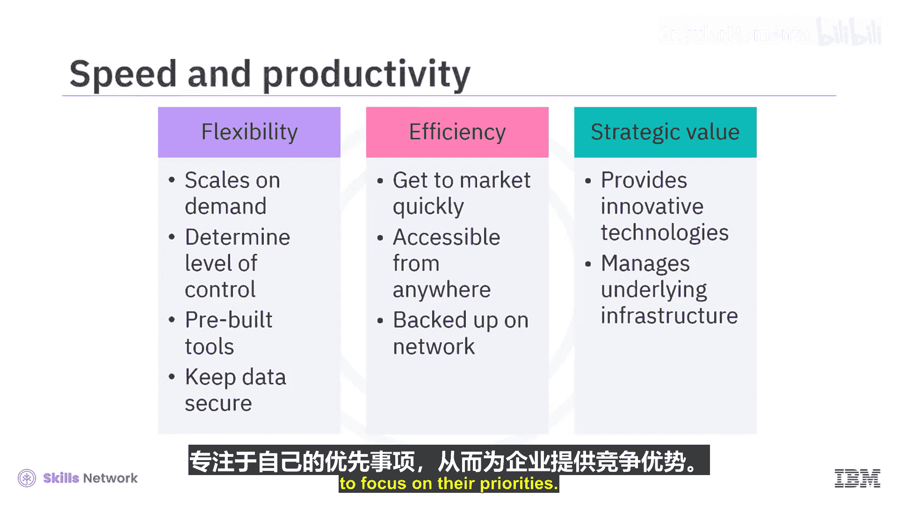
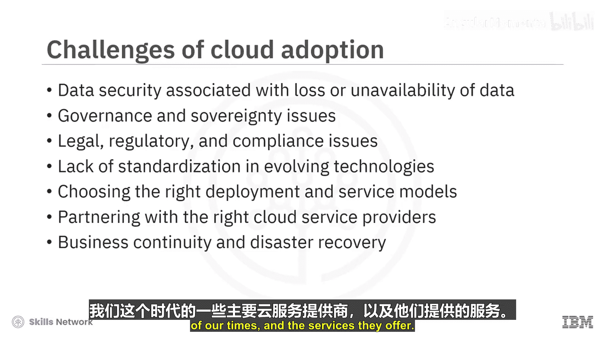

# 005：云计算的关键考量因素 ☁️

在本节课中，我们将要学习企业在制定云采用策略时需要考虑的关键因素。我们将探讨云计算的潜在优势与挑战，帮助初学者理解如何评估和规划向云端的迁移。

每个组织的转型之旅都是独特的，因此每个组织的云采用策略也各不相同。敏捷性、灵活性和竞争力是迁移到云端的关键驱动力，前提是这一过程不会造成业务中断，或引发安全、合规与性能方面的问题。

上一节我们了解了云采用的基本驱动力，本节中我们来看看企业在制定云策略时可以参考的一些关键考量因素。

## 基础设施与工作负载

首要考量因素是基础设施和工作负载。建设和运营数据中心的成本可能非常高昂。另一方面，云计算初始成本低和按需付费的特性，可以显著节省成本。同时，需要考虑的一点是，并非所有工作负载都能直接迁移到云端。

## 软件即服务与开发平台

第二个考量围绕软件即服务（SaaS）和开发平台。组织需要考虑，为应用程序访问付费是否比购买现成软件并随后投资升级更具可行性。

## 速度与生产力

组织需要考虑速度与生产力。对他们而言，在云端用 **X小时** 启动并运行一个新应用，与在传统平台上花费数周甚至数月相比意味着什么？以及他们通过使用云仪表板、实时统计和主动分析所获得的人力成本效益。

在探讨了关键考量因素后，以下是云采用的一些主要好处，可大致归类为灵活性、效率和战略价值。

## 云采用的主要优势

### 灵活性
云提供了灵活性。用户可以缩减或扩展服务以满足需求，定制应用程序，并通过任何有互联网连接的地方访问云服务。云基础设施可按需扩展以支持波动的工作负载。组织可以通过“即服务”选项来确定其控制级别。用户可以从一系列预构建的工具和功能菜单中选择，以构建符合其特定需求的解决方案。加密和API密钥等选项有助于保障数据安全。

### 效率
云也带来了高效率。企业用户可以快速将应用程序推向市场，而无需担心底层基础设施的成本或维护。基于云的应用程序和数据几乎可以从任何联网设备访问。硬件故障不会导致数据丢失，因为网络上有备份维护。云计算使用远程资源，为组织节省了服务器和其他设备的成本，并按使用付费。

### 战略价值
云服务通过提供最先进的技术同时管理底层基础设施，为企业提供了竞争优势，从而使组织能够专注于其优先事项。

尽管云带来了巨大机遇，但它也给业务领导者和IT部门带来了挑战。接下来，我们看看其中一些常见的风险认知。

## 云采用的潜在挑战与风险

以下是一些常见的风险认知：
*   **数据安全**：与数据丢失或不可用相关的风险，可能导致业务中断。
*   **治理与主权问题**。
*   **法律、法规与合规性问题**。
*   **缺乏标准化**：不断发展的技术如何集成和互操作缺乏统一标准。
*   **选择正确的部署和服务模型**：以满足特定需求。
*   **与合适的云服务提供商合作**。
*   **业务连续性与灾难恢复**相关的担忧。

组织不能再将云采用视为未来才需要考虑的事情。通过正确的云采用策略、技术、服务和服务提供商，这些风险是可以被缓解的。

本节课中我们一起学习了制定云策略时的关键考量因素，包括基础设施、工作负载、SaaS、速度与生产力。我们还探讨了云计算的三大核心优势：**灵活性**、**效率**和**战略价值**，并识别了迁移过程中可能面临的挑战，如安全、合规和标准化问题。理解这些因素对于成功规划和实施云转型至关重要。