云计算导论：P6：主要云服务提供商及其服务 🌐

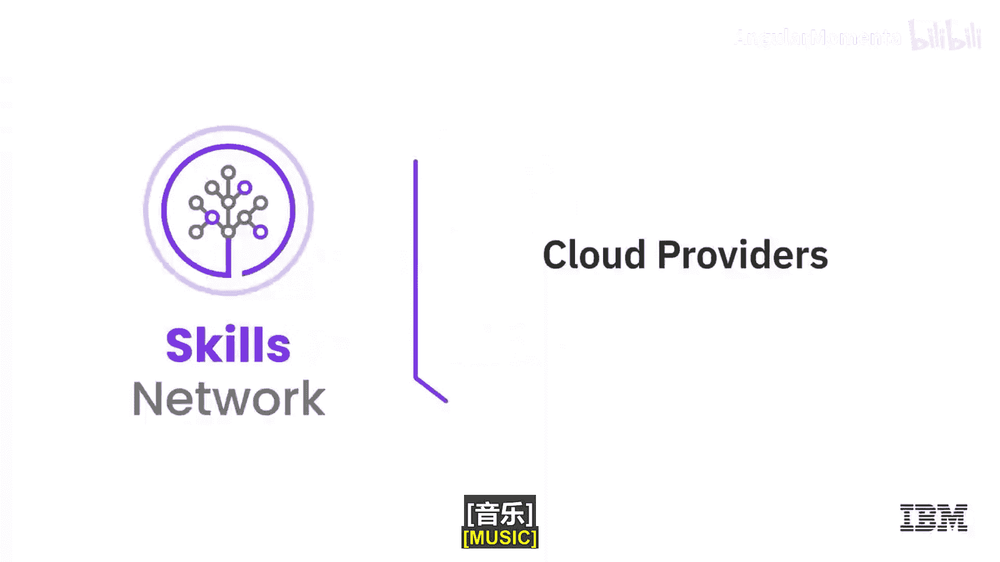

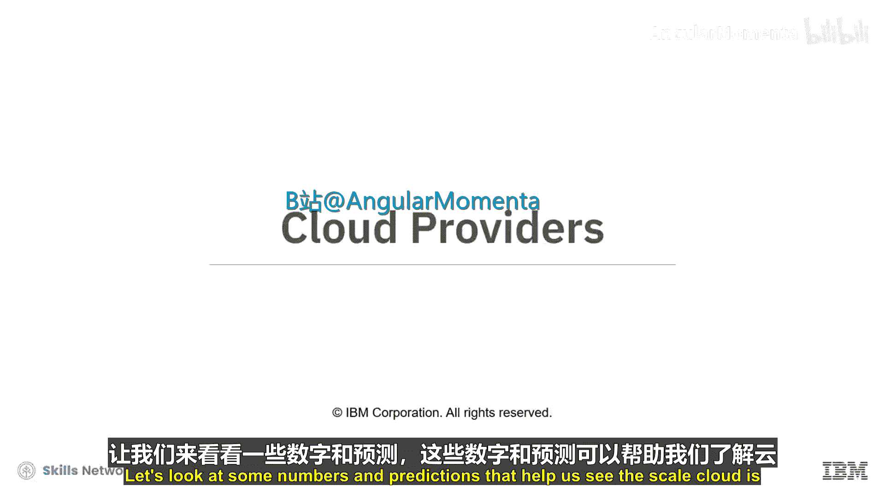

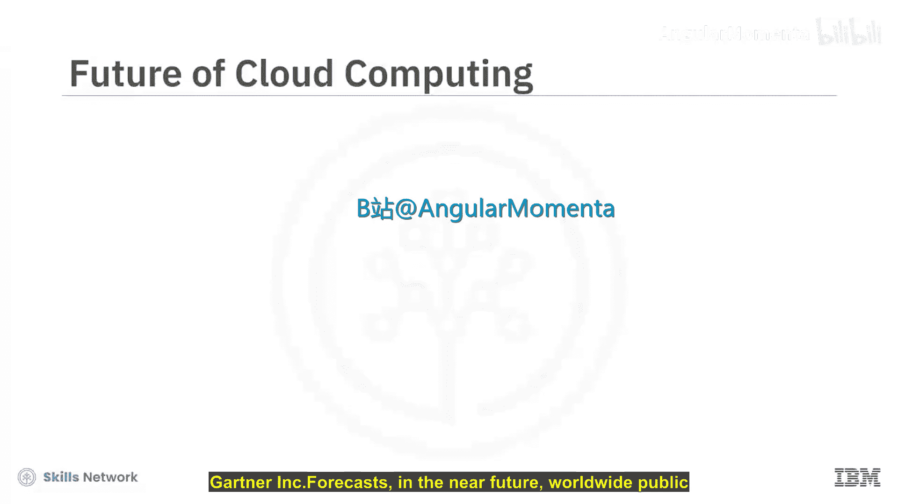

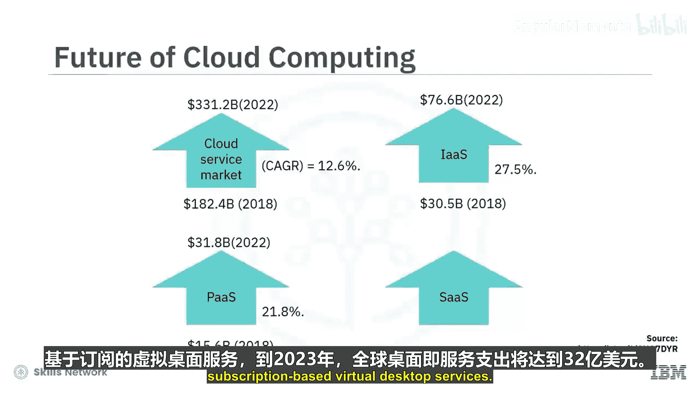

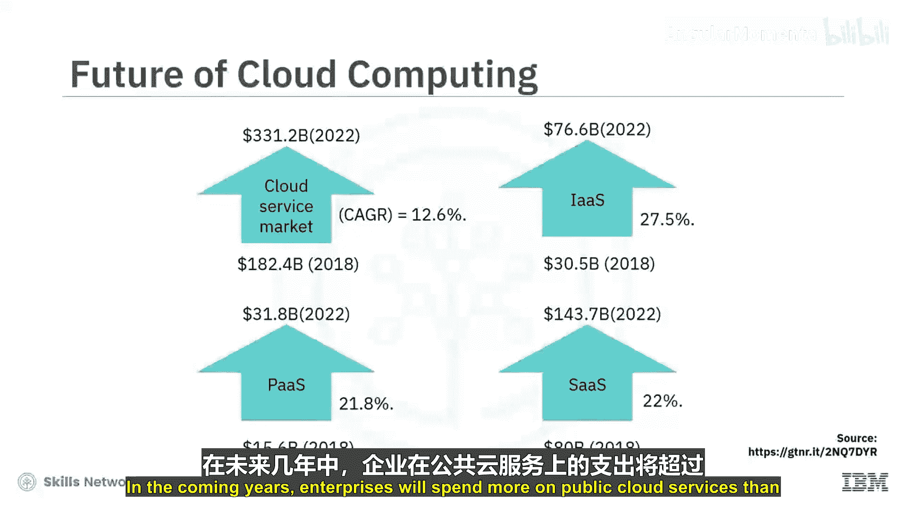

在本节课中，我们将要学习全球云计算市场的规模预测，并了解按字母顺序排列的主要云服务提供商及其核心服务。

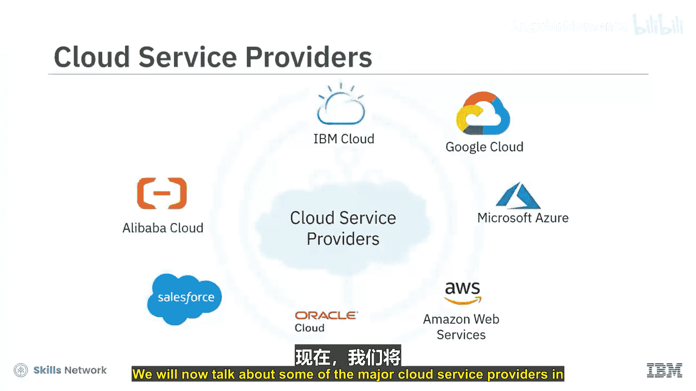

---

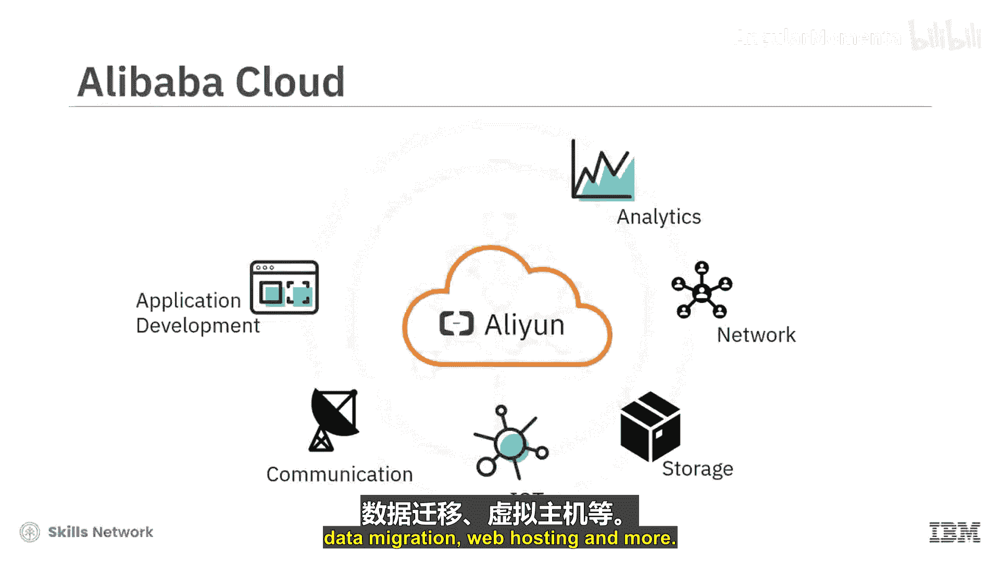

让我们先看一些数据和预测，这有助于我们了解未来几年云计算的预期规模。

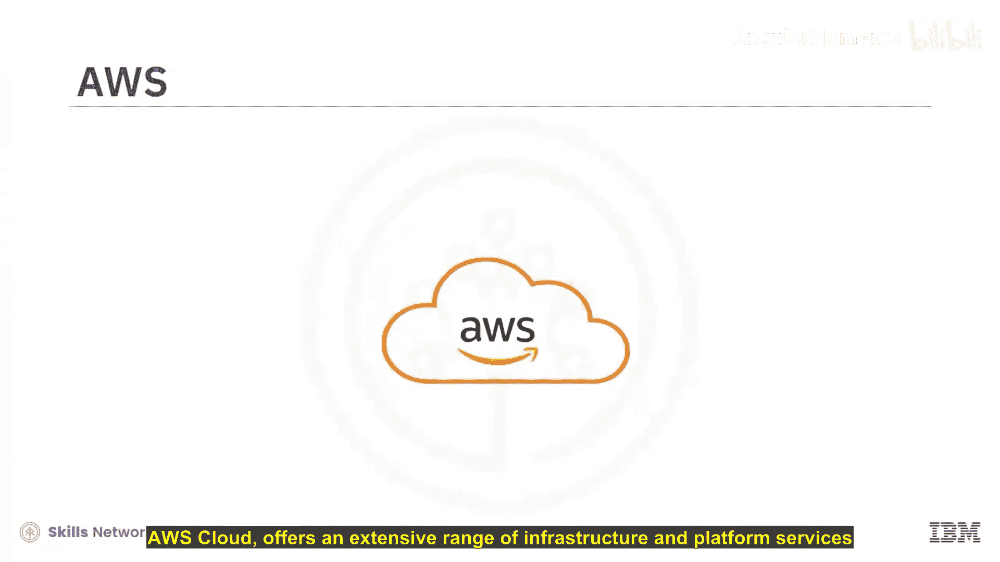

根据Gartner公司的预测，在不久的将来，全球公有云支出将增长20.7%，总额达到5918亿美元，高于前一年的4903亿美元。到2023年，全球桌面即服务（DaaS）的支出将达到32亿美元，因为企业正从传统的客户端计算解决方案转向基于订阅的虚拟桌面服务。

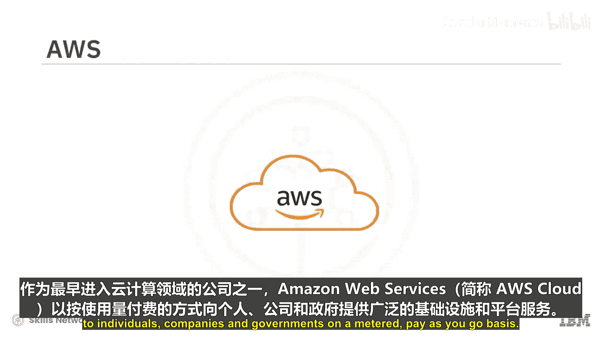

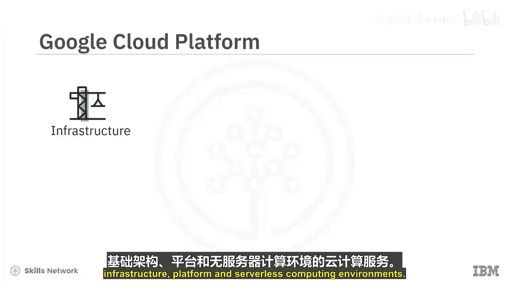

在未来几年，企业在公有云服务上的支出将超过传统IT解决方案。

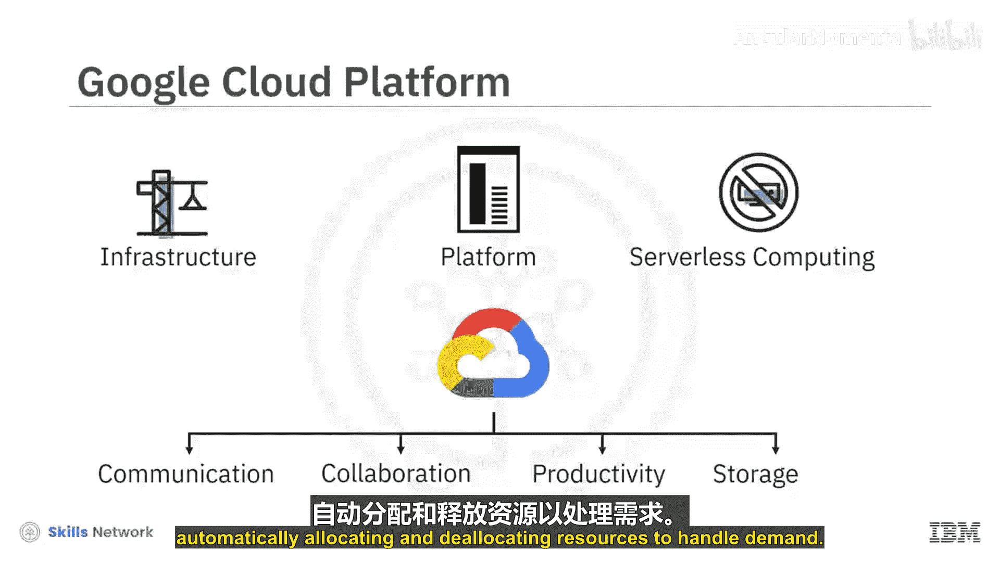

显而易见的是，云计算的普及速度比预期更快，采用率很高，收入也在飙升。如今企业面临的问题不再是是否需要采用云，而是他们的云采用策略应如何制定，才能最好地服务于其业务和客户。推动并引领这一技术浪潮的，是提供广泛服务的云服务提供商。

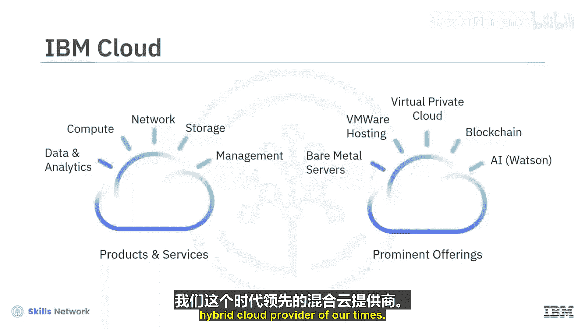

接下来，我们将按字母顺序介绍一些主要的云服务提供商。

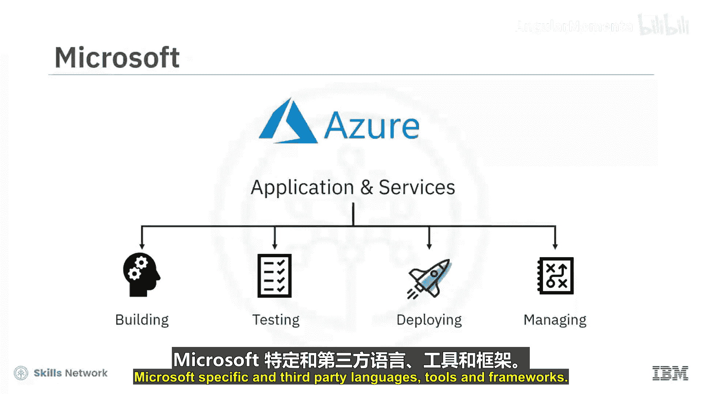

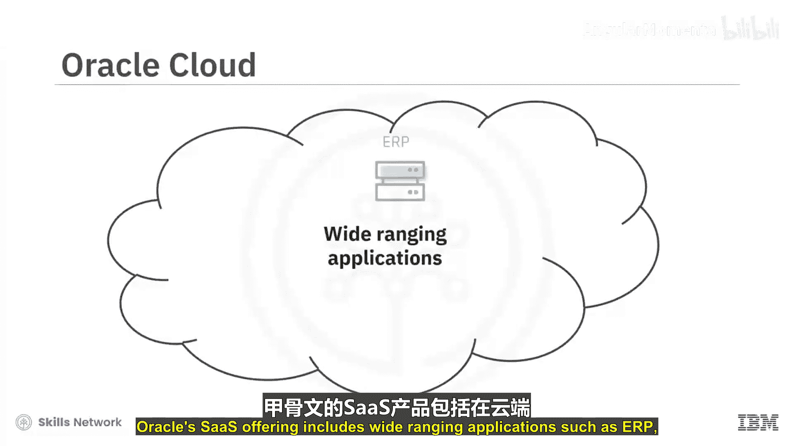

以下是按字母顺序排列的主要云服务提供商列表：

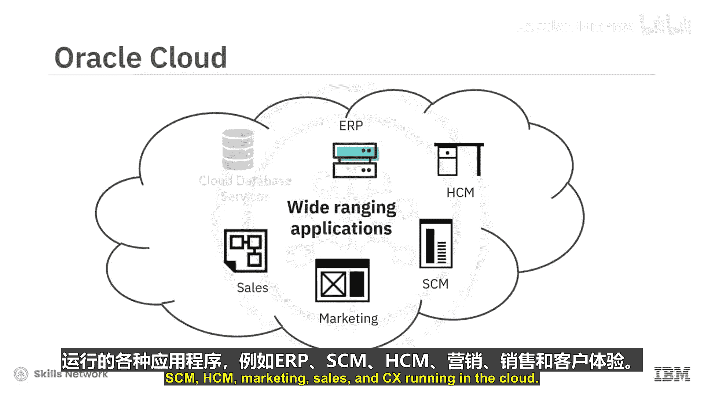

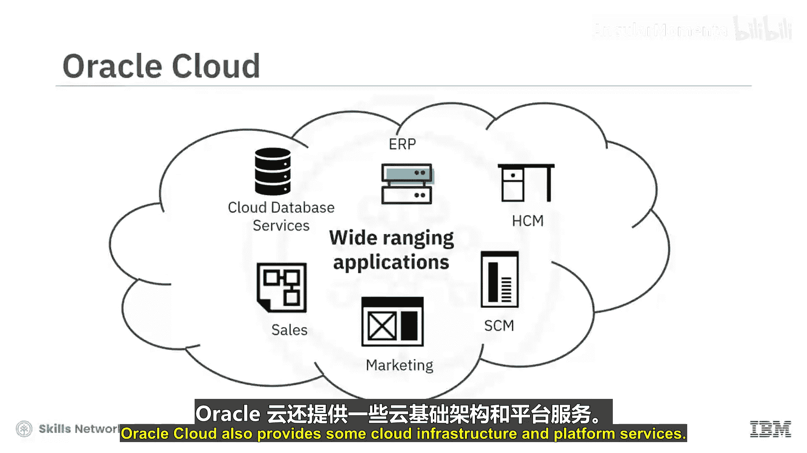

*   **阿里云**：虽然相对较新，但它是中国最大的云计算服务提供商。阿里云提供全面的全球云计算服务套件，不仅为其客户的在线业务提供支持，也为阿里巴巴集团自身的电子商务生态系统提供动力。它提供一系列产品和服务，如计算、网络、存储、安全、监控和管理、通信、分析、物联网、应用开发、数据迁移、网络托管等。
*   **亚马逊云科技**：作为最早进入云计算领域的公司之一，亚马逊云科技（AWS Cloud）向个人、公司和政府提供广泛的基础设施和平台服务，采用按需付费的模式。亚马逊云提供广泛的产品、服务和解决方案，涵盖计算、开发运维、数据、分析、物联网、机器学习、网络、内容分发、机器人技术、无服务器计算等。
*   **谷歌云平台**：谷歌云平台（GCP）是一套云计算服务，提供基础设施、平台和无服务器计算环境。谷歌内部也使用GCP来支持其面向最终用户的产品，如谷歌搜索和YouTube。谷歌云包括G Suite，提供通信、生产力、协作、存储等产品。Google App Engine是一个在谷歌管理的数据中心开发和托管Web应用程序的平台，可自动分配和释放资源以应对需求。
*   **IBM Cloud**：IBM Cloud是一个全栈云平台，涵盖公有、私有和混合环境，其产品和服务覆盖计算、网络、存储、管理、安全、开发运维和数据库。其突出的产品包括裸机服务器、VMware、用于应用现代化的Cloud Packs、虚拟私有云，以及人工智能、物联网、区块链、数据和分析等新兴技术套件。通过收购红帽，IBM也正将自己定位为当今领先的混合云提供商。
*   **微软 Azure**：微软Azure是一个灵活的云平台，用于通过微软管理的数据中心构建、测试、部署和管理应用程序及服务。其数据中心遍布全球多个区域，Azure提供了全球覆盖和本地存在。它提供软件、平台和基础设施服务，支持微软特定及第三方的语言、工具和框架。
*   **甲骨文云**：甲骨文云主要以软件即服务（SaaS）和数据库即服务（也称为Oracle Data Cloud）而闻名。甲骨文的SaaS产品包括在云中运行的广泛应用程序，如ERP、供应链管理、人力资本管理、营销、销售和客户体验。Oracle Data Cloud提供了最大的基于云的数据管理平台之一，帮助客户为其目标受众个性化在线、离线和移动营销活动。甲骨文云也提供一些云基础设施和平台服务。
*   **Salesforce**：Salesforce专注于其软件即服务产品，重点是客户关系管理，支持企业更好地连接其客户、合作伙伴和潜在客户。Salesforce提供多种云服务，如销售云、服务云和营销云，帮助客户实时跟踪分析、实现客户成功与支持、处理客户投诉，甚至监听客户在社交平台上的声音，并自动将其转接给合适的客服人员以解决问题。
*   **SAP**：SAP以企业软件和应用程序而闻名，例如在云中运行的ERP、CRM、人力资源和财务软件。此外，SAP还提供SAP云平台，用于在SAP管理的安全云计算环境中，以快速的创新周期构建和扩展业务应用程序。

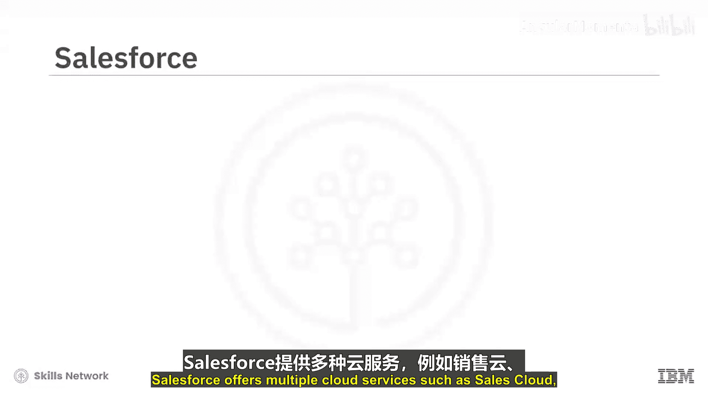

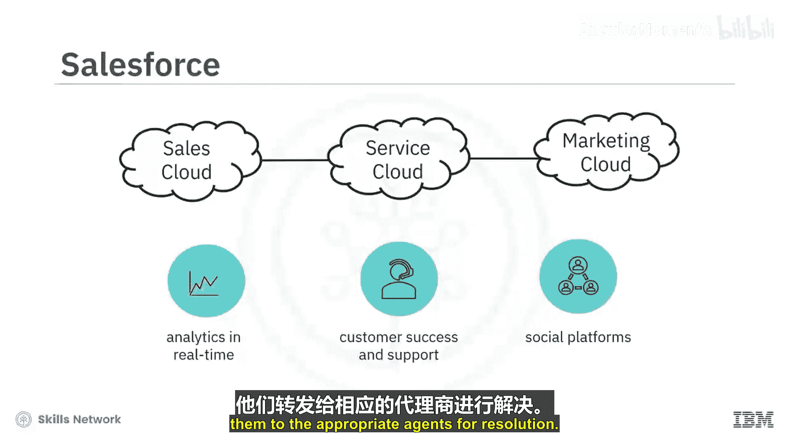

---

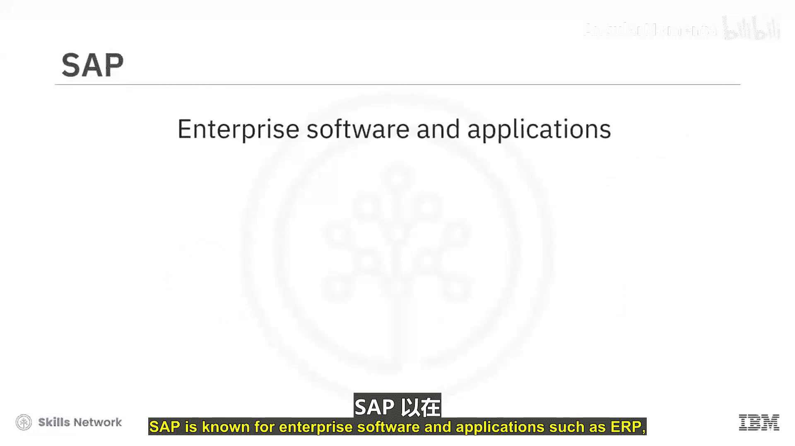

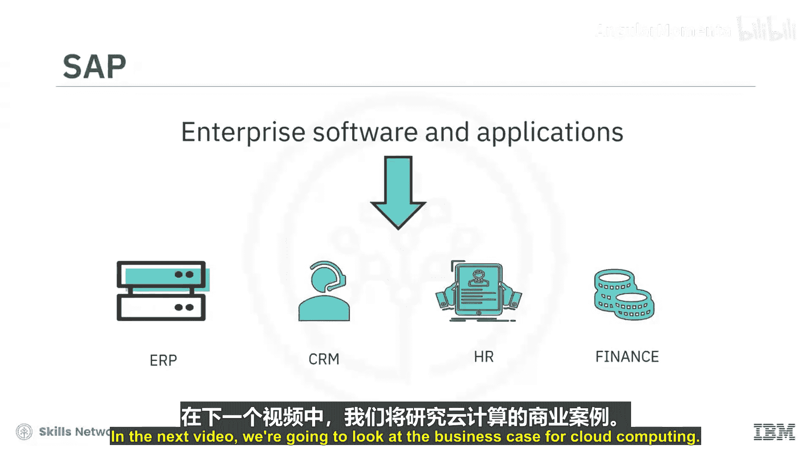

本节课中，我们一起学习了全球云计算市场的增长趋势，并详细了解了阿里云、亚马逊云科技、谷歌云平台、IBM Cloud、微软Azure、甲骨文云、Salesforce和SAP这八家主要云服务提供商的核心服务与定位。在下一节视频中，我们将探讨云计算在商业应用中的具体案例。