# 007：云采用已非选择 ☁️

在本节课中，我们将探讨为什么云采用已不再是未来的选项，而是当今企业保持竞争力和实现增长的核心战略。我们将了解云计算如何缩短价值实现时间、赋能业务创新，并成为数字化转型的基石。

## 云计算的普及与价值实现

从个人到全球性的数十亿美元规模企业，任何人都可以访问其所需的云计算能力。决策到产生价值的滞后时间不再是以年为单位、需要高额前期资本的漫长旅程。云计算使企业能够以较低的风险敞口进行实验、失败和学习，其速度远超以往。

如今，企业拥有更大的自由度来改变方向，而无需承受过去昂贵决策所带来的后果。

## 企业采用云的现状与目标

根据IBM商业价值研究院的一项研究，当今超过四分之三的企业正在使用云计算来拓展新行业。以下是企业采用云的主要目标：

*   **74%** 的企业采用云以改善客户体验。
*   **71%** 的企业利用云来创建增强的产品和服务，同时缩减遗留系统规模并降低成本。

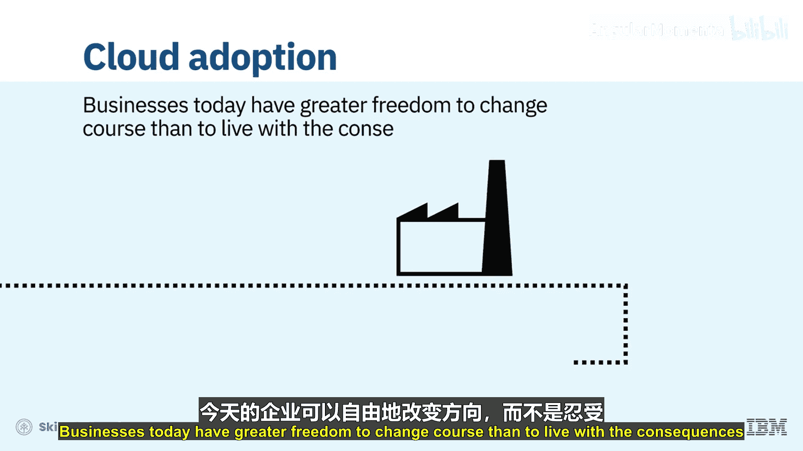

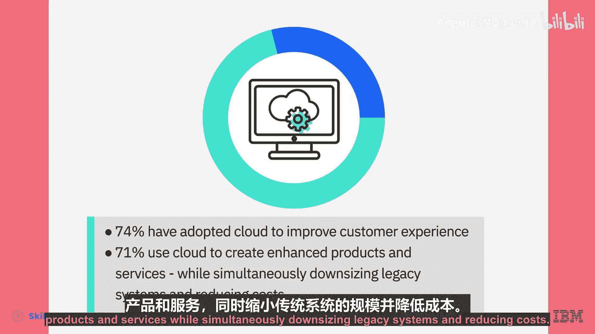

## 保持竞争力的关键能力

为了保持竞争力，企业需要能够快速响应市场变化，利用分析工具理解客户体验，并运用这些洞察来调整其产品和服务。

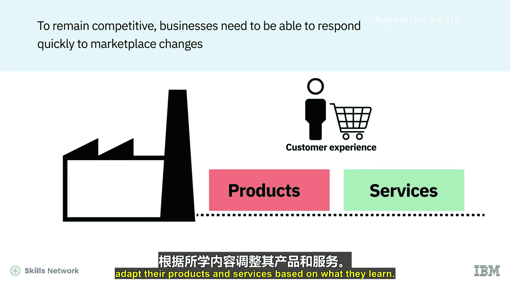

产品生命周期已经缩短，市场准入门槛也已降低。认知赋能的工作流程、应用指数级增长的技术（如人工智能、自动化、物联网和区块链）、跨越新旧解决方案的应用程序，以及开放、混合且安全的**多云基础设施**，是当今实现增长、敏捷性和创新的关键推动力。

`多云基础设施 = 公有云 + 私有云 + 混合云组合`

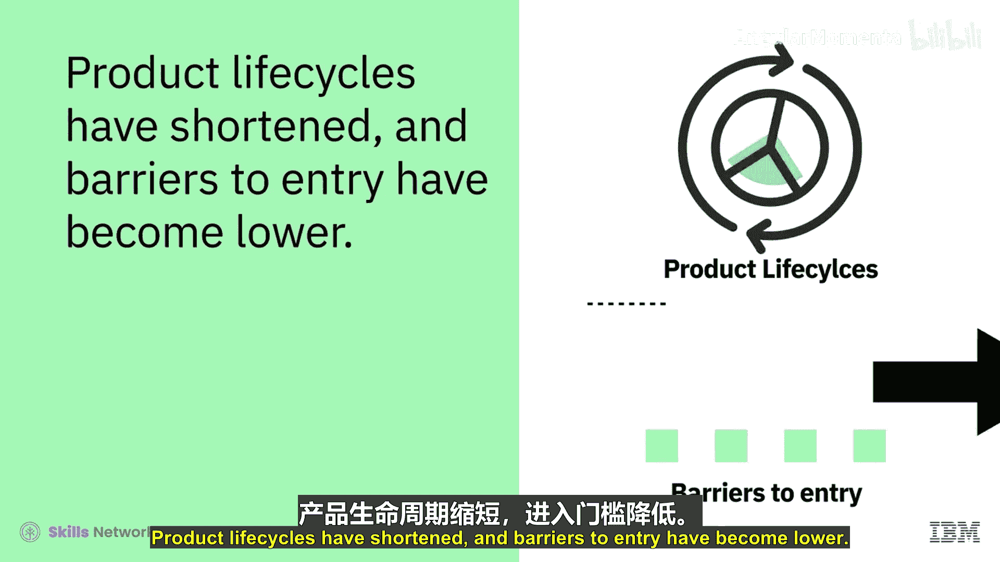

## 云计算：数字化转型的基础

云计算的强大能力、可扩展性、灵活性以及**按使用付费**的经济模式，使其成为数字化转型的底层基础。

`成本模型 = 按实际使用量付费`

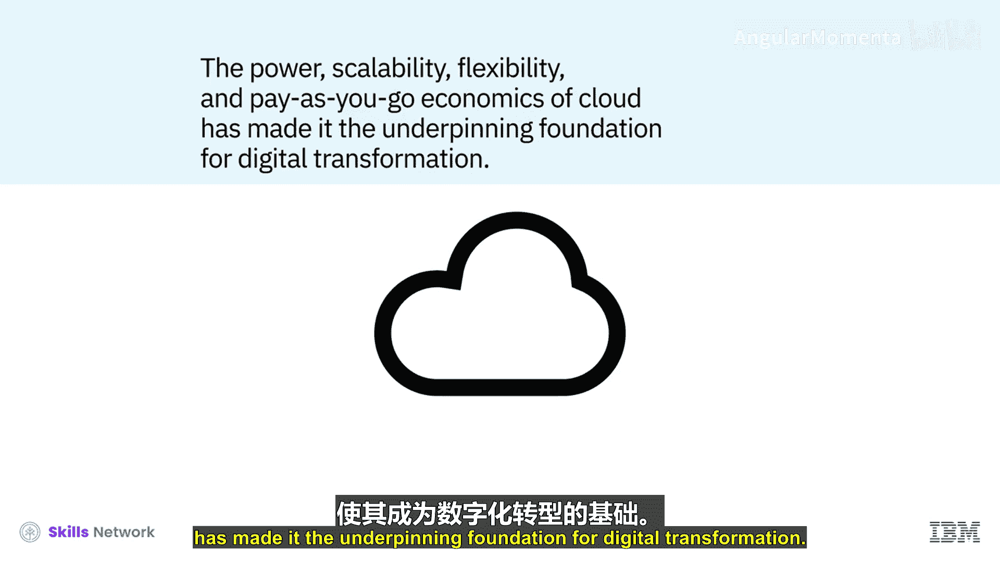

## 数据时代与云战略的核心地位

国际数据公司预测，到2025年，全球创建的数字化数据总量将上升至163泽字节，其中1泽字节相当于1万亿千兆字节，并且这些数据中的30%将是实时信息。考虑到每日产生的数据量空前巨大，以及做出数据驱动决策的能力对任何企业都至关重要，云计算对于企业在当今市场中取得成功、持续发展和参与竞争变得必不可少。

如今，云战略不仅仅是IT战略，更是任何业务战略的核心组成部分。尚未或当前未将云集成到其业务战略中的企业，将面临缺乏竞争力所需的速度、敏捷性、创新和决策能力的风险，同时也将影响其应对数字化颠覆的能力。

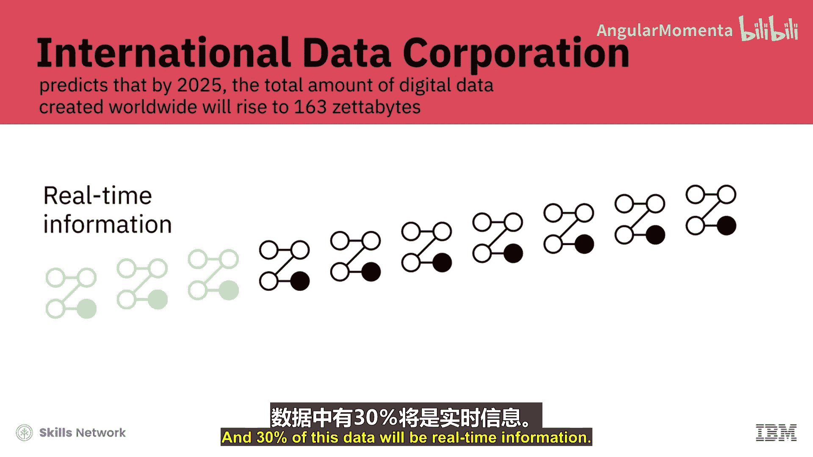

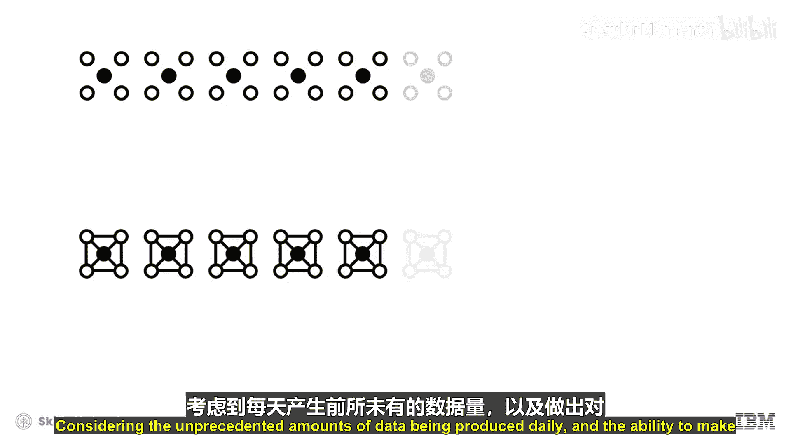

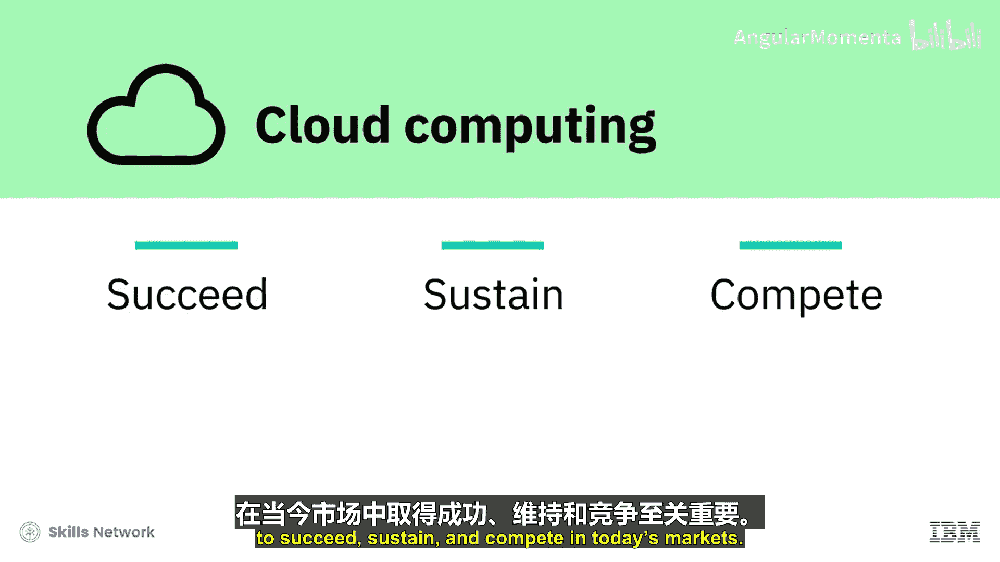

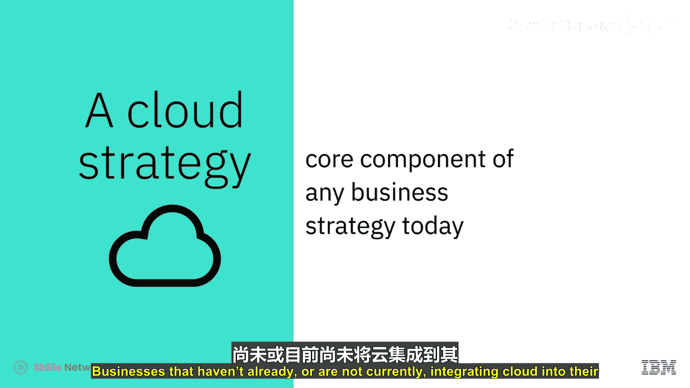

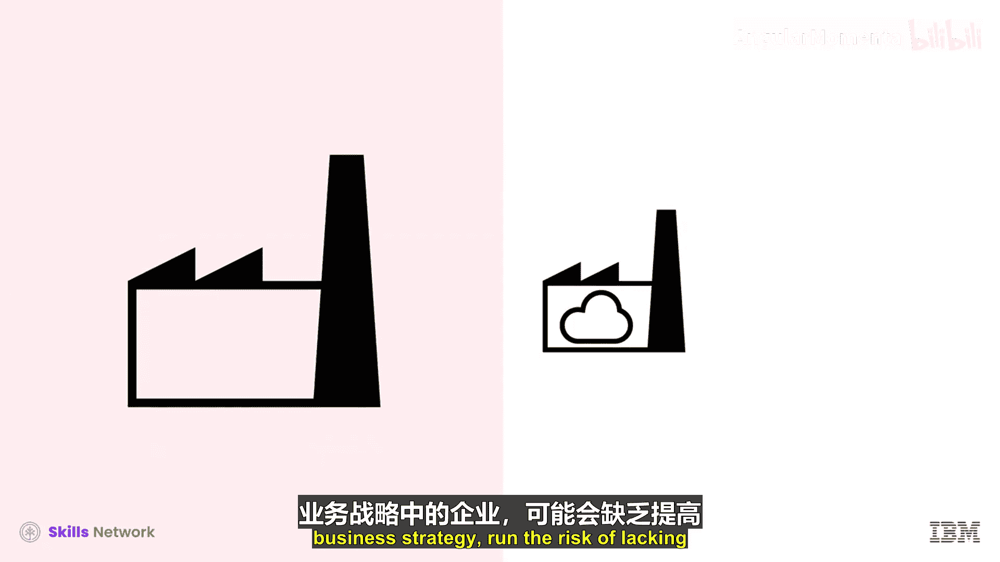

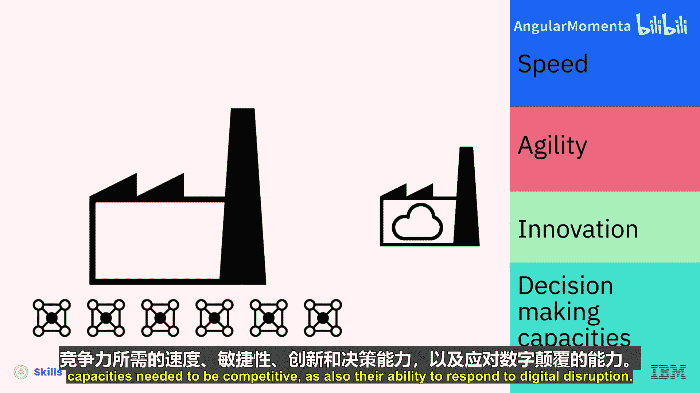

## 总结与预告

本节课中，我们一起学习了云计算为何已成为企业不可或缺的战略选择。我们了解到，云通过其敏捷性、成本效益和创新赋能，正驱动着数字化转型，并帮助企业应对数据洪流和市场快速变化的挑战。

在下一个视频中，我们将通过一些案例研究，来具体看看企业通过采用云计算创造了哪些实际影响。

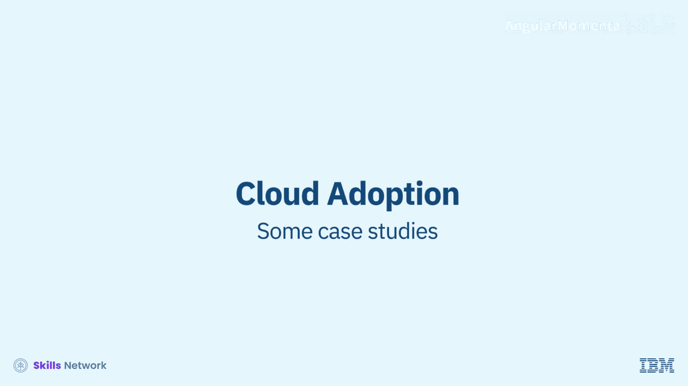

