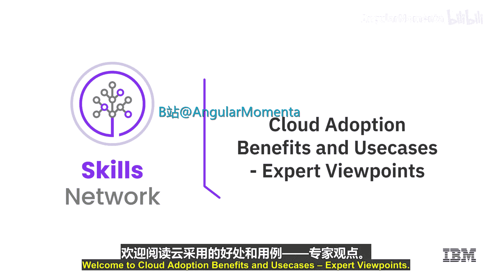
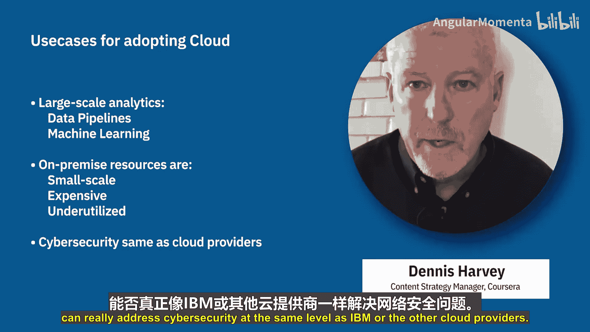
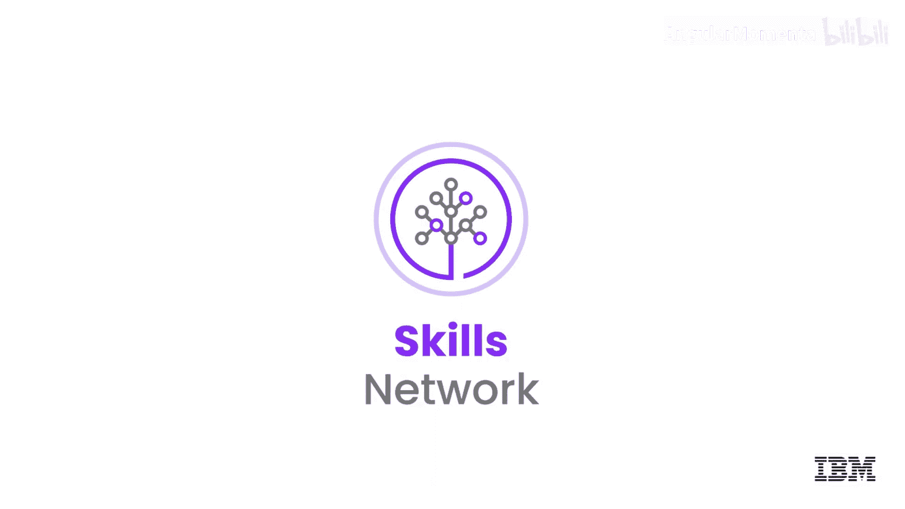

# 008：云采用的益处与应用场景 🌩️

在本节课程中，我们将聆听多位云计算应用专家的见解，共同探讨企业采用云计算技术的主要驱动力及其典型应用场景。

## 概述：为何选择云计算？

上一节我们介绍了云计算的基本概念，本节中我们来看看专家们如何从实践角度阐述云计算的益处。多位专家从速度、成本、专注核心业务等维度，分析了企业拥抱云技术的核心原因。

## 专家观点：采用云计算的核心益处

以下是专家们总结的企业采用云计算最具吸引力的几个理由：

*   **极致的速度与敏捷性**：云计算赋予企业快速前进和增强产品的能力。各行各业都有特定需求，而云中现成的服务与技术已能满足其中许多需求。企业可以站在巨人的肩膀上，无需自行创建AI算法或构建连接互联网的机器，这些服务都已提供。云计算最棒的一点在于，它能让你轻松、快速地启动并运行高度专业化的功能，而自身无需具备该领域的专业知识。
*   **成本效益与弹性**：通过使用云计算，企业只需为实际使用的服务付费，这有助于降低基础设施和运营成本。机器可以在几分钟内部署和使用。基础设施可以弹性伸缩，以满足不断增长的业务需求。由于云计算服务运行在全球多个安全的数据中心，应用程序的网络延迟得以降低，并实现了更大的规模经济。
*   **增强的可靠性与安全性**：云计算使数据备份和恢复服务的成本更低，同时提供了更高级别的安全策略。
*   **聚焦核心业务**：云技术允许企业完全专注于其核心商业模式，而将其他组件交由云处理。例如，如果我的业务不涉及数据库，我就不想操心管理和部署数据库。我可以将其卸载到云端，并为我业务获得一个高可用、分布式的数据库保障。这让我和我的工程师能够专注于对我的应用程序和用户真正重要的事情。
*   **高性能计算的可及性**：借助云端的高性能计算，你可以轻松获得极其快速的计算机集群，并且仅在需要时为其付费。得益于云，规模较小的公司也能够建立高性能计算集群，从而实现快速创新。
*   **低门槛与按需付费**：采用云技术最令人信服的理由之一是通常只需为实际使用量付费。这意味着进入门槛非常低，通常可以按小时计费开始尝试，无需前期成本。
*   **享受高水平服务**：另一个重要原因是利用云所能提供的高水平服务。例如，我需要访问数据库，我希望它们高度可用、快速并定期备份，但我并不从事数据库管理业务。如果我有机会让别人来管理它，我通常会接受。
*   **缩短产品上市时间**：最后是构建新产品的上市时间压力。我们看到许多（或许是大多数）初创公司使用云平台来快速且低成本地构建和部署产品。

## 专家观点：云计算的关键应用场景

在了解了核心益处后，我们来看看专家指出的哪些业务场景特别适合采用云计算。以下是几个典型用例：

*   **业务需要全球覆盖**：当你的业务需要全球布局，而企业很可能负担不起自建全球数据中心的成本时，云计算是一个非常明显的选择。
*   **业务需要弹性资源**：考虑零售和电子商务在需求高峰期的节假日，或现场活动票务、人力资源和医疗保健的年度注册期。基本上，任何需求高度可变或存在峰值的应用程序都适用。
*   **大规模分析与数据处理**：进行大规模分析或开发数据管道及机器学习。本地物理资源可能规模太小、成本太高或利用率不足。
*   **网络安全**：你需要评估你的组织是否真的能够达到像IBM或其他云提供商同等水平的网络安全能力。

## 总结

本节课中，我们一起学习了来自行业专家的观点。他们指出，企业采用云计算的主要驱动力包括**提升速度与敏捷性**、**实现成本优化与弹性伸缩**、**增强安全与可靠性**，以及**专注于核心业务创新**。同时，对于需要**全球部署**、应对**弹性需求**、进行**大数据与AI处理**以及寻求**专业级网络安全**的业务场景，云计算提供了极具价值的解决方案。理解这些益处和场景，有助于我们更好地规划和实践云迁移。