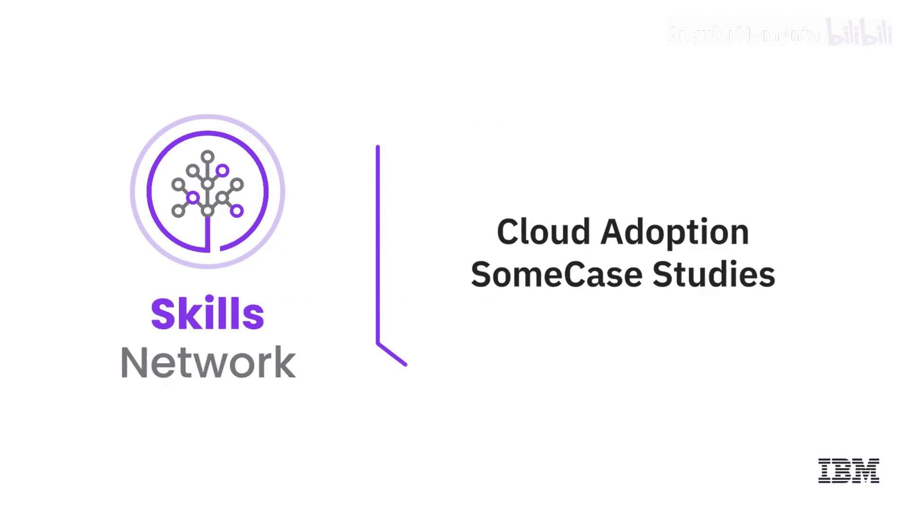
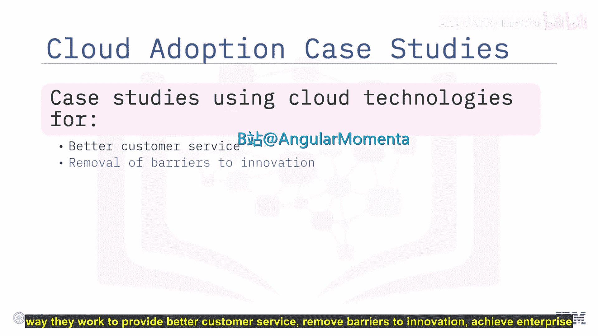
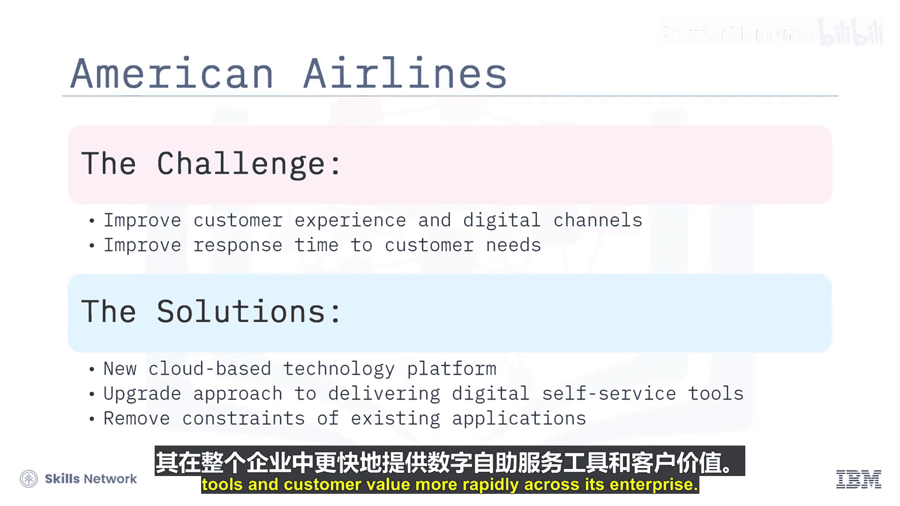
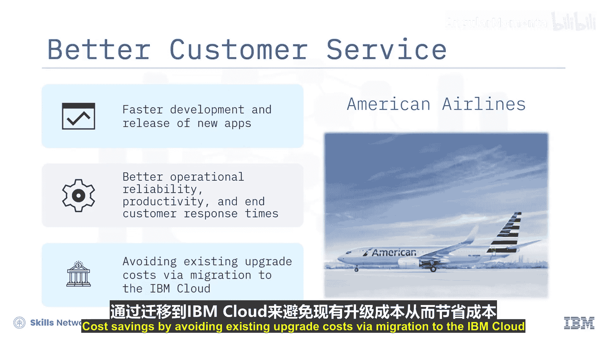
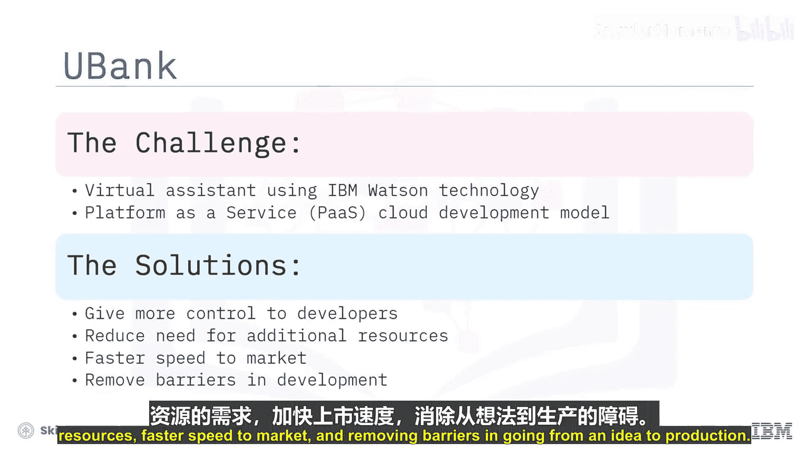
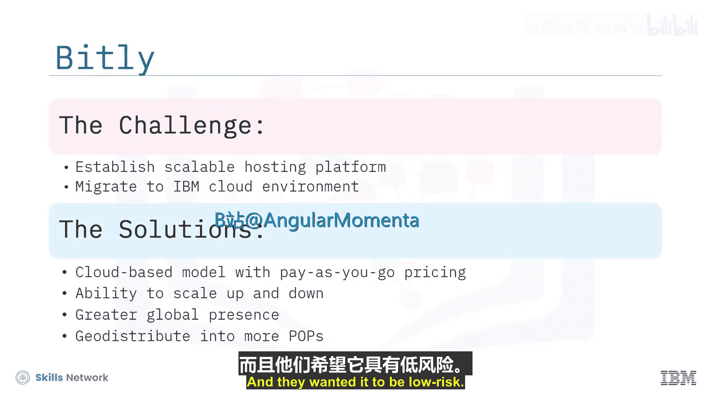
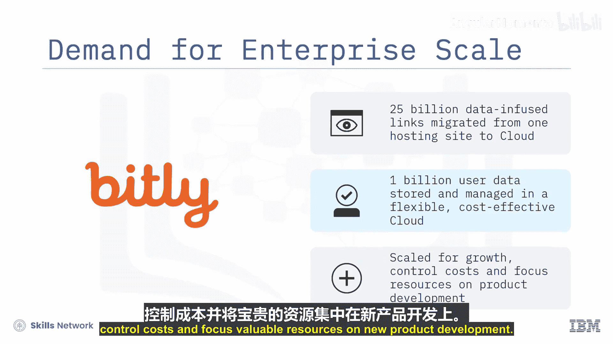
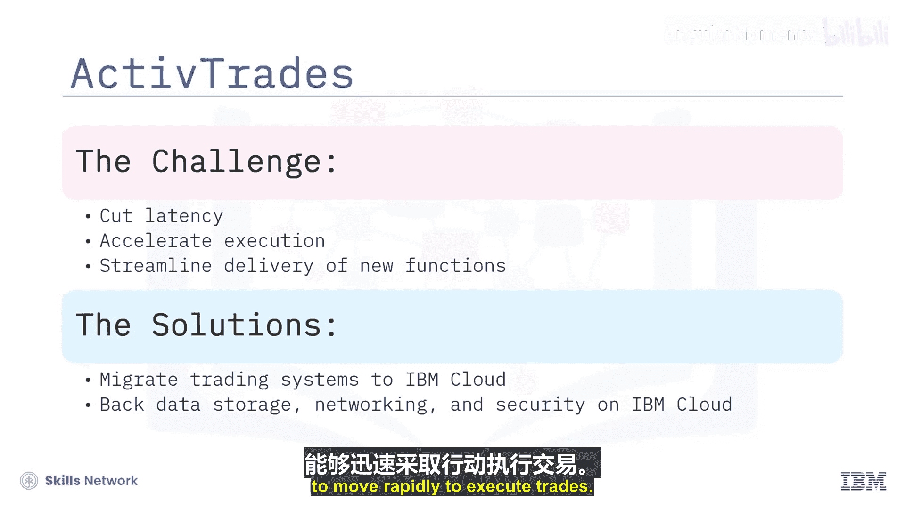
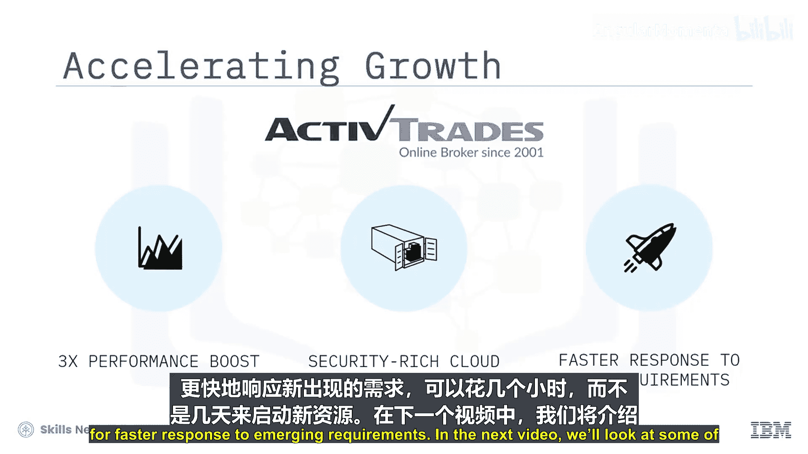

# 009：若干案例研究 📊

在本节中，我们将通过几个领先企业的实际案例，了解他们如何利用云计算技术来转变工作方式，从而提供更优质的客户服务、消除创新障碍、实现企业级规模并加速业务增长。虽然以下案例均来自IBM Cloud，但类似对业务产生显著影响的故事，在使用其他云服务提供商的公司中也普遍存在。

## 提升客户服务 ✈️

在竞争激烈的航空业，客户体验是关键的差异化因素，数字渠道的重要性日益凸显。

为了更迅速地响应客户需求，美国航空公司需要一个全新的技术平台和开发方法，以帮助其在整个企业范围内更快地提供数字自助服务工具和客户价值。

该航空公司认识到，有机会将其基于单体代码的现有面向客户的应用程序，迁移到云上基于云原生的微服务架构，从而摆脱原有架构的束缚。

以下是迁移带来的成果：
*   更快地开发和发布新应用。
*   提升了运营可靠性、生产力和最终客户响应时间。
*   通过迁移至IBM Cloud，避免了原有的升级成本，实现了成本节约。

## 消除创新障碍 💡

UBank作为一个人员编制有自我限制的精益组织，擅长寻找创新方式来满足需求。面对持续寻找更高效运营方式的挑战，UBank的IT团队探索了平台即服务（PaaS）云开发模式。

他们的需求是给予开发者更多控制权，减少对额外资源的需求，加快产品上市速度，并消除从想法到生产部署过程中的障碍。UBank在IBM云平台环境中启动了新项目，其中包括一个融合了IBM Watson技术的虚拟助手，以支持银行的在线住房贷款申请。

以下是采用云平台带来的成果：
*   通过简化开发流程并赋能产品团队的云平台框架，实现了更快的产品上市时间。
*   利用快速、便捷且经济高效的云开发资源，促进了更大的创新。
*   实现了更高效的运营。

## 实现企业级规模需求 🌐

自2008年成立以来，Bitly从一个提供智能链接缩短技术的初创公司，发展成为寻求敏捷、高性价比IT基础设施以支持其向企业产品转型的公司。

Bitly开始规划云迁移。他们的需求是拥有一个按使用付费的云模型、能够灵活伸缩的能力、更强的全球存在感，以及能够将服务地理分布到更多接入点，并且希望整个过程风险较低。Bitly迁移到了IBM云环境，建立了一个可扩展的托管平台，为全球企业客户提供低延迟服务。

以下是迁移成果：
*   将250亿个数据丰富的链接从一个托管站点迁移到全球拥有数据中心位置的云基础设施。
*   用户交互数据存储和管理在灵活、经济高效的云对象存储环境中。
*   转变了IT运营模式，以支持业务增长、控制成本，并将宝贵资源集中用于新产品开发。

## 加速业务增长 📈

金融交易员对交易系统的速度和可用性要求极高，盈利能力往往取决于分秒之间的决策。作为外汇、大宗商品、股票、加密货币、指数和其他金融工具的领先在线经纪商，Active Trades使投资者能够在众多金融市场进行买卖。投资者需要可靠地获取准确的市场信息，并具备快速执行交易的能力。

随着客户群的增长，Active Trades希望降低延迟、加速执行并简化新功能的交付。Active Trades将三大主要交易系统从本地基础设施迁移到了IBM Cloud for VMware解决方案，并依托IBM Cloud上的数据存储、网络和安全产品。

以下是迁移成果：
*   性能提升高达三倍，帮助客户抓住转瞬即逝的盈利机会。
*   具备超高可用性的安全云平台保护了客户投资。
*   能够在数小时而非数天内启动新资源，以更快响应新出现的需求。

## 总结

本节课中，我们一起学习了四个不同行业的企业如何采纳云计算：
1.  美国航空公司通过云原生架构**提升了客户服务**响应速度与质量。
2.  UBank利用PaaS模式**消除了创新障碍**，加速了产品上市。
3.  Bitly借助云的弹性与全球分布能力，**实现了企业级的规模扩展**。
4.  Active Trades通过高性能云基础设施**加速了业务增长**并提升了交易系统性能。

这些案例表明，云计算能够从客户体验、创新效率、运营规模和业务敏捷性等多个关键维度，为企业带来实质性的转型与价值。

在下一个视频中，我们将探讨云上可用的一些新兴技术及其为企业带来的机遇。