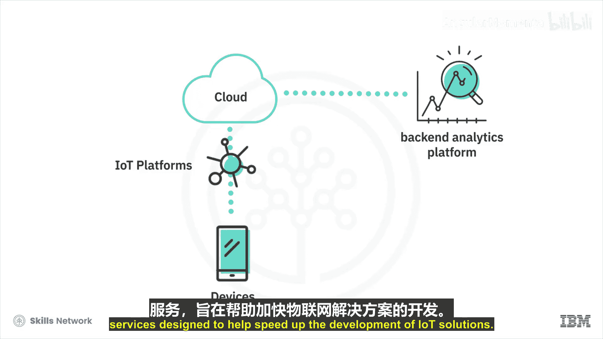
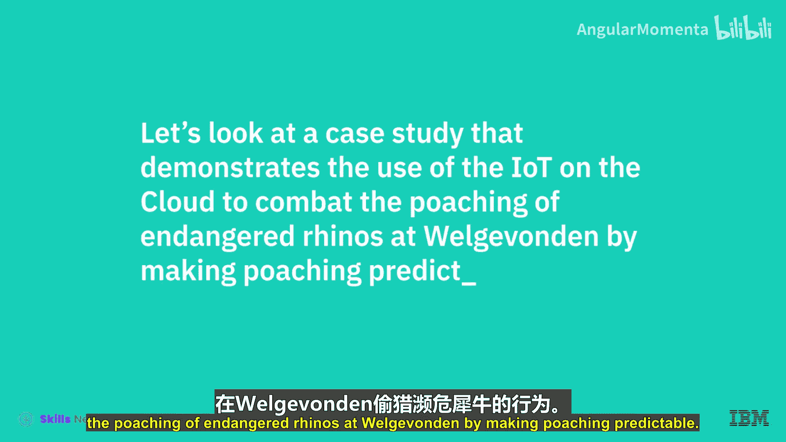
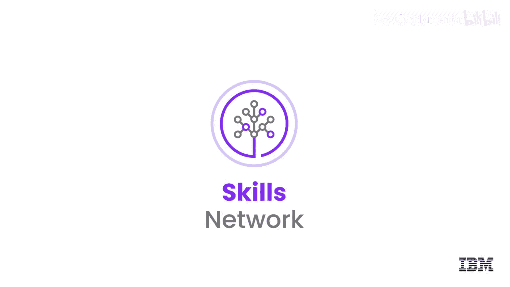

# 010：云端物联网 🌐

在本节课中，我们将要学习物联网如何与云计算相结合，为当今企业创造巨大价值。我们将探讨物联网的基本概念、其与云计算的协同作用，并通过一个实际案例来理解其应用。

在这个新时代，物联网、大数据、人工智能和区块链等技术正在颠覆现有的商业模式和行业，同时为企业创造了前所未有的机会，使其能够实现差异化并为客户创造价值。云资源的强大规模、动态特性和经济性，使得云计算成为采用和演进这些新兴技术的关键推动者。

上一节我们介绍了云计算作为新兴技术基础的角色，本节中我们来看看云计算如何具体赋能物联网。

## 物联网与云计算的结合

物联网是一个由互联的“物”与人组成的巨大网络，它极大地改变了我们的日常生活方式，从驾驶方式到购物方式，从个人健康监测到家庭能源获取。智能设备和传感器持续追踪并收集数据。例如，一栋智能建筑可能拥有数千个传感器，用于测量与热、光、结构和环境刺激相关的各类数据。

前所未有的数据量正在生成，这给互联网带来了巨大压力。此时，云计算的作用便显现出来。

## 云计算的核心作用

云计算通过将物联网设备用户连接到云端，解决了数据处理与存储的挑战。无论是用于设备注册、设备身份验证、存储数据还是访问企业数据，通过物联网设备收集的数据都在云端进行存储和处理。

由于物联网设备可能处于移动状态，云端充当了最近的数据收集点，从而最大限度地减少了数据上报的延迟，并能快速向物联网应用返回响应。

因此，从完全运行在云端的物联网平台，到客户与这些设备交互所使用的界面，再到后端分析平台，云计算都为其提供了支持并使其成为可能。

以下是云计算赋能物联网的几个关键方面：
*   **数据存储与处理**：海量的物联网数据在云端进行集中存储和高效处理。
*   **降低延迟**：云端作为就近的数据收集点，减少了数据传输和响应时间。
*   **平台支持**：为物联网应用的前端界面和后端分析提供完整的运行环境。

此外，云服务提供商还提供专门的物联网服务，旨在帮助加速物联网解决方案的开发。

## 案例研究：利用云端物联网保护犀牛 🦏

让我们通过一个案例研究，来了解如何利用云端物联网来打击偷猎行为，保护濒危的犀牛，并使反偷猎工作可预测。

犀牛已成为整个非洲因偷猎而濒临灭绝的关键物种之一，目前在南非尤其严重。迄今为止，偷猎者的数量一直在增加，并且他们配备了更具军事化的武器。因此，保护人员也不得不采取同样的方式应对，但这种方式不可持续。更好的唯一方法是引入偷猎者所没有的技术。

现在，这种濒危物种得到了一些意想不到的朋友的帮助——斑马和羚羊。它们佩戴着连接到IBM云的物联网传感器。当偷猎者进入该区域时，动物们会逃跑，从而向护林员发出警报。护林员可以追踪动物的动向，并在任何伤害发生之前阻止偷猎者。这是一种帮助增加犀牛数量、并使偷猎者成为“濒危物种”的智能方式。

本节课中我们一起学习了物联网与云计算的紧密结合。我们看到，物联网产生海量数据，而云计算提供了处理这些数据所需的可扩展性、动态资源和经济效益，是物联网得以广泛应用和发展的关键。通过保护犀牛的案例，我们看到了这种技术结合产生的实际社会价值。

在下一个视频中，我们将探讨云端人工智能如何影响企业。