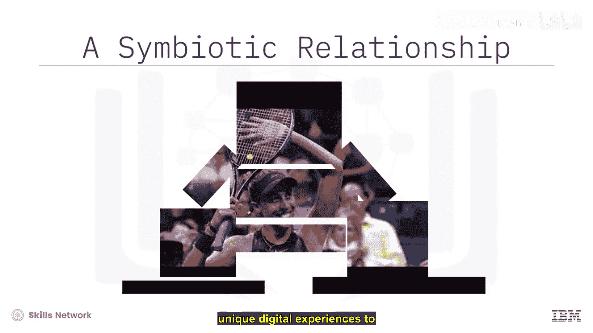
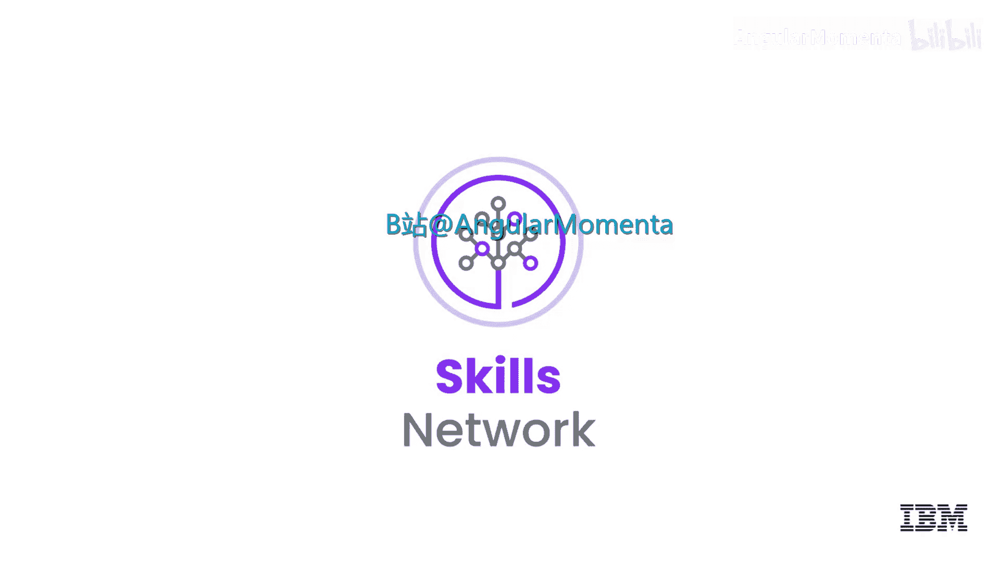

# 011：人工智能在云端 🤖

在本节课中，我们将要学习人工智能如何与云计算结合，并探讨它们与物联网共同构成的共生关系。我们还将通过美国网球协会的实际案例，了解AI在云端的具体应用。

## 概述

理解海量数据流是人工智能的用武之地。如今，许多AI应用之所以成为可能，正是依赖于云平台提供的可扩展、按需供给的计算能力。AI、物联网和云计算三者之间存在着紧密的联系。

## AI、物联网与云的共生关系

上一节我们介绍了AI与云的关系，本节中我们来看看AI、物联网和云如何协同工作。它们之间是一种三向的共生关系。

*   **AI消费物联网数据**：人工智能系统需要处理和分析由物联网设备产生的海量数据。
*   **物联网响应AI决策**：物联网设备的行为可以根据AI系统的分析结果进行调整和优化。

例如，智能助手这类常见的物联网设备，会随着使用时间的增长不断学习用户的偏好，如喜欢的歌曲、家庭温度设置、偏好的用餐时间等。久而久之，它们便能根据用户的历史行为预测其下一步动作。

因此，我们看到的是一个**物联网、人工智能和云计算**的共生循环：**物联网提供数据，人工智能驱动洞察**。而这两项新兴技术都借助了**云的可扩展性和处理能力**，为个人和企业创造价值。

## 案例研究：美国网球协会（USTA）

了解了核心关系后，我们通过一个具体案例来看看AI在云端如何落地。美国网球协会利用云端AI为数百万球迷提供独特的数字体验。

每年夏末的两周时间里，全球网球迷的目光都会聚焦于纽约和美国网球公开赛，现场观众数十万，线上观众更是数以百万计。在IBM看来，美网就是数据——比分、统计数据、现场画面和声音。

IBM整合并分析来自球场的实时数据流，通过IBM云平台为全球超过1000万网球爱好者提供独特的数字体验。IBM云是美网的数字基石，它能快速扩展以应对高达**5000%** 的网站流量激增，并确保为全球球迷提供一致的体验。

借助IBM云上的Watson人工智能，美网得以年复一年地用新颖的方式吸引球迷：

以下是美网应用的几项核心AI功能：

*   **Slam Tracker**：分析超过**2600万**个历史数据点，为球迷提供对阵双方的深度洞察，并能实时洞察比赛势头的转换。
*   **AI Highlights**：利用Watson处理数千小时的美网视频。它能“听”到人群的欢呼，“看”到球员的庆祝，并“知道”什么才是精彩的网球集锦。今年，这项AI能力还被赋能给美国球员和教练，用于分析比赛录像，快速找到指导球员成长所需的视频片段。
*   **宾客信息服务**：如果你需要知道在哪里停车、找到好吃的汉堡或购买最新的美网装备，都可以通过美网APP和移动网站中基于Watson的宾客信息服务找到答案。

USTA选择与IBM合作，是因为IBM能帮助他们保持在球迷体验的技术前沿，助力他们采用云和AI等最新技术，并以一种易于访问且引人入胜的方式让数据“活”起来。

## 总结

本节课中我们一起学习了人工智能、物联网与云计算之间密不可分的共生关系。我们看到，**物联网是数据的源头，AI是数据的智慧大脑，而云则是支撑这一切的强劲引擎**。通过美国网球协会的案例，我们具体了解了AI如何借助云的能力，处理海量数据，并创造出真正有价值的智能应用和用户体验。

在下一个视频中，我们将探讨区块链和云端分析技术如何影响商业世界。