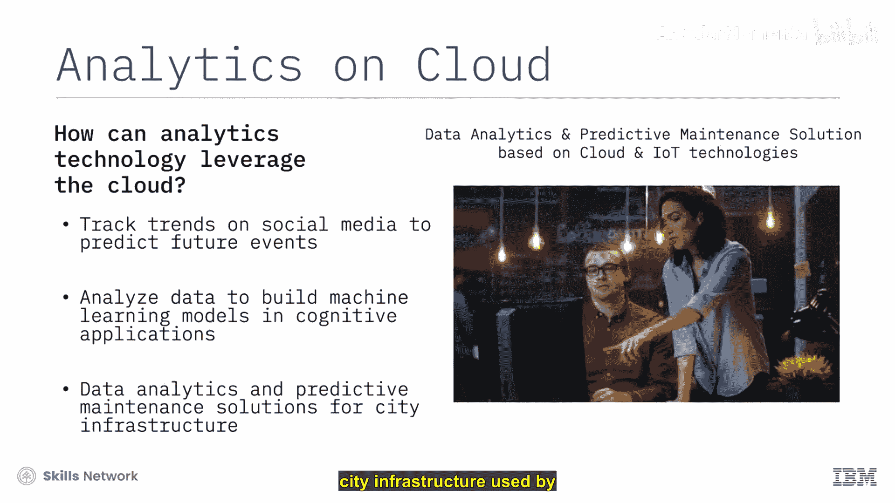
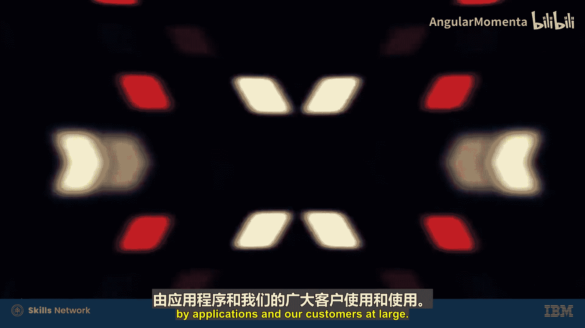
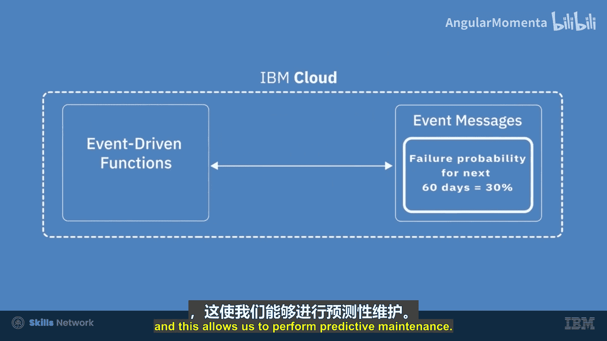
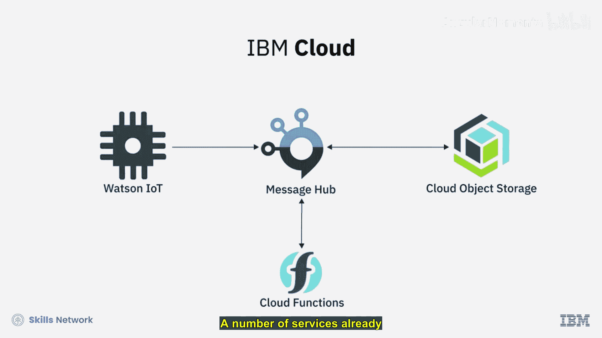

# 012：区块链与云端分析 🚀

在本节课中，我们将要学习区块链技术如何与云计算结合，以及云端分析如何赋能现代业务。我们将探讨区块链的核心特性、其与人工智能（AI）的协同作用，并通过两个实际案例了解它们在提升供应链透明度和实现预测性维护方面的应用。

---

## 区块链：构建信任与透明的分布式账本

区块链是一种安全、分布式、开放的技术，它能帮助加速流程、降低成本，并在交易应用中建立透明度和可追溯性。

它是一个不可篡改的网络，允许成员仅查看与其相关的交易。网络越开放、多样化和分布式，数据和交易中的信任与透明度就越强。

如今，85%的企业依赖多个云来满足其IT需求，其中超过70%的企业使用三个以上的云。这些企业需要能够轻松安全地在多个云之间迁移应用程序和数据，这导致了对构建和管理多云环境业务应用（如区块链）的新兴需求。

---

## 区块链与人工智能的协同

与物联网（IoT）和人工智能（AI）一样，区块链、AI和云计算也构成了一个三方协同关系。

*   **区块链技术** 提供了可信的、去中心化的真相来源。
*   **人工智能** 驱动着从收集到的数据中进行分析和决策。
*   **云计算** 提供了全球分布式、可扩展且经济高效的计算资源，以支持前所未有的数据收集量以及从这些数据中获取洞察所需的处理能力。

区块链通过记录进入AI算法决策的数据和变量，使AI更易于理解，从而提高了这些算法所得结论和决策的信任度与透明度。

---

## 案例研究：区块链保障食品安全 🥗

上一节我们介绍了区块链与AI的协同，本节中我们来看看区块链在云端如何帮助农民减少食品浪费。

通过构建食品供应链的可追溯性和透明度，云上的区块链技术正在帮助农民在发生产品召回时减少浪费。

**农民视角：**
“对我们农民来说，这是我们一生的事业。要知道，全国60%的生菜都产自萨利纳斯。谈到如何照看植物，我总会联想到人类的养育方式。我希望确保所有产品在离开农场前都是安全的。但当召回发生时，完全完好的食物也被浪费了，你必须下架所有产品，无论其生产日期和来源。种植这些产品耗费了资源，现在我们实际上是在消耗未来的食物供应。但我们找到了解决办法。”

**技术解决方案：**
“借助IBM云上的区块链技术，我们能够在几秒钟内追踪我们的产品，让消费者在发生任何召回时能即时查询产品来源。这样我们就不必下架所有食品。拥有这种即时访问能力可以减少浪费。世界上有很多人在挨饿，我希望成为解决这个问题的一代人。”

---

## 云端分析：从数据中获取洞察

云端分析技术利用云端的灵活性、可扩展性和计算资源，从追踪社交媒体趋势以预测未来事件，到分析数据以构建可部署在认知应用中的机器学习模型。

云提供了所需的一体化环境，以利用数据进行持续改进并加速业务增长。

---

## 案例研究：云端物联网与预测性维护 🏙️

了解了云端分析的基础后，我们来看看通力公司（Kone）如何投资云和物联网技术，为每日超过10亿人使用的城市基础设施提供数据分析和预测性维护解决方案。

“在通力，我们制造电梯、自动扶梯、自动人行道和门。所有这些设备都是我们正在收集的数据流。为了处理这些数据流，我们需要一种可扩展的方式来处理涌入的数据量，而云函数（Cloud Function）正好完美契合。我们使用事件驱动架构来处理这些数据。我们利用函数来持久化数据，并基于这些数据生成进一步的事件，这些事件随后被应用程序以及我们分析平台中的客户和用户所利用。”

**以下是分析平台的工作流程：**

1.  **数据收集与处理**：通过云函数和事件驱动架构，处理来自全球设备的实时数据流。
2.  **数据分析**：在分析平台中，我们对数据集进行分析并生成价值。
3.  **预测与维护**：我们能够以一定的百分比预测未来设备可能发生的故障率，这使我们能够执行预测性维护。

“这是我们‘24/7互联服务’背后的整个理念，这是我们向客户做出的承诺，即设备连接到云端并由我们监控，这正是我们为客户创造真正价值的地方。目前，我们几乎使用了IBM云的所有方面，我们使用云存储、云函数、消息服务、物联网服务，平台中已经使用了多项服务，并且随着我们在行业中的数字足迹增长，这种使用只会越来越多。”

---

## 总结

本节课中我们一起学习了区块链技术与云端分析的核心概念与应用。我们了解到：

*   区块链作为一种分布式账本，能增强交易的**透明度**与**可追溯性**。
*   区块链、人工智能与云计算三者协同，能构建更可信、高效的数据处理与决策系统。
*   通过**食品供应链**案例，我们看到区块链如何在实际中减少浪费、建立信任。
*   通过**电梯预测性维护**案例，我们了解到云端分析如何利用物联网数据实现主动服务，创造商业价值。

云计算作为基础平台，为这些创新技术提供了可扩展、灵活且强大的运行环境，共同推动着各行各业的数字化转型。