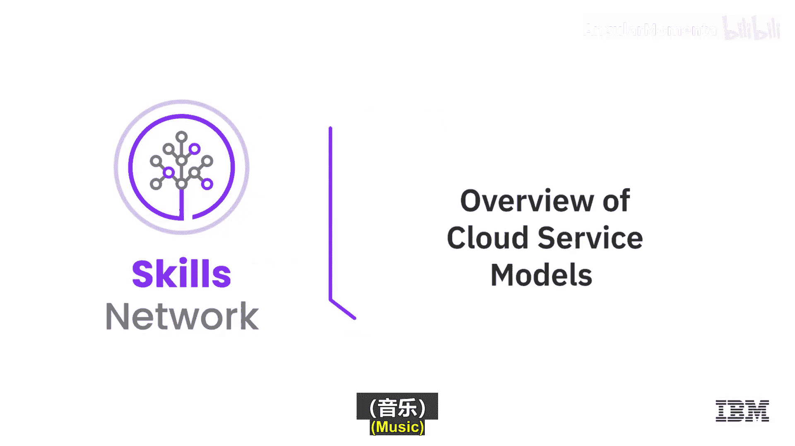
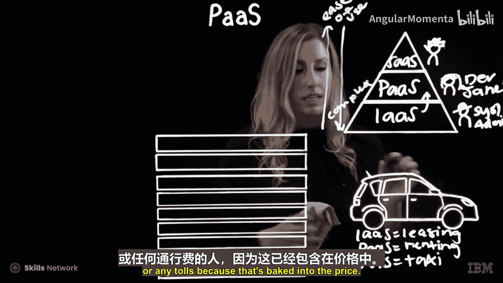
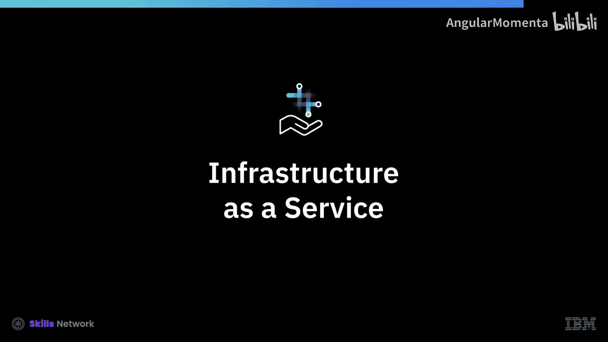

云计算导论：13：云服务模型概述 🏗️

在本节课中，我们将要学习云计算的三种核心服务模型：基础设施即服务、平台即服务和软件即服务。我们将通过概述，了解它们的基本概念、区别以及各自的适用场景。

在之前的介绍性视频中，我们简要提到了云上可用的三种服务模型。在后续视频深入探讨每种模型的细节之前，我们先来快速概览一下这些模型。

**基础设施即服务** 是云服务模型的基础。它是一组由供应商虚拟化的计算、网络和存储资源，用户可以按需访问和配置它们。在设计中，我们通常将使用IaaS的用户角色称为**系统管理员**或**IT管理员**。

**软件即服务** 是最容易理解的一层。它指的是您无需在本地机器上安装或手动更新的软件。使用SaaS的用户可以是任何人。例如，如果您正在YouTube上观看此视频，那么您就是SaaS的用户。SaaS通常采用订阅模式收费，而非一次性许可费。

接下来是**平台即服务**。PaaS利用了IaaS的所有虚拟化资源，但将其抽象化，使用户无需操心管理这些虚拟资源。PaaS的用户通常不是系统管理员，而是**开发人员**。在IBM，我们将这个用户角色称为“Dev Jane”。

整个金字塔隐喻旨在表明，随着您向下移动，您在基础设施资源的知识和管理方面的**复杂性在增加**，同时**易用性在降低**。

为了更形象地解释，我常向团队设计师使用一个关于汽车的比喻。

以下是三种服务模型的类比说明：

*   **IaaS如同租赁汽车**：您需要研究车型、关心规格性能、颜色，并且自己驾驶、支付油费和保养费。
*   **PaaS如同租用汽车**：例如在度假时从机场租车，您不太关心车的颜色或规格，但仍然是自己在驾驶并支付油费和过路费。
*   **SaaS如同乘坐出租车或网约车**：您完全不关心车型和颜色，甚至不是自己在驾驶，油费和过路费都已包含在车费中。

那么，这在云计算及其三种服务模型中意味着什么呢？

在**IaaS**模型中，云提供商管理物理资源（数据中心、冷却、电力、网络、安全）以及计算资源（包括服务器和存储）。

在**PaaS**模型中，提供商除了管理计算资源，还管理平台基础设施，包括操作系统、开发工具、数据库和业务分析工具。

在**SaaS**模型中，提供商除了管理基础设施和平台资源，还托管并管理应用程序和数据。

本节课中我们一起学习了云计算的三种基本服务模型：IaaS、PaaS和SaaS。我们了解了它们从底层基础设施到顶层应用的不同抽象层次，以及各自的目标用户和职责划分。通过汽车租赁的比喻，我们形象地理解了它们之间的核心区别。在下一个视频中，我们将更详细地探讨基础设施即服务，包括其特性、优势和用例。