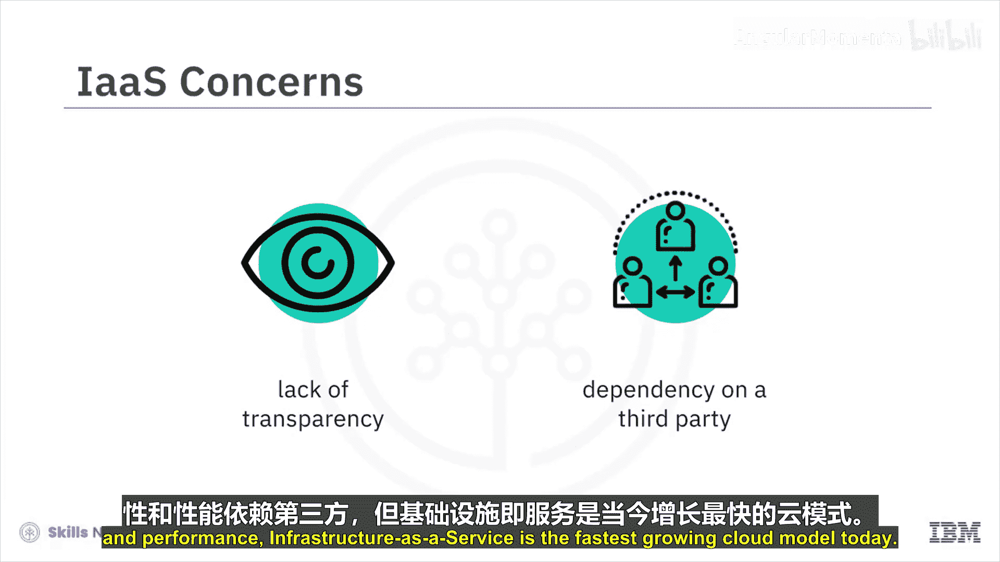
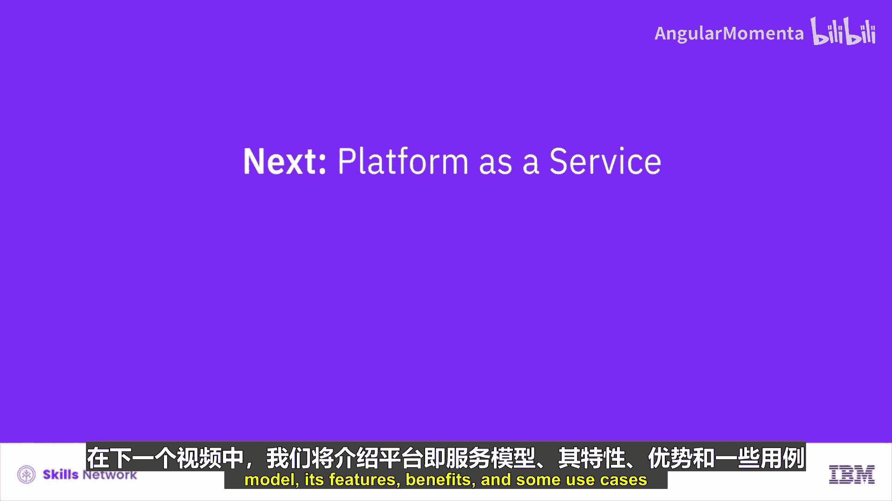
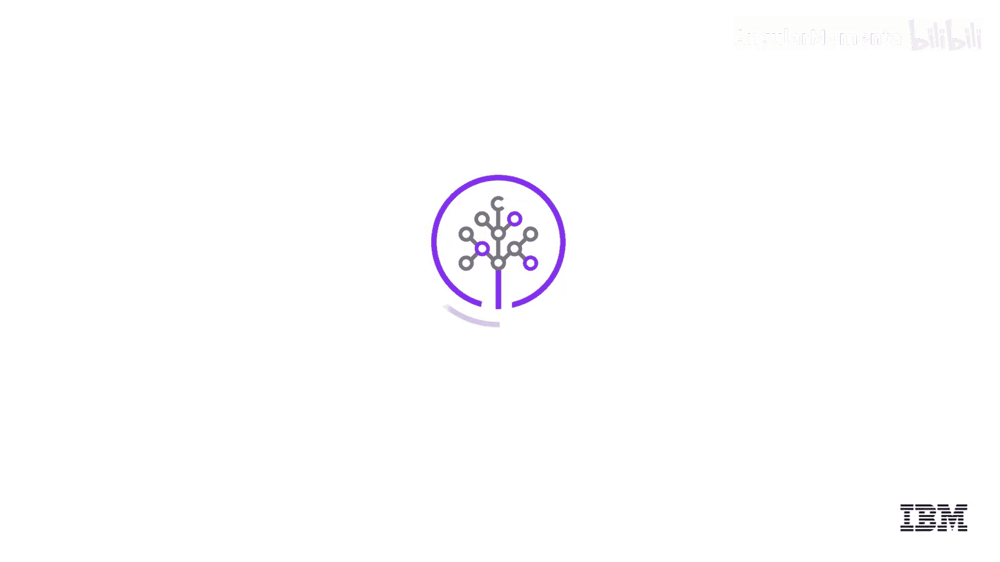

# 014：IaaS - 基础设施即服务 🖥️

在本节课中，我们将详细讨论基础设施即服务模型。IaaS是当今增长最快的云模型之一，它通过互联网按需向用户提供基础的计算、网络和存储资源。

## 什么是IaaS？

基础设施即服务，通常简称为IaaS，是一种云计算形式。它以按需付费的方式，通过互联网向消费者提供基础的计算、网络和存储资源。云服务提供商托管着传统本地数据中心中存在的基础设施组件，以及虚拟化或管理程序层。

在IaaS云环境中，客户可以在云提供商提供的区域和可用区中，按需创建或配置虚拟机。这些虚拟机通常预装了客户选择的操作系统。随后，客户可以在这些虚拟机上部署中间件、安装应用程序并运行工作负载。他们还可以为工作负载和备份创建存储。云提供商通常还提供跟踪和监控其云服务性能与使用情况的能力，并帮助管理灾难恢复。

## IaaS的关键组件

上一节我们介绍了IaaS的基本概念，本节中我们来看看构成IaaS的几个核心组件。以下是IaaS架构中的主要组成部分：

*   **物理数据中心**：IaaS提供商管理着大型数据中心，其中包含支撑上层各种抽象层所需的物理机器。在大多数IaaS模型中，最终用户并不直接与物理基础设施交互，而是将其作为一种服务来体验。
*   **计算资源**：IaaS提供商管理着管理程序（Hypervisor），最终用户可以通过编程方式配置具有所需计算能力、内存和存储资源的虚拟实例。云计算通常还附带自动扩展和负载均衡等支持服务，以提供可扩展性和高可用性。
*   **网络资源**：用户通过虚拟化或编程API访问云上的网络资源。
*   **数据存储**：云数据存储主要有三种类型：对象存储、文件存储和块存储。其中，对象存储是云中最常见的存储模式，因为它具有高度分布式和弹性强的特点。

## IaaS的典型应用场景

了解了IaaS的组件后，我们来看看它在实际中有哪些用途。IaaS支持广泛的应用场景，以下是一些典型的例子：

*   **快速测试与开发**：如今，组织利用云基础设施服务，使其团队能够更快地设置、测试和开发环境。通过抽象底层组件，有助于更快地创建新应用程序。云基础设施帮助开发者更多地关注业务逻辑，而非基础设施管理。
*   **业务连续性与灾难恢复**：业务连续性和灾难恢复需要大量的技术和人员投入。IaaS帮助组织降低成本，并确保在灾难或中断期间，应用程序和数据仍可正常访问。
*   **Web应用托管与扩展**：组织使用云基础设施来更快地部署其Web应用程序，并可根据需求波动灵活地扩展或缩减基础设施。
*   **高性能计算**：组织利用云基础设施的高性能计算能力来解决涉及大量变量和计算的复杂问题，例如气候和天气预测、金融建模。
*   **大数据分析**：挖掘海量数据集以定位有价值的模式、趋势和关联需要巨大的处理能力。云基础设施不仅提供了所需的高性能计算，还使其在经济上变得可行。

## 总结与展望

本节课中，我们一起学习了基础设施即服务模型。我们了解了IaaS的定义、其核心组件（包括数据中心、计算、网络和存储），并探讨了它在测试开发、灾难恢复、Web应用和高性能计算等领域的典型应用场景。尽管存在对云基础设施配置管理缺乏透明度、以及工作负载可用性和性能依赖于第三方等担忧，但IaaS仍是当今增长最快的云模型。

在下一个视频中，我们将探讨平台即服务模型，包括其特性、优势和一些应用案例。