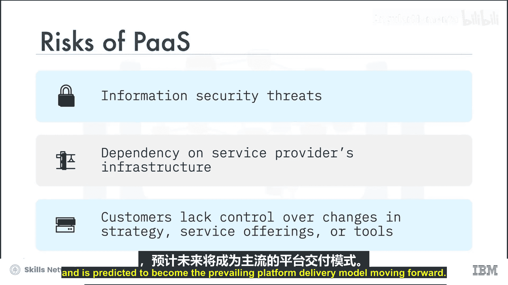
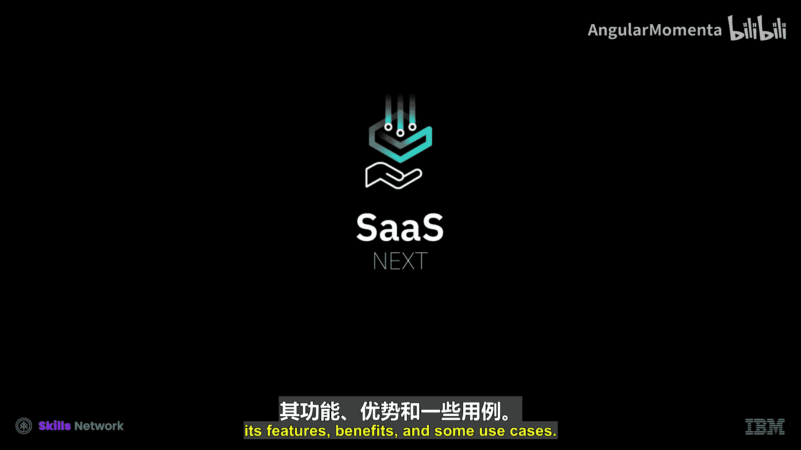
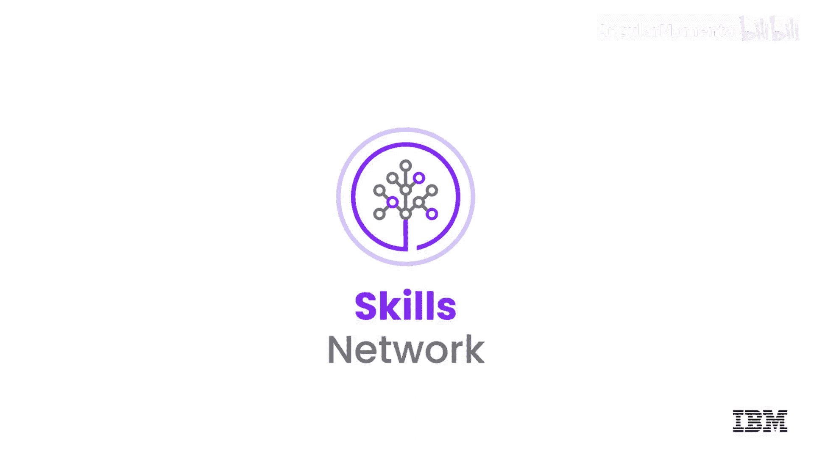

# 015：平台即服务 (PaaS) 🚀

在本节课中，我们将要学习云计算中的一种核心服务模型——平台即服务。我们将了解它的定义、核心特征、典型用例、优势以及需要注意的风险。

---

## 概述

平台即服务，通常简称为 **PaaS**，是一种云计算模型。它为开发人员提供了一个完整的平台，用于开发、部署、管理和运行他们自己创建或从第三方获取的应用程序。

## 什么是平台即服务 (PaaS)？

PaaS 提供商在其数据中心托管一切资源，包括服务器、网络、存储、操作系统、应用程序运行时环境、API、中间件、数据库和其他工具。提供商还负责应用程序基础设施的安装、配置和操作，用户则只需负责应用程序代码及其维护。客户按使用量为此服务付费，并按需购买资源。

与 IaaS（基础设施即服务）相比，IaaS 提供商提供对原始计算资源（如服务器、存储和网络）的访问，而用户需自行负责平台和应用软件。在 PaaS 模型中，云服务提供商交付并管理整个平台基础设施，将用户从环境的底层细节中抽象出来。

## PaaS 的核心特征

让我们看看平台即服务的一些基本特征。

PaaS 云的特点在于它们为用户提供了高度的抽象，消除了部署应用程序、配置基础设施以及配置负载均衡器和数据库等支持技术的复杂性。

PaaS 提供服务和 API，帮助简化开发人员交付具有弹性扩展性和高可用性的云应用程序的工作。

以下是 PaaS 提供的一些典型能力：

*   **分布式缓存、队列和消息传递的 API**
*   **文件和数据的存储服务**
*   **工作负载管理**
*   **用户身份管理**
*   **分析服务**

这些服务消除了集成不同组件的需要。

PaaS 运行时环境根据应用程序所有者和云提供商设置的政策来执行最终用户的代码。许多 PaaS 产品为开发人员提供了快速部署机制或“推送即运行”机制来部署和运行应用程序。

## PaaS 提供的应用基础设施

PaaS 产品支持一系列应用程序基础设施或中间件能力，例如：

*   **应用服务器**
*   **数据库管理系统**
*   **商业分析服务器**
*   **移动后端服务**
*   **集成服务**
*   **业务流程管理系统**
*   **规则引擎**
*   **复杂事件处理系统**

这样的应用程序基础设施通过减少必须编写的代码量，同时扩展应用程序的功能，来协助开发人员。

## PaaS 的主要用例

PaaS 最重要的用例是战略性的：快速且经济高效地构建、测试、部署、增强和扩展应用程序。

让我们看看 PaaS 的一些其他用例：

*   **API 开发与管理**：组织使用 PaaS 来开发、运行、管理和保护 API 及微服务。微服务是松散耦合、可独立部署的组件和服务。
*   **物联网 (IoT)**：PaaS 支持用于物联网部署的广泛应用程序环境、编程语言和工具。
*   **商业分析 (BI)**：PaaS 工具允许组织分析其数据，以发现商业洞察，从而做出更明智的商业决策和预测。
*   **业务流程管理 (BPM)**：组织使用 PaaS 云来访问以服务形式交付的 BPM 平台。
*   **主数据管理 (MDM)**：组织利用 PaaS 云为关键业务数据（如客户交易信息和分析数据）提供单一参考点，以支持决策制定。

## 使用 PaaS 的优势

使用 PaaS 具有多项优势。

**可扩展性**：由于 PaaS 提供的按使用付费模型能够快速分配和释放资源，因此实现了可扩展性。

**提高开发效率**：PaaS 云提供的 API、支持服务和中间件能力，帮助开发人员将精力集中在应用程序开发和测试上，从而缩短其产品和服务的上市时间。中间件能力还减少了需要编写的代码量，同时扩展了应用程序的功能。

**更高的敏捷性和创新性**：使用 PaaS 平台意味着您可以尝试多种操作系统、语言和工具，而无需对这些资源进行投资。您可以用极低的风险来评估和原型化想法，从而更快、更容易、风险更低地采用更广泛的资源。

## 市场上的主要 PaaS 产品

当今市场上一些关键的 PaaS 产品包括：

*   AWS Elastic Beanstalk
*   Cloud Foundry
*   IBM Cloud Paks
*   Windows Azure
*   Red Hat OpenShift
*   Magento Commerce Cloud
*   Force.com
*   Apache Stratos

## PaaS 的风险与考量

PaaS 云确实伴随一些风险，这些是所有云服务普遍存在的风险，例如信息安全威胁和对服务提供商基础设施的依赖。

当服务提供商的基础设施出现停机时，服务可能会受到影响。客户对提供商在其战略、服务产品或工具方面可能做出的变更也没有直接控制权。

然而，其带来的好处可能远远超过这些风险。PaaS 持续经历强劲增长，并预计将成为未来主流的平台交付模型。

---

## 总结

本节课中，我们一起学习了平台即服务模型。我们了解了 PaaS 如何为用户提供一个完整的开发和部署平台，抽象了底层基础设施的复杂性。我们探讨了它的核心特征、提供的中间件服务、主要用例（如API开发、物联网、商业分析等）以及它带来的可扩展性、开发效率提升和敏捷性等优势。最后，我们也简要提及了使用 PaaS 时需要考虑的常见云风险。在下一个视频中，我们将了解软件即服务模型及其特点、优势和用例。