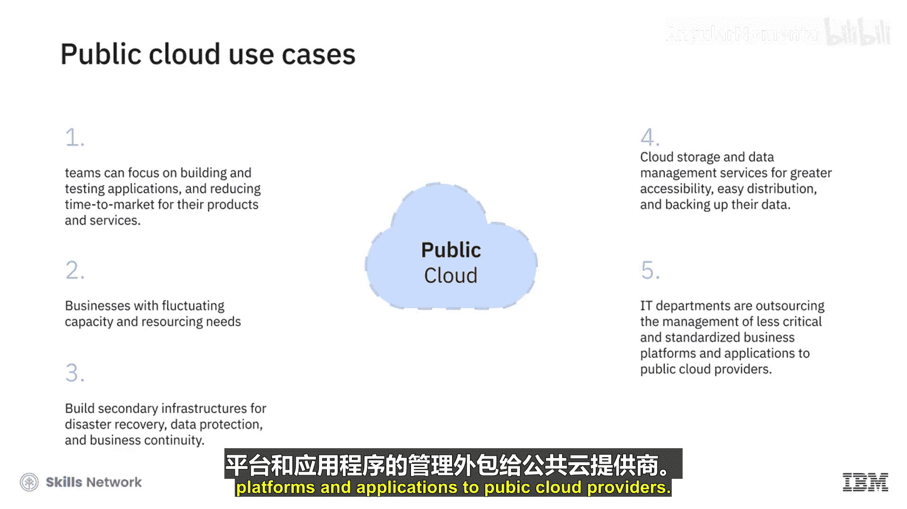

# 017：公有云 ☁️

在本节课中，我们将要学习云计算的四种部署模型之一——公有云。我们将详细探讨公有云的定义、特点、优势、潜在顾虑以及常见的应用场景。

在上一节介绍云计算的视频中，我们简要提到了云计算的四种部署模型。本节中，我们将更深入地讨论公有云部署模型。

部署模型指明了基础设施的所在地点、其所有者和管理者，以及云资源和服务如何提供给用户使用。四种云部署模型包括：公有云、私有云、社区云和混合云。

## 什么是公有云？ 🏢

在公有云模型中，用户通过互联网，从云服务提供商那里获取服务器、存储、网络、安全和应用程序等服务。用户可以通过Web控制台和API来配置他们所需的资源和服务。

云提供商拥有、管理、配置和维护基础设施，并以订阅费或按使用量计费的方式将其租给客户。用户不拥有运行其应用程序的服务器、存储其数据的存储设备，也不管理服务器的操作，甚至不决定平台的维护方式。

这与我们在日常生活中消费和支付水电煤气等公用事业的方式非常相似。我们不拥有任何这些云资源，而是与服务提供商达成协议，使用资源，并为我们在特定时期内使用的部分付费。

## 公有云的特点 📊

以下是公有云的一些关键特征：

*   **虚拟化多租户架构**：公有云是一种虚拟化的多租户架构，允许多个租户或用户共享位于其防火墙之外的计算资源。
*   **资源共享池**：云提供商的资源池（包括基础设施、平台和软件）并非专供单个租户或组织使用。
*   **按需分配**：资源根据需求进行分配，并通过多种订阅和按使用付费模式提供。

## 公有云的优势与顾虑 ⚖️

公有云具有显著的优势，但用户也存在一些顾虑。

### 主要优势

以下是公有云的一些主要好处：

*   **海量按需资源**：可用的按需资源非常庞大，允许应用程序无缝应对需求波动。
*   **显著的规模经济**：考虑到大量用户共享集中的按需云资源，公有云提供了最显著的规模经济效益。
*   **高可用性**：公有云上可用的服务器和网络资源数量庞大，意味着它具有高可用性。如果一个物理组件发生故障，服务仍可在其余可用组件上不受影响地运行。

### 主要顾虑

同样重要的是，要注意用户对公有云的一些担忧，其中关键点在于安全性和数据主权合规性。

*   **安全问题**：诸如数据泄露、数据丢失、账户劫持、尽职调查不足以及系统和应用程序漏洞等问题，似乎是用户对公有云安全性持续存在的担忧。
*   **数据主权合规**：随着数据存储在不同地点并跨越国界访问，公司遵守有关数据存储、传输和安全的数据主权法规也变得越来越关键。服务提供商不仅要跟上法规，还要正确解读这些法规的能力，是许多企业共同关心的问题。

## 公有云的常见用例 💼

让我们看看公有云的一些常见应用场景：

*   **加速应用开发与上市**：越来越多的组织选择访问基于云的应用程序和平台，以便团队专注于构建和测试应用程序，缩短产品和服务上市时间。
*   **应对波动的容量需求**：业务容量和资源需求有波动的企业倾向于选择公有云。
*   **构建灾备基础设施**：组织使用公有云计算资源来构建用于灾难恢复、数据保护和业务连续性的辅助基础设施。
*   **数据存储与管理**：越来越多的组织使用云存储和数据管理服务，以实现更高的可访问性、便捷的分发和数据备份。
*   **外包非核心IT管理**：IT部门将不太关键和标准化的业务平台及应用程序的管理外包给公有云提供商。

## 总结 📝

本节课中，我们一起学习了公有云模型。我们了解到，公有云是由第三方提供商通过互联网向公众提供的计算服务，用户按需付费，无需拥有和维护底层硬件。它具有多租户、资源共享、弹性伸缩和高可用性等优势，但也需关注安全与合规性挑战。公有云广泛应用于快速开发、应对业务波动、灾备和数据管理等多个场景。

在下一个视频中，我们将探讨私有云模型，包括其特点、优势和一些用例。

