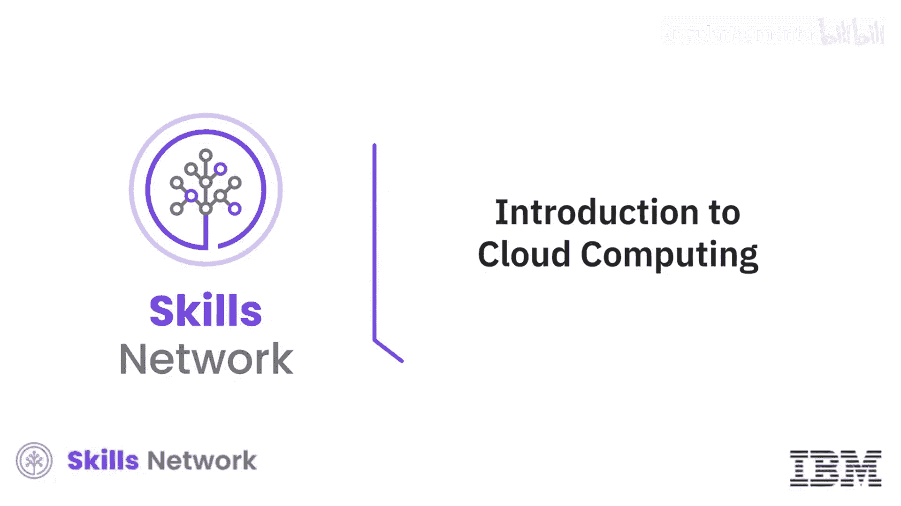
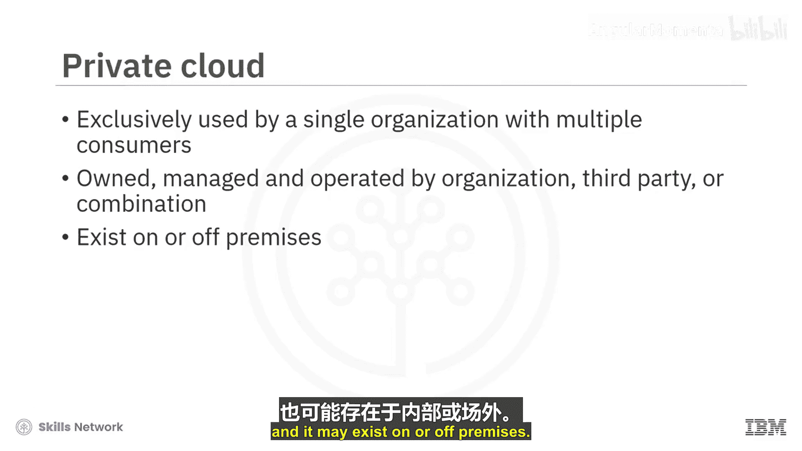
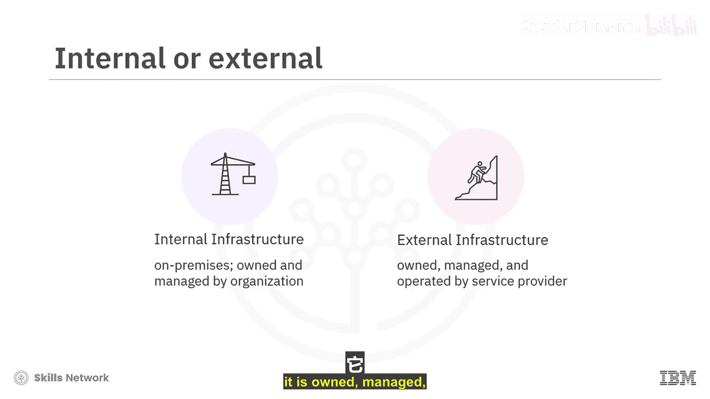
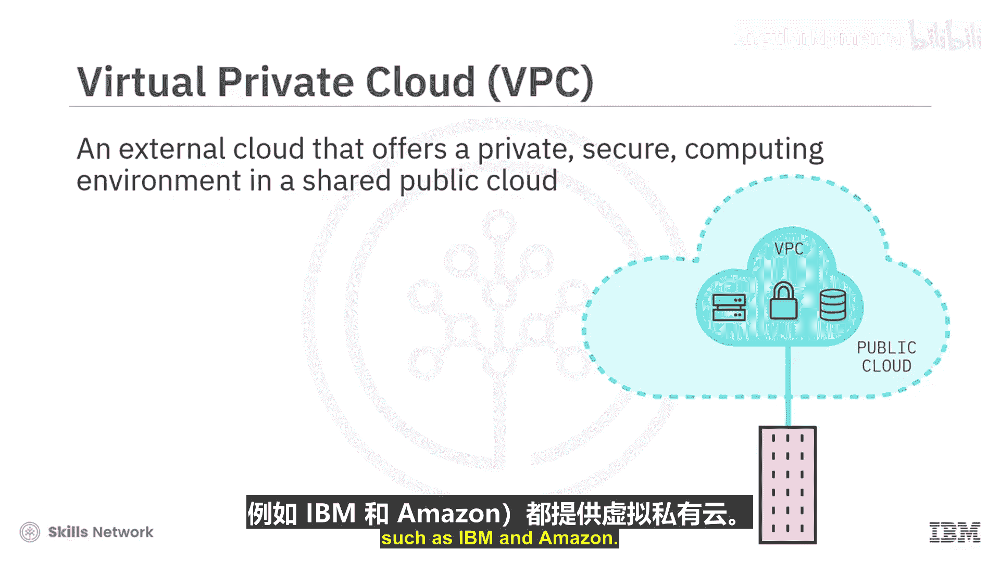
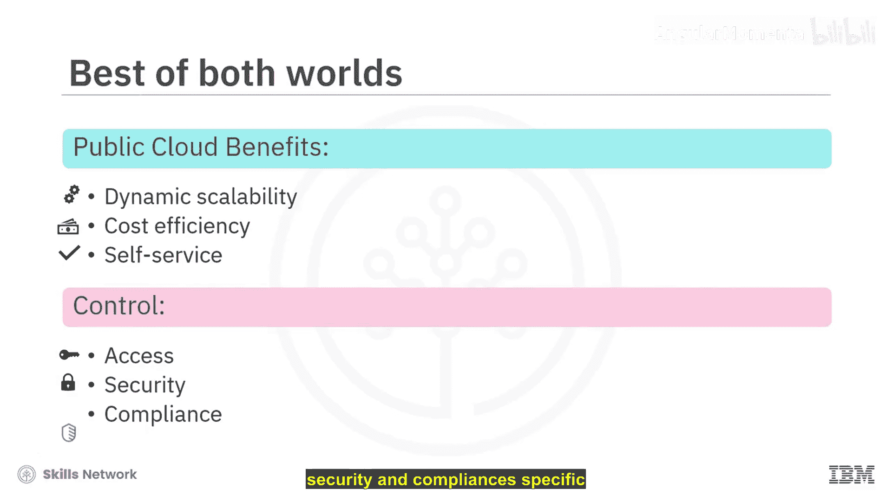
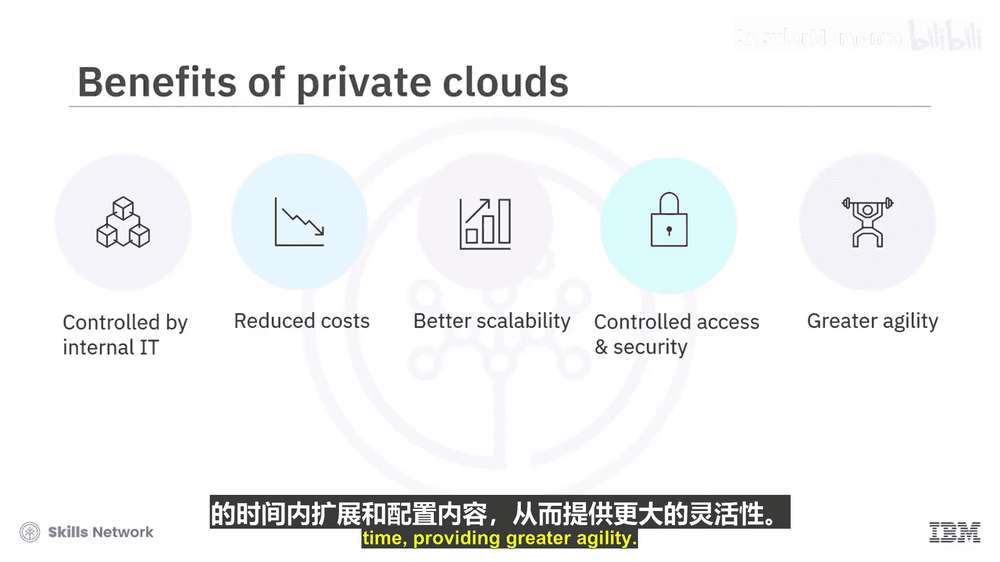
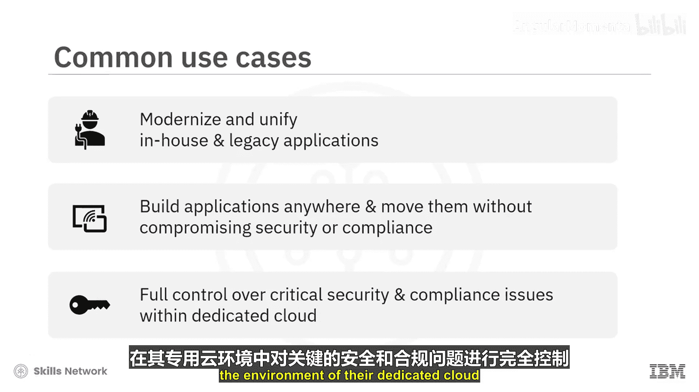

# 018：私有云 🏢

在本节课中，我们将要学习私有云的概念、定义、部署模式、优势以及常见的应用场景。私有云是云计算的一种重要部署模型，为组织提供了对计算资源的专属控制权。

---

美国国家标准与技术研究院将私有云定义为：为单一组织（包含其内部的多个消费者，如业务部门）专门配置的云基础设施。它可能由该组织、第三方或它们的组合所拥有、管理和运营，并且可以部署在本地或异地。

私有云平台可以在内部或外部实现。当平台部署在组织的内部基础设施上时，它运行在本地，并由该组织拥有、管理和运营。当平台部署在云服务提供商的基础设施上时，它则由服务提供商拥有、管理和运营。

这种部署在云服务提供商基础设施上的外部私有云服务，被称为**虚拟私有云**。VPC是一种公共云服务，它允许组织在一个共享的公共云中逻辑隔离的部分，建立自己私密且安全的类云计算环境。

通过使用VPC，组织可以同时利用公共云的动态可扩展性、高可用性和较低的拥有成本，并获得根据组织独特需求量身定制的基础设施和安全性。大多数公共云提供商（如IBM和亚马逊）都提供虚拟私有云服务。

私有云是一种虚拟化环境模型，旨在引入公共云平台的优势，同时避免开放共享的公共平台可能带来的不利因素。组织内的开发人员和业务部门等私有云用户，仍然可以享受规模经济、精细扩展、运营效率和用户自助服务等好处，同时又能完全控制其组织特定的访问、安全性和合规性。

---

上一节我们介绍了私有云的基本定义和VPC的概念，本节中我们来看看私有云能为组织带来的具体优势。

以下是私有云提供的主要价值：

1.  **利用云计算价值**：能够使用由组织内部IT直接管理或在其可感知控制下的系统来利用云计算的价值。
2.  **提升资源利用率**：能够更好地利用内部计算资源，例如组织在硬件和软件方面的现有投资，从而降低成本。
3.  **增强可扩展性**：通过虚拟化和**云爆发**（即在一段时间内利用公共云实例，在需求高峰过后再回归私有云）实现更好的可扩展性。
4.  **定制化控制与安全**：根据特定的组织需求，实施受控的访问和更强的安全措施。
5.  **提升敏捷性**：能够在相对较短的时间内扩展和配置资源，提供更高的敏捷性。

---

了解了私有云的优势后，我们来看看组织选择私有云的常见原因。这些原因通常与组织的核心业务、安全要求和法规遵从性密切相关。

组织可能出于多种原因选择私有云：
*   其应用程序提供了独特的竞争优势。
*   存在安全和监管方面的顾虑。
*   其数据高度敏感，并受到严格的行业或政府法规约束。

---

最后，让我们探讨私有云的一些典型应用场景，以帮助理解其在实际中的运用。

以下是私有云的常见用例：

1.  **应用现代化与整合**：私有云为组织提供了现代化和统一其内部及遗留应用程序的机会。将这些应用程序从专用硬件迁移到云端，也使它们能够利用云端计算资源和多种服务的强大能力。
2.  **混合云集成**：利用私有云，组织正在将其现有应用程序的数据和应用服务与公共云服务进行集成。这使得它们能够利用私有云的计算能力处理大型作业，同时将数据拉入私有云上的应用程序以利用关键的公共云服务，从而有效地开放其数据中心与云服务协同工作。
3.  **应用可移植性**：应用可移植性是云平台的一个关键特性。使用私有云使组织能够随时随地构建应用程序并将其移动到任何地方，而无需在此过程中牺牲安全性和合规性。
4.  **满足安全与合规需求**：一些可能阻止组织迁移到公共云的关键原因包括安全和监管顾虑以及数据敏感性。私有云为这些组织提供了专属企业资源的优势，同时能在其专属云环境内部对关键的安全和合规问题行使完全控制权。

---

本节课中我们一起学习了私有云。我们明确了其定义，了解了它可以通过内部部署或作为虚拟私有云（VPC）在外部提供。我们探讨了私有云在控制、安全、资源利用和敏捷性方面的核心优势，并分析了组织选择私有云的典型原因和实际应用场景。私有云是平衡云计算效率与组织特定控制需求的重要解决方案。