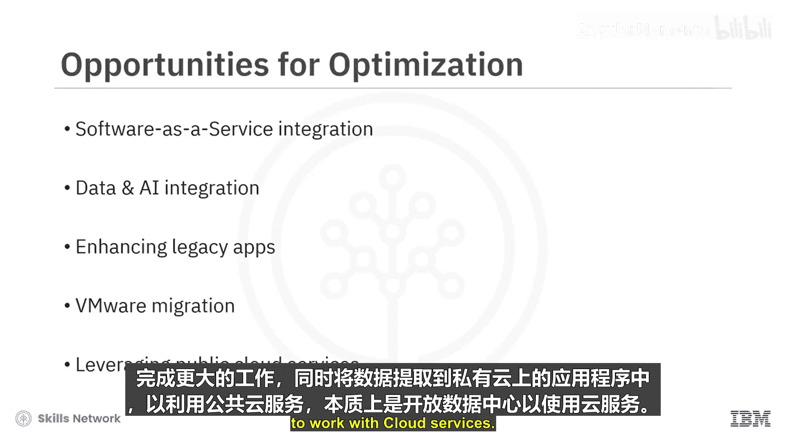
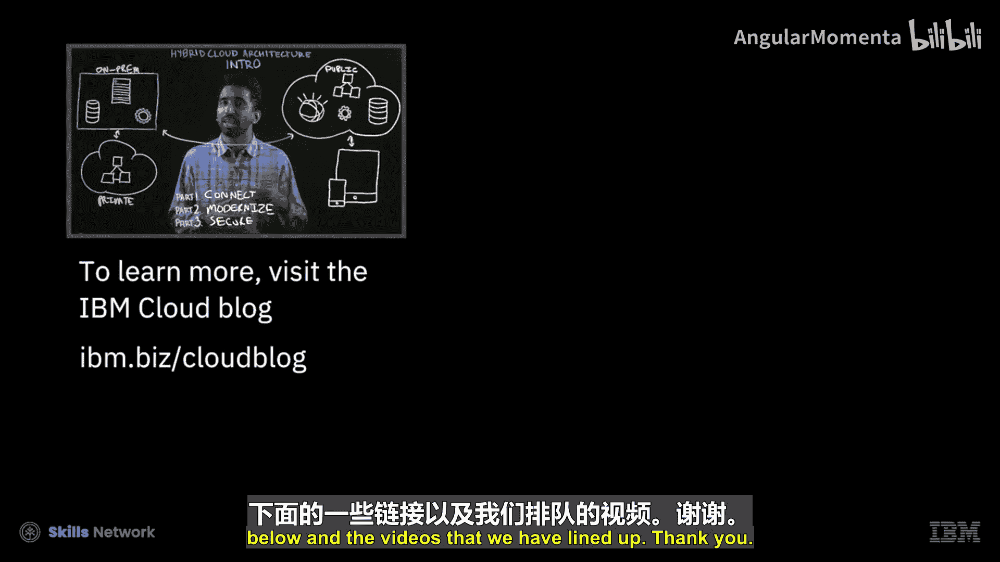
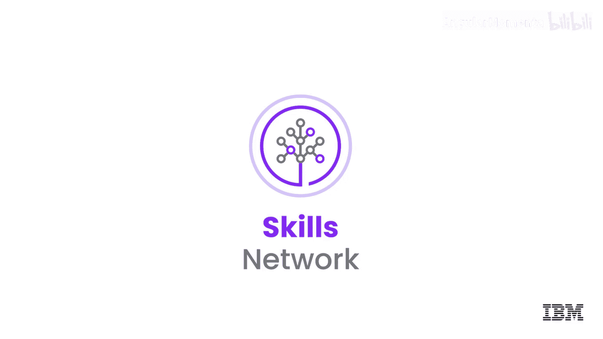

# 019：混合云 🚀

在本节课中，我们将要学习混合云的核心概念、关键原则、不同类型、优势挑战以及常见应用场景。混合云是连接私有云与公有云的计算环境，为组织提供了灵活的基础设施来运行应用程序和工作负载。

## 混合云定义与核心原则

混合云是一种计算环境，它将组织的本地私有云与第三方公有云连接起来，形成一个单一、灵活的基础设施，用于运行组织的应用程序和工作负载。

混合云的关键原则是**互操作性**、**可扩展性**和**可移植性**。

*   **互操作性**：指公有云和私有云服务能够理解彼此的API、配置、数据格式以及身份验证和授权形式。
*   **可扩展性**：当需求激增时，运行在私有云上的工作负载可以利用额外的公有云容量。
*   **可移植性**：由于不再被特定供应商锁定，您不仅可以在本地系统和云系统之间移动应用程序和数据，还可以在不同的云服务提供商之间移动。

## 混合云的类型

上一节我们介绍了混合云的核心原则，本节中我们来看看混合云的两种常见类型。

以下是两种主要的混合云类型：

1.  **混合单云**：指仅与一家云服务提供商构建的混合云。
2.  **混合多云**：指基于开放标准构建的堆栈，可以部署在任何公有云基础设施上。混合多云提供了更高的灵活性，允许组织将工作负载和环境从一个供应商迁移到另一个。

此外，还有一种混合多云的变体，称为**复合多云**。它使这种灵活性更加细化，可以将单个应用程序分布在多个提供商之间，允许您根据需要跨云服务和供应商移动应用程序组件。

## 混合云的优势与挑战

混合云结合了两种环境的优点。它允许组织在私有云中部署受严格监管或敏感的工作负载，同时在公有云上运行敏感性较低的工作负载。

混合云在以下领域提供了显著优势：

*   **安全与合规**：在私有云中处理敏感数据，在公有云中运行其他工作。
*   **可扩展性与弹性**：能够快速、低成本甚至自动地利用公有云基础设施进行扩展。
*   **资源优化与成本节约**：可以最高效地利用基础设施预算，在效率最高的地方维护工作负载，按需使用公有云的“即用即付”模式，并快速采用所需的新工具。

然而，混合云在部署和维护方面既复杂又具有挑战性，因为它涉及策略、应用程序和数据的同步、重定向、延迟、安全性、可移植性、互操作性和兼容性等诸多问题。

## 混合云的常见用例

一个典型的组织会拥有分布在私有云、公有云和传统IT环境中的一系列应用程序和工作负载。这为通过混合云方法进行优化提供了广泛的机会。

让我们来看一些日益常见的混合云用例：

*   **软件即服务集成**：通过混合集成，组织将公有云中可用的SaaS应用程序连接到其现有的公有云、私有云和传统IT应用程序，以提供新的解决方案。
*   **数据与人工智能集成**：组织通过将公有云上的新数据源（如天气、社交、物联网、CRM和ERP）与现有数据及分析、机器学习和AI能力相结合，创造更丰富、更个性化的体验。
*   **增强遗留应用程序**：越来越多的组织使用公有云服务来升级其本地应用程序的用户体验，并将其全局部署到新设备上，同时逐步现代化其核心业务系统。
*   **虚拟机迁移**：越来越多的组织将其本地虚拟化工作负载“直接迁移”到公有云，无需转换或修改，以减少本地数据中心占用空间，并为无需额外资本支出的扩展做好准备。
*   **利用公有云服务**：组织将其现有应用程序的数据和应用服务与公有云服务集成。这允许他们利用私有云的计算能力处理大型作业，同时将数据拉入私有云上的应用程序以利用公有云服务，实质上就是开放其数据中心以与云服务协同工作。

## 混合云架构系列介绍

大家好，我是S Venham，我是IBM的一名开发者布道师。今天，我很高兴为大家介绍一个关于混合云架构的三部分视频系列。

混合云这个概念已经存在相当长的时间了，但我们发现它正越来越多地用于架构设计和现代化现有的或遗留的应用程序。

根据研究，我们发现75%的非云应用程序将在未来三年内迁移到云端。这表明，如果您还没有开始考虑您的混合云策略，您可能已经落后了。

在这个三部分系列中，我想深入探讨构成混合云架构的关键概念。

以下是本系列视频的三个核心部分：

1.  **第一部分：连接**。连接性和互操作性是混合云架构的核心概念。我们需要一种安全的方式来连接运行在不同环境（本地、私有云、公有云）中的服务。利用诸如基于Linux的容器、Kubernetes、Istio以及多集群管理工具、消息代理等开源解决方案，可以帮助您实现混合云架构所需的连接性。
2.  **第二部分：现代化**。对于您可能拥有的现有应用程序，例如单体应用程序，您可能希望将其拆分并迁移到公有云，以便更好地利用公有环境提供的扩展能力。在第二部分中，我将探讨现代化这些遗留应用程序的策略，这是混合云架构的核心部分。
3.  **第三部分：安全**。迁移到混合云可能会让一些人感到担忧，但我们有正确的解决方案来确保您可以利用现有的本地资产及其安全性，同时安全地将部分资产移动到公有云甚至私有云。这使您能够在利用公有云所有资源的同时，仍保持架构所需的安全性。

我相信这个三部分系列将帮助解决您在架构混合云应用程序时可能遇到的三个主要问题。

---

本节课中我们一起学习了混合云的定义、核心原则、不同类型、优势与挑战，以及常见的应用场景。我们还预览了一个深入探讨混合云架构连接、现代化和安全三大核心主题的视频系列。混合云通过整合私有云的安全可控与公有云的弹性灵活，为组织优化IT资源、加速创新提供了强大的基础。