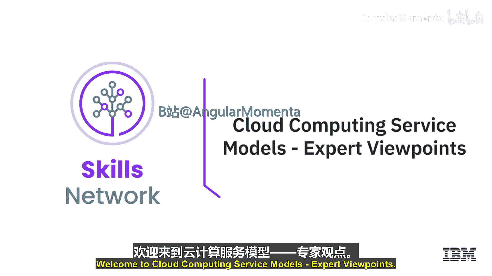
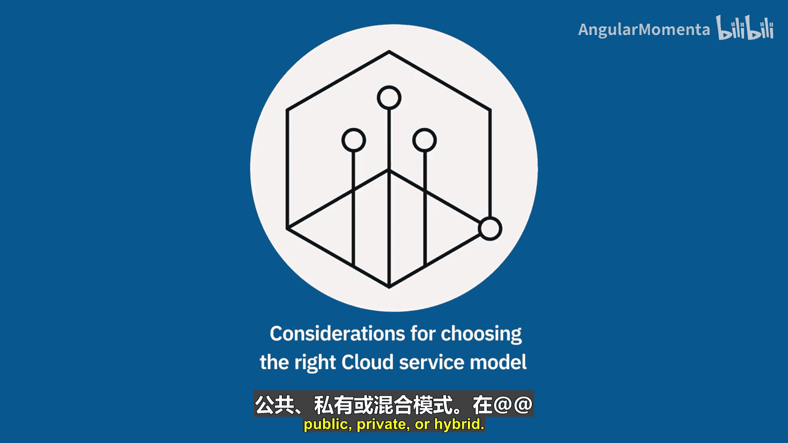
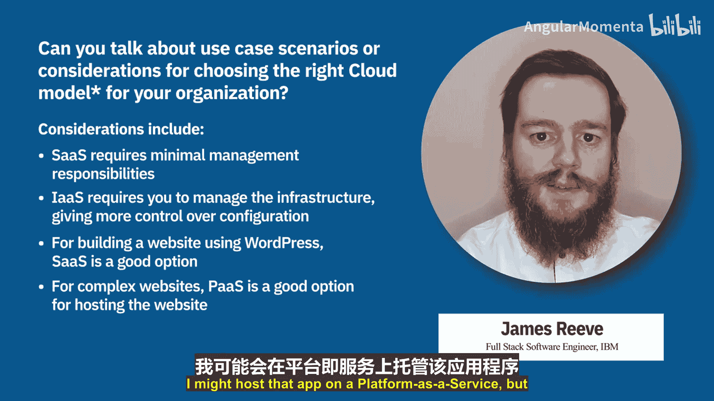

**云计算导论：P20-02：专家观点：云计算服务与部署模式** 🚀



在本节中，我们将聆听几位云计算专家的讨论，了解如何为组织选择和采用不同的云服务与部署模式。



---

### **概述**

本节内容将围绕专家们对选择合适云模型的见解展开。我们将探讨在选择**服务模式**（如IaaS、PaaS、SaaS）和**部署模式**（如公有云、私有云、混合云）时需要考虑的关键因素。

---

### **选择云模型的核心考量**

选择适合组织的云模型时，需要考虑以下几个核心方面。

以下是主要的考量维度：

1.  **组织的云迁移阶段**：评估组织当前在云旅程中所处的位置。例如，如果数据中心租约即将到期，可能没有时间将应用重写为云原生应用，只能将虚拟机直接迁移到云上，这对应**基础设施即服务**模式。
2.  **业务需求与时间**：如果有更多时间，可以考虑**重新平台化**，即采用**平台即服务**模式，如容器服务。如果正在开发全新产品并追求速度，**函数即服务**是更现代的选择。
3.  **控制与责任**：在抽象层次上，从SaaS到IaaS，管理责任逐渐增加，但对资源的控制力也更强。公式可以表示为：**控制力 ∝ 管理责任**。
4.  **成本**：通常，SaaS和PaaS的初始投资和运营成本较低，而IaaS可能更昂贵，但提供了更高的定制性和控制权。

---

### **不同服务模式的应用场景**

根据业务的具体需求，可以选择不同的服务模式。

以下是各模式的特点与适用场景：

*   **软件即服务**
    *   **场景**：业务需要开箱即用的软件，如电子邮件、客户关系管理、活动管理工具等。
    *   **优势**：支持随时随地访问、自动软件更新、成本较低、易于采用。
    *   **责任**：软件由供应商管理。

*   **平台即服务**
    *   **场景**：需要用于构建产品的平台，是软件开发公司的理想选择。
    *   **优势**：减少开发时间、支持多种编程语言、便于团队协作、降低成本。
    *   **责任**：开发者专注于应用代码，平台由供应商管理。

*   **基础设施即服务**
    *   **场景**：业务只需要虚拟机，例如用于托管网站、构建虚拟数据中心或进行数据分析。
    *   **优势**：更可靠、更安全，数据保存在指定的数据中心。
    *   **责任**：所有虚拟机管理相关问题均由企业自身负责，成本通常高于SaaS或PaaS。

---

### **专家的权衡建议**

上一节我们介绍了不同模式的特点，本节中我们来看看专家如何在实际中进行权衡。

专家普遍建议，在满足业务需求的前提下，应尽可能选择抽象层次更高的服务模式。例如，构建网站时，可优先考虑SaaS选项（如WordPress）。如果网站较复杂，需要构建一个React应用，则可能选择PaaS来托管。只有当应用有特殊需求，例如必须在PaaS不支持的特定操作系统中运行时，才不得不选择IaaS，自行配置和管理虚拟机。

代码示例展示了这种从高阶服务开始的思路：
```plaintext
首选：SaaS (如 WordPress)
   ↓ (如果需求不满足)
次选：PaaS (托管 React 应用)
   ↓ (如果平台不支持)
最后选择：IaaS (自行配置VM)
```

---



### **总结**

本节课中，我们一起学习了专家们对云计算服务与部署模式选择的观点。关键点在于：选择云模型需综合评估组织的云成熟度、业务需求、期望的控制水平以及成本。通常，从高阶服务（SaaS/PaaS）开始评估是高效的做法，仅在必要时才承担IaaS带来的额外管理责任以换取完全的控制权。理解这些权衡有助于为组织做出最合适的云战略决策。