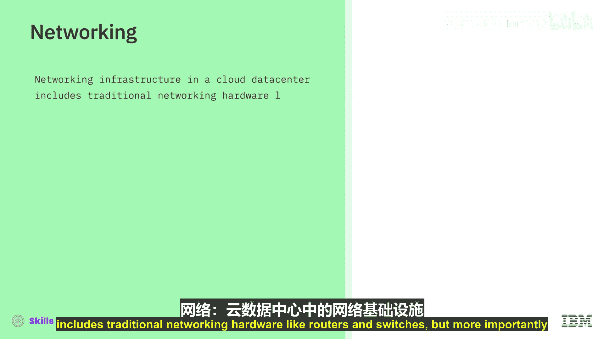

# 021：云基础设施概述

在本节课中，我们将要学习云基础设施的核心组成部分。云基础设施是云计算服务的物理基础，理解其架构对于有效利用云服务至关重要。

## 概述

在选择了云服务模型和供应商提供的云类型之后，客户需要规划其基础设施架构。基础设施层是云的基础。

## 区域、可用区与数据中心

上一节我们介绍了云服务模型，本节中我们来看看支撑这些服务的物理架构。云提供商的IT环境通常分布在全球多个区域。

一个云区域是指云提供商基础设施聚集的地理区域或位置，其名称可能类似“华南”或“美国东部”。云区域之间相互隔离，因此如果一个区域受到自然灾害（如地震）影响，其他区域的云操作仍将继续运行。

每个云区域可以包含多个可用区。可用区通常是拥有独立电力、冷却和网络资源的不同数据中心。这些可用区可能有诸如“DAL09”或“US-East1”之类的名称。可用区的隔离提高了云的整体容错能力，降低了延迟，并避免了创建单一的共享故障点。

可用区及其内部的数据中心通过极高带宽的网络连接，与其他可用区、区域、私有数据中心以及互联网相连。

云数据中心是一个容纳云基础设施的巨大房间或仓库。这些数据中心包含机柜和机架，即计算资源（如服务器）的标准化容器，以及存储和网络设备——几乎包含了物理IT环境所拥有的一切。

## 计算资源

云提供商提供多种计算选项。以下是主要的三种类型：

*   **虚拟服务器**：云数据中心中的大多数服务器运行管理程序，以创建基于虚拟化技术的虚拟服务器或虚拟机。
*   **裸金属服务器**：机架中的其他服务器是裸金属服务器，即未虚拟化的物理服务器。
*   **无服务器计算资源**：用户也可以在无服务器计算资源上运行工作负载，这是虚拟机之上的一个抽象层。

客户可以根据需要配置虚拟机和裸金属服务器，并在其上运行工作负载。我们将在后续视频中更详细地讨论这三种计算选项。

## 存储

存储信息和数据可以包含文件、代码、文档、图像、视频、备份、快照和数据库，并且可以存储在云上的多种不同类型的存储选项中。裸金属服务器和虚拟服务器在配置时都带有默认存储和本地驱动器。

## 网络

云数据中心中的网络基础设施包括传统的网络硬件，如路由器和交换机。但对于云用户而言，更重要的是云提供商提供的软件定义网络选项。在SDN中，某些网络资源被虚拟化或通过API以编程方式提供。

`SDN = 软件定义网络，通过API编程管理网络资源`

这允许在云中更轻松地进行网络配置、设置和管理。在云中配置服务器时，您需要设置其公共和私有网络接口。顾名思义，公共网络接口将服务器连接到公共互联网，而私有接口则为您的其他云资源提供连接并帮助确保其安全。

与物理IT世界一样，云中的网络接口需要分配或配置IP地址和子网。在云环境中，配置哪些网络流量和用户可以访问您的资源更为重要，这可以通过设置安全组和访问控制列表来完成。

为了进一步确保云中资源的安全和隔离，大多数云提供商提供虚拟局域网、虚拟私有云和虚拟专用网络。一些传统的硬件设备，如防火墙、负载均衡器、网关和流量分析器，也可以在云中虚拟化并作为服务提供。

云提供商提供的另一项网络能力是内容分发网络。CDN将内容分发到全球多个节点，因此访问内容的用户可以从离他们最近的节点获取内容，从而更快地访问。我们将在后续视频中了解更多关于这些云网络选项和术语的信息。

## 总结

本节课中我们一起学习了云基础设施的基础架构，包括其物理分布（区域、可用区、数据中心）以及核心组件：计算资源、存储和网络。云基础设施正在不断进步和完善，在下一个视频中，我们将解释虚拟化和虚拟机。