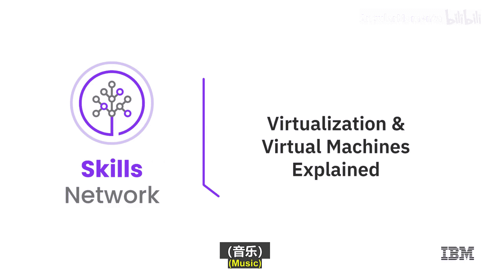
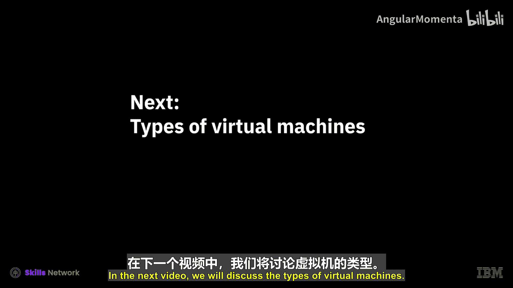

# 022：虚拟化与虚拟机详解 💻

在本节课中，我们将要学习虚拟化的核心概念，包括什么是虚拟化、管理程序（Hypervisor）的类型以及虚拟机（VM）的工作原理和优势。

虚拟化是一项历史悠久但至今仍至关重要的技术，它是构建现代云计算战略的基石。简单来说，虚拟化是创建基于软件的、虚拟版本资源的过程，这些资源可以是计算、存储、网络、服务器或应用程序。

## 什么是管理程序（Hypervisor）？🤔

虚拟化之所以可行，关键在于一个名为**管理程序**的软件。管理程序运行在物理服务器（或称主机）之上，其核心作用是从物理服务器中提取资源，并将这些资源分配给虚拟环境。

以下是两种主要的管理程序类型：

### 类型一：裸机管理程序

类型一管理程序直接安装在物理服务器的硬件之上，因此也被称为“裸机”管理程序。这是市场上最常见、最安全且延迟最低的管理程序类型。

**示例代码/产品名称：**
*   VMware ESXi
*   Microsoft Hyper-V
*   开源 KVM

### 类型二：托管式管理程序

类型二管理程序与类型一的不同之处在于，它在物理服务器和管理程序之间增加了一层**主机操作系统**。因此，它们也被称为“托管式”管理程序。这类管理程序使用频率较低，主要用于最终用户虚拟化，其延迟通常高于类型一管理程序。

**示例代码/产品名称：**
*   Oracle VirtualBox
*   VMware Workstation

## 什么是虚拟机（VM）？🖥️

在安装了管理程序之后，我们就可以创建虚拟环境，也就是**虚拟机**。虚拟机本质上是一个基于软件的计算机，它像物理计算机一样运行，拥有自己的操作系统和应用程序。

以下是虚拟机的几个关键特性：

*   **独立性**：多个虚拟机可以运行在同一个管理程序上，但它们彼此完全独立。这意味着你可以在不同的虚拟机上运行不同的操作系统，例如，一个运行Windows，另一个运行Linux。
*   **可移植性**：虚拟机具有极高的可移植性。你可以将一台虚拟机几乎瞬时地从一台机器上的管理程序迁移到另一台完全不同的机器上的管理程序，这为环境提供了极大的灵活性和可移动性。
*   **资源管理**：管理程序负责管理从物理服务器分配给这些虚拟环境的资源。

## 虚拟化的核心优势 🚀

上一节我们介绍了虚拟机和其特性，本节中我们来看看虚拟化技术带来的主要好处。

1.  **成本节约**：能够从单一基础设施运行多个虚拟环境，意味着可以大幅减少物理基础设施的数量。这是服务器整合的核心，也意味着无需维护那么多服务器、消耗那么多电力、支付那么多维护成本，最终显著降低总体支出。
2.  **敏捷性与速度**：启动一台虚拟机相对容易且快速，远比为了开发人员运行一个深度测试场景而去配置一整套全新物理环境要简单得多。虚拟化使这个过程更加简单和迅速。
3.  **降低停机时间**：如果一台主机意外宕机，你可以将虚拟机快速迁移到另一台正常工作的物理服务器的管理程序上。这为你提供了一个强大的备份和灾难恢复方案，有效降低了业务中断的风险。

## 总结 📝

本节课中我们一起学习了虚拟化的基础知识。我们了解到虚拟化是通过管理程序创建虚拟资源的过程，管理程序主要分为直接安装在硬件上的类型一（裸机）和安装在主机操作系统上的类型二（托管式）。虚拟机作为独立的软件计算机，运行在管理程序之上，具有独立性、可移植性等优点。最后，我们探讨了虚拟化带来的三大核心优势：节约成本、提升敏捷性以及降低系统停机风险。虚拟机和虚拟化技术是云计算的核心，为现代IT架构提供了坚实的基础。在接下来的视频中，我们将讨论虚拟机的不同类型。