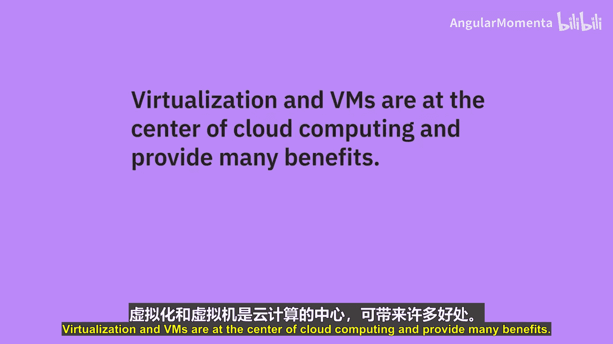
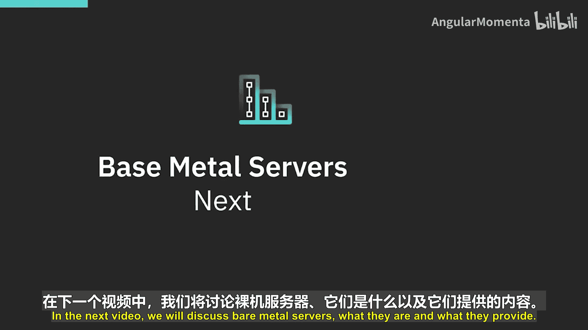

# 023：虚拟机类型 🖥️

在本节课中，我们将要学习云计算中的核心组件——虚拟机。我们将了解什么是虚拟机，以及云服务提供商提供的几种主要虚拟机类型及其适用场景。

虚拟机，也称为虚拟服务器或虚拟实例，是云计算的基础。不同的云服务提供商提供多种配置和部署选项的虚拟机，以满足不同的使用需求。

## 创建虚拟机

当您在云中创建虚拟服务器时，需要指定几个关键参数。您需要选择服务器将被部署的区域和可用区（或数据中心），以及您希望安装在服务器上的操作系统。

以下是创建虚拟机时的主要选项：
*   **租户模式**：您可以选择**共享**（即多租户）虚拟机或**专用**（即单租户）虚拟机。
*   **计费方式**：您可以选择按小时或按月计费。
*   **资源配置**：您可以为虚拟服务器选择存储和网络选项。

上一节我们介绍了创建虚拟机的基本步骤，本节中我们来看看云中可以配置的几种不同类型的虚拟机。

## 虚拟机类型详解

以下是几种主要的虚拟机类型及其特点。

### 共享/公共云虚拟机

共享或公共云虚拟机是由提供商管理的多租户部署，可以按需配置预定义的大小。多租户意味着底层的物理服务器被虚拟化，并在其他租户或用户之间共享，以满足不同的工作负载需求。

云提供商提供预定义的大小和配置，范围从单个虚拟核心和少量RAM到多个虚拟核心和大量RAM。例如，有针对计算密集型、内存密集型或高性能I/O工作负载的配置。

除了预定义大小，一些提供商还提供**自定义配置**，允许用户定义核心数、RAM和本地存储特性。

公共虚拟机通常按小时计费，在某些情况下甚至按秒计费。配置的起价可以低至每小时几美分。一些提供商也提供按月计费的虚拟机，如果您确定虚拟机将运行至少一个月，这可以节省一些成本。但如果您在月中决定停用虚拟机，您仍需支付整个月的费用。

### 瞬时/Spot虚拟机

瞬时或Spot虚拟机利用了云数据中心未使用的容量。云服务提供商以远低于同类常规虚拟机的成本向用户提供这些未使用的容量。

尽管瞬时虚拟机有很大的折扣，但云提供商可以随时取消配置它们，并回收资源以配置常规的、价格更高的虚拟机。因为当数据中心容量减少时，您将面临丢失这些虚拟机的风险。

这些虚拟机非常适合非生产工作负载，例如测试和开发应用程序。它们对于运行无状态工作负载、测试可扩展性，或以低成本运行大数据和高性能计算工作负载也很有用。

### 预留虚拟服务器实例

预留虚拟服务器实例允许您为未来的部署预留容量并保证资源。您预留所需数量的虚拟服务器容量，在需要时从该容量中配置实例，并为您的预留容量选择一个期限（例如一年或三年）。在合同期限内，您可以在您选择的数据中心内保证获得此容量。

通过承诺更长的期限，与按小时或按月计费的实例相比，您还可以降低成本。当您知道在特定持续时间内至少需要一定水平的云容量时，这非常有用。如果您超出了预留容量，您始终可以选择用按小时或按月计费的虚拟机来补充计划外的使用和容量需求。但请注意，并非所有预定义的虚拟机系列或配置都可用作预留实例。

### 专用主机

专用主机提供单租户隔离。这意味着只有您的虚拟机在给定的主机上运行，因此它们可以独占使用底层硬件的全部容量和资源。

在配置专用主机时，您需要指定希望放置主机的数据中心和区域。然后，您将实例或虚拟机分配给特定的主机。这允许对工作负载的放置进行最大程度的控制。

专用主机通常用于满足合规性和监管要求，或满足特定的许可条款。

## 总结

本节课中我们一起学习了云计算的基石——虚拟机。我们了解了创建虚拟机的基本选项，并详细探讨了四种主要类型：共享/公共云虚拟机、瞬时/Spot虚拟机、预留虚拟服务器实例以及专用主机。每种类型都有其独特的成本结构、资源保证和适用场景，理解这些差异对于在云中做出明智的架构和成本决策至关重要。虚拟机和虚拟化是云计算的核心，提供了诸多优势。在下一个视频中，我们将讨论裸机服务器，了解它们是什么以及它们能提供什么。