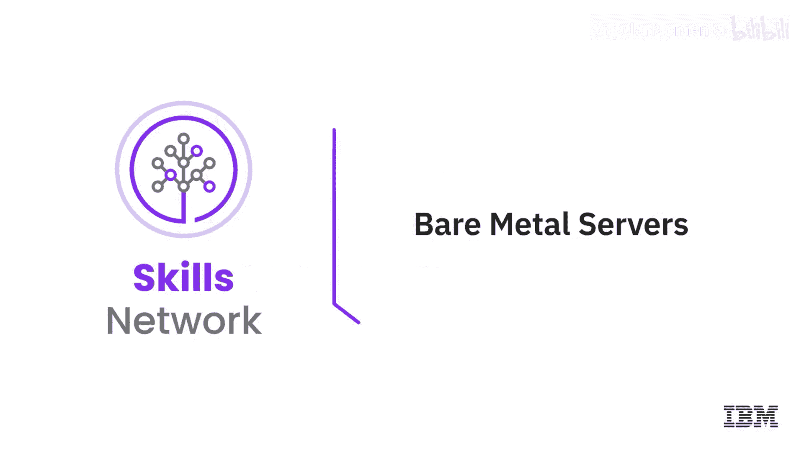
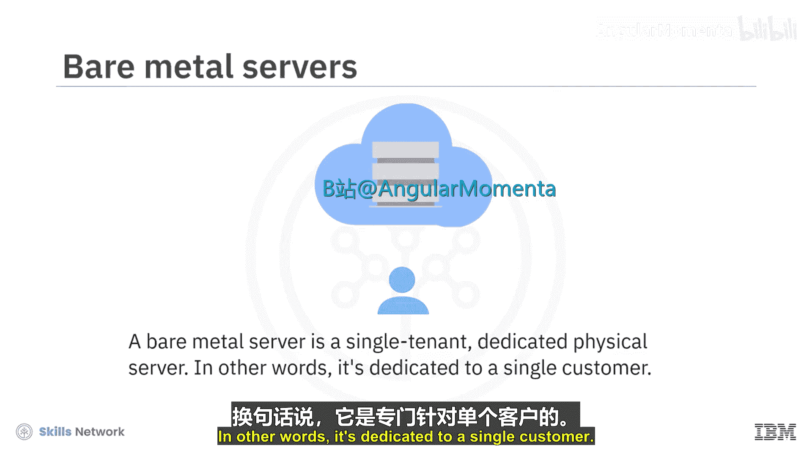
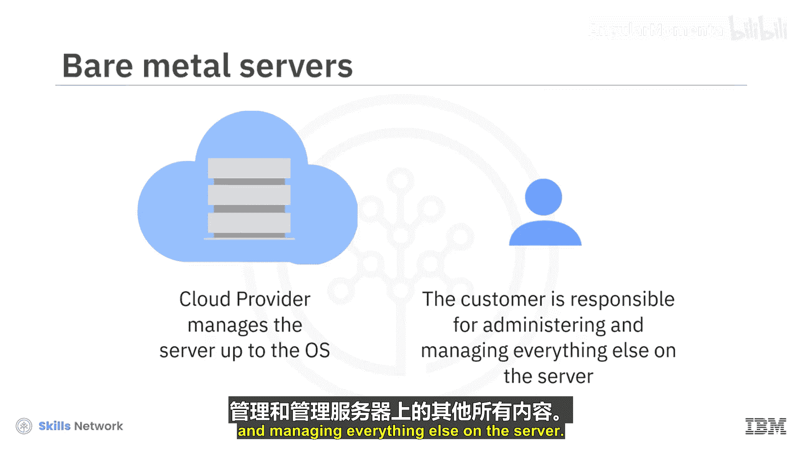
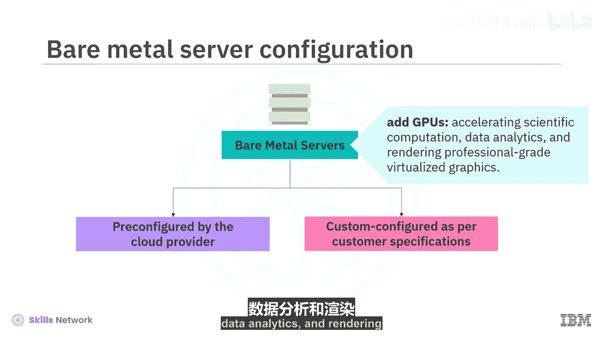
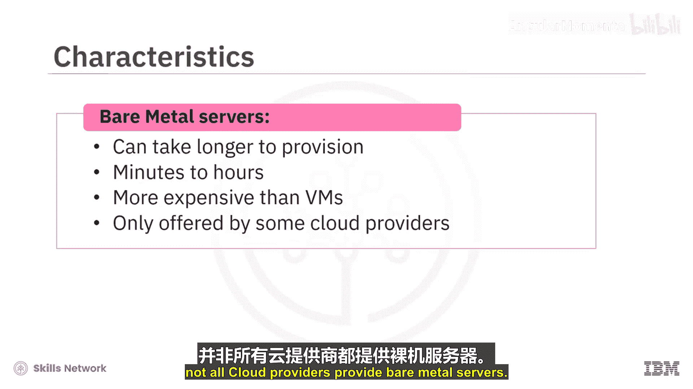
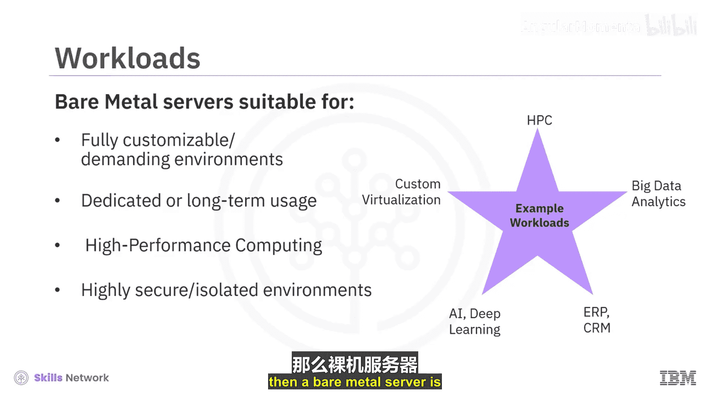
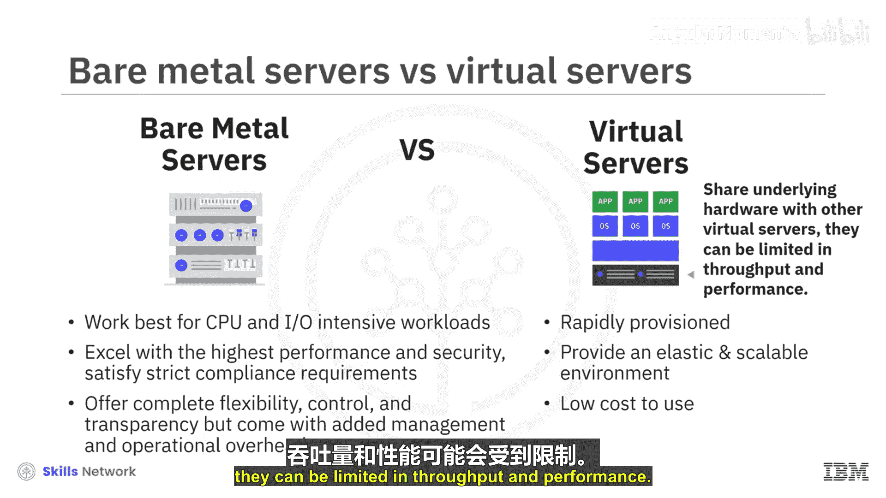

# 024：裸机服务器详解 🖥️

在本节课中，我们将要学习云计算中的一种重要服务类型——裸机服务器。我们将了解它的定义、特点、适用场景以及与虚拟服务器的关键区别。

## 什么是裸机服务器？

裸机服务器是一台单租户专用的物理服务器。换句话说，它专供单一客户使用。云服务提供商将物理服务器实际安装在数据中心的机架中，然后提供给客户。

云提供商负责管理服务器直至操作系统（OS）层面。这意味着如果硬件或机架连接出现任何问题，他们将负责修复、更换并重启服务器。客户则负责管理和维护服务器上的所有其他内容。

## 裸机服务器的配置与特性

上一节我们介绍了裸机服务器的基本概念，本节中我们来看看它的配置方式和核心特性。

裸机服务器可以由云提供商预配置以满足特定工作负载包的要求，也可以根据客户规格进行自定义配置。这包括处理器、RAID硬盘、专用组件和操作系统。

客户还可以安装自己的操作系统，以及安装云提供商不提供的特定**虚拟机管理程序（Hypervisor）**，从而创建自己的虚拟机和服务器集群。

以下是裸机服务器的几个关键特性：
*   **GPU支持**：可以添加GPU，专为加速科学计算、数据分析和渲染专业级虚拟化图形而设计。
*   **部署时间**：由于是物理机器，其部署时间比虚拟服务器长。预配置的裸机服务器可能需要20到40分钟，而自定义构建可能需要大约三到四个小时。这些时间可能因云提供商而异。
*   **成本**：由于在任何给定时间都专供单一客户使用，裸机服务器往往比同等规格的虚拟机更昂贵。同时请注意，并非所有云提供商都提供裸机服务器。

## 裸机服务器的优势与适用场景

由于裸机服务器是完全可定制的，它们能够在要求最苛刻的环境中满足客户的需求。它们专为长期、高性能使用而设计，适用于高度安全和隔离的环境。

客户对裸机服务器拥有完全的访问和控制权，因为它不需要虚拟机管理程序，也不与其他客户共享底层服务器硬件。

裸机服务器能够满足高性能计算（HPC）和数据密集型应用的需求，这些应用要求极低的延迟。这些服务器在大数据分析应用和GPU密集型解决方案中也表现出色。

以下是裸机服务器适用的一些工作负载示例：
*   ERP（企业资源规划）
*   CRM（客户关系管理）
*   人工智能与深度学习
*   虚拟桌面基础设施

如果您使用的任何应用程序需要高度的安全控制，或者通常是**在本地环境（On-Premises）** 中运行的应用程序，那么裸机服务器是云中的一个良好替代方案。

## 裸机服务器与虚拟服务器的比较

在比较裸机服务器与虚拟服务器时，一些最重要的考虑因素源于客户需求。

以下是两者的核心对比：
*   **裸机服务器**：
    *   最适合CPU和I/O密集型工作负载。
    *   在最高性能和安全性方面表现出色。
    *   满足严格的合规性要求。
    *   提供完全的灵活性、控制力和透明度。
    *   但会带来额外的管理和运营开销。
*   **虚拟服务器**：
    *   可以快速部署。
    *   提供弹性且可扩展的环境。
    *   使用成本较低。
    *   然而，由于它们与其他虚拟服务器共享底层硬件，因此在吞吐量和性能方面可能受到限制。

---

本节课中我们一起学习了裸机服务器的核心知识。我们明确了它是专供单客户使用的物理服务器，由云提供商管理硬件，客户管理操作系统及以上的一切。我们探讨了其可定制性强、性能高、控制完全但部署较慢、成本较高的特点，并分析了它最适合高性能计算、大数据、AI等密集型、高安全要求的工作负载。最后，通过对比虚拟服务器，我们更清晰地理解了如何根据实际需求在两者之间做出选择。