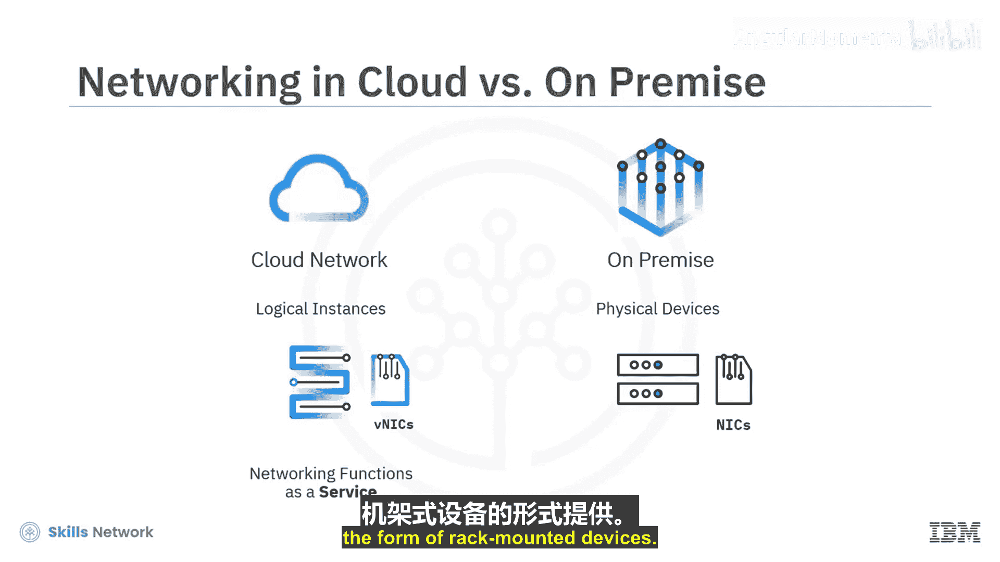
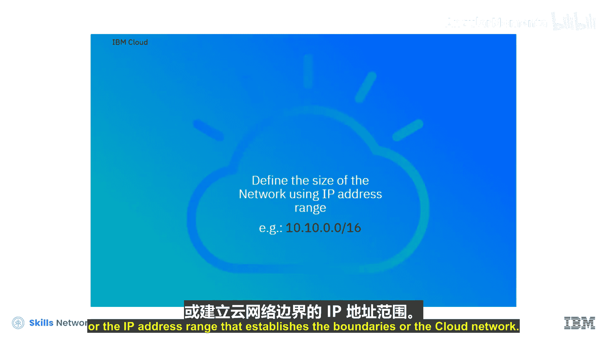
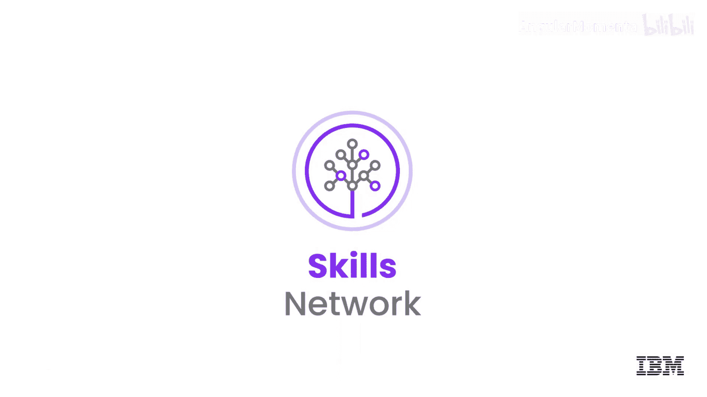

# 025：云端安全网络构建指南 🔐

在本节课中，我们将学习如何在云环境中构建一个安全的网络。随着云计算的普及和数字数据面临的网络安全威胁日益增加，构建安全的云网络至关重要。我们将从基本概念开始，逐步了解云网络的构成要素、安全机制以及如何将其与传统数据中心网络进行对比。

## 概述：云网络与传统网络

上一节我们介绍了云计算的宏观概念，本节中我们来看看如何具体构建一个云网络。构建云网络的基本思路与在本地数据中心部署网络并无本质不同，核心区别在于：**云环境中我们使用的是网络元素的逻辑实例，而非物理设备**。

例如，网络接口控制器在云环境中由虚拟网络接口卡表示。网络功能以服务形式提供，而非机架式硬件设备。

## 构建云网络的第一步：定义网络边界

要创建一个云网络，首先需要定义网络的规模，即确定IP地址范围，这设定了云网络的边界。云网络部署在逻辑上隔离的网络空间中。

以下是构建网络边界的关键步骤：
*   使用**虚拟私有云** 来划分网络空间。
*   VPC可以进一步细分为更小的网段，称为**子网**。
*   逻辑上隔离的云网络是云中的私有区域，为客户提供了私有云的安全性和公有云的可扩展性。

## 核心组件：子网与安全部署

在定义了网络边界后，我们需要在其中部署资源。云资源，如虚拟机、存储、网络连接和负载均衡器，都被部署到子网中。

使用子网允许用户采用与本地环境相同的多层架构概念来部署企业应用程序。同时，**子网也是云中实施安全策略的主要区域**。

每个子网都受到访问控制列表的保护，ACL充当子网级别的防火墙。在子网内部，可以创建**安全组**，以提供实例级别的安全防护。

## 应用场景：部署多层应用程序

假设您有一个需要Web访问的三层应用程序，包含Web层、应用层和后端数据库。在这种情况下，我们会将面向Web的VSI放入一个安全组，将应用层VSI放入第二个安全组，而将数据库VSI放入第三个安全组。

显然，面向Web的VSI需要互联网访问。为此，需要在网络中添加入网网关实例，以使用户能够从互联网层访问应用程序。

## 网络连接扩展：VPN与专线

虽然入网网关非常适合实现云资源的互联网访问，但企业通常希望安全地将其本地资源扩展到云端，这可以通过**虚拟专用网络** 来实现。

当构建多个子网并部署多个工作负载时，确保应用程序持续响应变得必要。这可以通过**负载均衡器**来实现，它能确保不同应用拥有可用的带宽。

对于拥有混合云环境的企业，在云和本地资源之间使用专用的高速连接，是比公共连接解决方案更安全、更高效的方式。一些云服务提供商提供此类连接，例如IBM Cloud的Direct Link解决方案，能够根据需要将本地资源扩展到云端。

## 总结

本节课中，我们一起学习了如何构建安全的云网络。构建云网络本质上就是创建一系列提供网络功能的逻辑结构，这些功能等同于所有IT专业人员所依赖的、用于保护其环境和确保业务应用高性能的数据中心网络。关键在于理解VPC、子网、安全组、ACL、网关、VPN和负载均衡器等核心组件的作用，并按照应用架构和安全需求进行合理设计与部署。