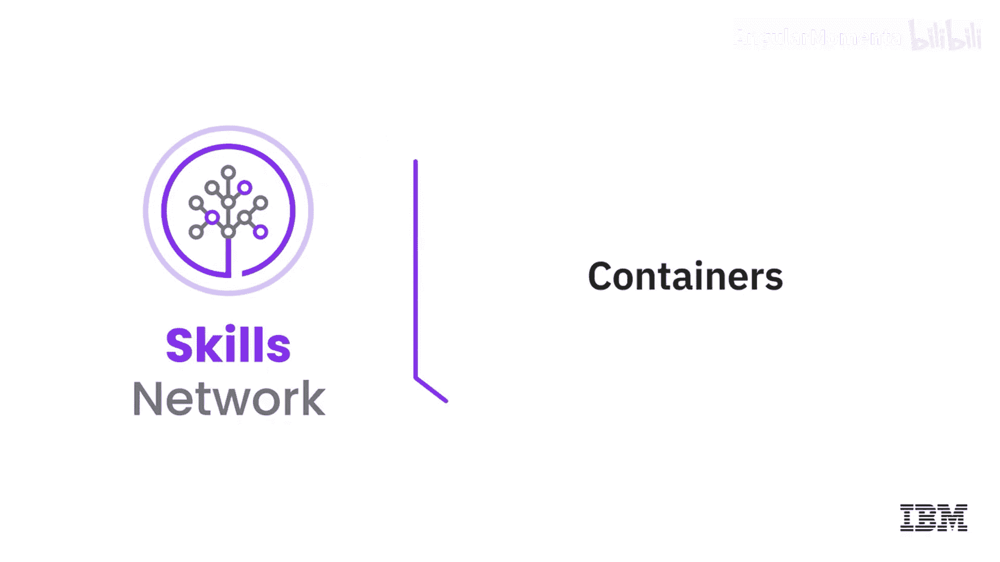
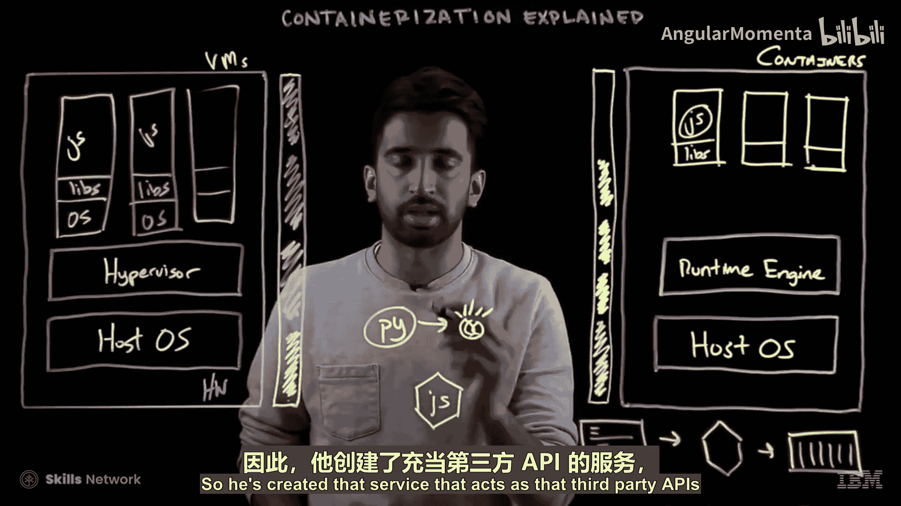
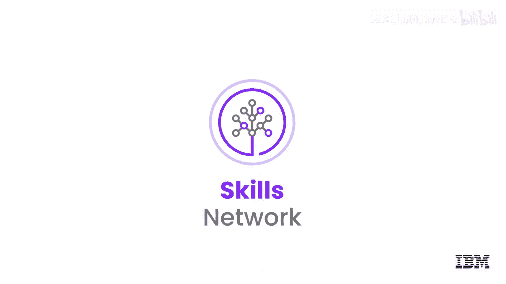

**云计算导论：P26：容器技术详解** 🐳

在本节课中，我们将要学习容器技术。容器是一种将应用程序代码与其库和依赖项打包在一起的软件可执行单元，它能以统一的方式在任何地方运行，无论是桌面、传统IT环境还是云端。容器具有小巧、快速和可移植的特点。与虚拟机不同，容器无需在每个实例中都包含一个客户操作系统，而是可以直接利用主机操作系统的功能和资源。

在接下来的内容中，我们将深入探讨基于容器的技术是如何工作的。

---

### **容器技术概述**

容器技术并非新生事物。早在2008年，Linux内核就引入了**控制组**功能，这为今天我们所见到的各种容器技术奠定了基础，包括Docker、Cloud Foundry、Rocket等容器运行时。

为了理解容器的优势，我们通过一个例子来对比虚拟机和容器。

---

### **虚拟机部署方式**

首先，我们来看传统的虚拟机部署方式。假设我是一名开发者，创建了一个Node.js应用程序，并希望将其部署到生产环境。

以下是虚拟机架构的组成部分：
*   **硬件**：物理服务器。
*   **主机操作系统**：运行在硬件之上的基础操作系统。
*   **虚拟机管理程序**：用于创建和运行虚拟机的软件。

即使我们只运行一个轻量级的Node.js应用，每个虚拟机也必须包含一个完整的**客户操作系统**以及相关的二进制文件和库。这使得虚拟机体积庞大。一个最小的Node.js虚拟机镜像可能超过400MB，而Node.js运行时和应用程序本身可能不足15MB。

当我们部署这个应用时，它会消耗一部分硬件资源。

接下来考虑扩展。如果我们创建该应用程序的两个额外副本，即使应用程序完全相同，每个新虚拟机也必须重复部署独立的客户操作系统和库。最终，三个虚拟机可能会耗尽硬件的所有资源。

此外，还存在环境一致性问题。开发者可能在MacBook上开发应用，当部署到生产环境的Linux虚拟机时，可能会遇到不兼容问题。这就是经典的“在我机器上能运行”问题，它阻碍了敏捷开发和持续集成/交付流程。

---

### **容器化部署方式**

容器化解决了上述问题。创建和部署容器通常遵循一个三步流程。

以下是容器创建的核心步骤：
1.  **编写清单文件**：这是一个描述容器内容的文件。例如，在Docker中是`Dockerfile`，在Cloud Foundry中是`manifest.yml`。
2.  **构建镜像**：根据清单文件，构建出包含应用程序及其所有依赖的不可变镜像。例如Docker镜像或ACI。
3.  **运行容器**：从镜像启动一个可运行的容器实例，其中包含了运行应用所需的所有运行时、库和二进制文件。

容器运行在一个与虚拟机相似但更精简的架构上：
*   **硬件**：物理服务器。
*   **主机操作系统**：基础操作系统。
*   **容器运行时引擎**：取代了虚拟机管理程序，用于运行容器。例如Docker引擎。

运行时引擎本身会消耗一部分资源。

现在，我们来容器化Node.js应用。遵循上述三步流程后，我们得到了容器。关键优势在于，容器更加轻量，因为它们**不需要包含客户操作系统**，只包含应用所需的库和应用本身。

因此，当我们扩展部署三个相同的容器副本时，由于无需复制臃肿的操作系统依赖，它们消耗的资源更少。部署完成后，硬件上仍有充足的剩余资源。

---

### **容器在云原生架构中的优势**

假设我的同事决定为Node.js应用集成一个第三方图像识别API，并为此创建了一个Python应用程序。我们的Node.js应用需要调用这个Python应用。

在虚拟机方案中，为了实现真正的云原生架构（即能够独立扩展不同服务），我可能需要释放一个虚拟机的资源来部署Python应用，这并不理想。

而在容器方案中，得益于其**模块化**特性，我们可以轻松地直接部署一个Python应用容器。它只会消耗少量额外资源。

容器技术的另一个重要优势是资源共享。如果某个容器进程没有充分利用CPU或内存，这些资源可以立即被同一硬件上运行的其他容器使用。

通过以上对比，我们总结了容器的核心优势：
*   **可移植性**：一次构建，随处运行。
*   **易于扩展**：轻量级特性使得快速水平扩展成为可能。
*   **支持敏捷开发**：通过标准化的构建和部署流程，促进了持续集成和持续交付。

---

### **总结**

本节课中，我们一起学习了容器技术。容器通过将应用与依赖打包成轻量级、可移植的单元，简化了云原生应用的开发和部署。我们对比了虚拟机与容器的架构差异，理解了容器在资源利用、环境一致性和模块化部署方面的显著优势。

在下一课中，我们将介绍云存储。