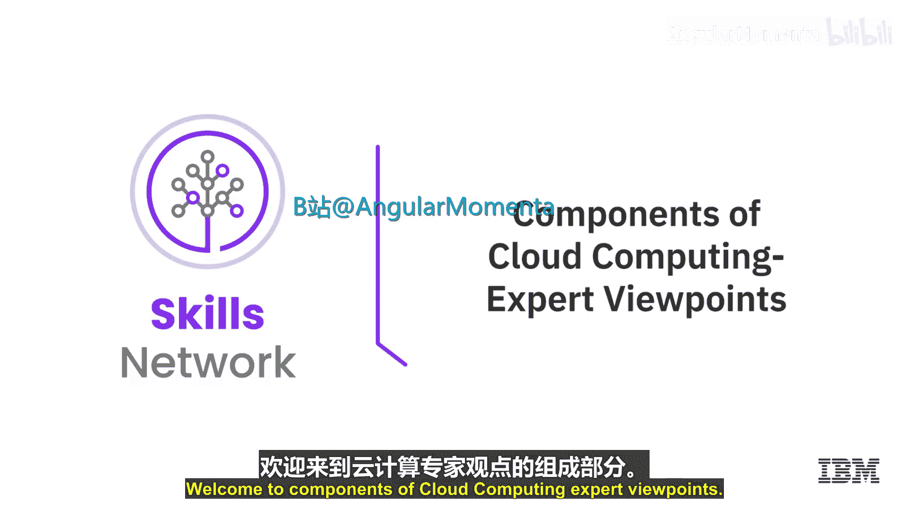
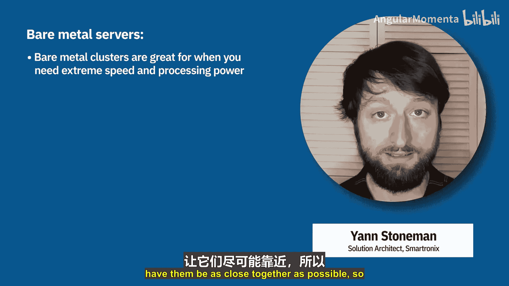
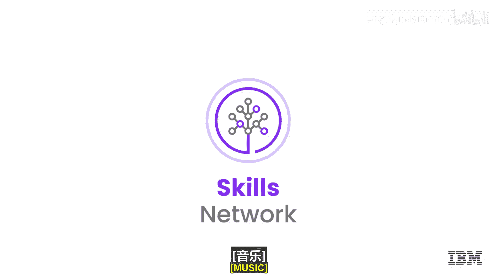

# 027：专家观点 - 云计算组件 🧩

在本节课中，我们将聆听几位云计算应用专家的观点，了解他们在选择云计算资源（例如裸机服务器、虚拟服务器与容器）时所考虑的关键因素。

上一节我们介绍了云计算的基本概念，本节中我们来看看专家们如何分析不同计算组件的优劣。

---

## 虚拟服务器 (Virtual Servers)

虚拟服务器本质上是在一个操作系统内部运行另一个操作系统，例如在Linux之上运行Windows。因此，它们包含自己完整的操作系统，这使得虚拟机在外观和行为上非常类似于物理服务器。也正因为包含整个操作系统，它们通常体积庞大，达到**GB级别**。

虚拟机的可移植性较差，这源于其对底层操作系统、应用程序和库版本的依赖。这是在选择虚拟机时需要考虑的一点。

---

## 容器 (Containers)

在容器、虚拟服务器和裸机服务器之间做选择时，我通常首先考虑容器，因为其**可扩展性**和**成本效益**。

然而，这并不意味着容器总是最佳选择。例如，出于安全原因，您可能无法容忍您的容器与另一个客户的容器运行在同一台虚拟机上，这时您可能会选择配置自己的虚拟服务器。或者，您可能始终需要最佳性能，并且不想处理**虚拟机管理程序开销**或**邻居干扰效应**，这时您会选择裸机。

容器基于一个可在不同环境（开发、测试、生产）间共享的**Linux基础镜像**，这是容器的一大优势。容器的启动速度也非常快，达到**毫秒级**，而虚拟机则需要数秒。它们非常轻量，通常只有**MB级别**。

以下是容器相关的核心技术：
*   **Docker**：用于创建和管理容器。
*   **Kubernetes** 与 **OpenShift**：用于容器编排。

容器的一些引人注目的用例包括可以将工作负载分解为最小可服务单元的场景，例如**微服务架构**。这可以说是**云原生架构**的一项基础技术。

如果您希望拥有成本低廉且仅在需要时运行的东西，那么**无服务器函数**是一个完美的用例。在某些云提供商那里，他们甚至按**毫秒级使用量**收费。无服务器函数还能帮助您节省诸如修补操作系统之类的工作时间。

如果您希望实现**云无关性**，即拥有混合云设置，同时使用不同的云提供商，那么容器是一个非常好的选择，因为**Docker可以在任何地方以相同的方式运行**。

过去几年，我看到容器技术取得了长足进步，尤其是在企业领域。坦率地说，容器几乎可以运行您想投入的任何工作负载。当然也有例外，有时您需要在裸机中使用特殊的显卡，或者需要访问内核级设置等，这在容器中无法实现。但总的来说，除非有特殊需求，否则您很可能会使用容器或无服务器方案。

---

## 裸机服务器 (Bare Metal Servers)

裸机服务器基本上是**单租户专用硬件服务器**。这相当于我们传统的硬件部署方式。

其优点在于，您可以根据性能、安全性和可靠性的特定需求来优化服务器。然而，缺点在于按需扩展能力有限，因为硬件具有**固定容量**。此外，裸机服务器通常采用**包月定价**模式。

在某些用例中，裸机服务器是合理的：
*   需要极高性能的场景，例如**游戏**或**实时分析**。
*   法规或合规性要求规定必须使用专用计算环境的情况。
*   使用稳定且持续计算资源的应用程序。

如果您需要极致的速度和强大的处理能力，例如您正在迭代超音速飞机的设计，需要模拟其在风洞中的行为，并且需要重复此过程500次，这将处理海量数据。此时，您会希望使用集群中最强大的机器，并让它们尽可能紧密地协作，这就是裸机服务器的用武之地。

---

本节课中我们一起学习了云计算中的三种核心计算组件：虚拟服务器、容器和裸机服务器。专家们指出，容器因其轻量、快速和可移植性，已成为现代云原生应用的主流选择，但虚拟服务器在隔离性、裸机服务器在极致性能与专用性方面仍有其不可替代的价值。理解它们的特点和适用场景，是构建高效、经济云解决方案的关键。